# 处理机器学习模型中的高偏差和其他问题/解决方案

> 原文：<https://medium.com/hackernoon/tackle-bias-and-other-problems-solutions-in-machine-learning-models-f4274c5fe538>

预测分析模型非常依赖于回归、分类和聚类方法。在分析预测模型的有效性时，预测越接近实际数据，就越好。本文希望成为主要问题及其最流行/有效的解决方案的一站式参考，而不是深入执行的细节。

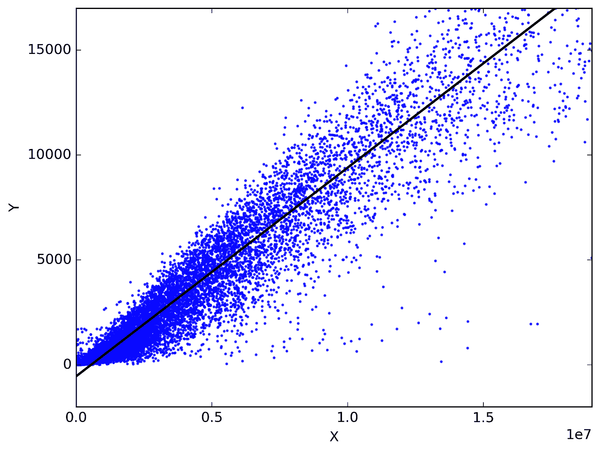

*A Linear Regression Plot*

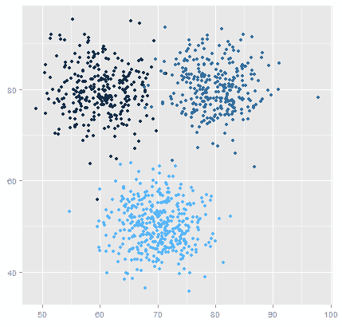

*A clustering algorithm plot*

首先，数据选择和删减发生在数据准备阶段，在这一阶段，您首先要处理掉不良数据。此外，在训练过程中，数据及其与 ML 模型目标的相关性存在问题，算法的使用存在问题，数据中会出现错误。实际上，对模型进行了[偏差](http://bit.ly/EveryoneAI)、方差、自相关和许多在最终确定模型时可能出现的错误的测试。在最终确定模型之前，对数据执行一些已定义的测试——这些是检测此类错误的测试算法。

在运行这些测试之后，您返回到模型并做出那些修正，然后批准模型是合适的，或者“好的”。但是，行业中的佼佼者已经找到了在以后的迭代中避免这种错误的方法。可能会出现许多错误，但让我们用定义明确且最有效的测试和解决方案来探究其中的一些错误:

# 过度拟合和欠拟合

**过拟合和欠拟合问题可以用偏差-方差权衡属性来解释:**

偏差是学习算法中的错误，此时学习算法从数据中学习的能力较弱。在高偏差的情况下，学习算法不能学习数据中的相关细节。因此，它在训练数据和测试数据集上都表现不佳。另一方面，当学习算法试图从数据集过度学习或试图尽可能接近地拟合训练数据时，方差是学习算法中的错误。在高方差的情况下，该算法在测试数据集上表现不佳，但在训练数据集上表现相当好。

偏差-方差权衡是机器学习中的一个重要问题。这是一种你不能同时拥有低偏差和低方差的情况。但是你必须通过训练一个模型来进行权衡，这个模型可以捕捉数据中的规律，足够精确，并且可以推广到同一来源的不同点，具有最佳偏差和最佳方差。

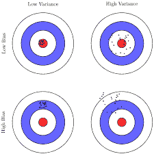

> 偏差和方差是学习算法中总误差中的两个误差，如果你试图减少一个误差，另一个误差可能会增加。

**偏差和方差是如何导致过度拟合和欠拟合的？**

为了确定模型的最佳拟合，我们分析测试样本/数据点如何被考虑用于模型分析。当解析数百万行时，您可能会试图包含所有的数据点，不管它们是否相关，或者超出了前面提到的阈值。这里的关键是不要尽善尽美地包括每个数据点，也不要在试图拟合曲线时忽略数据点。

当学习算法具有高偏差问题时，致力于减少偏差将导致方差上升，从而导致过拟合问题。并且，当学习算法遭受高方差问题时，致力于减小方差将导致偏差上升，从而导致欠拟合问题。这就是“权衡”一词的由来，因为仅仅减少偏差不会改善模型，反之亦然。“最佳点”是将数据点放在有最佳偏差和最佳方差的地方。基本上，找到一个模式不要走极端，以免影响准确性。大多数时候，规划和选择这些点是数据科学家和分析师面临的最大挑战。

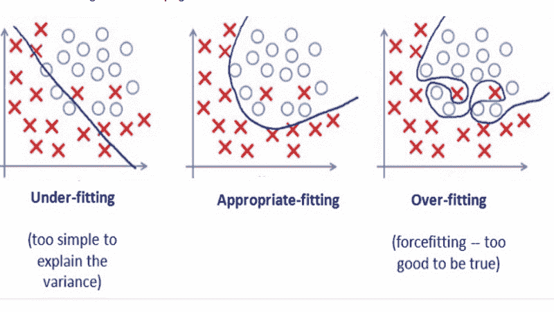

*The best fit may not be the one that excludes outliers to the T, but is always a compromise*

但是，也有测试模型拟合度的方法。针对这些现象提供的一些解决方案有:

偏差-方差权衡问题的答案:

*建立更复杂的模型*

对拟合不足问题的第一个也是最简单的解决方案是训练一个更复杂的模型来解决问题。对于过度拟合的模型，获取更多的数据。和正规化。

*交叉验证*

在交叉验证中，所有可用或选择的数据都不会用于训练模型。通常有三个方面有助于执行交叉验证方法——训练数据、测试数据和验证数据集。您可以单独使用训练和测试数据的组合，或者使用所有三种数据折叠。

[训练数据=用于模型训练

测试数据=用于模型超参数调整

验证数据=用于模型验证和准确性评估]

有许多方法可以处理这些折叠，训练数据通常占总数据集的 60%，测试数据集占 20%，而验证数据集由剩余的 20%组成。

通过首先仅使用训练数据训练模型，然后将该模型与用测试数据训练的模型进行比较，来测试训练模型的质量。通过这种方式，我们可以识别哪些数据点带来了更好的预测。交叉验证有多种形式:

坚持:数据分为测试数据和训练数据，然后进行比较。在保留方法中，我们只使用一组保留的训练数据。

100 个样本，60 个训练，20 个测试，20 个在验证数据集中。在训练期间，你计算模型的准确性。测试是对模型进行训练后测试精度。

K-Fold 交叉验证:这里数据被分成 k 个集合。则第一组或第一折叠是验证数据集，并且第一折叠从折叠总数中移除(其中，假设 k=10)。对于每次迭代，我们取一个折叠进行验证(第 9 次，在第一次迭代(k-1)之后)，然后从现在剩余的折叠总数中减去它(现在 k=9)。这种方法是有效的，但需要巨大的计算能力。

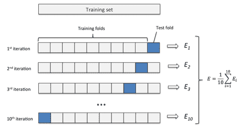

*Example for k-fold cross validation with 10 folds*

留一个出来:这种方法比较麻烦，因为每次测试 n 个数据点时，一对一的数据会被剔除。

*辍学*:

当在深度学习中使用[神经网络](http://bit.ly/NeuralNets)时，使用退出方法。Dropout 是一种古老的技术，被证明有助于模型的准确性。这使得层中的一些激活被去激活(等于 0)。我们可以从数据集中选择任意数量的数据来创建辍学层。通常，这在 20%或 30%的范围内。假设，如果我们使用 30%的丢弃率，那么在那个特定层中随机 30%的神经元的激活被去激活。去激活的神经元将不会传播到网络的下一层。我们这样做是为了避免过度拟合，因为更多的噪声会使模型更健壮。

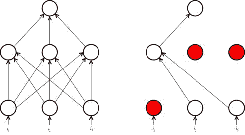

*Dropout method: Here, some neurons have been deactivated( red colored, right). Suppose the activation is x, then in dropout it is equated to zero*

直觉上，这迫使网络即使在缺乏某些信息的情况下也是准确的。去激活的阈值是较早决定的。

*渐变噪声:*

这种方法包括在训练期间添加梯度噪声，这种方法被证明提高了模型的准确性。参考本文- [*加入梯度噪声提高了非常深度网络的学习*](http://bit.ly/gradientNoise) )。

添加从高斯分布采样的噪声:

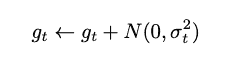

*规范化*:

正则化只是另一种减少过度拟合现象的流行方法。该技术用于解决高方差问题，包括惩罚系数和权重，以获得训练数据和测试数据的更高精度。

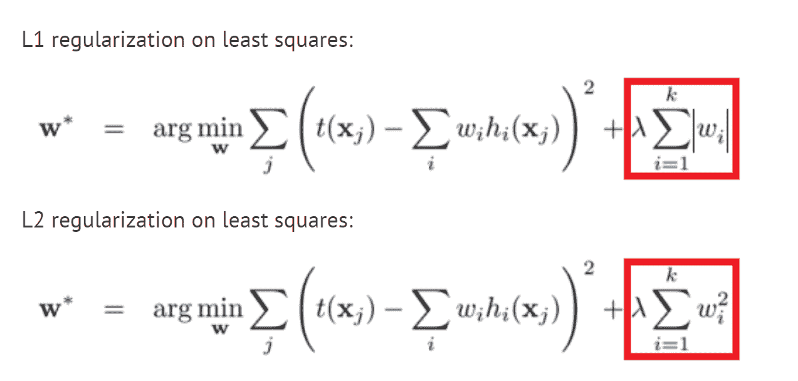

*这里，w 是权重值，红框代表正则项，λ是正则化参数，在训练过程中得到优化。剩下的是计算最小平方的损失函数。*

# 消失和爆炸渐变问题

当使用反向传播来训练深度神经网络时，可以向网络中添加新的和新的隐藏层。这最终会构建一个高度复杂的模型，但会影响训练速度。这里，当使用 sigmoid 激活函数或 tanh 激活函数时，会出现梯度消失的问题，这两个函数用于激发神经网络的神经元，确定梯度在通过层时的行为。

当计算权重矩阵的梯度，然后从完全相同的矩阵中减去时，会发生这种情况。然而，如果模型有许多层，最终一些梯度等于零，因此使其权重值不变，并且它们停止学习。然而，这带来了一个问题，因为模型没有从这些消失的梯度中学习，这没有实现任何东西。通常，这种降低梯度值的效果会随着您在层中反向传播而增强，从而使那些较早的层停止学习。

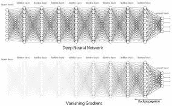

Gradient Descent and Vanishing/Exploding Gradients

更清楚地说，当使用反向传播时，如果使用值在 0 和 1 之间的 sigmoid 激活函数。因此，如果产生一个高值(> 1)，那么激活函数将激活该值为 1，在反向传播期间，导数变为 0，从而完全丢失更高的值，反之亦然(低值[>0)，保持恒定在 0。为了避免这种消失梯度，使用其他激活函数，如 ReLU、PReLU、卢瑟和 eLU。

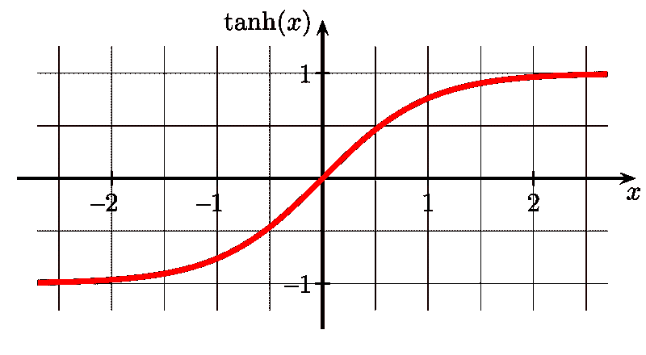

*A Tanh function*

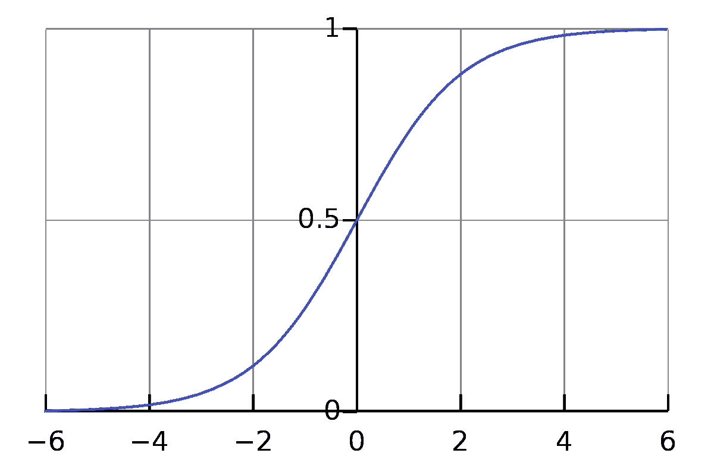

*A sigmoid function. Notice that higher values beyond -6 and 6 remains constant, here*

消失和爆炸渐变问题的答案

*激活功能— ReLU、PReLU、RReLU、ELU*

ReLU:(整流线性单位)为了使大于零的值不变为无效，ReLU 将其标记为无穷大，从而生成一个线性函数。然而，ReLu 的缺点是将小于零的值等同于零，这在某些情况下不是很好，因为它完全错过了这些值，但提高了速度。并且，当值的饱和度低于零时，ReLU 实际上完全阻止了任何训练。

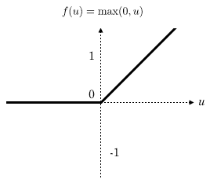

*ReLu*

PReLU(参数校正线性单位):比 ReLU 更好，PReLU 不会使低于零的值无效，但会提高速度。它通过用参数**‘α’替换 0.01 的值来减轻饱和度。**

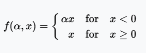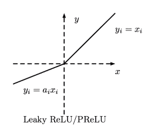

RReLU(随机泄漏整流线性单元):RReLU 据说击败了上述每一个激活函数。RReLU 为负斜率分配随机值，因此不会影响速度或精度。

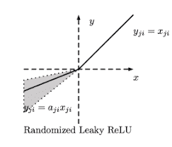

ELU(指数线性单位):ELU 通过将大于零的值等同于 1 来避免饱和。主要是为了提高分类的准确性，ELU 加快了训练速度。

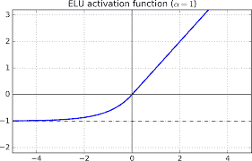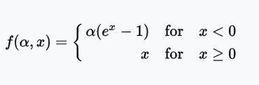

参见文章[此处](https://towardsdatascience.com/secret-sauce-behind-the-beauty-of-deep-learning-beginners-guide-to-activation-functions-a8e23a57d046)的方程和这些函数的详细解释。

*归一化:*

归一化解决了过度拟合、欠拟合和消失梯度问题。

批量归一化:批量归一化技术用于提高反向传播的性能。它包括重新调整输入值的比例，以防止它们变得过大或过小。

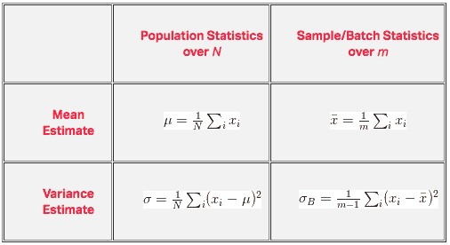

实例规范化:实例规范化是一种只使用单个样本的规范化，而不是像批量规范化那样使用一批样本。

# 多重共线性

当模型预测中的预测变量之间存在多重相关性时，就会出现多重共线性。这种现象是大多数人都熟悉的，在回归模型中也很常见。多重共线性问题仅在您需要知道特定预测发生的原因(即需要预测的原因)时才会出现。这可以为模型的任何预测带来解释。有时，一个高度相关的列看起来可能是某些结果的原因，但实际上它们只是相关的。

发现数据集中的多重共线性可以防止对某些结果得出严重错误的结论，例如在患有哮喘的肺炎患者中，他们被认为对哮喘有更好的抵抗力，因为他们接受治疗的时间更早。然而，事实是，当哮喘患者同时患有肺炎时，他们得到了及时的治疗，因为如果不及时治疗，他们更容易发生致命的后果。

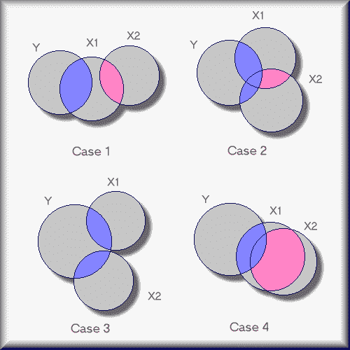

*Credits: creativewisdom.com*

多重共线性的答案

*自相关&部分自相关测试:*这些测试可以检测模型中的相关现象。它们通常用于时间序列分析和预测。通过这些测试，您可以检测哪里发生了相关，并删除高度相关的列。

*自相关:*检测数据中的相关性，或者重复信号的出现，多用于时间序列分析和预测。它可以发生在两个因变量 x1 和 x2 之间。

*主成分分析(PCA):*

主成分分析用于校正相关误差。它只是保留一组新的预测变量，这些变量是高度相关的变量行为的组合。因此，这些新变量保留了那些循环和相关变量的行为，而不是放弃那些在模型中有自己角色的相关变量。它通过特征提取来工作。

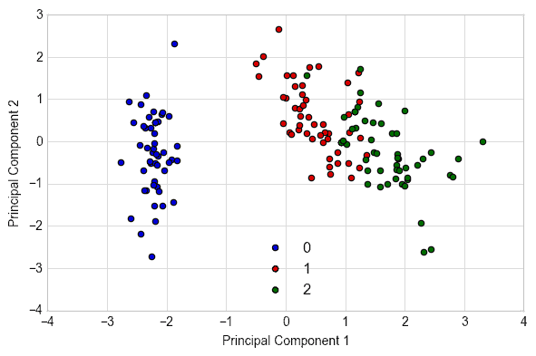

*Plot that analyses the Principal Components of a Dataset through Feature Extraction*

*通过特征提取分析数据集主要成分的图*

*线性判别分析(LDA):*

LDA 用于预测分析问题。

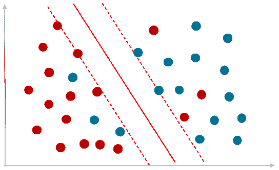

*Logistic Regressions are Classification Algorithms*

它假设一组新输入将属于到目前为止收集的数据集中的类。当使用逻辑回归时，会出现某些限制，例如模型的不稳定性。相反，我们可以使用 LDA 进行线性回归。该算法还使用著名的贝叶斯定理来计算输入对输出的概率。

p(Y = X | X = X)=(PIk * fk(X))/sum(PIl * fl(X))

*皮尔逊相关系数:*

皮尔逊系数用于计算两个变量 X 和 y 之间的相关性。它给出一个介于-1 和 1 之间的值，表示负相关或正相关，如果该值为零，则不存在相关性。

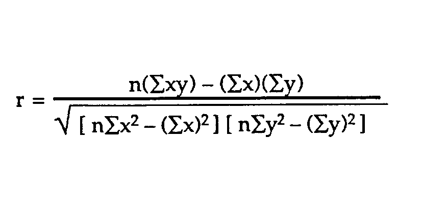

*自相关&偏自相关测试:*

自相关测试结果与变量的相关程度。自相关函数(ACF)用于计算时间序列中的相关性。时间序列预测的观测值与已经收集的时间序列观测值相关联。因此，这个名字叫做自相关。ACF 的目的是使用值绘制具有滞后的所有相关性的图表。这里的滞后项是通过从以前的时间序列观测值中提取使序列平稳所需的值来计算的。

# 关于 Mate Labs

> 在 [*Mate Labs*](http://www.matelabs.ai) *我们*已经构建了 [Mateverse](https://www.matelabs.ai) ，一个机器学习平台，在这里你可以在几分钟 s **内构建**定制的 ML 模型，而无需编写一行代码**。我们利用专有技术、复杂管道、大数据支持、自动化数据预处理(使用 ML 模型的缺失值插补、异常值检测和格式化)、自动化超参数优化和[等等，让分析师和数据科学家的工作变得更加轻松。](http://bit.ly/2UKMO2J)**
> 
> 为了帮助您的企业采用机器学习，而不会浪费您的团队在数据清理和创建有效数据模型方面的时间，请填写[类型表单](https://matelabs.typeform.com/to/LIAau1) [**此处**](http://bit.ly/formcontactus) ，我们将与您联系。
> 
> 阅读更多关于我们的[产品](https://towardsdatascience.com/product-launch-announcement-mateverse-high-level-v-1-0-e51577dab05f)的信息。欢迎致电[**mate @ mate labs . in**](mailto:mate@matelabs.in)联系我们

# 联系我们

> 此外，要收到像这篇文章这样有用的文章，请关注我们的[这里](/@matelabs_ai)，在 Medium 上[，LinkedIn](https://www.linkedin.com/company/mate-labs/) 和 Twitter 。

# 关于作者

## [渡鸦的丹尼尔](/me/stories/public)

> 在 Medium 上找到她，[这里](/@rayvensdan)。在 LinkedIn 上寻找更多行业话题和更新。