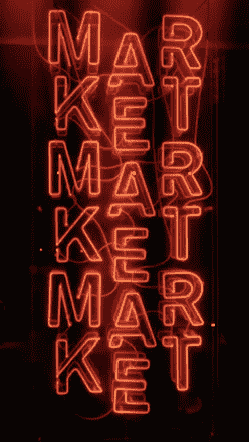

# 解决这些常见的陷阱，成为更好的密码交易员

> 原文：<https://medium.com/hackernoon/tackle-these-common-pitfalls-to-become-a-better-crypto-trader-b596210f6501>

毫无疑问，加密炒作已经吸引了雄心勃勃的新交易者。但是，如果没有一些常识、可靠的策略和可靠的密码交换，很容易陷入一些常见的恐慌驱动的错误模式。

以下是避免它们的方法。

# 你是哪种交易者？

决定你如何交易(或想如何交易)会让你明白你的风险，以及你将如何处理市场的涨跌。

你是一个每日交易者*——
经常根据趋势交易吗？*

*或者你是一个 ***投资者****——* 买入硬币(尤其是在市场下跌的时候)并长期持有？*

*你也可以两者兼而有之。*

> *最安全的策略是长期投资硬币——根据趋势最低限度地调整它们，并持有它们以备未来大幅增长。*

*然而，如果你想快速获得短期利润，交易通常会让你更快达到目的，当然风险也更大。*

*但是对于你这些新的每日交易者来说，记住最常见的错误是过度交易。*

*所以慢慢开始，观察和研究市场，把你的风险降到最低。*

# *你在哪里交易？*

*可供选择的加密交易所屈指可数，但哪些是最有信誉、最可靠的呢？*

**

*如果你还是交易新手，你首先需要一个支持法定货币(如美元、英镑、欧元)的交易所，将它们兑换成加密货币。这些交换允许你与你的银行账户同步，这样你就可以开始积累你的硬币。*

*[**比特币基地**](https://www.coinbase.com/)——*

*到目前为止，它是最受欢迎的交易所之一，受到投资者的支持，被全球数百万人使用——这是一个伟大而可靠的切入点。*

**其他最优交流包括*[*coin mama*](https://buybitcoinww.co/CoinMama_Crypto)*和*[*cex . io*](http://buybitcoinww.co/CEX__IO)*。**

## *如果你是长期投资的话？*

*你可能会越来越少地依赖法定货币，最终需要一个可以提供更多硬币品种和功能的加密交易所。*

*考虑一下****——*****

***总部位于马耳他的交易所，目前是世界领先和最快的加密货币交易所，交易费用非常低(每次交易 0.05%)。这是一个非常受欢迎的选择，它有一个超级用户友好的移动应用程序，使交易更加容易。***

****其他伟大而高级的交流还有***[*bit trex*](https://bittrex.com/)*[*changely*](https://changelly.com/?ref_id=d6a054d39ec8)*。*******

*******为什么不*给自己设置一个最优的？******

****您还可以在这里 获得关于不同加密交换 [**的更深入的视图。**](https://www.buybitcoinworldwide.com/cryptocurrency/exchanges/)****

********

# ****理解你的硬币****

****做好准备，迎接来自推特、电报集团和互联网的一波又一波的谣言和令人不安的“提示”，说服你像一个无脑木偶一样买卖。尽早意识到这些大多是假账户、付费推广者或那些试图故意操纵市场并通过 FOMO(害怕错过)影响你的人。****

> ****FOMO 是密码世界的潮流——是推拉和恐慌影响着新交易者的买卖。****

********

****放弃木偶表演，自己理解你的硬币处于发展阶段的哪个阶段(有些阶段会变化更多)，你会开始注意到它的平均波动幅度和趋势线。****

****市场总是会波动，但如果你能发现更大的下跌，你就能保持领先。****

# ****有一个利润退出策略****

****作为交易者，有时候你的持仓量会激增。****

*****然后呢？*****

****你会在第一次上涨时获利，还是会得寸进尺，继续持有？****

********

****许多新交易者没有为他们的利润建立退出策略。****

****一个好的经验法则是分阶段出售，而不是一次卖掉你所有的硬币。****

****通过这种方式，你仍然可以获得一些直接的利润，但也为其他潜在的增长留下了一些空间。****

# ****使不同****

****完全投资于一个硬币并不是坏事，但这是有风险的——我们都在努力将风险最小化。****

****即使市场整体表现良好，每一枚硬币(不管它有多受欢迎)最终都会(暂时地)在某一点上大幅下跌。****

> ****在经济的这一面，没有什么是有保证的。****

********

****研究其他硬币，开始分散投资，认真对待风险管理。****

****通过这样做，你的投资组合将足够好地应对市场的涨跌，甚至会增加你从不同硬币中获利的机会，因为它们都处于不同的成长阶段。****

****意识到交易中最初的常见陷阱可以帮助你保持谨慎，走在曲线的前面(尽可能)，并最小化不必要的风险。****