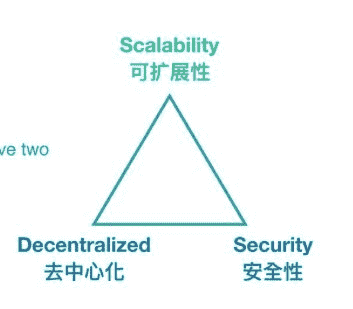
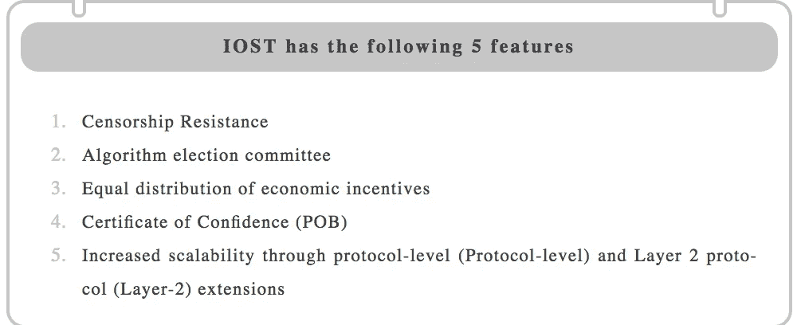
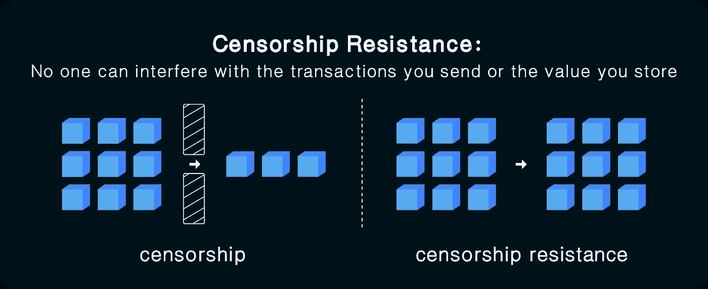
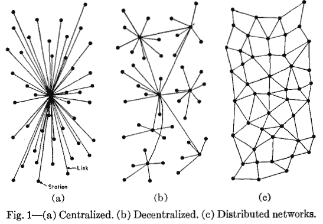
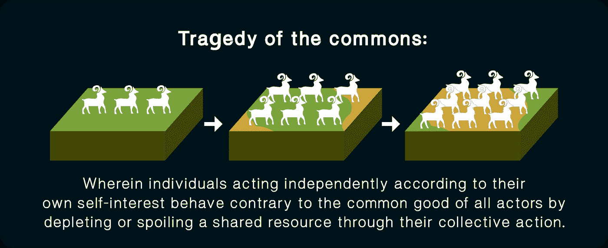
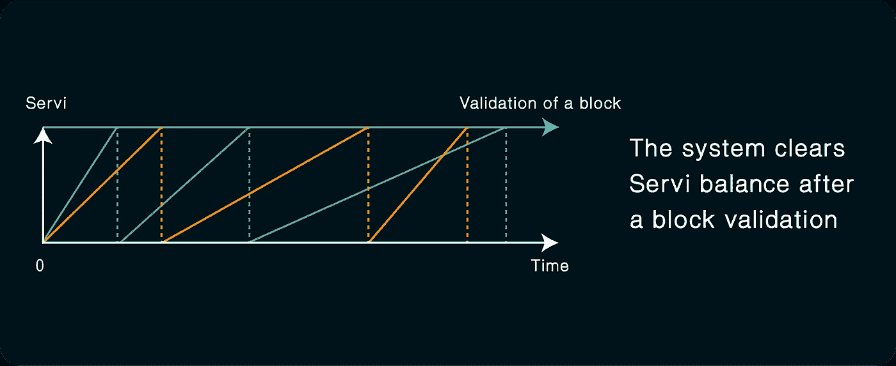
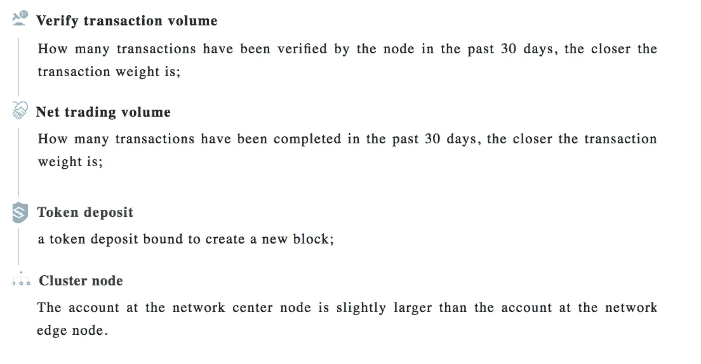
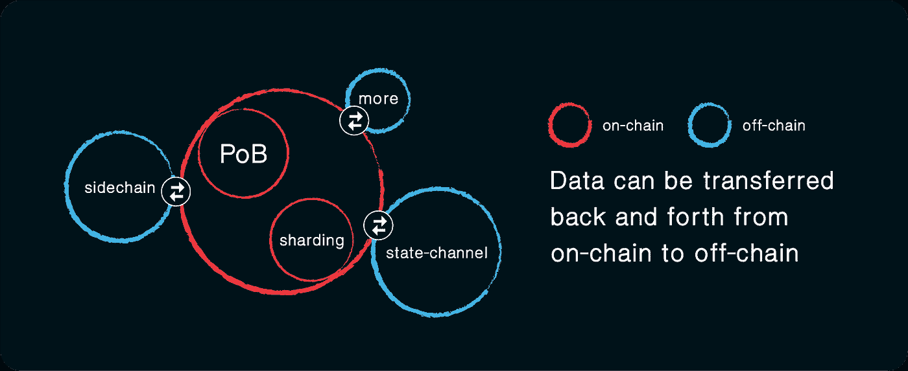

# 解决可扩展性的三难困境

> 原文：<https://medium.com/hackernoon/tackling-the-scalability-trilemma-1627fa3f6936>

> IOST 区块链的成功离不开技术发明和社区支持。6 月底，我们发布了 IOST 测试网络的第一个版本 Everest 0.5。以验证 POB 共识机制的参数，在真人环境测试中达到了 8000 TPS 的峰值，使得 Everest 的 TPS 比以太坊快 400 倍，比 EOS 快 8 倍。
> 
> 由于我们能够在技术方面实现我们的最初目标，我们的核心工程团队致力于创造更多的内容来解释我们的开发思维过程，以及我们为解决区块链行业面临的最大挑战而采取的各种方法。
> 
> 我们将每月制作思想片段，并与开发团队的核心工程师进行深入对话，讨论我们最初的关注点、技术难点、开发概念以及通常不会涉及工程师的事情。我们相信这个[技术](https://hackernoon.com/tagged/technology)的讨论将让我们分享我们在这个不可思议的建设过程中积累的智慧，并帮助推动区块链社区达到更高的高度。

在过去的几年里，区块链项目一直在努力解决所谓的可伸缩性三难问题。试图在可伸缩性、安全性和去中心化之间找到平衡并不容易，许多项目在一个领域偷工减料太多，因此损害了区块链的完整性。在 IOST，我们正在努力开发技术来解决这个问题，并引入一个真正的功能分散的基础设施！

IOST 是一个区块链平台，为分散的应用程序提供了一个强大的方法来开发社区拥有的网络，并为第三方开发者，创作者和企业提供了一个公平的竞争环境。我们认为，集中式平台已经占据主导地位太久了，以至于人们已经忘记了有一种更好的方式来构建互联网服务，即最初的开源方法。为了偏离这种集中化的道路，IOST 正在努力解决区块链可扩展性的三难困境，而不是回避这个问题，并在短期内诉诸集中化来争夺市场主导地位。

The Scalability Trilemma

IOST 提高了交易性能，而没有牺牲去中心化的关键属性，即审查阻力、开放参与和免受某些攻击。它比 EOS 之类的系统更加分散，同时比 ETH 之类的智能合约平台更具可扩展性。IOST 有以下五个独特的特点:

## **审查阻力**

在可伸缩性三难困境的背景下，IOST 倾向于去中心化。更具体地说，相对于规模，IOST 更重视审查阻力。即使在我们试验不同的扩展解决方案时，IOST 区块链仍然保持着审查阻力、开放参与和对某些攻击的免疫力。IOST 区块链的每个节点都有公平的机会被选入委员会，参与生产区块和验证交易。PoB 允许这种情况发生，而没有在其他方面做出任何牺牲。

人们普遍认为，为了最终取得成功并看到这些平台的主流采用，网络必须能够与签证级别的吞吐量竞争，因为没有人希望使用交互需要几天、几小时甚至几秒钟的应用程序。这是一个危险的说法。这一论点是正确的，因为区块链需要有与集中服务相当的绩效，但它没有理解，不能以分散化为代价来实现绩效。

这一论点没有考虑到区块链教实际提供的基本价值，即抵制审查。如果区块链平台不提供审查阻力——那么他们必须依赖一组可信的参与者来产生和验证块，如 EOS——这就简单地转化为对传统数据库系统的回归，尽管代价是亚马逊网络服务或微软 Azure 等传统系统提供的效率。

## 为什么抵制审查很重要？

比特币区块链的抗审查性质意味着，任何人都可以在 BTC 持有价值，而没有被恶意行为者、机构或监管机构没收的风险。来自 INBlockchain 的 Eric Meltzer 在下面的引用中简洁地抓住了抵制审查的价值:

> “我发现，在国家控制之外，基本上不可流通的货币的存在令人非常欣慰。国家是一个不可预测的怪物，大约每隔一个世纪就会出现一次。有能力离开而不留下任何东西是关键。”

当然，抵制审查除了货币资产之外还有其他有价值的应用。IOST 通过系统的设计认识到了这一点。IOST 没有静态的节点集，而是有一个动态的、基于信誉的委员会来验证交易和生成区块。我们区块链的每个节点都有公平的机会被选入委员会。它允许开发者构建抗审查的应用程序和智能合约。如果你与另一方签订了一份智能合同，重要的是你要清楚，无论是合同记录还是合同规则都不能以你为代价被篡改。如果你的身份——社会保险号，信用信息等。—存在于智能合同中，确保特定参与者永远不会干扰您的信息是至关重要的。

一些人认为基于 DPoS 的区块链是抵制审查的。但是自从 EOS mainnet 最近推出以来，审查就已经开始了。“EOS 核心仲裁论坛”(ECAF)是一个新成立的中央集权政党，已经命令所有区块生产商冻结网络上的 27 个账户。他们这样做的同时说“这个订单的逻辑和推理将在以后公布。”冻结命令是由一个叫萨姆·萨波兹尼克的人发出的，所有超级节点毫无疑问地执行。使用一个没有审查抵抗能力的区块链是没有意义的，因为去中心化变得不存在，区块链的任何事情都可能被扭曲。

到目前为止，EOS 章程中增加了一些新规则。这种增加没有任何分散的决策过程。这样做是为了让 ECAF 及其做出有约束力决定的无限酌处权具有某种程度的有效性。EOS 的审查现在是“符合宪法的”。这违背了加密最初的初衷。

**The difference between centralized and decentralized systems)**

## **算法选举委员会**

IOST 区块链使用算法根据他们对社区的贡献和他们持有的令牌来选择验证委员会，而不是像大多数区块链那样使用基于 DPoS 机制的链上投票系统。

链条上的投票委员会有严重缺陷。这一机制试图复制代议制民主的条件，但引用维塔利克·布特林的话来说，“代议制民主的一人一票制度已被一人一票的制度所取代。”

这种制度无疑将最终演变成富人统治的分层制度。拥有更多资本投票权的人将能够继续积累资本，这样那些投票权较少的人将越来越被剥夺权利，因为他们的投票对选举结果影响很小或没有影响。从的发展历史来看，人工投票机制管理的有< 15%的参与度，如 DAO carbonvote、EIP186 carbonvote、DAO 议案投票、2014 Bitshares 投票等。在 IOST 系统中，区块生产商(BPs)委员会根据贡献和余额分配算法，每个人都有相同的责任和权利。

同时，“公地悲剧”也可能发生在区块链投票中。

由于每个选民影响投票结果的机会非常小，他们投票的动机比理想情况少几千倍。这意味着很有可能每个人都将他们的代币放在交易所，交易所将代表他们投票，这些用户不会真正关心交易所如何使用他们的钱投票。这种情况会导致投票中心化的趋势。

另一个问题是，选民变得容易接受超级节点的贿赂，这些超级节点可以购买选票，以换取一部分年度奖励。超级节点被鼓励相互勾结，这样他们就可以固定与选民分享奖励的比率。

因为存在购买选票的动机。一旦当选，所有的超级节点(或 **B** lock **P** roducers，BPs)都会想继续掌权。因此，存在维持既定秩序的激励，这意味着当选的区块生产者将结成联盟，相互投票。在使用与 EOS 非常相似的 DPOS 系统的加密货币 Lisk 中，这导致了两个非常强大的类似 maffia 的联盟的出现:Elite 和 GDT。另一方面，IOST 使用动态委员会模型来验证和产生有意阻止联盟形成的块。如果一个节点产生了阻塞，该节点需要“冷却”一段时间才能再次参与。

一旦这种联盟形成，区块链纲领的权力下放将不复存在。联盟甚至可以开始以各种方式勒索建立在 EOS 基础上的企业。不仅交易会受到卡特尔的审查，除非它以某种方式行事或向 BPs 付款，而且审查可能是隐蔽的。例如，英国石油公司的卡特尔可以通过网络运作方式的微小变化，使某项特定业务的运作变得更加困难。毕竟，网络上允许或不允许什么的决定权在卡特尔手中。

通过以间接、隐蔽的方式进行审查，任何可能的公众反弹都被最小化了。毕竟，BP 唯一要做的事情就是解释他们为什么要修改协议。只要这个理由看似合理，足以让一般不知情的公众逍遥法外，我们甚至不知道是否有任何敲诈正在进行。

## 经济奖励的平均分配

在 PoS 中，更大和更老的硬币持有者有更高的概率签署下一个区块。虽然计算能力相对于电力来说是节省的，但是富裕的用户会比其他人更快地获得财富。

PoB 系统不仅奖励那些有一定账户余额的人，还考虑他们对社区做出了多少贡献。贡献因素包括已验证的交易、更多的计算贡献和资源贡献，我们目前正在测试其他因素。

这意味着那些积极帮助经济和促进整个网络的人将得到奖励，从而使更大的社区受益。用户的贡献由*服务*来衡量。用户的*服务*余额加上下注的代币余额决定了用户的可信度分数。它越高，他们被选入委员会的机会就越大。

POB consensus 具有独特的设计，因为*服务*是自终止的。这意味着在验证一个块之后，系统将自动清除用户拥有的 *Servi* 余额。因此，高分和低分的节点可以轮流验证块。这确保了公平奖励赠品。

POB 的好处是，这将意味着财富分配更加平均；基本上任何有贡献的人都有公平的机会获得 IOST；刚加入网络的新人可以和很久以前加入网络的人获得同等水平的奖励。

这是一个重要的平等主义概念，因为它给每个人相似的机会。IOST 的目标是赋予普通人权力，并为每个人提供一个充满机会的区块链。节点没有什么不同，每个人都可以通过贡献成为超级节点。该系统旨在为所有参与者提供平等公平的机会。

## **可信度证明的安全设计(POB)**

可信性证明(POB)共识机制扩展了传统的 PoS 概念，其中节点需要积累大量令牌以便有资格参与新区块链的创建，并且基于某个值的比率来确定产生块的概率。在 PoS 中，这个值是一个节点累积或给出的令牌总数，而在信任证书(POB)中，这个分数包含了更多的变量。应用网络聚类和页面排名的数学计算思想，**可信度得分主要由以下因素决定:**

**可信性证明解决了 PoS 的两个主要缺陷。**

首先，在发布中，节点将积累尽可能多虚拟货币，并继续从批量生产中赢得奖励。这就把财富集中在平台内部，阻碍了代币的流通。**在 PoB 共识机制下，仅仅积累财富而不帮助产生和传播交易会导致较低的可信度得分，这有助于 IOST 流通增加可信度。**

第二，是无关紧要的问题。因为创建块不需要资源，所以当有一个分叉时，节点可以在两个分叉上自由创建一个新的块，这个新的块会以极大或无限的方式扩展某个点。信任证书(POB)可以利用保证金担保的“约束保证金”来防止这种情况发生。如上所述，每个节点的可信度分数包括用户抵押的令牌。为了能够解锁这些绑定的代币存款，用户必须首先启动解锁保证金过程，然后等待更长的时间间隔，即所谓的“解锁期”。这也让所有用户提前了解审核委员会将如何变化。如果没有这个“解绑期”，节点将容易受到原核查委员会的攻击，事实上核查委员会可能不复存在。

## 容量扩展(**扩展)**

正如我们已经讨论过的，如果这些平台要真正到达主流受众并实现其所有革命性的承诺，可伸缩性是最终需要的。但是可扩展性不应该以牺牲审查阻力为代价。

IOST 的解决方案是通过将区块链简化为一个集中式数据库系统，来真正解决可伸缩性三难问题，而不是绕开它。

我们正试图通过各种协议级和第二层扩展解决方案来实现这一点，包括:通道、分片和侧链。

我们认为协议级和第二层协议是提高区块链可扩展性的两种主要方式。协议层包括建立设计更好的底层区块链协议。正如我们在现有的简单区块链设计中看到的那样，它保持了大多数区块链的预期分散化和安全性特征。它只需要一小部分节点来查看和处理每个事务，并允许同时并行处理更多事务。第 2 层协议(Layer 2)包括链下协议的创建，该协议将大多数事务发送到链，并且仅偶尔与链的上层交互以进入和退出第 2 层系统。这也适用于防御对系统的攻击。凯斯。我们认为，这两项战略相辅相成。我们支持采取多管齐下的战略来改善 IOST 的扩张，也就是说，让这两种战略相互作用，相互补充。