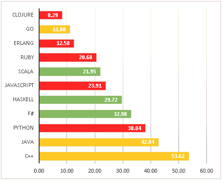

# 让你的软件质量更上一层楼

> 原文：<https://medium.com/hackernoon/take-your-software-quality-to-the-next-level-182cc4a0a9fe>

如果你想成为一名专业的程序员，你能拥有的最强大的技能之一就是知道如何构建高质量的软件。软件项目失败率很高，根据一些报告显示[超过 50%，开发人员可以:](https://www.cio.com/article/3068502/project-management/more-than-half-of-it-projects-still-failing.html)

1.  建造正确的东西，然后
2.  好好建造它

在大多数人中脱颖而出。

一次又一次的研究和多年的经验表明，当软件团队把质量放在第一位时，其他的事情都会水到渠成:

*   你交货更快
*   这种产品使用起来很愉快
*   团队士气更高
*   产品更稳定，速度更快。

软件质量有很多方面。开发人员最常讨论的软件质量方面是测试:

*   单元测试，
*   集成测试，
*   功能测试，
*   TDD 等。

其中，出于某种原因，单元测试最受关注。

**忘记单元测试吧。**

构建阶段测试对实际产品质量的影响最小(1)。不要误解我。继续编写单元测试。但是要知道单元测试是大海中的小鱼。如果你真的想写高质量的软件，你的关注点应该在别的地方。

# 和大鱼一起游泳

在这篇文章中，我们将看看确认和验证。

不幸的是，在软件工程中，术语*验证*和*验证*之间有些混淆。我是这样区分它们的:

*   验证——我们是否构建了正确的产品(正确的需求等)？
*   验证—产品构建是否正确(是否有效)？

验证就是测试的用武之地——测试，以及其他一些经常被忽视，但是非常有价值的实践。

# 软件验证

> 过去 25 年的研究已经证明，尽早消除缺陷是值得的。组织发现，与在系统测试期间或发布之后纠正这些错误相比，在详细的构建开始之前清除需求和架构错误可以减少 90–99%的返工成本。
> —史蒂夫·麦康奈尔

作为一名专业软件工程师，你最重要的任务之一与工程无关。你必须理解“生意”正如我在之前的一篇文章中提到的，工程师的主要工作是解决问题。为了成功地解决问题，你必须了解你的问题领域。对于大多数软件工程师来说，这意味着理解他们公司的业务。

*   你的公司为什么存在？
*   你的客户有什么问题是你的公司正在努力解决的？
*   是什么让你的公司在竞争中脱颖而出？

为什么这很重要？绝大多数产品错误发生在开发的需求和构建阶段。而且，在这个早期阶段出现的问题是大问题。建造错误的东西，你的企业就无法实现目标。在最好的情况下，你会看到重写。没有比重写更昂贵、更容易出错的了。在最坏的情况下……是时候掸掉简历上的灰尘了。

如果你幸运的话，你的工作环境中，你可以对故事的发展或分配给你的团队的任务有所贡献。如果是这样，你的故事头脑风暴会议是整个软件开发生命周期中最重要的部分之一。当你了解你的业务和你的客户时，你就准备好发现产品设计中的缺陷了。您可以保护应用程序的完整性。您可以帮助防止最大、最棘手的问题影响您的项目。

# 软件验证:关键任务

在这一阶段，目标是确保你正在开发的功能对公司有益。大多数情况下，这意味着为最终用户增加一项好处。

要在此阶段取得成功:

*   尽早让利益相关者和用户参与进来。这种早期参与使得“预期用途”的规范和验证更容易、更彻底、更准确。
*   原型。创建一个快速、实用的原型，并让人们使用它。质量在这里并不重要。它必须工作。你专注于设计和 UX。迭代设计。用户往往不知道他们想要什么，直到他们可以触摸它。这是快速进化原型如此成功的原因之一。当你有用户喜欢的东西时，就去构建它——或者重构并强化它。
*   有一个宏伟的计划，但不要试图一次建立太多。对产品如何运作有一个统一的愿景增加了概念的完整性和用户的愉悦。允许产品通过迭代和用户反馈来发展，将有助于产品保持相关性，并满足用户和业务的需求。

当您准备好构建时，是时候关注一些您习惯的标准质量任务了。

# 软件验证:超越单元测试

> 已知最有效的消除缺陷的方法…包括需求模型、自动证明、需求、设计和代码的正式检查；以及代码和文本的静态分析…这些方法分别在缺陷消除效率方面被测量到 85%。
> —卡斯帕·琼斯(2)

当有其他软件度量被证明更有价值时，在单元测试上花费了太多的思想空间。所以，现在，忘掉单元测试吧。让我们探索一些其他选项:

。设计:

。。。建模/规格

。。。契约

。类型和证明

。复习

# 设计

> 思考并不能保证我们不会犯错。但是不思考保证我们会。
> —莱斯利·兰波特

在编码之前，先做一些设计。离开电脑。画一张图。就这个问题进行对话。思考这个问题，试着去理解它。和你的团队一起检查你的想法。迭代。如果开发人员花时间仔细考虑他们的设计——而不是“在键盘上设计”,那么许多问题和缺陷都可以被消除。

最近，我开发了一个应用程序，它包含了引导用户通过一系列步骤。团队中的一个开发人员实现了一个复杂的向导组件来控制导航流程。他们在没有咨询团队其他成员的情况下开发了这个解决方案。这是一个在键盘上设计的例子。现在，几个星期后，我们正在考虑从应用程序中重构向导，因为它增加了不必要的复杂性。如果有问题的开发人员事先与团队一起审查了他们的设计，这个问题可能就可以避免了。

## 建模/规格

当我们在编码前仔细考虑我们的设计时，我们的代码会不由自主地改进。必须设计任务和生命关键软件的工程师使用的工具之一是规范语言。这种规范语言的例子包括:ACSL、Spec#、Eiffel contracts、JML 和 SPARK contracts(见下面的合同)。另一种规范语言兼作编程语言。示例包括:Coq、Agda、WhyML 和 Idris(参见下面的依赖类型和证明)。最后，还有独立的规范语言。这些都不是完整的编程语言。一些例子是:Z，VDM，B 方法，ASM 和 TLA+。

建模/规范和模拟是工程中的标准实践。多年来，不同的建模技术在软件领域占据了主导地位——从 UML 到餐巾纸绘图。一些建模技术已经被证明非常有效——TLA+就是一个很好的例子。

TLA+是一种正式的规范和验证语言。它帮助工程师设计、说明、推理和验证复杂的软件系统。根据 Ron Pressman 的说法:

> TLA+已被英特尔、康柏和微软成功地用于硬件系统的设计，最近开始在大型软件系统中使用，在微软、甲骨文，最著名的是在亚马逊，工程师们使用 TLA+指定和验证许多 AWS 服务。

然而，这种级别的建模虽然非常有价值，但并不总是物有所值。也就是说，不做任何模型也是昂贵的。为您的应用程序找到一个平衡点——知道什么时候花时间做正式建模是有意义的——是非常有价值的。你是怎么做到的？您的功能越关键，花时间指定和验证就越值得。

## 契约

与 TDD 一样，契约式设计(DbC)也是一个设计过程。它帮助你*设计*更好的代码。它是这样工作的:在实现函数之前，您显式地定义函数的输入和输出，以及函数前后输入和输出值的状态。这些定义通常被称为*断言*，被直接写入函数中。他们确保函数和任何调用者都遵守约定。如果没有，断言会停止代码的执行。

在代码中使用断言有几个明显的优点。

*   内嵌的、明确的需求文档
*   测试所有输入的
*   *组件间关系的测试*
*   *当违反合同时，应用程序立即失败*

***内嵌的、明确的需求文档***

*人们常说，单元测试增加了价值，因为它们记录了您正在测试的特性的功能。这是真的。然而，要获得这个文档，你必须在函数和单元测试之间进行上下文切换。使用 DbC，所有这些需求都与函数代码内联。*

***所有输入的测试***

*单元测试只测试你能想到的功能和输入。事实上，他们覆盖代码的能力非常有限:*

> *在一个合理的测试周期内，单元测试不太可能测试超过任何给定方法的万亿分之一的功能。克服它。( ***万亿在这里不是修辞性的使用*** ，而是基于给定平均对象大小为四个字的不同可能状态，保守估计你使用的是 16 位字。吉姆·科普林(着重部分由作者标明)*

*代码覆盖率[到此为止](https://martinfowler.com/bliki/TestCoverage.html)！*

*考虑到这一点，DbC 测试所有输入的事实非常重要。(并非偶然，正是因为这个原因，Coplien 推荐 [DbC 而不是 TDD](https://www.infoq.com/interviews/coplien-martin-tdd) )。*

***测试组件之间的关系***

*单元测试只是孤立地测试功能*的一个方面*。大多数错误不是孤立出现的。它们发生在单位相互作用的时候。所以，大多数编写单元测试的开发人员都会编写集成测试。此外，在编写集成测试时，您可能会遇到与单元测试相似的问题:您能想到多少交互要测试，以及可能有多少交互？使用 DbC，默认情况下测试交互。*

***违反合同时立即申请失败***

*一段代码失败得越快，就越容易调试。如果您的应用程序有一个 bug，它发生在从原点开始向下堆栈的第五个函数中，这可能很难识别。如果您的应用程序在问题所在的地方立即失败，事情会变得容易多少？DbC 故障快。就在问题的源头。*

# *类型和证明*

***静态类型***

*静态类型最近似乎很流行——尤其是在前端。Elm 文档声称，由于使用了静态类型，“用户实际上看不到运行时错误。”Flow 的文档指出，“当你编码时，Flow 识别问题”。FP 博客作者认为，“一大类错误是在开发过程的早期，更接近引入它们的位置被捕获的(静态类型)，”并且，“类型指导开发，甚至可以为你编写代码！”索赔没完没了。*

*其他消息来源认为，所有关于静态类型的噪音都是[有点言过其实](https://labs.ig.com/static-typing-promise)(参见，此处和此处的[)或者没有考虑到](https://blog.jooq.org/2014/12/11/the-inconvenient-truth-about-dynamic-vs-static-typing/)[成本](https://metaphysicaldeveloper.wordpress.com/2010/06/30/the-issue-with-static-typing/)。重要的是，没有人说静态类型没有帮助——只是有更多的故事。*

*下面这个著名的研究按语言分析了 GitHub 上项目的 bug 密度。引用该报告:“图表没有显示静态/动态类型有任何不同的证据，但它们确实显示了…注重简单性的语言与不注重简单性的语言之间的差距。”*

**

*Languages sorte​d by bug density. Repos with more than 100 stars.*

*由 Gao，Bird 和 Barr 进行的研究分析了 Flow 和 TypeScript 识别 bug 的能力，表明静态类型可以将 JavaScript 项目中的 bug 减少 10-15%。*

> *…在 95%的置信度下，Flow 和 TypeScript 可检测到的错误的真实百分比落在[11.5%，18.5%]之间，平均值为 15%… Flow 和 TypeScript 在很大程度上检测到相同的错误。
> —高、伯德、巴尔*

*向 JavaScript 项目中添加静态类型并非没有问题(如上所述)。举例来说，以我的经验来看,“心流”有点像一台组装机。这有点像猴子给 JavaScript 打补丁来拥有类型。一起工作会很痛苦。然而，正如高、伯德和巴尔所说，“即使签入的 bug 数量上的微小变化也可能非常有价值。”*

***依赖类型&证明/形式验证***

*如果变量的类型在编译时已知，那么语言就是静态类型的。依赖类型允许类型依赖于值。这意味着程序行为的某些方面可以在类型中指定。*

*形式验证(校对)是使用数学证明或否定算法符合规范的正确性的行为。这是计算机科学中的一个非常大的领域，我将主要对此加以掩饰。我在这里只提到它与依赖类型的关系。*

*具有依赖类型的语言允许所谓的端到端验证。端到端验证是指定和验证从最高抽象级别到机器指令的程序行为的能力，确保可执行文件符合规范。*

*通过使用依赖类型编程，通常可以不用写任何看起来像证明的东西来证明定理。相反，这项工作是通过类型检查来完成的。依赖类型对于以防止构造任何无效对象的方式定义数据特别有用。*

*这非常有价值。首先，类型提供了与代码一致的功能规范(这也是契约式设计的一个好处)。其次，它允许集成证明——证明应用程序符合其规范的能力。*

*不幸的是，这种可靠性和可读性的代价很高。根据 Ron Pressler 的说法，依赖类型的语言“极其复杂，需要几个月的学习和几年的掌握。由于这个原因，它们只被专家使用，在工业中很少使用，而且几乎从来没有没有学术专家的支持。”可恶。*

## *摘要*

*最后，向 JavaScript 项目中添加静态类型很可能是有价值的。即使收益只是一类 bug 的 15%，那些依然是你不用担心的 bug。实现静态类型的成本相对较低。*

*在 JavaScript 中使用静态类型的另一个好处是可以编写更快的代码。 [V8](https://www.html5rocks.com/en/tutorials/speed/v8/) 、[蜘蛛猴](https://developer.mozilla.org/en-US/docs/Mozilla/Projects/SpiderMonkey/JIT_Optimization_Strategies)、[查克拉](https://blogs.windows.com/msedgedev/2017/10/31/optimizations-webassembly-sharedarraybuffer-atomics-edgehtml-16/)对可预测类型的函数和对象进行优化。*

*虽然使用依赖类型语言听起来很酷，但目前的情况表明这是不实际的。这并不意味着我们不能从他们使用的概念中获益。例如，通过结合契约式设计、静态类型和单元测试，我们可以获得很多好处。*

# *复习*

*根据 IEEE 的报告，在你运行第一个测试用例(2)之前，评审可以从一个产品中去除高达 90%的错误。如上所述，琼斯、*等人*。，从评论中发现了类似的结果:*

> *需求的正式检查[结合其他方法]…已经被测量到缺陷去除效率高达 85%。
> —卡斯帕·琼斯(3)*

*评审不仅仅是代码评审。评审应该在几个层次上进行:*

*   *主要文件和计划的质量保证(QA)审查。*
*   *需求、设计、代码、UML 和其他可交付成果的正式检查。*
*   *需求变更的正式检查。*
*   *需求、设计、代码的非正式同行评审。*
*   *编辑和校对关键要求和文件。(3)*

*几个人执行评审也更好。McConnell 报告说，研究人员发现同一内容的多个审查者发现的缺陷只有 20%的重叠(4)。*

*如果你正在做代码审查，那很好。在代码被评审之前，有多少人必须批准它？你的代码评审过程有多正式？你在做需求评审吗？您是否正在审阅文档(如果有)？*

# *摘要*

*套用弗雷德·布鲁克斯的话:*

> *你花在一个项目上的时间有一半以上(大约 70%)应该花在思考上。再先进的工具也不能替你思考。(5)*

*思考第一。了解业务。了解用户。理解问题。思考并迭代解决方案。使用给你思考空间的过程。使用有助于你思考的语言和工具。所有这些将有助于你创作出高质量的作品。*

**注意事项**

*①[https://www.seguetech.com/rising-costs-defects/](https://www.seguetech.com/rising-costs-defects/)*

*(2)同上。*

*(3) [软件缺陷来源和消除方法](http://www.ifpug.org/Documents/Jones-SoftwareDefectOriginsAndRemovalMethodsDraft5.pdf)，Jones，2012，第 6 页。*

*(4)代码完成，表 20–2。*

*(5)[https://en.wikiquote.org/wiki/Fred_Brooks](https://en.wikiquote.org/wiki/Fred_Brooks)*