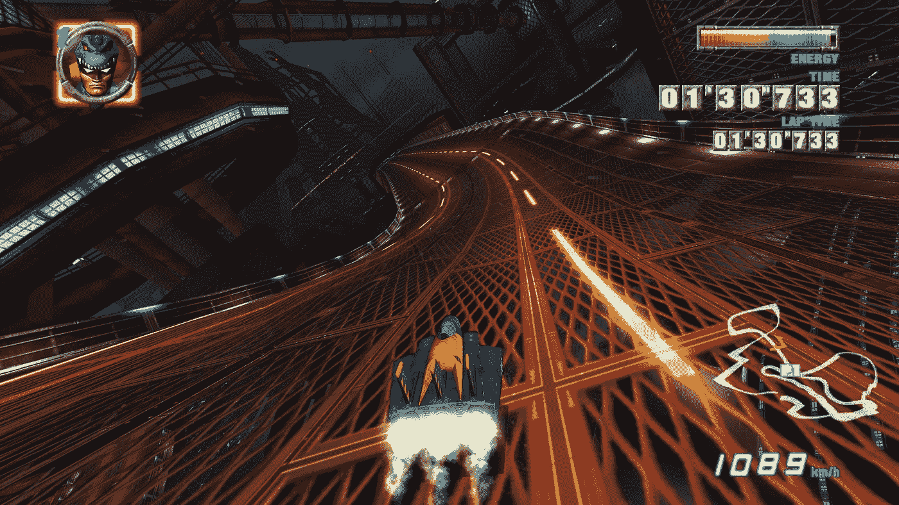
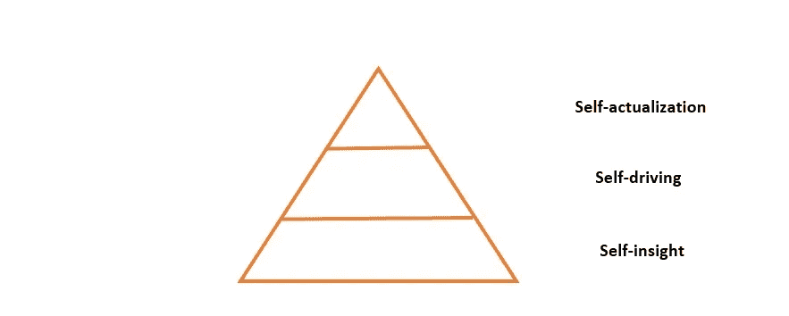
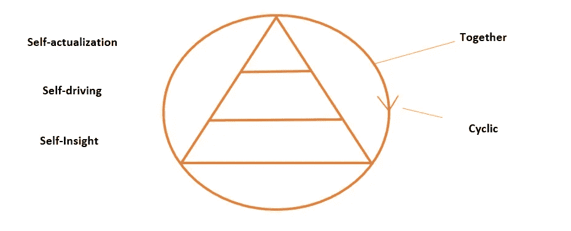
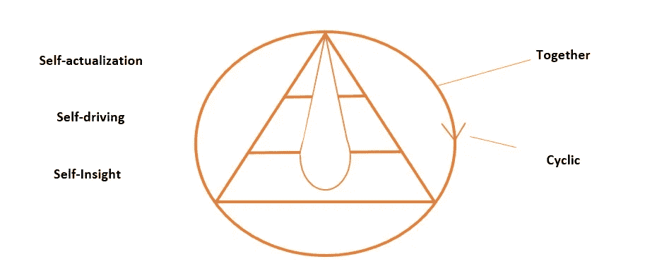

# 从奔向未来的竞赛中休息一下

> 原文：<https://medium.com/hackernoon/taking-a-break-from-the-race-to-the-future-3c484d246ac>

## 未来:快进——对创新影响的不同看法

Image retrieved at [Imgur](https://www.google.nl/url?sa=i&rct=j&q=&esrc=s&source=images&cd=&cad=rja&uact=8&ved=2ahUKEwj1na6Y5OndAhWBLFAKHX19Bk8QjB16BAgBEAQ&url=https%3A%2F%2Fimgur.com%2Fgallery%2FazBHgVe&psig=AOvVaw2tORJRvpI8amdIrGGXYeOh&ust=1538639110792159)

**物联网，区块链，机器学习，AI。所有这些创新技术的真正影响是什么？不是我们使用什么样的技术和我们如何部署它们，而是非常人性化的因素，如道德、对自我和意义的认识，或目的，将在未来产生最大的影响。对于个人和组织来说。对技术的影响提出不同的观点。**

很快，一级方程式赛车将不再在轮子上进行，而是在空中进行，在未来照明轨道上方几米处，与普通过山车一样曲折。包括线圈。也许部分是在虚拟现实中。

> “我们必须用不同的眼光看待现实，以获得新技术所蕴含的最大价值。”— Paul Bessems，区块链顾问兼作者

在你下一次进站的时候，你当然会想如何让你的车跑得更快。或者看看你如何把你现在的车变成一种更适应未来的，甚至可能是完全不同类型的车辆。或者决定是否可以让一种算法来控制车辆。

或者，想想为什么你真的想成为比赛中的第一名。但是要想明白这一点，你必须先停下来。

# 未来:快进|研究

对于博客系列 [*未来:快进*](https://www.motion10.nl/kennisbank/blog/visie-2028/) 【荷兰】我有幸有机会代表 [Motion10](http://www.motion10.com) 采访了几位荷兰商界在创新和数据领域的远见者和先驱。

研究问题是:当前重要的技术趋势将对组织存在的理由和营销产生什么影响；领导力、协作、所需技能和招聘，最后是组织的社会责任？

# 研究结果摘要

首先，我想用一个非常简短的 Twitter 格式给你们总结一下研究结果。这项研究部分基于案头和趋势研究，部分基于访谈。

根据微软 NL 首席执行官恩斯特-扬·施蒂特、[区块链](https://hackernoon.com/tagged/blockchain)顾问和作家保罗·贝塞斯、Motion10 的人力开发负责人穆尼亚·胡阿里和趋势观察家文森特·埃弗茨等人的说法，未来十年组织和组织将发生什么变化:

在未来，成功的组织为客户增加价值，而不是为股东。他们在松散而紧密的关系中这样做，并与客户本身密切合作和协商；一个“组织”将是一个更具流动性的现象，具有更开放的边界。

*这些组织中的团结意识将由个人的、有远见的领导以及人际关系和文化来塑造。等级控制需要被抛弃。*

*社会责任和道德不再是无足轻重的额外津贴:它们恰恰是公司的核心，因为它们直接解释了一个组织的宗旨。目标是一切的中心。*

好吧，这是三条推特。

# 惊喜:伦理和社会责任

如果你代表一家 ICT 咨询公司开始你的研究，并且你偏离了像[机器学习](https://hackernoon.com/the-state-of-ai-in-the-world-56be75b51887)、物联网、数字平台思维、[区块链](https://hackernoon.com/real-life-examples-of-blockchain-disruption-and-what-to-expect-next-6b1675a88f33)和量子计算这样的趋势将对组织中的生活和工作产生强烈影响的想法，你期待某些结果。

你真正没想到的是，几乎所有 18 位受访的远见者都提到，社会责任和道德对未来的成功至关重要。

> “在我看来，这是我们看到的最重要的变化:从利润，我们正在走向目的；从“我”，我们走向“我们，在一起”。在我看来，我们主要是在从‘我’向‘我们’转化”。— Mounia Houari，博客作者，Motion10 的人类发展经理

然而，社会和伦理问题变得越来越重要远不是最令人震惊的。

# 三个出人意料的重要主题

你根本不会想到的是，三个或多或少的哲学主题作为主题浮出水面，这些主题真的很重要，而且在未来也会如此。自我实现、自我驱动(自主和自我洞察)将在很大程度上决定你作为一个人和你所在组织的相对成功和附加值。

The basis of the ‘Purpose Alignment Pyramid’

这三个明显相关的主题一起形成了一个模型，可以帮助你不断提高自己的成功和效率。更不用说你的幸福了。“目标一致金字塔”可以作为对话的开始，也可以作为组织和个人的心智模型。

让我们从金字塔的顶端开始。

# 自我实现

自我实现意味着增加你自己的潜力，并实现越来越多的潜力。在我们的采访中，微软负责云计算和企业产品组合的 Isabel Moll-Kranenburg 这样描述它:“[……]发挥最大潜力。作为一个人的你，作为一个组织的你。这意味着你必须考虑这样的事情:我想要实现什么？”

为了他们自己、他们的同事和他们的客户，真诚地追求这一点的个人和公司将很快定义新的标准。

为什么这一点会成为这类技术研究未来成功的关键因素？因为科技越来越能让我们实现自己的潜力。因为，在未来的竞争格局中，客户与您的竞争对手之间的最后一次积极体验，将成为她与您下次互动的预期标准。对于“客户”，也可以读作“经理”，对于“竞争对手”；同事等等。

# 实现更多

例如，微软的使命是“让每个人[……]获得更多成就”，这绝非巧合。我们 Motion10 有自己的“成长圈”,它概括了我们的使命宣言。但是，如果你仔细想想，谷歌或网飞或任何其他成功的公司也是为了让员工和客户更容易实现他们的目标。

因为每家公司都在逐渐成为 IT 公司，我们都将继续借助数据和创新技术帮助客户实现个人目标。

微软西欧搜索营销主管马斯卡·德里森(Mascha Driessen)这样说:“技术让我们能够在如此多信息的基础上做出正确的选择，做出快速的选择，做出有影响力的选择。”

但是你如何为你自己、你的同事和顾客实现自我实现呢？

# 自动驾驶

随着越来越多的技术变得‘自动驾驶’，我们自己也可以变得越来越‘自动驾驶’。这就像自治，但有一个转折。

> “管理者必须放开方向盘。如果你相信未来是‘自动驾驶’，那么人们必须弄清楚自己想为自己做什么。”趋势观察家文森特·埃弗茨

在那个句子中，你可以很容易地用“经理”来代替“董事会成员”、“人”或简单地用“我们”来代替。关于自我导向或自我驾驶的主题的要点是，技术和其他人可以并将从你手中拿走很多东西。

想到自动驾驶汽车；(自动吸尘机器人)或你的同事或外部合作伙伴，他们可能比你更擅长你那点讨厌的、乏味的工作，而且比你更有乐趣。第二点是，你应该允许这一点，甚至鼓掌。

如果你不再需要做那些对你来说毫无意义的事情，这就释放了自我控制的道路。你变得*更*自驾；很像汽车，只是多了一个内在的*驱动*。你对你的精力、可用资源、知识和技能的部署和应用控制得越多，你实现的目标就越多。

这种方法的顶峰是——像一种新禅宗的武士一样——尽可能专注于你擅长的活动，以及有助于你为自己和世界实现目标的活动。

# 找到你的目标

专注，而不是持续的多任务处理和分心。所以:不要再回复邮件，实施新工具或者参加每周团队会议。[不要一直向下滚动你的脸书或 Instagram 页面](/life-beyond/life-beyond-the-touch-screen-a715b119b8db)。一定要读那本书或遵循那项训练。

在你、你的同事、你的爱人和家人、外部合作伙伴和客户之间的竞技场上，你会找到你能增加最大价值的地方，这也符合你选择的道路。

注意:最佳位置是不断变化的。你的道路也应该如此。甚至你最高的目标和抱负也可能是不稳定的。但是，你如何实现你对那个更高目标的最清晰的愿景呢？你怎么知道什么时候调整它？

# 自我洞察力

了解自己与世界的关系是一切的基础。这就是为什么自我洞察的主题构成了金字塔的基础。它确切地说明了金字塔顶端的位置。只有当你作为一个个体——或者作为一个组织——知道了什么是你与众不同的特征，你才能有所作为。

只有当你强烈意识到是什么让你心跳加速时，你才能选择一个你可以为之努力更长时间的目标。只有当你知道你的优势和陷阱在哪里，你才有机会实现你的目标。

# 一起循环

如果我们考虑到没有个人和组织存在于真空中，这个模型就接近完成了。“提升自己”或“成功”都不是一次性的项目。你的最大成长是与他人一起在一个连续的过程中实现的。

人类是典型的社会人。如果你不同意这个观点，那么你至少必须承认，组织主要是社会实体，经济流量是一种社会现象。这意味着我们的潜力的开发和实现必须总是在与他人的互动中进行。“你只能在一个[网络](https://hackernoon.com/tagged/network)中发挥你的最大潜力”，这是伊莎贝尔·莫尔的描述。

你自己最美丽的版本——或者，如果我们必须这么做的话:最有利可图的版本——只有通过为他人增加价值，你才能成为。此外，作为个人或组织，你在发展之旅中迈出的每一步都会迫使你重新评估自己和自己的目标。进步是永远不会‘完成’的；这是一个持续的循环过程。

这就是为什么上述目的金字塔最终形成了以下近乎完整的模型:

Purpose Alignment Pyramid - nearly complete model

请注意，这个模型还有很多问题。比如，如何做，做什么。但这将随后发生。该模型适用于数据平台的部署。或者形成一个新的命题。有趣的是，我现在每天都在我的个人发展和工作中应用这个模型。

然而，我很想听听它现在对你来说有多有用和清晰。

# 将你的“为什么”和“附加值”结合起来

现在比以往任何时候都更加重要的是，知道你可以在哪里为他人增加价值。这与你内心的“为什么”和你的初步发展道路相吻合。这适用于每一个人和每一个组织。

> “我们现在在公司里必须做的是——同时也是作为个人——照照镜子。[……]我希望人们能够与自己对话。每天都是。说:“我认为我有能力做得更多。”我想这对我们每个人来说都是事实。“—穆尼亚·胡阿里

弄清楚激情和附加值的交叉点在哪里，是另一件明智的事情，你可以利用他人的意见。作为一个组织，但实际上就像个人一样，你可以使用众所周知的[价值主张画布](https://strategyzer.com/canvas/value-proposition-canvas)或类似的模型来做这个练习。

但是，和自己商量至少同样重要，而且非常非常明智。

# 留白和沉思

模型的最后部分可能是最关键的部分:留白和沉思——中间的小水滴形状象征着这些。留白——当你冥想时，或者当你玩你最喜欢的运动或花时间在一个爱好上时，你所经历的——给你空间让你发挥出最好的自己。它是任何一种创造力的温床。休息。

沉思——有目的的反思——建立在它的基础上，帮助你保持专注，确定你的目标，将它们分成子目标，并持续评估这些目标和你的进展。

Purpose Alignment Pyramid — full model

# 停下来，深呼吸，沉思

然而，在这场奔向未来的激烈竞争中，如果不简单地停下来，认真地为自己腾出时间，就不可能与自己商量。休息，冥想，如果必要的话，但特别是冥想。在现代社会中，这似乎是我们最没有时间做的事情。

白日梦、正念和运动是帮助我们不去思考的好方法。但是，我们必须花时间以一种有条理和有效的方式积极思考。关于我们自己和我们在世界上的位置。你想产生什么影响，为什么？

在未来，你、你的员工和你的客户将如何变得更加快乐和成功？只有在你决定花点时间给自己之后。通过寻找空白。首先放松，放松，平静放松地呼吸；然后去思考你到底是谁，你真正想要的是什么。和谁，为谁。

我非常重视并感谢您的关注。这也是我努力带来价值的原因。我主要写的是在 [*生活超越*](https://medium.com/life-beyond) *时对技术的有意识的平衡使用。如果你能让我知道你是如何评价这篇文章的，我会很高兴，通过鼓掌或者在下面的评论中。*

*最后，如果你知道这篇文章对谁有价值，请分享。*