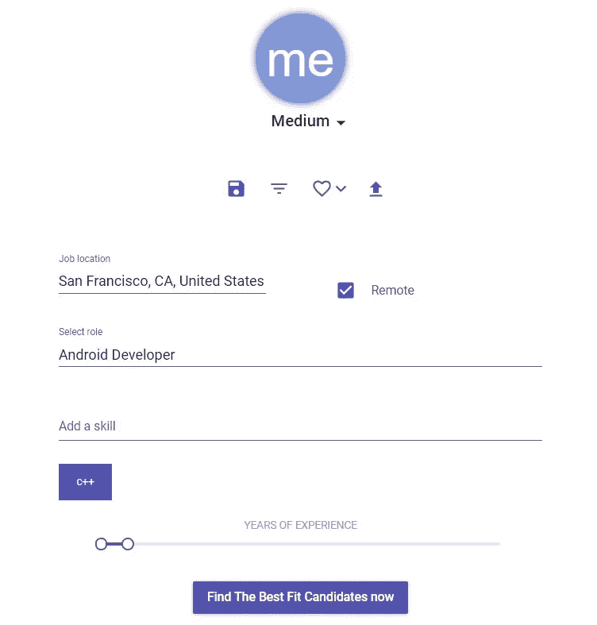

# TalentSnap ICO 评论:区块链技术如何安全地自动化招聘流程

> 原文：<https://medium.com/hackernoon/talentsnap-ico-review-how-blockchain-tech-safely-automates-the-hiring-process-e7295241295>

The Blockchain Sees Right Through Your Tall Tales

劳伦可能拥有一份吸引人的招聘启事中所列技能的一半。但她不会让这阻止她通过自己的努力获得 6 位数的年薪。

信不信由你，那个小故事绝对是真的。劳伦能说会道的天赋为她赢得了一个她完全不胜任的职位。

是时候结束这些代价高昂、完全没有必要的恶作剧了。

区块链理工大学正在融合人工智能，为任何公司的招聘过程带来一些急需的诚实和透明。

那么，TalentSnap 是什么，项目想解决什么问题？我一会儿告诉你。

但是首先，请继续阅读下一部分。这不会像入职时填写一份新工作的文件那么痛苦，但它仍然有点重要…

***免责声明*** *:这不是投资或理财建议。无论如何我都不是金融专家。本文中的大部分信息都是推测性的，仅仅是我个人的观点。在参与任何创业项目之前，一定要进行自己的研究。*

永远记住，你用钱做什么是你自己的决定。如果这个决定对你一个人来说太难了，向金融专家寻求指导。

*我可能会也可能不会收到创建此内容的少量令牌分配。也就是说，我会尽我所能保持公正和公平。我尽量避开所有的 FOMO 和 FUD，也绝不希望把这些情绪传染给我的秘密首脑伙伴们。*

# 可疑的做法

如果劳伦坦诚自己的实际技能，她永远也不会进入第二轮面试。也许她认为她会随着时间的推移学会这个角色。

也许，至少在劳伦的眼里，这很好。但我保证她的雇主会有不同的看法。如果你要招聘一份年薪超过 10 万美元的工作，你要找的是顶尖人才，而不是一个光鲜亮丽的实习生。

让我们面对现实吧，如果你真的想要一份新工作，你可能会愿意稍微歪曲事实。但是如果你把这些故事讲得太久，你会给自己惹上麻烦。

> **“等一下。你是说劳伦不是真正的 18 级认证 Excel 女巫？我这里有她的简历。她将自己的 Excel 技能列为“超凡脱俗”和“令人惊讶”。但你却告诉我不是这样？我们去和她聊聊吧…”**

哦哦，劳伦，你在公司的日子可能屈指可数了…

每个人都有权在工作后休息一下。读了这么多，现在让我们来读一个。

这里有一个超快的视频，可以让你快速了解 TalentSnap 项目的目标:

Sorry, Lauren, you’ll have to apply offchain

欺骗很容易渗透到招聘过程中。与约会类似，被采访的人倾向于投射一个不完全真实的自我形象。

一旦员工签订了合同，解雇他们可能会非常困难且代价高昂。这在某些欧洲国家尤其如此，在这些国家，法律对雇员一方的影响更大。

人们可能会在你的生意中插上一脚——就像鞋子一样——变得很难摆脱。作为一名招聘经理，你要确保你在正确的候选人身上冒险。

可悲的是，像劳伦这样的故事肯定不是孤立的。我还有一个给你。这又一次是真的。

为了保护那些完全不知道自己被扔进了数字巴士的人的身份，我会稍微改一下他们的名字…

# 疯狂欺诈 z

从前，我在一家消费电子公司工作，这家公司最终因管理不善而破产。

该组织的名称？嗯，他们的知识产权最近被廉价收购，现在他们在新的所有权下重新开始经营。我守口如瓶。

但是我会给你一些提示。他们的名字和悲伤的帽子押韵。他们为自己赢得了一个贬损 urbandictionary.com 的条目。几乎他们创造的所有东西都是以一个无意义的缩写命名的。

并且，他们是这个来自 CollegeHumor 的视频的灵感来源。

你看，我将要解释的招聘混乱的根源是老板，他自己就是一个彻头彻尾的骗子。

自恋之王——罗尼——自称是一名“广告人”，曾在可口可乐工作过。但是他 99%的下属认为他在那里的经历实际上是在收发室，而不是在会议室。

不知道是谁出的馊主意，竟然给这个****技术挑战**** *创意*部门负责人*一个在招聘过程中对 *IT* 以及*网络开发*有发言权的机会，但就是这样。欺诈导致欺诈。*

*我们已经有了一个小开发者——Al——为我们工作，但是因为我们正在扩展我们的多品牌网站，我们开始寻找一个高级开发者。*

*贝西·布埃诺来了。面试时流行词肯定满天飞，因为贝西实际上一文不值。我坐在贝西显示器的视野范围内，典型的一天是 5%的工作和 95%的 YouTube 视频。*

*当贝茜在一个项目中陷入困境时——无法完成一个对高级开发人员来说应该轻而易举的任务——你认为贝茜会向谁求助？没错，小开发商艾尔。*

*我真的以为艾尔在发现贝西的真实头衔的那天就要辞职了。我可以从他的眼中看到不公正和不信任的愤怒。*

> *收入比你高 25%的人不应该去你的办公桌前问一些他们在被雇佣前就应该知道的事情！*

*现在，如果贝茜不得不*证明*拥有特定工作技能，这种荒谬且完全不合适的工作场景本可以避免。如果罗尼能够很容易地检查，他可能会选择不同的候选人。*

*可验证的技能是 TalentSnap 项目的核心。该团队正在将人工智能与区块链结合起来，使验证过程变得快速而简单。*

**

*TalentSnap’s MVP is currently up and running*

# *确保良好贴合*

*招聘指标远不止相关技能和经验。每个工作场所都有独特的文化，如果你不喜欢某个地方，你最好继续找工作。*

*你的性格类型应该与你的角色以及你的工作环境相匹配。如果你不能很好地与他人相处，你将很难融入任何组织。*

*这使得个人面试变得至关重要。他们并不总是亲自来，但你必须花时间与某人交谈——至少通过 Skype 或类似的服务——在给他们大楼的钥匙卡之前，感受一下他们的个性。*

*但是在你邀请一个候选人参观你的办公室之前——在和他们在电话上聊过之后，希望能证实他们不是一个十足的怪人——有一大堆数据等着你去查阅。*

*这就是 TalentSnap 的用武之地。在你联系求职者之前，你已经有了大量与职位相关的信息。*

*该团队开发了一个应用程序——现在有一个完整的仪表盘和 Chrome 扩展——来削减脂肪，让你的招聘工作更加智能。*

**

*View a candidate’s details & LinkedIn profile, email them, add them to your favorites, or leave yourself a note*

## *FitScore*

*现在我们开始有趣的部分了。*

*很多招聘网站都有各种各样的筛选条件，比如教育程度、技能和工作经验。但是很少有人考虑到性格类型。这些网站都不能在简历中声称人工智能或机器学习是一项技能。*

*TalentSnap 服务分析了几十个招聘指标，创建了一个独特的 fit score——范围从 1 到 100——用于将雇主和求职者联系起来。*

*随着候选人和雇主在 TalentSnap 平台上创建数据，这项服务只会随着它的匹配而变得更好。*

*你看，人工智能需要信息才能进化。全球就业市场每天产生数以亿计的数据点，TalentSnap 的算法不缺乏思考。*

*如果你愿意，现在就可以测试一下 [**FitScore MVP**](https://dashboard.talentsnap.co/login) 。只要确保你回来完成你在这里开始的事情。*

# *招聘自动化*

*TalentSnap 项目将随着时间的推移而发展。目标是创建一个平台，成为招聘流程的全球基准。*

*将 FitScore 测量提升到行业标准状态将需要团队扩展他们的研发工作。*

*以下是该项目计划深入研究的几个主题…*

## *联合学习*

*别担心，你在这里找不到任何邪恶的*星球大战*角色。*

*联合学习是机器学习领域中的一种设置。目的是使用分布在大型分布式用户群中的训练数据来训练一个集中式模型。*

*在 TalentSnap 的案例中，他们将使用这种方法来智能平台的人工智能。当用户在网络上生成数据时，数据会被发送到智能合约。*

*每次合同进行计算时，它在解释输入数据时都会变得更好一些。这加强了我上面的观点:平台产生的每一个 FitScore 都会比上一个更聪明一点。*

## *同态加密*

*这种技术就是平台如何处理加密的数据，而不需要先解密它。*

*同态加密将允许网络上的每个人安全地共享他们的个人数据。*

*TalentSnap 服务的用户不需要让他们的数据受到信息收集公司的窥探，这些公司旨在从不属于他们的东西中获利。*

> ***需要注意的是，同态加密和联合学习要到 2020 年才会实现。***

## *身份证明*

*你是你所说的那个人吗？区块链知道。*

*为了保护用户身份的隐私，TalentSnap 计划将现有的区块链科技整合到他们即将推出的平台中。*

*例如，Civic 是区块链的一个项目，允许用户创建一个他们可以在整个密码圈内使用的数字 ID。*

**顺便说一句，如果你是 ICOs 的活跃分子，厌倦了 KYC，试试思域吧。这项服务方便易用。**

*身份证明将向雇主保证，申请人是在平台上有真实个人资料的合法候选人。*

# *TSC 实用程序令牌*

*TalentSnap 的本机令牌 TSC 是一个 ERC20。该团队表示，如果以太坊网络无法解决其当前的可扩展性问题，他们可能会跳槽到另一个区块链或建立自己的一个。*

*TSC 令牌的主要用途是作为平台内的支付机制。每次生成 FitScore 时，都会从用户的余额中扣除 TSC 令牌。*

*对候选人来说，这是个好消息——除非 FitScore 匹配度达到 90 分及以上，否则不会扣分。*

*此外，如果候选人和雇主选择与连接到 TalentSnap 平台的第三方公司共享数据，他们可以获得 TSC 令牌作为补偿。*

# *最后的想法…*

*招聘过程自动化是一条漫长的道路。看一下 TalentSnap 项目的路线图，你会看到一个比大多数项目显示的要远得多的里程碑。*

*2035 年——该团队预计的自主招聘目标——可能看起来很遥远。早在 2000 年，等待 2020 年似乎也是漫长的。然而它就在眼前。*

*我认为长期的方法显示了团队是基于现实的。我更喜欢项目慢慢来，把事情做好，而不是急于达到自我设定的里程碑。*

*尽管人工智能行业正在快速发展，但在我们开始看到这项技术融入我们的日常生活之前，仍然需要取得很多进展(T2)。*

*如果你打算做贡献的话，请记住项目缓慢而稳定增长的计划。*

*该项目的技术 100%依赖于数据。在人工智能变得足够聪明来改善整个行业之前，他们将需要一个又一个万亿字节。*

*随着 TalentSnap 开始积累大量数据来满足平台的信息饥渴算法，他们的服务将会改善。*

*将我们已经与社交招聘平台免费分享的数据符号化，可以充分利用区块链理工大学所能提供的一切。*

*招聘过程的简化也为各方节省了成本和时间。如你所知，寻找一份工作或一个强有力的候选人可能是一个漫长而乏味的等待过程。*

*公司可以透过烟雾和镜子，只与看起来真正合适的人打交道。候选人将有权申请与其技能非常匹配的职位。*

*一旦该平台全面投入运营，FitScores 成为雇主和候选人之间匹配度的高度可靠指标，公司将会意识到新员工的质量有所提高。*

*当那一天到来时——希望在未来几年内——公司将能够把劳伦、罗尼和贝西这样的人挡在他们的组织之外。*

*然后，除了欺诈者，所有人都将赢得这场招聘游戏。*

## *DYOR*

*对你想参与的任何项目形成自己的观点总是一个好主意。*

*在这里，您可以更深入地了解 TalentSnap:*

*[talent snap 网站 ](https://talentsnap.co/)*

*[**TalentSnap 白皮书**](https://talentsnap.co/whitepaper.pdf)*

## *社交化*

> *[Bitcointalk](https://bitcointalk.org/index.php?topic=4739921.0)脸书 LinkedInReddit*
> 
> *[电报](https://t.me/talentsnap)推特 YouTube*

## *顺便说一下…*

*如果你喜欢你在这里看到的，并且需要帮助把你的加密信息传递给大众，我很想听听你的项目。*

*请随时联系我:blockchainauthor 作者在 Gmail*