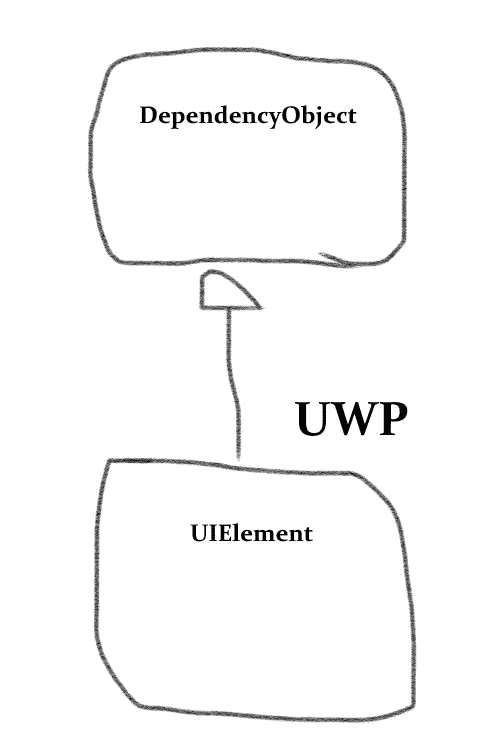
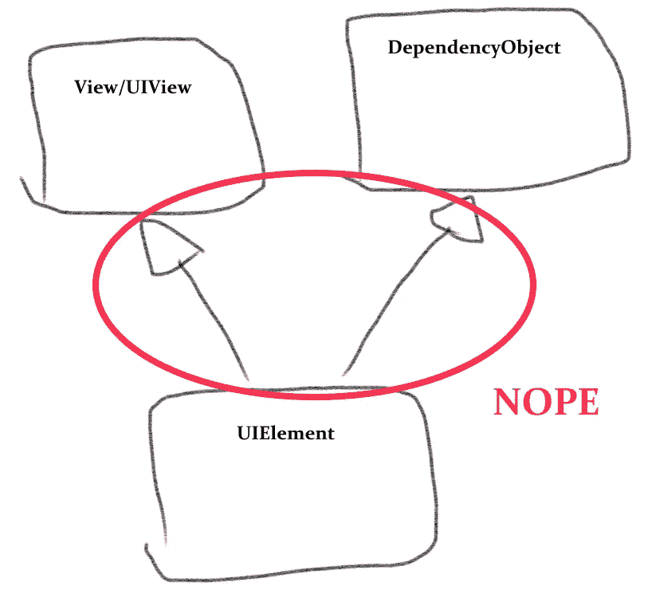
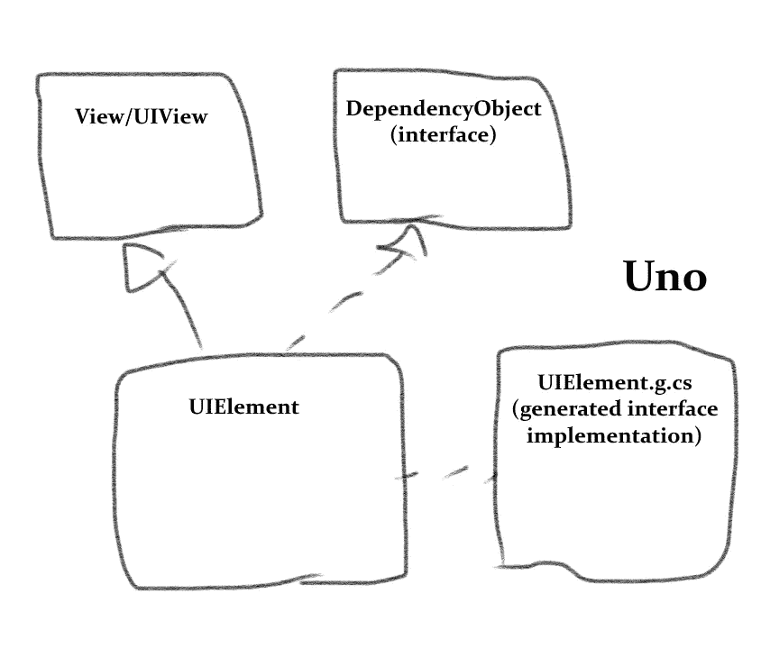

# 谈论我这一代:Uno 平台如何生成代码，第 2 部分——引擎盖下

> 原文：<https://medium.com/hackernoon/talkin-bout-my-generation-how-the-uno-platform-generates-code-part-2-under-the-hood-9970ac38ad06>


[之前](/@unoplatform/talkin-bout-my-generation-how-the-uno-platform-generates-code-part-1-under-the-hood-7664d83c4f90)我们看了 [Uno 平台](https://platform.uno/)如何将 XAML 标记文件转换成 C#代码。在这篇文章中，我将谈论 Uno 使用代码生成的另一种方式，允许我们使原生 Android 和 iOS 视图符合 UWP 的 API，并解决[多重继承](https://en.wikipedia.org/wiki/Multiple_inheritance)的棘手问题。

# 想要这一切

Android 和 iOS 上的 Uno 的部分功能是能够轻松地混合 UWP 视图类型和纯本地视图。这是可能的，因为在 Uno 中，所有视图都继承自本机基本视图类型:Android 上的 [View](https://developer.android.com/reference/android/view/View) ，iOS 上的 [UIView](https://developer.apple.com/documentation/uikit/uiview) 。

但是正如我在以前的一篇文章中提到的，这给复制 UWP 的继承层次结构带来了挑战。UIElement 是 UWP 中的基本视图类型，但它又派生自 DependencyObject 类。`DependencyObject`是任何有`DependencyProperties`的东西的基类，也就是任何支持数据绑定的东西。这包括所有视图，以及一些非视图框架类型，如[变换](https://docs.microsoft.com/en-us/windows/uwp/design/layout/transforms)和[笔刷](https://docs.microsoft.com/en-us/windows/uwp/design/style/brushes)。

我们想继承`ViewGroup`或`UIView`。我们也想从`DependencyObject.`继承，C#不允许多重继承，那么我们该怎么办？由于我们不能改变 iOS 或 Android 框架，我们选择在 Uno 内部将`DependencyObject`变成了[界面](https://docs.microsoft.com/en-us/dotnet/csharp/programming-guide/interfaces/index)。这允许一个 Uno `FrameworkElement`成为一个`UIView`，同时也成为一个`DependencyObject`。但仅此还不够。

如果你的应用程序中有这样的代码会怎么样？

```
public class MyBindableObject : DependencyObject     {         public string MyProperty         {             get { return (string)GetValue(MyPropertyProperty); }             set { SetValue(MyPropertyProperty, value); }         }         // Using a DependencyProperty as the backing store for MyProperty.  This enables animation, styling, binding, etc...         public static readonly DependencyProperty MyPropertyProperty =             DependencyProperty.Register("MyProperty", typeof(string), typeof(MyBindableObject), new PropertyMetadata(default(string)));     }
```

我们从`DependencyObject`继承并使用标准语法定义了一个`DependencyProperty`，该语法使用了`DependencyObject.GetValue`和`DependencyObject.SetValue`方法。在 UWP，这些是在基类中定义的，但是如果`DependencyObject`是一个接口，那么*就没有基类。事实上，如果它只是一个接口，那么代码不会编译，因为接口还没有实现。*

幸运的是`DependencyObject`不仅仅是*在 Uno 中的一个接口，上面的代码将在 Android 和 iOS 上按原样编译，就像在 UWP 上一样。代码生成实现了这一点。这里有一些程序员艺术来说明这一点。详细解释如下。*



*在 UWP 上，* `*UIElement*` *继承自* `*DependencyObject*` *类。*



多重继承——不是一个选项。



*在 Uno 中，* `*DependencyObject*` *是一个接口，由代码生成自动提供实现。*

我们面临这个问题的一种较弱形式——希望有两个基类型——在其他情况下也是如此。在框架中的一些地方，我们从一个更加派生的本地视图类型中继承。比如`ScrollContentPresenter`继承了 Android 和 iOS 上的原生滚动视图。但是我们也希望`ScrollContentPresenter`公开`FrameworkElement`的方法和属性。

我们通过使用代码生成在 C#中实现 mixins 成功地解决了这两个问题。

# 把事情混在一起

大多数静态类型语言不允许多个基类，因为这会增加复杂性，也就是所谓的[‘钻石问题’](https://en.wikipedia.org/wiki/Multiple_inheritance#The_diamond_problem)。(C++是一个明显的例外。)然而，在动态类型语言中，用 [mixins](https://en.wikipedia.org/wiki/Mixin) 以可重用的方式将额外的功能附加到一个类中是很常见的。

C#作为一种静态类型语言，不支持 mixins 作为一级语言特性。不过，代码生成允许我们模拟它。Uno 使用代码生成以(至少)两种不同的方式添加 mixins。

我将从更简单的方法开始:使用“T4”模板。引用微软的文档:

> *在 Visual Studio 中，T4 文本模板是可以生成文本文件的文本块和控制逻辑的混合物。在 Visual C#或 Visual Basic 中，控制逻辑是作为程序代码片段编写的。在 Visual Studio 2015 Update 2 和更高版本中，可以在 T4 模板指令中使用 6.0 版功能。生成的文件可以是任何类型的文本，如网页、资源文件或任何语言的程序源代码。*

*来源:*[https://docs . Microsoft . com/en-us/visual studio/modeling/code-generation-and-T4-text-templates？view=vs-2017](https://docs.microsoft.com/en-us/visualstudio/modeling/code-generation-and-t4-text-templates?view=vs-2017)

T4 模板('。tt 文件)已经存在很长时间了。它们本质上是静态文本(在我们的例子中是 C#代码)和条件逻辑的混合。这里有一个片段:

```
namespace <#= mixin.NamespaceName #> 
{ 
    public partial class <#= mixin.ClassName #> : IFrameworkElement 
    {  
    #if !<#= mixin.IsFrameworkElement #> 
        /// <summary> 
        /// Gets the parent of this FrameworkElement in the object tree. 
        /// </summary> 
        public DependencyObject Parent => ((IDependencyObjectStoreProvider)this).Store.Parent as DependencyObject; 
#endif 

#if <#= mixin.HasAttachedToWindow #> 
    partial void OnAttachedToWindowPartial() 
    { 
        OnLoading(); 
        OnLoaded(); 
    } 
�
```

这来自于在 Uno 中增加了功能的`IFrameworkElement`模板。它实现了`Width` / `Height`、`Opacity`、`Style`等属性。在编译时，模板运行并创建一个[分部类](https://docs.microsoft.com/en-us/dotnet/csharp/programming-guide/classes-and-structs/partial-classes-and-methods)，其中包含`ScrollContentPresenter`和其他几个类的成员(包括`FrameworkElement`本身)。

T4 方法经过了很好的测试，在这种情况下效果很好。但是它有一些限制:

1.  它需要手动设置:每个想要使用 mixin 的类都必须显式注册。
2.  它需要手动标记来确保生成的代码不会“踩踏”创作的代码，例如，当创作的代码已经定义了`Foo()`时，生成一个`Foo()`方法。
3.  它不支持外部代码。你不能在你的应用中使用上面的 mixin(除了将模板复制粘贴到应用中)。

出于这个原因，为了有一个 mixin 来实现`DependencyObject`的特性，我们做了一些更复杂和更神奇的事情。

# DependencyObjectGenerator —创造奇迹

罗斯林的发布，又名。NET 编译器平台”是代码生成的福音。在 Roslyn 中，微软开源了 C#编译器，但他们也公开了一个强大的代码分析 API。使用 Roslyn，很容易访问编译器拥有的所有语法和语义信息。

为了利用这种能力进行代码生成，我们创建了 [Uno。SourceGeneration](https://github.com/nventive/Uno.SourceGeneration) 包。就像 Uno 平台一样，它是免费和开源的。它创建一个构建任务，并允许您根据 Roslyn 对您的解决方案的分析，轻松地添加生成的代码。这可能是扩充现有类型的部分类定义，也可能是全新的类。

在 Uno 中，这由[dependency object generator](https://github.com/nventive/Uno/blob/master/src/SourceGenerators/Uno.UI.SourceGenerators/DependencyObject/DependencyObjectGenerator.cs)类使用。这个生成器寻找解决方案中实现了`DependencyObject`接口的每个类，就像上面的`MyBindableObject`例子一样。对于每个这样的类，它自动生成`DependencyObject`的方法和属性。

由于生成器拥有来自 Roslyn 的全套语义信息，它可以以一种智能的方式来完成这项工作。例如，如果它检测到该类是一个视图类型，它会添加一些方法，以便在加载或卸载视图时更新绑定信息。

下面是来自`DependencyObjectGenerator`的一小段[代码:](https://github.com/nventive/Uno/blob/74ba91756c446107e7394e0423527de273154f5d/src/SourceGenerators/Uno.UI.SourceGenerators/DependencyObject/DependencyObjectGenerator.cs#L218-L250)

```
private void WriteAndroidAttachedToWindow(INamedTypeSymbol typeSymbol, IndentedStringBuilder builder)
			{
				var isAndroidView = typeSymbol.Is(_androidViewSymbol);
				var isAndroidActivity = typeSymbol.Is(_androidActivitySymbol);
				var isAndroidFragment = typeSymbol.Is(_androidFragmentSymbol);
				var isUnoViewGroup = typeSymbol.Is(_unoViewgroupSymbol);
				var implementsIFrameworkElement = typeSymbol.Interfaces.Any(t => t == _iFrameworkElementSymbol);
				var hasOverridesAttachedToWindowAndroid = isAndroidView &&
					typeSymbol
					.GetMethods()
					.Where(m => IsNotDependencyObjectGeneratorSourceFile(m))
					.None(m => m.Name == "OnAttachedToWindow"); if (isAndroidView || isAndroidActivity || isAndroidFragment)
				{
					if (!isAndroidActivity && !isAndroidFragment)
					{
						WriteRegisterLoadActions(typeSymbol, builder);
					} builder.AppendLine($@"
#if {hasOverridesAttachedToWindowAndroid} //Is Android view (that doesn't already override OnAttachedToWindow)
#if {isUnoViewGroup} //Is UnoViewGroup
					// Both methods below are implementation of abstract methods
					// which are called from onAttachedToWindow in Java.
					protected override void OnNativeLoaded()
					{{
						_loadActions.ForEach(a => a.Item1());
						BinderAttachedToWindow();
					}}
```

在这个方法中，我们有一个 [INamedTypeSymbol](https://docs.microsoft.com/en-us/dotnet/api/microsoft.codeanalysis.inamedtypesymbol?view=roslyn-dotnet) ，一个来自 Roslyn 的对象，它封装了关于类型的信息。我们已经确定`typeSymbol`实现了`DependencyObject`；这里我们检查它是否是一个 Android `View`，如果是，覆盖加载的方法。你可以注意到，我们还检查了类型没有*已经*覆盖相同的方法，所以我们不会意外地生成与编写的代码冲突并导致编译器错误的代码。每当你的应用程序编译时，所有这一切都在没有用户干预的情况下进行。

最终结果是`DependencyObject`在 Uno 中的使用方式几乎和在 UWP 中完全一样，尽管它是一个接口而不是一个类！存在边缘情况:例如，一些通用约束不会以同样的方式工作。但总的来说，它工作得非常好。

目前就这些。让我们知道你还想了解 Uno 的哪些“幕后”方面！

