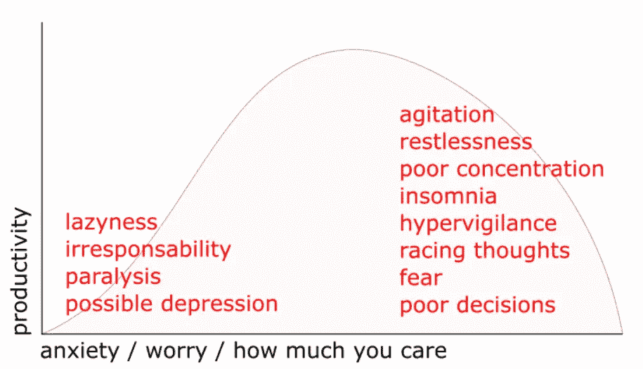
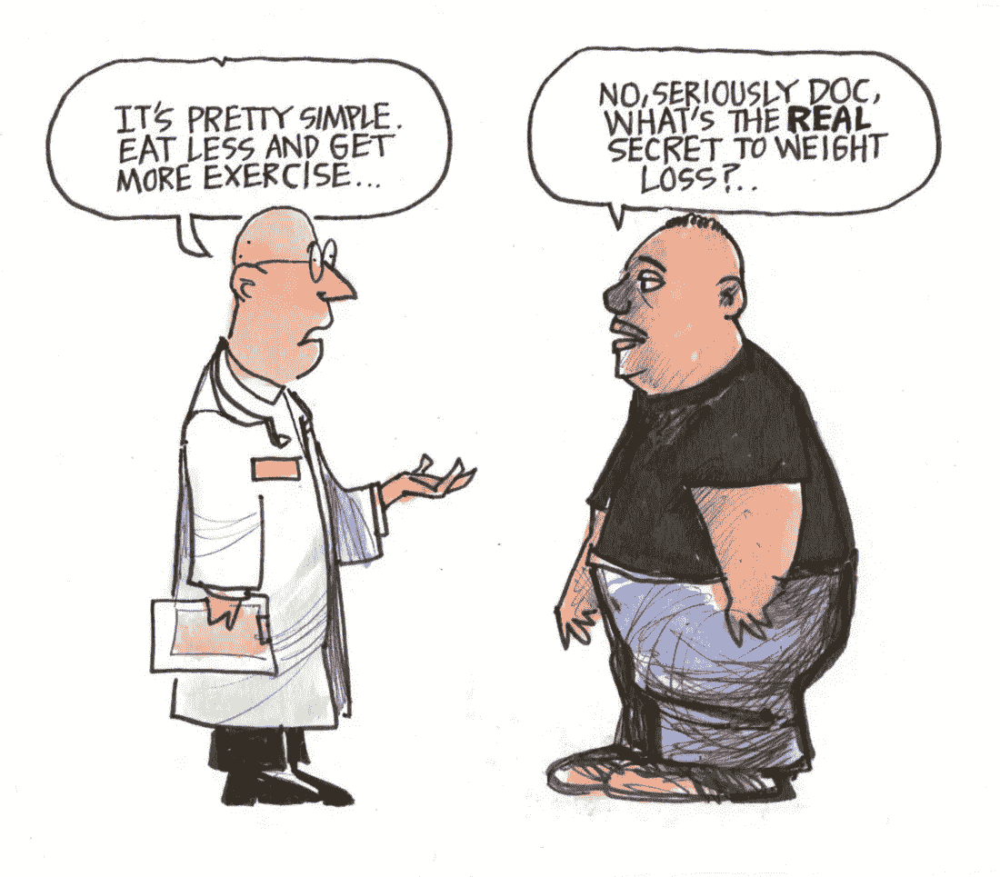

# 驯服焦虑，用黑客的方式提高生产力

> 原文：<https://medium.com/hackernoon/taming-anxiety-and-hacking-your-way-into-productivity-1c9258b8380a>

> “除了你自己，没有什么能带给你平静。”― **戴尔·卡内基。**

我不是心理健康专家，但我已经与[焦虑症](https://en.wikipedia.org/wiki/Anxiety_disorder)抗争了 14 年，所以我觉得我更有资格谈论它。

大约 10 年前，当我第一次决定寻求治疗时，我的主要抱怨并不完全是焦虑的身体和精神表现。我最大的问题是它直接影响了我的决策，最重要的是，**我的生产力**。

我性格中最突出的特点之一是**创造力**。我真的很喜欢建造东西。我的意思是:真的。我通常每天花 1.5 到 3 个小时学习、做兼职项目，最近还写作。然后有一天，我开始注意到，在一天的正常工作后，我回家了，感觉太累了，没有效率，甚至太兴奋了，什么也做不了。然后我想:“*如果我的工作基本上就是坐在舒适的椅子上，开着空调，在键盘上打字，我怎么会这么累呢？我又不是整天扛砖的泥瓦匠。我可没那么累*”。是的，软件开发绝对是脑力劳动，但是我知道我越界了。我的下一个想法是，“好吧，所以，我很有压力，因为 X，Y 和 Z”。然后我把 X，Y，Z 排序，什么都没变；这让我接受了治疗。这让我去看心理医生，最终被诊断出患有[焦虑症](https://en.wikipedia.org/wiki/Anxiety_disorder)。

韦氏词典是这样描述焦虑的:

> 一种不正常的、压倒性的恐惧和害怕的感觉，通常表现为身体症状(如紧张、出汗和脉搏加快)，对威胁的真实性和性质的怀疑，以及对自己应付能力的自我怀疑

让我吃惊的是，我从来没有任何理由有这种感觉。我有一个伟大的职业生涯，我不能抱怨我的健康，我的人际关系很好，所以，为什么？患有 AD 的人往往真的很讨厌被人问:“你为什么这么焦虑？”因为没有明显的答案。这背后没有明确的理由。当然，如上所述，焦虑几乎总是根植于潜在的恐惧，我想每个患有 AD 的人内心深处都知道恐惧是什么。问题是，它无论如何都没有现实基础。

在同一个 [Reddit 帖子](https://www.reddit.com/r/GetMotivated/comments/7875wh/image_i_wish_this_wasnt_so_damn_true/)中，我发现了上面的图片，我看到了相关的引用:

> “我这辈子经历过一些可怕的事情，有些确实发生过。”——马克·吐温

现在回到主题:**生产力**。我们都想在生活中有所成就。为了做到这一点，你需要:深刻理解成功对你意味着什么；准确识别实现目标需要什么；制定一个计划，确保每天结束时，你离你的目标又近了一点。没有一夜成功这回事。成功是一砖一瓦建成的。每天你能砌上一块砖的唯一方法就是**进入正确的心态**。你需要思路清晰。你需要能够集中注意力。

这就是我认为生产力与焦虑的关系:

你看到了吗？焦虑不一定是你的敌人。你可以把它用在你喜欢的地方。我喜欢把它想象成一匹野马:如果你能驯服它，它可以带你走得很远。如果你失败了，它会击垮你。就像海浪，它可以摧毁你，也可以带你前进。

# 驯服焦虑

## 留意

正如[维基百科对](https://en.wikipedia.org/wiki/Mindfulness)的描述，“正念是将一个人的注意力吸引到当下发生的经历的心理过程”。它受到佛教传统元素的启发，但通过乔恩·卡巴特·津恩的作品，尤其是我强烈推荐的《无论你去哪里，都有你:日常生活中的正念冥想》这本书，它在西方特别受欢迎。

为了学习如何练习正念，我建议订阅 [Headspace](https://www.headspace.com/) (我与他们没有任何关系)并每天训练**。如同生活中的一切，持续的小动作成为习惯。你必须建立势头。Headspace 为你可能经历的每一种困难都准备了“包”:压力、焦虑、抑郁、处理损失、处理痛苦。价格是值得的。**

**一个典型的正念过程是这样的:你首先坐下来深呼吸。[深呼吸](https://www.psychologytoday.com/blog/neuraptitude/201602/the-science-slow-deep-breathing)有瞬间放松的效果。然后你必须让你的头脑安静下来，正念有一个有趣的方法来达到这个目的。当你的想法出现时，不要试图停下来，而是通过在三个主要方面循环你的注意力来最小化它们的出现:1) *你的呼吸*。2) *身体的不同部位及其与周围环境的接触*。环境，尤其是你周围的声音。当你积极地专注于这三件事情中的一件，同时控制你的呼吸，你的思想就不太可能走神，因为你实际上不能同时专注于两件事情。这是正念的“秘密”。当然还有更多，但本质上是深深地活在当下，更加清醒。**

## **解决你焦虑的根源**

**在内心深处，变化是你知道你焦虑的触发因素。如果没有，你绝对应该去看心理医生。了解你焦虑的根源是最小化其影响的关键。如前所述，这些通常与隐藏的**恐惧**有关，通常不基于现实。你必须采取行动。记住:**小动作变成习惯**。你害怕孤独终老吗？去健身房，参加社交活动。你害怕失去工作吗？学习和工作，尽你所能成为最好的员工。你害怕万一没有足够的钱吗？开始存钱。**

**我知道这是那种说起来容易做起来难的事情，但是没有秘密。停止懈怠**采取行动**。改变你的生活方式。不要等到明天。现在开始。**

> **“我喜欢把想法想象成势能。它们真的很棒，但是除非我们冒险把它们付诸行动，否则什么都不会发生。”——梅·杰米森**

****

**[Source / Attribution](/personal-growth/two-words-that-will-change-your-life-2fc43f668efe)**

## **生物黑客**

**多年来，我一直在接受心理学家和精神分析师的治疗。这总是有帮助的，每个人都应该这样做，但是，在我的具体情况下，没有什么比精神病学更有效。是的，药物。**

**我服用药物，更具体地说是[苯二氮卓类](https://en.wikipedia.org/wiki/Benzodiazepine)和[血清素-去甲肾上腺素再摄取抑制剂](https://en.wikipedia.org/wiki/Serotonin%E2%80%93norepinephrine_reuptake_inhibitor)。我突然想到，在 21 世纪，“为你的头吃药”仍然是一种禁忌，但如果你认为你患有 ad，你真的应该见见精神病医生，如果他/她同意的话，就吃药。[苯二氮卓类](https://en.wikipedia.org/wiki/Benzodiazepine)改善某些神经递质的作用，是镇定剂。它们有立竿见影的效果，让你更平静，最重要的是，有助于睡眠。相信我:晚上睡个好觉是应对焦虑的第一要务。[血清素——去甲肾上腺素再摄取抑制剂](https://en.wikipedia.org/wiki/Serotonin%E2%80%93norepinephrine_reuptake_inhibitor)，顾名思义，减少神经递质的吸收，使更多的神经递质可用。这种药对焦虑和抑郁都有长期效果。**

**如果胃中的化学物质不平衡导致你胃灼热是完全可以接受的，为什么大脑中的神经递质不平衡就不可能呢？我们为什么要为此感到羞耻？**

**关于精神药物的第一个误解是它们会让你变成僵尸。这与事实相去甚远。精神病医生的主要作用是测试某些药物和剂量的有效性，直到他/她找到最佳的组合，让你达到最佳的生活质量。**

## **锻炼**

**这一条非常重要，显而易见。我不会深究，但你真的应该去健身房，让你的身体动起来。**

## **消除拖延**

**拖延是担忧和焦虑的根源。使用 [Google Keep](https://keep.google.com/) 来跟踪所有那些你不幸必须分类的“不愉快”的事情，并确保你每天至少处理一件。立即回复电子邮件和即时消息。**

## **使用工具来卸下你的思想**

**你可以用一个简单的技巧来最大限度地减少担忧，最大限度地提高工作效率，那就是把你的注意力转移到应用程序上:**

*   **谷歌日历:记住你的约会。**
*   **Google Keep:快速记住你要做的事情的方法。**
*   **Evernote :创建笔记本，记录一切。**
*   **[特雷罗](https://trello.com/):为每件事创建清单:生活目标；你要研究的课题；你需要改进的方面，甚至是购物清单；**
*   **[LastPass](https://www.lastpass.com/) :忘记你的密码，这个应用为你处理一切。甚至可以用银行密码之类的敏感数据写秘密/加密的纸条(信不信由你。我更倾向于信任)。**
*   **Monefy :记录你日常开销的简单方法。**
*   **你的银行 app:是的，别忘了经常检查自己的财务状况。避免意外总是好的。**

## **最后的话**

**我倾向于对自己的行为苛刻和评判，我必须时刻注意这一点，以避免被焦虑所困扰。我觉得这很有趣，因为，同时，我是决定论者。我相信，[正如维基百科所说](https://en.wikipedia.org/wiki/Determinism)，“所有事件，包括道德选择，都是完全由先前存在的原因决定的”。因此，理性地说，我认为没有理由对自己或任何人进行评判。事情就是这样，不会有什么不同。**

**让我们培养接受能力，特别是对我们自己，继续做我们正在做的事情，但是这次，比以前更好。**

**想了解更多关于我的信息，请访问 https://aboutdevs.com/andrerpena**