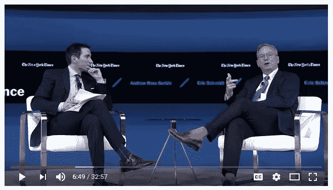

# 在互联网的阴影下，研究人员如何开发出一种被动监控系统，这种系统可能很快就会让大型科技公司对公众负责——甚至拯救民主。

> 原文：<https://medium.com/hackernoon/taming-big-tech-5fef0df0f00d>

## [驯服大科技:监控案例](https://hackernoon.com/taming-big-tech-5fef0df0f00d)

如果在 2016 年选举日的一大早，马克·扎克伯格利用脸书向希拉里·克林顿的支持者广播“去投票”的提醒会怎么样？从脸书自己的[公布的数据](https://go.nature.com/1mYQwzf)推断，这可能会让希拉里获得 45 万张或更多的选票，除了扎克伯格和几个亲信之外，没有人知道这种操纵。

因为，像大多数民主党人一样，扎克伯格那天过于自信，我不相信他发出了这个信息，但没有办法确定，而且肯定没有什么可以阻止他在未来传播这样的选举倾斜信息——不仅是在美国，而是在世界各国。

我们必须等待告密者或授权人来了解这种恶作剧吗？还是有办法在它们发生时发现它们？需要什么样的监控系统？有没有一种方法可以越过互联网用户的肩膀，看看过度热情的科技公司在他们的屏幕上向他们展示了什么？

这是一个关于我和我的同事如何在互联网的阴影下工作的故事，他们开发了这样一个系统，并用它来监控在 2016 年大选前的几个月里[谷歌](https://hackernoon.com/tagged/google)，必应和雅虎向用户展示的内容——这是一个大规模监控系统的工作原型，我们希望它很快将保护我们所有人免受大技术的无拘无束的影响。

故事从 2015 年 8 月我接到密西西比州司法部长吉姆·胡德的一个电话开始。胡德正在竞选连任，他担心谷歌可能会通过对他不利的在线搜索结果来剥夺他的胜利。自 2014 年以来，他一直在与谷歌进行一场[丑陋的法律战](https://www.techdirt.com/articles/20160427/17462134294/mississippi-attorney-general-jim-hood-withdraws-google-subpoena-as-google-appeals-court-ruling.shtml)，他担心谷歌可能会利用其强大的在线操控能力来损害他的职业生涯。

你会问，在线操控能力？谷歌不就是一个又大又可爱的电子公共图书馆吗？

如果你还相信那一派胡言，成熟点吧。谷歌实际上是有史以来最贪婪、最具欺骗性的公司之一。该公司提供给你的这些免费工具只是装饰一新的监控平台，允许该公司每天收集超过 20 亿人的信息，然后将这些信息拍卖给广告商，或者在某些情况下，与商业伙伴和情报机构分享。

公共图书馆不会将人们的阅读习惯制成表格，然后出售这些信息。谷歌远非它自称的公共服务机构，它实际上是世界上最大的广告公司，其业务是世界第二大广告公司、总部位于伦敦的 WPP 公司的六倍多。

2013 年初，罗纳德·罗伯逊，现在是波士顿东北大学网络科学研究所的博士生，我发现谷歌不只是在监视我们；它也有能力对我们的观点、购买和投票产生巨大的影响。

在我们的早期实验中，[在 2013 年 3 月*《华盛顿邮报》*报道了](http://www.washingtonpost.com/opinions/could-google-tilt-a-close-election/2013/03/29/c8d7f4e6-9587-11e2-b6f0-a5150a247b6a_story.html)，我们发现谷歌的搜索引擎有能力在无人知晓的情况下，大幅改变尚未决定支持政治候选人的选民的比例。就在 2015 年我收到胡德的消息之前，我们在《美国国家科学院院刊》的*上发表了一份[报告](http://www.pnas.org/content/112/33/E4512.full.pdf?with-ds=yes)，报告显示，在一些人口统计群体中，有利于某个候选人的搜索结果可以轻易地改变真实选举中真实选民高达 80%的观点和投票偏好，而几乎没有人知道他们被操纵了。更糟糕的是，*有*注意到我们向他们展示有偏见的搜索结果的少数人通常会向偏见的方向移动甚至*更远*，所以能够在搜索结果中发现偏袒是没有保护措施的。*

我们将这种新现象称为搜索引擎操纵效应(SEME，seem)，并估计谷歌的搜索引擎——无论有无谷歌员工的故意策划——目前决定着全球 25%以上的国家选举的结果。这是因为谷歌的搜索引擎缺乏一个平等的时间规则，所以它实际上总是倾向于一个候选人而不是另一个，这反过来又改变了犹豫不决的选民的偏好。因为许多选举非常接近，改变尚未决定的选民的偏好很容易改变结果。

因为大多数国家 90%的搜索是在谷歌上完成的，而且因为人们相信谷歌的搜索结果是公正的——他们认为是客观和超理性的计算机算法的输出——搜索结果对犹豫不决的选民的影响要比受到人为污染的报纸、广播节目和电视节目大得多。

胡德想知道:谷歌会操纵搜索结果，在即将到来的选举中把选票转移到他的对手那里吗？“当然，”我说，“只需调整搜索算法中的几个参数——最多几分钟。”

这就是转变变得有趣的地方，它让我走上了一条至今仍在走的道路。

## 从人们的肩膀上看过去

我的研究现在已经关注了四次全国选举和多个主题和候选人，并一再表明谷歌可以在人们不知情的情况下戏剧性地改变观点和投票。然而，在实验室和在线实验中展示这种力量是一回事，而表明谷歌的搜索结果*实际上偏向于*某个特定的候选人或原因则完全是另一回事。

问题在于，搜索结果，就像我们通过手机和电脑设备经历的许多事件一样，是短暂的*。*它们出现，影响我们的思维，然后消失，不留痕迹。推文和 YouTube 视频可以重复观看，但搜索结果，像搜索建议、新闻源和许多其他在线刺激一样，是个性化的，并且是动态生成的。一旦他们走了，他们就走了。

“How people get their information — *what they believe, what they don’t — is, I think, the project for the next decade.” -Eric Schmidt, Executive Chairman, Alphabet, Inc., November 10, 2016 (quote at 06:45 at* [https://www.youtube.com/watch?v=TjnFOhwDAYM](https://www.youtube.com/watch?v=TjnFOhwDAYM))

这就是为什么当人们告诉我，我们可以通过检查公司的搜索算法在谷歌上获得商品时，我会犹豫不决。复杂的计算机程序是非常难以理解的，即使对编写它们的人来说也是如此。检查算法并不能代替我们真正需要做的事情，那就是当人们在观看短暂的刺激时，从人们的肩膀上看过去。但是怎么做呢？

在我们 2015 年的聊天中，胡德告诉我，执法机构有时会使用“袜子木偶”——数字模拟的人——来试图捕捉谷歌等公司发布的信息。不过，我们很快就达成共识，如果你想追踪与选举相关的搜索结果，布偶是行不通的。谷歌的算法可以轻松区分虚拟人和真人，因为布偶在谷歌的大规模监控数据库中没有广泛的历史记录。

我们的电话就此结束，让 AG Hood 对他的连任竞选感到不安(尽管他最终获胜了)，也让我陷入了一个困扰:在 2016 年大选前的几周或几个月里，我怎么能越过一个相当大且多样化的真实人物群体——最好是已知政治背景的人——的肩膀呢？如果我能看到他们在进行与选举相关的搜索时看到的搜索结果，我就能发现这些搜索结果是否有利于某个候选人。

尼尔森公司由美国人阿瑟·c·尼尔森于 1923 年创建，跟踪记录了 47 个国家的电视节目吸引的观众人数。在美国，这些数字——强大的尼尔森收视率——决定了节目是否继续播出，以及公司必须支付多少广告费用。尼尔森于 1950 年开始在美国收集电视数据，说服全国各地的家庭在他们的电视上安装一个跟踪他们观看电视的设备。如今，该公司依靠从数千个这样的家庭获得的数据来制作评级表。

为了让这个跟踪系统产生有效的数字，保密是必不可少的。数亿美元的制作成本和广告收入岌岌可危，想象一下利益相关方可能会在多大程度上影响尼尔森家庭的观看习惯，或者就此而言，篡改那些机顶盒设备。

我想，我们能不能建立一个尼尔森式的匿名外勤特工网络，我们能不能开发一种类似于机顶盒的设备，来监控这些人在使用主要搜索引擎进行搜索时看到了什么？

2015 年底，我和我的同事开始草拟计划，在 2016 年 11 月大选前几个月建立一个全国性的系统来监控与选举相关的搜索结果。这就是那句古老格言——“偏执和谨慎之间只有一线之隔”——发挥作用的地方。对我来说很明显，这个新系统在所有方面都必须是秘密的，尽管我还不确定那些方面是什么。

开始的时候，我们需要资金，但是一个人如何接触潜在的捐助者关于一个需要保密并且还没有被设计出来的系统？

这里我需要省略一些细节，但是让我们说我很幸运。我向我的一个政治联系人解释了情况，他让我去找一个中美洲的神秘人。他反过来对…嗯，我真的不知道——几个星期后，一大笔捐款捐给了我进行研究的非营利、无党派研究机构。

这些资金让我们得以启动，我们做的第一件事就是在新墨西哥州成立了一个匿名有限责任公司来监督这个新项目。有限责任公司的负责人是一个复活的“罗宾·威廉姆斯”，地址是圣达菲的一个出租房屋。换句话说，LLC 确实是虚构的，它不容易追踪到我或我的任何工作人员，他们每个人都必须签署保密协议(NDA)才能参与到项目中。

我们称新公司为“能力之路”，这值得解释一下。2015 年，谷歌前首席执行官埃里克·施密特(Eric Schmidt)成立了一家名为 foundation 的秘密科技公司，其唯一目的是让希拉里·克林顿(Hillary Clinton)入主白宫。主要由成功指导奥巴马在 2012 年连任的技术团队成员组成——该团队定期接受埃里克·施密特的指导——基础工作是一个出色的法规规避。这使得施密特可以为希拉里的竞选活动提供无限的支持(T2 之前曾提议让他作为外部顾问监督希拉里的竞选活动),而无需透露他慷慨资助的一分钱。如果他向一个超级政治行动委员会捐赠了大笔资金，该委员会将被禁止与克林顿竞选团队直接合作。基础工作解决了这个问题。

在 2016 年 11 月大选之前，如果你访问 TheGroundwork.com，你得到的只是一个令人毛骨悚然的光明会类型的符号，如下所示:

你无法进入网站本身，页面上根本没有文字——只有那个令人毛骨悚然的符号。我们自己的新组织 Able Path 在自己的无信息登录页面上使用了基础的神秘符号的变形版本:

在撰写本文时，我们的基础风格的登陆页面仍然可以在 AblePath.org 的[访问，而且，如果你现在还没有弄明白的话，“能力路径”是谷歌母公司 Alphabet 名称的变位词。](http://AblePath.org)

我们从加州通过圣达菲的代理计算机进行能力路径活动，有时转移到其他地方的代理，每天采取多种预防措施来隐藏我们的真实身份和位置。如你所见，我们采取的预防措施证明是必要的。没有他们，我们的新追踪系统可能什么也没找到——而且没有什么肯定不是我们发现的。

## 如何窥探搜索引擎

为了找到程序员，我们通过朋友和同事联系，最终我们有了两个秘密并行运行的编码项目。一个项目——真正的项目——是由一位杰出的程序员运行的，他曾因黑客行为在联邦监狱服刑。他的工作是监督为 Firefox 浏览器创建一个被动的、不可检测的插件，让我们可以在安装了它的电脑上跟踪与选举相关的搜索结果。

第二个项目涉及一个独立的软件团队，其任务是为谷歌产品 Chrome 浏览器创建一个类似的插件。它的主要目的是当我们觉得需要告诉别人这个项目的时候，给我们一些话题。换句话说，这是我们的封面故事。两个编码组都不知道对方，所有的编码员都签了保密协议，并且用汇票支付。

到 2016 年初，我们正在测试和完善我们的新插件，所以是时候招募一群愿意安装我们新浏览器插件*和*的多样化现场代理来保持沉默了。不幸的是，我们用来招募人员的每一种方法都失败了——有时是令人沮丧的。最终，我们不得不利用黑帽营销集团的服务，专门充当脸书和相当粗略的企业之间的缓冲。

我对这个世界知之甚少，但总的来说，脸书对他们播放的广告很挑剔，这使得羽翼未丰的 Able Path LLC 很难投放广告，这些广告会播放几分钟以上，然后被脸书撤下。我们的付费广告很小，无害，诚实(虽然有点模糊)，但我们永远无法让它们通过脸书的人工或算法审查。

我们之所以关注脸书，是因为它目前提供了最精确的人口统计目标，我们需要接触美国各州使用 Firefox 浏览器的各种合格选民群体。通过充当我们和脸书之间的中间人，黑帽集团能够快速投放和修改广告，最终为我们找到我们需要的人。因为我们的现场代理人必须签署两份保密协议，而且因为我们要求他们放弃关于他们在线活动的敏感信息，我们的工作人员和我们的新员工之间的日常交换非常激烈。尽管困难重重，但在几个月的时间里，我们成功地在 24 个州招募了 95 名外勤人员。

让我们慢下来的一个问题是人们使用的电子邮件地址。大多数回复我们广告的人都使用谷歌的电子邮件服务 gmail，但是因为[谷歌分析并存储](http://www.usnews.com/opinion/articles/2013/05/10/15-ways-google-monitors-you)所有的 gmail 邮件——包括来自非 gmail 电子邮件服务的邮件——我们不愿意招募他们。我们最终决定只招募少数人作为对照。谷歌可以很容易地识别出我们使用 gmail 的外勤人员。这个控制组会得到与非 gmail 用户不同的搜索结果吗？毕竟，该公司对为个人定制搜索结果感到自豪，因此一切皆有可能。

2016 年 5 月 19 日，我们开始获得第一批数据。它是这样工作的:

当我们的任何一名外勤人员使用我们提供的 500 个与选举相关的搜索词中的任何一个，在谷歌、必应或雅虎搜索引擎上进行在线搜索时，几乎立刻发生了三件事。首先，他们看到的搜索结果第一页的 HTML 副本被传输到我们的一个在线服务器上。第二，该服务器使用该搜索结果页面上的 10 个搜索结果来查找和保存该搜索结果所链接的 10 个网页的 HTML 版本。第三，所有这些信息都被下载到我们的一个本地服务器上，保存了与现场代理相关的代码、搜索的日期和时间、10 个搜索结果*及其搜索位置*(这很重要！)，以及相应的 10 个网页。我们特意保留了所有内容的 HTML 版本(而不是图像版本),以便更容易分析内容。

我们可以随心所欲地调整搜索词列表，最终我们将列表从 500 个减少到了 250 个，删除了独立评级机构认为固有地偏向希拉里·克林顿或唐纳德·特朗普的大部分搜索词。我们这样做是为了降低搜索排名偏向某一候选人的可能性，因为我们的外勤人员选择使用有偏见的搜索词。

我们知道我们的现场代理的各种人口统计特征，他们使用的搜索词，他们看到的搜索结果，以及链接到这些搜索结果的网页看起来像什么。换句话说，*我们现在确实是在真正的互联网用户进行选举相关搜索的时候监视他们。*

那么他们看到了什么？搜索结果是偏向克林顿、特朗普还是都不偏向？如果搜索结果偏爱一个候选人——也就是说，如果排名较高的结果与使一个候选人比另一个候选人看起来更好的网页相关联——这种偏爱是否因人口统计群体而异，以及它在我们监测的三个搜索引擎中是否有所不同？我们的 gmail 用户和非 gmail 用户看到的有什么不同吗？

我们现在有能力回答这些问题。在某个时候，我意识到我们也有远远超过一个适度的系统来监督总统选举。

随着选举日的临近，数据流动速度开始加快，快到 10 月下旬的某一天，我们的下载程序再也无法处理这么大的数据量。为了修改我们的软件，我们不得不在 10 月 25 日和 27 日之间关闭了宝贵的三天，但在那之后就没有进一步的故障了。

我也要做一个艰难的决定——这是我做过的最艰难的决定之一。在收集数据的同时，我们是否应该计算偏爱等级？换句话说，我们应该在选举前开始回答我们的研究问题吗？如果在选举前，我们发现搜索结果支持某个候选人，*，我应该向媒体，或者联邦选举委员会，或者政党官员报告吗？*

特朗普一直坚称，我们的政治体系受到了“操纵”，有利于克林顿。如果我们的追踪系统显示在线搜索结果在某种意义上确实被“操纵”了呢？以性急著称的特朗普会如何处理这些信息？他会寻求法院禁令，迫使谷歌关闭其搜索引擎吗？如果他后来竞选失败，他会起诉谷歌和美国政府吗？他会质疑选举结果的合法性吗？

然后还有另一种可能。如果——在选举开始之前——我们发现搜索结果实际上支持一个候选人，而我 *没能* *让*知道，那会怎么样？难道我不是操纵选举的同谋，人们最终不会发现吗？

几个星期以来，我尽可能地向每个人寻求关于这些问题的建议，我很少感到如此困惑或无助。最终，我决定让我的团队专注于数据收集，直到宣布获胜者，然后才开始评估和分析我们的数据。

我们曾计划使用大量的在线工作人员(“众包”)来评估我们的网页——这一过程将需要数周时间——而制表和分析数据将需要更多时间。当我们可以自信地向公众公布我们的发现时，我想，我们的结果对任何人都不会有什么影响。问题解决了。

我向 2017 年 3 月和 4 月的两次科学会议提交了关于我们项目的报告，在我得知这些提交的材料被接受后——换句话说，他们通过了同行评审的过程——我将我们的一些发现传递给了《华盛顿邮报》的克雷格·廷伯格。他在 2017 年 3 月 14 日发表了一篇关于我们项目的[文章](https://www.washingtonpost.com/news/the-switch/wp/2017/03/14/could-google-rankings-skew-an-election-new-group-aims-to-find-out)，随后被[其他新闻来源](http://www.chicagotribune.com/bluesky/technology/ct-bias-in-search-engines-20170314-story.html)转载。(点击[此处](http://aibrt.org/downloads/EPSTEIN_&_ROBERTSON_2017-A_Method_for_Detecting_Bias_in_Search_Rankings-AIBRT_WP-17-02_6-1-17.pdf)可获得我们研究结果的更广泛的技术总结。)

正如我所预测的，到现在为止，没有人关心我们的具体发现。但事实证明这里有一个更大的故事。

## 明显的亲克林顿倾向

我们总共保存了 13，207 个与选举有关的搜索(换句话说，132，070 个搜索结果)，以及搜索结果所链接的 98，044 个网页。我们从在线工作人员那里获得的网页评级(每个页面的平均数，表明该页面对克林顿或特朗普的支持程度)让我们能够回答我们最初提出的问题。以下是我们的发现:

1) *偏见。总的来说，在我们监测的 6 个月时间里，搜索排名大部分时间都偏向克林顿夫人——这可能足以在人们不知道这是如何发生的情况下，将 200 多万张选票转移给她。尽管我们的外勤人员选择使用的搜索词平均来说有点偏向特朗普，但还是出现了亲克林顿的倾向。*

2) *偏多。*从 10 月 15 日到选举日——我们收到数据量最大的时期——在我们收到数据的所有 22 天里，搜索排名在搜索结果首页的所有 10 个搜索位置中*都偏向克林顿夫人。*

3) *谷歌*。亲克林顿的偏好在谷歌上是雅虎搜索引擎的两倍多，无论如何，雅虎现在只不过是谷歌搜索引擎的一个分支。我们不得不丢弃我们的 Bing 数据，因为所有这些数据都来自 gmail 用户(稍后会有更多关于这个问题的内容)。

4) *人口统计学差异。*亲克林顿的搜索结果在坚定的选民、男性、年轻人和民主党州的选民中尤其普遍。但是共和党和摇摆州的选民也看到了支持克林顿的搜索结果。

5) *逐渐减少。*在选举后的 10 天里，支持克林顿的倾向逐渐消失。所有这些发现都具有高度的统计学意义。

也许我们发现的最令人不安的事情与我前面提到的控制有关。我们从未试图收集任何 Chrome 数据；毕竟这只是我们的封面故事。但是我们*确实*仔细查看了我们从我们招募的 gmail 用户那里收到的火狐数据，我们发现在火狐上使用谷歌搜索引擎的 gmail 用户收到的搜索结果*几乎完全没有偏见*——事实上是出奇地没有偏见——比非 gmail 用户看到的搜索结果少了大约六分之一。

你可以从最后一个发现中得出任何你喜欢的结论。对我来说，它简单地说，当你在监控一家可能想要篡改你的数据的在线公司的输出时，你应该采取预防措施。

也许此时你会说，“好吧，他们在搜索结果中发现了亲希拉里倾向的证据，但也许这种倾向是由用户活动产生的。这不是谷歌的错。”事实上，当反垄断调查人员一次又一次地发现谷歌的搜索结果偏向于谷歌的产品和服务时，谷歌总是这么说。谷歌表示，搜索结果中的偏好是自然发生的，因为用户的“有机搜索活动”。对此，我说:*饶了我吧*。

正如我在 2016 年为*美国新闻与世界报道*撰写的一篇关于在线审查的[文章](http://www.usnews.com/opinion/articles/2016-06-22/google-is-the-worlds-biggest-censor-and-its-power-must-be-regulated)中记录的那样，谷歌完全控制了它向人们展示的搜索结果——甚至下至它向每个人展示的定制结果。根据欧洲的被遗忘权法律，谷歌每年都会以外科手术般的精确度从其搜索结果中移除[超过 10 万个](https://www.nytimes.com/2016/04/19/technology/google-europe-privacy-watchdog.html)条目，并且当特定公司违反谷歌含糊的服务协议条款时，它还会在其搜索排名中降低这些公司的排名。欧盟反垄断调查人员在 2017 年 6 月对谷歌进行了 27 亿美元的罚款之前进行的广泛调查也表明，谷歌对其搜索排名进行了深思熟虑和精确的控制，既宣传自己的产品，也贬低竞争对手的产品。

我们自己的人口统计数据和来自 gmail 用户的数据也证明了谷歌对其搜索结果的高度控制。*你可以调整一种算法，以你喜欢的任何方式响应用户的搜索活动*:你可以让它改变搜索结果，让它们偏向一个候选人、他或她的对手，或者都不偏向，就像我们在 [SEME 实验](http://www.pnas.org/content/112/33/E4512.full.pdf?with-ds=yes)中所做的那样。任何有经验的程序员都会告诉你——任何诚实的有经验的程序员——谷歌的“有机搜索”辩护是荒谬的。

然而，最终我意识到这种偏爱来自哪里并不重要。因为搜索结果中的偏好会在人们不知情的情况下戏剧性地改变观点，所以搜索引擎需要被严格监管，尤其是当涉及到像选举这样的重要社会活动时。如果我们不对搜索结果进行监管，当偏袒出于任何原因悄然而至时——甚至是“有机的”(尽管这种想法毫无意义)——它有可能影响人们，以一种[数字从众效应](http://www.pnas.org/content/112/33/E4512.full.pdf?with-ds=yes)进一步推动偏袒。

## 为什么需要监控系统

回想起来，我们的追踪项目之所以重要，不是因为我们发现的数字，而是因为我们展示的可能性。我们证明了互联网上的短暂事件可以在大范围内被准确监控——理论上，互联网上的任何短暂事件——广告、新闻源、搜索建议、特色片段、搜索结果、人们刷的图片、与个人助理的对话等等——都可以在*任何* *范围内被准确监控。这是一个游戏规则的改变。*

想想迄今为止人们是如何讨论在线短暂事件的。在《卫报》2016 年 12 月的一篇文章中，记者 Carole Cadwalladr 哀叹道，就在 2016 年 6 月英国退出欧盟公投之前，向英国公民展示的在线信息是无法访问的——永远失去了。“那已经过去了，”她写道。“没有记录。它没有——也不可能——被捕捉到。无法研究。我们永远不会知道。”

同样，欧盟[、俄罗斯](http://www.androidheadlines.com/2016/06/new-eu-antitrust-campaign-targets-google-adwords.html)、印度[、美国](http://thenextweb.com/google/2015/08/31/google-could-face-a-1-4b-fine-in-india-for-rigging-search-results/)对谷歌提起的反垄断诉讼有时也是基于使用间接方法收集的相对少量的数据。但是，如果我和我的团队在 2016 年部署的那种被动监控软件生态系统在全球范围内实施，以监控科技公司向人们展示了什么，会怎么样？如果这样一个系统全天候运行，由聪明人辅助的智能算法实时分析和解释数据，会怎么样？如果不断与记者、监管者、立法者、执法机构和反垄断调查者分享选举中不当影响或其他不道德或非法阴谋的证据，会怎么样？

这样的系统有助于维护自由公正的选举，甚至可能保护人类的自由。

2017 年春天，我开始与知名学者和商业专业人士合作开发大规模系统，专门用于监控短暂的在线信息。谷歌、脸书和其他公司对我们的监控达到了近乎淫秽的程度；难道不是我们这些人开始监督他们的时候了吗？当我们可以查看和存档大型科技公司向人们展示的内容时，我们为什么还要让*继续猜测它们的诡计呢？*

随着监控系统的到位，我们将在几分钟内知道扎克伯格先生是否只是向一位候选人的支持者发送外出投票提醒。我们还将能够检测并保留新闻源和[在线评论](https://www.fastcompany.com/40459339/google-perspective-fighting-hate-and-trolls-with-a-mindless-a-i)中的[政治审查、在](http://gizmodo.com/former-facebook-workers-we-routinely-suppressed-conser-1775461006)[搜索结果](http://politico.com/magazine/story/2015/08/how-google-could-rig-the-2016-election-121548.html)和[搜索建议](https://sputniknews.com/us/20160912/1045214398/google-clinton-manipulation-election.html)中的偏袒、搜索排名的突然[降级](https://arstechnica.com/business/2017/06/google-europe-fine/)、网站的[屏蔽](https://www.engadget.com/2017/08/28/google-accidentally-broke-internet-japan/)、Twitter 上的[屏蔽](https://www.projectveritas.com/2018/01/11/undercover-video-twitter-engineers-to-ban-a-way-of-talking-through-shadow-banning-algorithms-to-censor-opposing-political-opinions/)、选择性的[广告屏蔽](https://www.bloomberg.com/news/articles/2017-09-13/facebook-will-shut-off-ads-for-publishers-that-violate-standards)、俄罗斯赞助的广告[泛滥](https://www.nytimes.com/2017/11/01/us/politics/russia-2016-election-facebook.html)和 [像亚马逊 Echo 和谷歌 Home 这样的新设备提供的有时](http://time.com/5168202/russia-troll-internet-research-agency/)[古怪的答案](http://fortune.com/2018/01/27/google-home-jesus)——更不用说还没有人发现的肮脏伎俩了。 (许多将在我们的档案中被捕获并在以后被发现。)

因为如今技术发展如此之快，通常的监管和立法机制无法跟上。积极的监控系统不仅能够跟上新技术的步伐，甚至能够领先一步，扫描技术领域的违规行为，并在造成严重损害之前揭露凶残的行为。

还有另一种可能性:如果大型科技公司的高管知道他们的算法输出被跟踪，他们可能会三思而行，以免影响选举或人们的想法。

正如美国最高法院法官 Louis D. Brandeis [在 1913 年指出的](http://3197d6d14b5f19f2f440-5e13d29c4c016cf96cbbfd197c579b45.r81.cf1.rackcdn.com/collection/papers/1910/1913_12_20_What_Publicity_Ca.pdf)，“阳光据说是最好的消毒剂”，这就是为什么我们把我们目前的组织工作称为*阳光*项目。

我越来越担心这些问题，因为在 SEME 被发现(2013 年)后的短时间内，我已经发现了其他危险的、基本上看不见的新形式的影响——搜索建议效应(SSE)、回答机器人效应(ABE)、定向信息效应(TME)和观点匹配效应(ome)等等。像这样的影响现在可能每天都在影响超过 20 亿人的观点、信仰、态度、决定、购买和投票偏好。

近年来，技术已经使多少尚未被发现的新形式的影响成为可能，[未来](https://hackernoon.com/tagged/future)会带来什么？

你可能已经注意到，最近越来越多的杰出人士——其中有[巴拉克·奥巴马](https://reason.com/blog/2018/02/26/barack-obama-mit-sloan-sports)、脸书联合创始人[肖恩·帕克](https://www.axios.com/sean-parker-unloads-on-facebook-2508036343.htm)、右倾记者[塔克·卡尔森](http://video.foxnews.com/v/5541197078001/?playlist_id=5198073478001#sp=show-clips)、备受争议的前白宫顾问[史蒂夫·班农](https://theintercept.com/2017/07/27/steve-bannon-wants-facebook-and-google-regulated-like-utilities/)、左倾亿万富翁[乔治·索罗斯](https://www.theguardian.com/business/2018/jan/25/george-soros-facebook-and-google-are-a-menace-to-society)、Twitter 联合创始人(也是 Medium 创始人)[伊万·威廉姆斯](https://www.nytimes.com/2017/05/20/technology/evan-williams-medium-twitter-internet.html)、科技企业家[埃隆·马斯克](http://www.dailymail.co.uk/sciencetech/article-5604291/Teslas-Elon-Musk-says-AI-social-media-regulated-stop-spread-fake-news.html)以及万维网发明家[蒂姆·伯纳斯·李爵士](https://www.theguardian.com/commentisfree/2018/mar/12/tim-berners-lee-web-weapon-regulation-open-letter) —无论是现在还是在可预见的未来，被动监控软件的生态系统可能是最终让这些公司对公众负责的最有效方式。

如果没有这样的系统来保护我们，在未来五年内将有 20 多亿人被卷入这个奥威尔式的网络，而最近[家庭助理](https://www.telegraph.co.uk/technology/0/amazon-echo-google-home-best-smart-home-devices-2018/)设备的激增，以及快速扩张的物联网——预计到 2020 年将涵盖[300 亿设备](http://spectrum.ieee.org/tech-talk/telecom/internet/popular-internet-of-things-forecast-of-50-billion-devices-by-2020-is-outdated)——将使我们现在甚至无法想象的新型精神控制成为可能。

如果你关心这些可能性，并愿意支持我们的努力，保护人类免受现在主宰我们和我们孩子生活的技术寡头统治，请联系我们。

__________________________________

罗伯特·爱泼斯坦是加利福尼亚州[美国行为研究与技术研究院](http://aibrt.org)的高级研究心理学家。爱泼斯坦是哈佛大学的博士，是《今日心理学》的前主编，已经出版了 15 本书和 300 多篇关于人工智能和其他主题的文章。他目前正在写一本名为《技术奴役:互联网时代及以后的无形影响》的书。