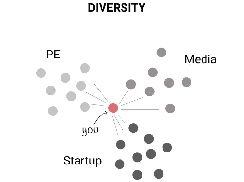
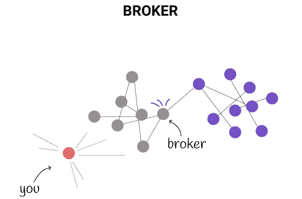
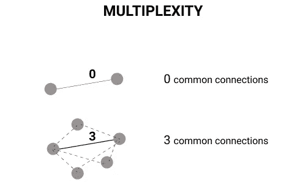
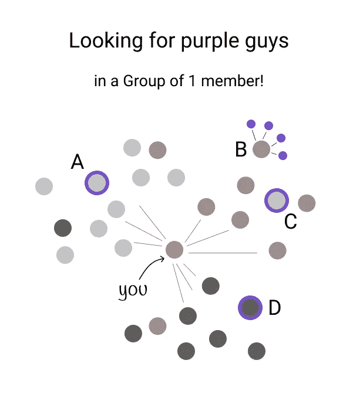
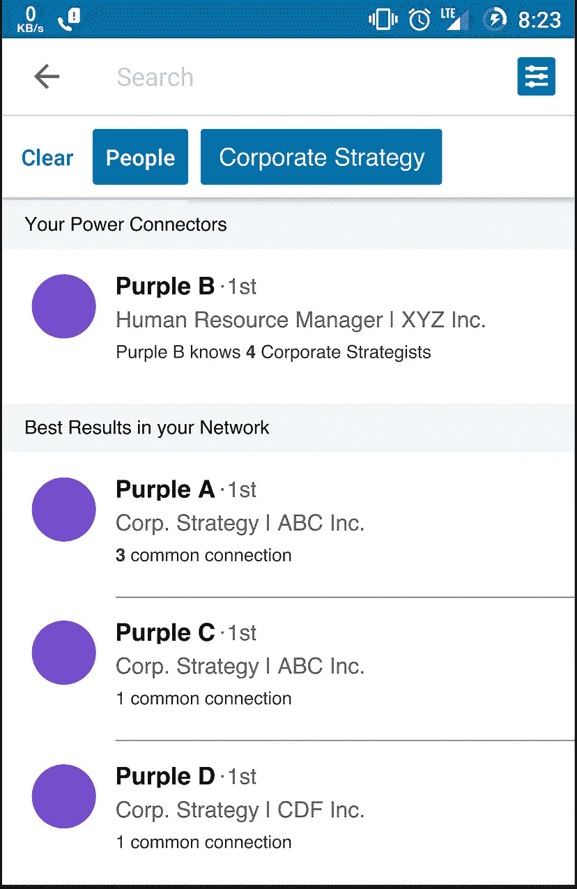
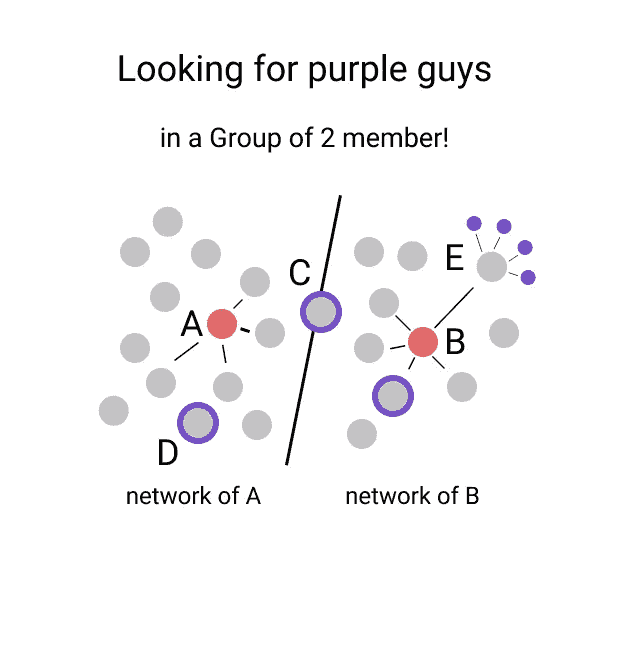
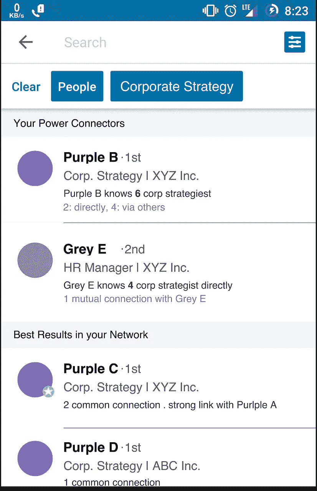

# 挖掘群体社交网络 LinkedIn 的产品机会

> 原文：<https://medium.com/hackernoon/tapping-social-network-of-groups-a-linkedin-opportunity-27fb83e94dde>

*..将联系网络作为一个群体加以利用的可能性，以及(LinkedIn 的)某一天可能打破这一领域的潜在产品。*

你获得机会、技能和资源的能力通常取决于你的人际网络，也就是你认识的人。市场上 76%的职位都是通过私人关系而非正规渠道获得的[ [来源](http://web.jobvite.com/rs/jobvite/images/2014%20Job%20Seeker%20Survey.pdf) ]。有些风投甚至不会看你的商业计划书，除非你是通过推荐来的！

在一个社交网络是唯一最大资产和成功决定因素的市场中，人们有办法任意分享、访问和利用彼此的网络吗？

想象一下:

*   一群 MBA 学生希望利用彼此的关系网来转换行业，获得他们梦想中的工作，或者
*   一家风险投资公司，希望利用其投资组合公司的网络招聘人才或寻找有影响力的人。

一个科技产品能解决这个问题吗？强大的网络是什么样子的？一个产品如何向用户传递最有影响力的网络信息？

让我们试着找出答案。

# 是什么造就了一个强大的网络？

三样东西——多样性。经纪人。多重复杂性。

**多样性**:你的人际网络中部门/职能的多样性&越多，你挖掘跨领域独特技能&机会的能力就越强。

**经纪人**:在你的网络中最有影响力的人是那些能够把网络的不同集群连接在一起的人。

**多重性**:公共连接的数量是链接的内聚性、信任度和强度的良好代理。

# 该产品

让我们想象一下，LinkedIn 决定通过推出“ **LinkedIn 超级网络”**——一种允许群组成员分享他们之间联系的产品，来尝试一下。

想象一个 1 人小组。假设这个人正在他的网络中的不同公司寻找“紫色”的人——从事公司战略角色的人。

他想知道:

*   在他的关系网中，最能给他介绍大多数“紫色”的人
*   他的网络中的 *Purples* 共享高度的多重性，即与他有共同的联系。

让我们来衡量一下。假设有一个由两个人组成的小组——A 和 b。作为该小组的管理员，如果您要搜索“紫色”的人，您将会看到以下信息。

绿色星星徽章可以代表链接的强度，在 LinkedIn 的情况下，可以通过技能认可、帖子喜欢、个人资料推荐等相互参与来定义。

列表中的排序可以是以下各项的加权函数:

*   **相关线索计数**
*   **分离度**
*   **多重性**
*   **连接强度**

# 结论

一些实验项目，如麻省理工学院沉浸式项目和社会实验室项目，通过提供免费的工具来探索、可视化和量化你的人际网络的优势和劣势。

有大量研究通过网络密度、层级、约束、有效规模等指标来衡量不同公司、部门、职能和地点的网络强度。一个强大的工具可以让你探索一个群体网络的深度和广度，这对任何从群体中获取价值的职业都有无限的潜力，无论是校友会、学生团体、公关经理还是风险投资家。

LinkedIn 处于一个独特的位置来打破这个空间。我将期待它在未来几年在这一领域的下一步行动。

我要感谢 Adam Waytz 教授在他的领导力课程中带来的令人惊叹的热情和知识。

*此外，还要特别感谢我的搭档*[*Suhani Chapparwal*](https://www.linkedin.com/in/suhani-chhaparwal-abb38632/)*，她通过分享她在风投公司工作的经历验证了这个问题，在那里，由于缺乏开放的 LinkedIn APIs，他们很难利用他们的社交网络。*

## 感谢阅读！:)如果你喜欢，请鼓掌支持👏🏻还有分享帖子。

## 欢迎在 LinkedIn 上发表评论或联系[我。](https://www.linkedin.com/in/sarthakhanda/)