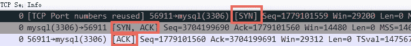
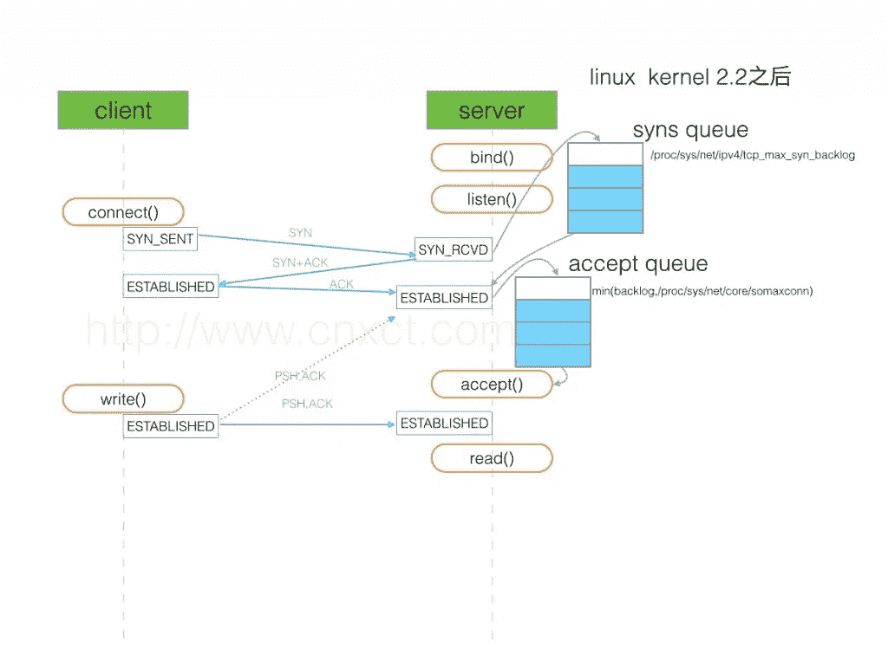
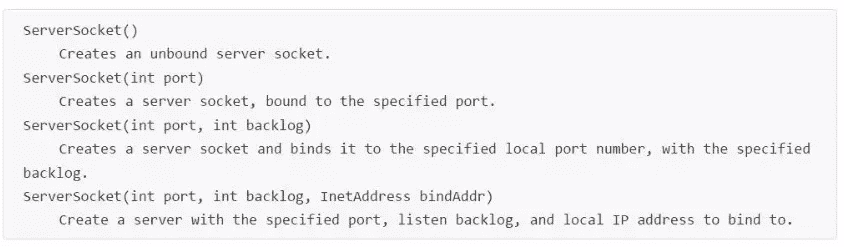
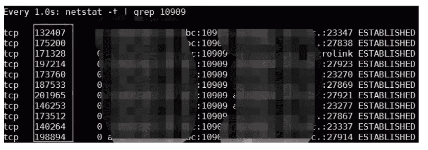

# TCP 三次握手

> 原文：<https://medium.com/hackernoon/tcp-three-way-handshake-4161eb8aba32>

你真的了解它吗？—阿里巴巴技术团队的最佳实践


任锡军是阿里巴巴中间件技术团队的成员。最近，他遇到了一个客户端通信服务器不断抛出异常的问题。但令他沮丧的是，尽管他在互联网上搜索信息，并反复尝试找到原因，但他无法找到任何有助于解释这两个队列或如何观察它们的指标的东西。

他没有被吓倒，自己承担起了弄清问题的责任。他写了这篇文章来记录他是如何发现并解决这个问题的。

# 令人烦恼的问题

在 Java 中，客户端和服务器使用套接字进行通信。在本例中，使用了 NIO 服务器。出现了以下状态:

为了在客户端和服务器之间创建连接，间歇性地执行了三次握手，但是 listen 套接字没有响应。

这个问题同时出现在许多其他连接中。

NIO 选择器没有被销毁和重新创建。用的总是第一个。

这些问题在程序启动时就出现了，之后又断断续续地出现。

# 回顾:TCP 三次握手是如何工作的？

我做的第一件事是提醒自己建立 TCP 连接时三次握手的标准过程。标准过程如下进行:

1.客户端向服务器发送一个 SYN 数据包来发起握手。

2.收到这个消息后，服务器向客户机发送一个 SYN-ACK 包。

3.最后，客户机向服务器发送一个 ACK 包，表明它已经收到了服务器的 SYN-ACK 包。(此时，已经通过客户端的端口 56911 建立了到服务器的连接。)



Process of a TCP three-way handshake

# 快速解决办法

根据对问题的描述判断，这听起来类似于在 TCP 连接建立期间 TCP 完整连接队列(或接受队列，将在后面讨论)已满的情况。为了证实这一点，我通过 netstat-s | egrep“listen”检查了队列的溢出统计数据。

```
667399 times the listen queue of a socket overflowed
```

查了三遍，发现数值在不断增加。很明显，服务器上的接受队列已经溢出。

然后就可以看到操作系统是如何处理溢出的。

```
# cat /proc/sys/net/ipv4/tcp_abort_on_overflow
0
```

在 tcp_abort_on_overflow 为 0 的情况下，如果在三次握手的第三步中接受队列已满，则服务器会丢弃客户端发送的 ACK 包，因为它认为服务器端尚未建立连接。

为了证明该异常与完整的连接队列相关，我首先将 tcp_abort_on_overflow 更改为 1。如果在第三步中整个连接队列已满，服务器将向客户端发送一个重置数据包，指示它应该结束握手过程和连接。(连接实际上没有在服务器端建立。)

然后，我继续进行测试，发现客户机中有许多“由对等体重置连接”的异常。我们得出的结论是，整个连接队列的溢出反过来导致了客户端错误，这有助于我们快速识别问题的关键部分。

开发团队查看了 Java 源代码，发现 socket backlog 的默认值是 50(这个值控制着完整连接队列的大小，后面会详细介绍)。我增加了该值并再次运行，在超过 12 小时的压力测试后，我注意到错误不再出现，溢出也没有增加。

所以，就这么简单。在发生 TCP 三次握手之后，有一个完整的连接队列溢出，只有在进入这个队列之后，服务器才能从 Listen 变为 accept。backlog 的默认值是 50，很容易溢出。如果溢出，在握手的第三步，服务器忽略客户端发送的 ACK 包。服务器将定期重复第二步(向客户端发送 SYN-ACK 包)。如果连接没有排队，将导致异常。

但是尽管我们已经解决了问题，我仍然不满意。我想把整个遭遇作为一次学习经历，所以我进一步研究了这个问题。

# 深入研究:TCP 握手过程和队列



(Source: [http://www.cnxct.com/something-about-phpfpm-s-backlog/](http://www.cnxct.com/something-about-phpfpm-s-backlog/))

如上所示，有两个队列:一个 SYN 队列(或不完整连接队列)和一个接受队列(或完整连接队列)。

在三次握手中，从客户端接收到 SYN 数据包后，服务器将连接信息放入 SYN 队列，并将 SYN-ACK 数据包发送回客户端。

然后，服务器从客户端接收 ACK 数据包。如果接受队列未满，您应该从 SYN 队列中移除信息并将其放入接受队列，或者按照 tcp_abort_on_overflow 的指示执行。

此时，如果接受队列已满，tcp_abort_on_overflow 为 0，服务器在一定时间后再次向客户端发送 SYN-ACK 包(换句话说，重复握手的第二步)。如果客户端经历了很短的超时，就很容易遇到客户端异常。

在我们的操作系统中，第二步默认重试两次(CentOS 为五次)。

```
net.ipv4.tcp_synack_retries = 2
```

# 新方法

上面详述的解决方案有点令人困惑，您可能想知道是否有更快或更简单的方法来解决这些问题。让我们先来看看一些有用的命令。

## 命令

**netstat–s**

```
[root@server ~]#  netstat -s | egrep "listen|LISTEN" 
667399 times the listen queue of a socket overflowed
667399 SYNs to LISTEN sockets ignored
```

例如，这里的 667399 表示接受队列溢出的次数。每隔几秒钟执行一次这个命令，如果数量增加，接受队列一定是满的。

**近卫军命令**

```
[root@server ~]# ss -lnt
Recv-Q Send-Q Local Address:Port  Peer Address:Port 
0        50               *:3306             *:*
```

这里，第二列中的 Send-Q 值为 50，表示监听端口(第三列)上的接受队列最多为 50。第一列 Recv-Q 表示当前正在使用的接受队列的数量。

接受队列的大小取决于分钟数(backlog，somaxconn)。在建立通讯端时会传入 backlog，而 somaxconn 是 OS 层级的系统参数。

此时，我们可以与我们的代码建立联系。例如，当 Java 创建 ServerSocket 时，它将允许您传入积压的值。



(Source: [https://docs.oracle.com/javase/7/docs/api/java/net/ServerSocket.html](https://docs.oracle.com/javase/7/docs/api/java/net/ServerSocket.html))

SYN 队列的大小取决于 max(64，/proc/sys/net/IP v4/TCP _ max _ SYN _ backlog)，不同版本的 OSs 可能不同。

**netstat 命令**

Send-Q 和 Recv-Q 也可以通过 netstat 命令显示，就像使用 ss 命令一样。但是，如果连接未处于“监听”状态，Recv-Q 表示接收到的数据仍在缓存中，进程尚未读取。此值表示进程尚未读取的字节数。Send 是发送队列中未被远程主机确认的字节数。

```
$netstat -tn  
Active Internet connections (w/o servers)
Proto Recv-Q Send-Q Local Address   Foreign Address State  
tcp0  0 100.81.180.187:8182  10.183.199.10:15260 SYN_RECV   
tcp0  0 100.81.180.187:43511 10.137.67.18:19796  TIME_WAIT   
tcp0  0 100.81.180.187:2376  100.81.183.84:42459 ESTABLISHED
```

需要注意的是，netstat -tn 显示的 Recv-Q 数据与接受队列或 SYN 队列无关。这里必须强调这一点，以免与 ss -lnt 显示的 Recv-Q 数据混淆。

例如，下面的 netstat -t 看到 Recv-Q 积累了大量数据，这通常是由 CPU 处理失败引起的。



## 核查进程

要验证上述详细信息，请将 Java 中的 backlog 值更改为 10(值越小，溢出越容易)，然后继续运行压力测试。然后，客户端开始报告异常，之后可以通过服务器上的 ss 命令观察到以下情况。

```
Fri May  5 13:50:23 CST 2017
Recv-Q Send-QLocal Address:Port  Peer Address:Port
11         10         *:3306               *:*
```

这里我们可以看到，端口 3306 上的服务接受队列最多为 10，但现在队列中有 11 个连接。必须有一个无法排队且将溢出的队列。与此同时，溢出的值确实在不断增加。

## 在 Tomcat 和 Nginx 中接受队列大小

Tomcat 默认为临时连接。在 Ali-Tomcat 中，积压的默认值(在 Tomcat 中是“接受计数”)是 200。在 Apache Tomcat 中，这个数字是 100。

```
#ss -lnt
Recv-Q Send-Q   Local Address:Port Peer Address:Port
0       100                 *:8080            *:*
```

在 Nginx 中，待定项的默认值为 511。

```
$sudo ss -lnt
State  Recv-Q Send-Q Local Address:PortPeer Address:Port
LISTEN    0     511              *:8085           *:*
LISTEN    0     511              *:8085           *:*
```

Nginx 以多进程模式运行，因此有多个数字 8085，这意味着多个进程都在监听同一个端口，以避免上下文切换并提高性能。

# 摘要

一旦发生溢出，CPU 和线程的状态就会正常，但压力不会上升。从客户端的角度来看，响应时间(网络+队列+服务时间)很长，但考虑到服务器日志中的真正服务时间，实际上非常短。在 JDK 和 Netty 等一些框架中，积压的默认值很小，在某些情况下可能会导致性能问题。

我希望这篇文章能够帮助您理解 SYN 队列和 accept 队列在建立 TCP 连接中的概念、原理和功能。接受队列和 SYN 队列的溢出问题很容易被忽略，但它很关键，尤其是在使用瞬时连接的场景中(比如 Nginx 和 PHP，尽管它们也支持持久连接)。

(Original article by Ren Xijun 任喜军)

# 阿里巴巴科技

关于阿里巴巴最新技术的第一手深度资料→脸书: [**“阿里巴巴科技”**](http://www.facebook.com/AlibabaTechnology) 。推特: [**【阿里巴巴技术】**](https://twitter.com/AliTech2017) 。

# 参考

[http://veithen . github . io/2014/01/01/how-TCP-backlog-works-in-Linux . html](http://veithen.github.io/2014/01/01/how-tcp-backlog-works-in-linux.html)

[http://www.cnblogs.com/zengkefu/p/5606696.html](http://www.cnblogs.com/zengkefu/p/5606696.html)

[http://www.cnxct.com/something-about-phpfpm-s-backlog/](http://www.cnxct.com/something-about-phpfpm-s-backlog/)

[http://jaseywang . me/2014/07/20/TCP-queue-% E7 % 9A % 84% E4 % B8 % 80% E4 % BA % 9B % E9 % 97% AE % E9 % A2 % 98/](http://jaseywang.me/2014/07/20/tcp-queue-%E7%9A%84%E4%B8%80%E4%BA%9B%E9%97%AE%E9%A2%98/)

[http://jin-yang.github.io/blog/network-synack-queue.html#](http://jin-yang.github.io/blog/network-synack-queue.html)

[http://blog.chinaunix.net/uid-20662820-id-4154399.html](http://blog.chinaunix.net/uid-20662820-id-4154399.html)