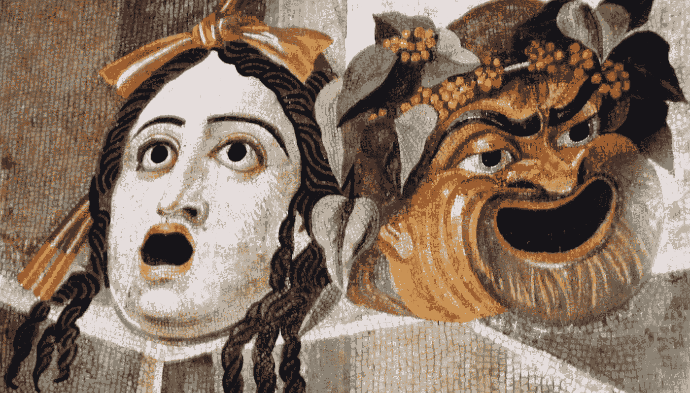

# 团队！为什么我们不能走得更快？！

> 原文：<https://medium.com/hackernoon/team-why-cant-we-go-faster-82f9c6b4cd6c>

注意:我喜欢解决这类问题。但我也喜欢先突出动态…

**管理层:**为什么我们什么事情都做不成？我们需要开快点！

**战队:**债务。依赖性。功能膨胀。多重任务。“特色菜”和银弹。过时的工具。淹没的共享资源。新员工入职。专业筒仓。返工。计划外的工作。脆弱的环境。员工流失。

**管理:**我们不可能一下子解决所有问题！没有人喜欢爱发牢骚的开发者。遗留代码是您没有编写的代码。带给我们解决方案，而不是问题！

**团队:**这里有一个解决债务的计划…

**管理:** OK。能不能造票，估票？然后由合规部门来处理。然后放一副牌…简单点，第一行。我们需要把这个卖给高层。试着现实一点，好吗？我们失去了一些组织的政治资本，所以…

**团队:**失去资本？真的吗？但是…

**管理:**门票…

各队:这里有 300 张票。如果我们现在投资，我们…

**管理:**终于！谢谢你。让我们为此投入 8%的时间，好吗？追踪您的时间…

**团队:**我们添加门票的速度是完成速度的 3 倍。我们不确定 8%的时间是否够用。光是多任务的打击就——嗯——以这种速度——18 年——我不确定我们能不能应付得了…

**管理:**嗯，我明白了。你对自己解决问题的能力没有信心。我们可以外包吗？事实上，我们已经有一个顾问在研究这个问题，他们认为这是可能的。你介意和他们见个面吗？

**团队:**顾问？那边那个人？在临时服务台？

管理:我们有生意要做！领导层想知道我们是如何让事情陷入如此糟糕的状态的。他们不知道…

团队:你告诉他们了吗？这已经酝酿了一段时间了…

**管理:**当然，肯定。我们画了这幅画。你知道，他们不喜欢去杂草丛生的地方。那 8%的时间呢？安排一次会议…我们将紧缩计划。

**团队:**哦，嗯，你知道，现在可能还可以…

*那么……如何打破这个循环呢？假设管理层尽了最大努力，团队也尽了最大努力。随着时间的推移，这种动态如何导致功能失调的行为(来自双方)？又该如何避免？*