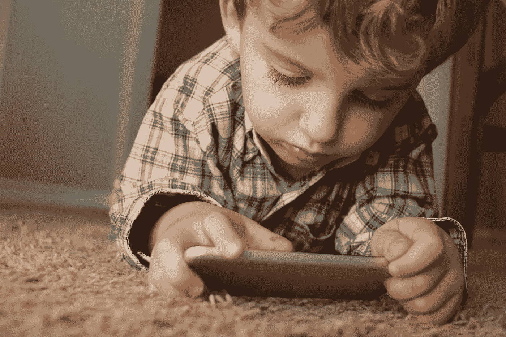

# 科技、人工智能和儿童:一个危险的组合？

> 原文：<https://medium.com/hackernoon/tech-a-i-kids-a-dangerous-mix-78af371b7f6a>

## 算法现在是在线领域的中心，它正在改变专家们对人类发展的思考方式

几个月前，脸书的早期投资者肖恩·帕克称自己是技术的良心反对者，认为“只有上帝知道它对我们孩子的大脑有什么影响”。尽管他的声明很虚伪，但这确实是一个很少触及的问题:从长远来看，现代科技对 T2 的孩子们有什么影响？两者是如何互动的？健康吗？科学将不得不等待几十年才能得到明确的答案，但在此期间，一些见解是可能的。但首先，一个小游戏:[现在是晚上 7 点，你知道你的孩子在用什么应用吗？](https://www.nytimes.com/2017/09/06/style/teen-apps-bullying.html?mtrref=www.google.co.uk&login=facebook&mtrref=myaccount.nytimes.com&gwh=ED14E9E26310DDE1732C93BA84DB4702&gwt=pay)

是 Youtube 吗？如果是这样，请继续阅读。

由于 Youtube 是 21 世纪的终极保姆，该平台上的许多创作者都旨在利用这样一个事实:数百万儿童的父母每天都让他们看适合孩子的卡通片。从逻辑上讲，这导致了人工智能制作视频的产生，以扩大卡通收入的规模并将其产业化。下面是一个视频类型的例子，它只是…发生了，没有任何人工输入。虽然它远没有威胁性，但却有着可怕的含义:人工智能没有目标，没有精神气质，没有悲怆，没有是非感；从长远来看，我们不知道这种奇怪的混合会对年轻人产生什么影响。除了这种不确定性，谷歌正在创造能够构建人工智能的人工智能，我们达到了丹·西蒙斯的怪异水平。

有些人可能会说，儿童 Youtube 是上述问题的解决方案。然而，这也是部分自动化的，因此尽管它的设计适合儿童，但不能保证免受不良视频的影响。该平台上可以找到的这类视频的一个令人不安的例子是超现实主义的内容组合:美国队长在糖果乐园式的环境中跳舞，令人难以置信的绿巨人在童谣播放时赶上了一架坠毁的飞机，蜘蛛侠和《冰雪奇缘》的艾尔莎与小丑进行了一场枪战。从算法的角度来看，所有这些都是为了让视频更有吸引力。案例和要点是，YouTube Kids 上的一些视频的标题经常不能反映它们的内容。更多情况下，它们只是一些常见搜索关键词的列表，如“学习颜色”和“童谣”。

即使不考虑潜在的令人不安的内容，我们也必须意识到，算法现在是数字世界的中心，正在改变专家对人类发展的思考方式。没有人为幼儿挑选最好的视频，而且，就像脸书的一样，YouTube 的算法旨在[让观众着迷](https://www.theatlantic.com/technology/archive/2017/07/what-youtube-reveals-about-the-toddler-mind/534765/?single_page=true&utm_source=CB+Insights+Newsletter&utm_campaign=850a1bae4e-ThursNL_8_03_2017&utm_medium=email&utm_term=0_9dc0513989-850a1bae4e-89201785)(想想巴甫洛夫)。这会以某种方式改变儿童的认知发展吗？现在还没有定论，但是考虑到孩子们在电话上花了多少钱，这还是值得一想的。

Snapchat 上也出现了一些令人担忧的趋势，因为该应用的隐私[使得跟踪小兵变得困难](https://www.bloomberg.com/news/articles/2017-11-08/snapchat-has-a-child-porn-problem?utm_source=Sailthru&utm_medium=email&utm_campaign=Issue:%202017-11-09%20Marketing%20Dive%20Newsletter%20%5Bissue:12802%5D&utm_term=Marketing%20Dive)。心怀不轨的成年人知道他们可以在 Snapchat 上联系到孩子，因为他们知道这是那个年龄段的流行应用程序(但不会持续太久)，而且现在很少有父母控制它。他们用它来联系孩子，并互相发送不合适的图像，因为他们比通过电子邮件或聊天室更难被当局跟踪。这也适用于 Twitter 和脸书，但程度要小得多。

由于这些最近的发展，研究人员正忙于跟踪和分析网络对儿童社会行为、[心理健康](https://www.psychologytoday.com/blog/smart-parenting-smarter-kids/201709/its-complicated-teens-social-media-and-mental-health)甚至生理发育的影响的各个方面，导致一些关于网络欺凌、报复色情和钓鱼的影响的伟大出版物，而执法部门和各种政府机构正在研究精通网络的恋童癖者、罪犯和抑郁症流行的兴起。无论走到哪里，成年人都在[滔滔不绝地表达他们对智能手机一代的焦虑](https://www.cnbc.com/2017/10/07/the-secret-lives-of-children-and-their-phones.html)(迟到总比不到好，对吧？).由于这一领域的各种突破，父母们现在知道他们必须非常努力地工作，以保护他们孩子的想象力免受掠夺性的、令人上瘾的网站的影响，这些网站想向他们出售东西——或者卖给广告商。

然而，在这些情况下，需要多少[养育](https://hackernoon.com/tagged/parenting)是有限度的。父母的角色不是安全无人机，[评估每一个动作](http://uk.businessinsider.com/screen-time-limits-bill-gates-steve-jobs-red-flag-2017-10?utm_source=feedly&utm_medium=webfeeds&r=US&IR=T)(无人机育儿=直升机育儿，但附带损害更多)。父母必须打好基础，开始谈论什么是真实的，什么不是，什么是危险的，什么是安全的。年轻人将不得不做剩下的事情。晚上从学校回家或在他们的房间里，当他们逃离老师，不受父母控制时，他们会去数字平台，和朋友一起尝试，闲逛和实验，独立，在无限的世界里自由地创造自己。

偏执型父母背后的逻辑既简单又容易理解:最新一代人必须受到格外的保护，因为我们生活在非常时期。这导致了令人愤慨的规则和头条新闻，以及整整一代人自由的丧失。孩子们很少被允许使用工具，经常被告知没有大人在场他们不能在外面玩，当然也不能指望他们在无人监督的情况下使用互联网。

然而，不允许一定程度的自由将(并且已经)导致脆弱一代的产生。这就是为什么我们在学校有[安全空间](http://www.safespaces.co.uk/safespace-in-schools/)，而千禧一代今天错过了[成人里程碑](https://www.marketwatch.com/story/4-charts-that-prove-that-todays-30-year-olds-are-not-adults-2016-06-30)。整整一代孩子被告知他们永远不会太安全——他们相信了。我们的文化试图让孩子们远离所有的风险、障碍、伤害和恐惧，从而剥夺了他们成为成功成年人所需的机会。尽管经常有证据表明儿童有巨大的勇气和力量，但社会却把他们视为脆弱的——在情感上、社交上和身体上——实际上是社会让他们如此。如果孩子不学会摇晃，他们永远也学不会走路；它们最终静止不动。

# **加入运动**

本文最初是为在线杂志《未来》撰写的，该杂志对当今的技术挑战进行了深入分析。[点击此处进入](https://www.thepourquoipas.com/post/tech-a-i-kids-a-dangerous-mix)。