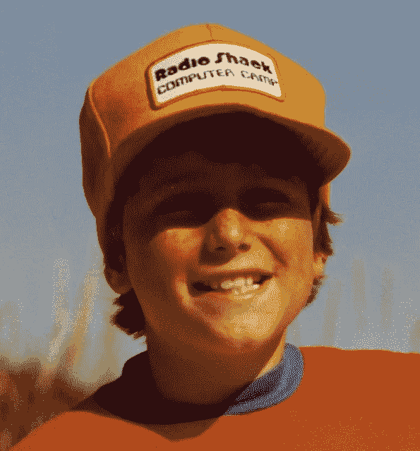

# 科技金童:斯图尔特·巴特菲尔德

> 原文：<https://medium.com/hackernoon/tech-golden-boy-stewart-butterfield-794d11c4e083>

## 加拿大出生的企业家和他的背景故事 Slack 首次公开募股宣布前的一系列事件。

slack——你可能听说过。它被誉为“电子邮件杀手”，改变了员工在工作场所的交流方式。背后是加拿大的连续企业家斯图尔特·巴特菲尔德，一个土生土长的英属哥伦比亚人，有着不可思议的身世。

45 年前，小达摩·杰里米·巴特菲尔德出生在公元前一个叫隆德的小渔村的一个公社里。他的父母是嬉皮士，在他生命的前三年，他住在一个没有自来水的偏僻小木屋里。他的父母来了个 180 度大转弯，把家搬到了维多利亚，年轻的达摩在 5 岁时发现自己身处一个繁华的大都市。他的父母给了这个蹒跚学步的孩子一台电脑，这在当时是罕见的，好像他们比他更早知道他的使命，或者世界甚至知道或理解互联网的力量。当他 12 岁时，达摩正式将他的名字改为斯图尔特·巴特菲尔德，把电脑放在一边，并在青少年时期探索其他兴趣。

> 在科技泡沫最严重的时候，斯图尔特撒手不干了。

正是在大学学习哲学时，斯图尔特用学校的主机获得了一个空壳账户，并发现了互联网。在考虑攻读哲学博士时，他注意到了这个不断发展的科技中心，因为它正处于互联网泡沫的尖端。看到技术人员的乐趣，他放弃了学业，加入了一家网页设计公司。随着斯图尔特意识到炒作背后的混乱，乐观情绪很快消失了。公司缺乏清晰的产品，管理会议经常以尖叫的比赛结束。在科技泡沫最严重的时候，斯图尔特撒手不干了。他认为自己以 35，000 美元的强制收购解决了 1000 万美元的股权。两周后，他看到泡沫破裂。那一刻，他知道他必须相信自己的直觉，为自己工作。

2002 年后不久，Stewart 和他的合伙人 Caterina Fake 以及其他几个朋友开始创建一家公司。投资者已经进入休眠状态，几乎不可能为一家科技初创公司筹集到任何资金。遗产，积蓄，都进了公司。斯图尔特从父母、朋友和政府拨款中又凑了些钱。资金非常紧张，只有一个有孩子的员工领到了薪水。直到纽约的一次食物中毒，斯图尔特才有了创建照片共享网站 Flickr 的最初想法。尽管该团队一直在努力开发一款视频游戏，但他们迫切需要支付租金。Flickr 使用了他们已经创造的一些现有技术，并提供了更短的开发周期。因此，正如所有的创始故事一样，它们都发生了转折。

> 到 2004 年秋末，Flickr 成了“时尚”

在顶级博主中获得一些初步关注后，斯图尔特成功说服雷德·霍夫曼(LinkedIn 创始人)和埃丝特·戴森(当时可能是最知名的天使投资人)投资。很快，Flickr 以每天 1%的速度增长，这意味着公司每个月都在翻倍。到 2004 年秋末，Flickr 成了“时尚”这家 9 人公司开始对他们的服务收费，并接近盈亏平衡。很明显，Flickr 正处于高速增长的轨道上。这引起了上市公司雅虎以及其他潜在买家和投资者的注意。

不幸的是，当时的风险投资格局非常不同，几乎没有人会进行部分清算，让创始人选择继续发展他们的公司。尽管 Accel Ventures 出价 500 万美元，但条件并不诱人，包括高度的清算优先权、强有力的反稀释条款，以及对原始投资者和外部投资者的不公平待遇。2005 年 3 月，雅虎宣布将以 3000 万美元收购 Flickr，这使得 Flickr 成为当时仅有的互联网出口之一。

在大肆宣传的收购之后，斯图尔特又一次经历了为别人工作的痛苦。雅虎当时是一家拥有 10，000 名员工的公司，伴随着迅速扩大的规模，它还存在着各种官僚主义和办公室政治。在收购后的 18 个月里，Flickr 用户反抗雅虎，声称母公司毁了他们曾经热爱的产品。当被问及为什么选择出售时，斯图尔特指出，当时的心态与现在有很大不同。当今的硅谷推动创始人尽可能地带领公司发展，打造一只独角兽，但在 2005 年，人们甚至已经忘记了技术退出是什么样子。斯图尔特的投资者建议拿这笔钱来建造他下一步想做的任何东西。斯图尔特同意了。

出售 Flickr 不仅改变了创业生态系统，也改变了斯图尔特创建新企业的方式。资金开始涌入风险投资基金，因为简单地投资四倍数量的公司是不可行的，公司开始开出更大的支票。鉴于斯图尔特的过往记录和经验，他立即筹集了 1750 万美元来处理他最初计划建立的视频游戏公司。

这家游戏公司名为 Glitch，已经发展到 10 万名玩家。平均收入为每个用户 80 美元，虽然这对于生活方式的企业来说是令人印象深刻的，但 Stewart 知道这一点不足以证明 1750 万美元的风险投资是合理的。在银行存款还剩 500 万美元的情况下，斯图尔特关闭了公司，并向员工提供了丰厚的遣散费和热情洋溢的推荐信。尽管他试图维持关系，但他回忆起不得不告诉一名刚刚举家搬迁到全国各地的新员工，他已经没有工作了。这是痛苦和耻辱。

Glitch 的体验与 Flickr 形成了鲜明的对比。Flickr 是在几乎没有任何资金的情况下绝望地启动的，而 Glitch 则获得了投资者的关注和信任。斯图尔特承认，游戏公司根本不是一个价值十亿美元的想法。然而，Glitch 员工之间的内部聊天引起了 Stewart 的注意。休假重组后，他开始努力建立 Slack。他制定了一个目标:除非 Slack 估值达到 10 亿美元，否则它不会筹集任何资金。斯图尔特意识到估值完全是任意的，依赖于市场情绪。由于 Slack 从 Stewart 以前的成功中获得了很好的资本，该公司不会倒闭，因为它等待获得更多的牵引力，吸引媒体，并成长为更高的估值。斯图尔特希望独角兽地位成为一个信号，让顾客和员工对 Slack 的耐力放心。

自从 Slack 迅速成为明星以来，Stewart 已经处理了几十个来自科技巨头的收购提议。当被问及为什么会拒绝 500 亿美元的退出时，他回答说:

> “我们做得很好。我们有 3 亿美元的银行存款，并且已经连续 70 周以每周 5%的速度增长。98%曾经为 Slack 买单的人现在还在为它买单。我们再也不会有这样的机会了。”

不可否认，他的决定部分是因为他对 Flickr 收购的负面经历。虽然收购可能不会被讨论，但斯图尔特仍然对公司上市持开放态度。因此，Slack 宣布高盛为其计划于 2019 年进行的 IPO 担任主承销商也就不足为奇了。在这一点上，Stewart 指出，他会赚到比任何结果都需要的更多的钱。他所关注的就是尽可能的放松。