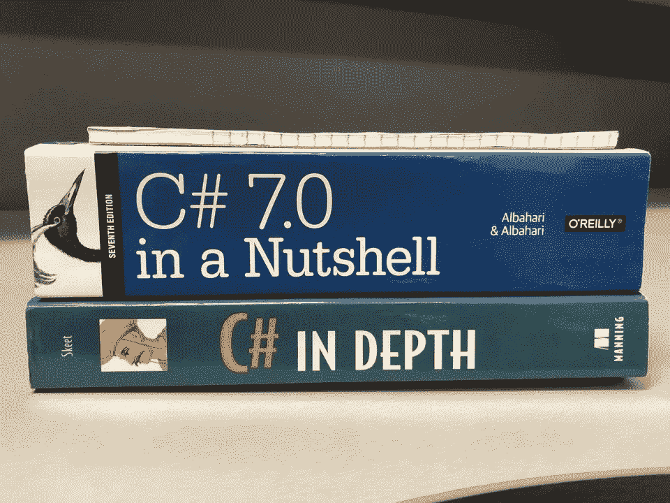

# 技术夸张！！

> 原文：<https://medium.com/hackernoon/tech-hyperboles-b9bb883d0da>

# 本周，我将通过夸张的方式对顶级[黑客正午](http://hackernoon.com)故事进行分组:

## 讨论最多的分析

[**以太坊-区块链大小已经超过 1TB，没错，是问题**](https://hackernoon.com/the-ethereum-blockchain-size-has-exceeded-1tb-and-yes-its-an-issue-2b650b5f4f62)**by[stopandcrypt](https://medium.com/u/cbbfa20339f2?source=post_page-----b9bb883d0da--------------------------------)。这个故事获得了 56 个回应，包括一个来自 ETH 创始人 Vitalik Buterin 的热情回应。[阅读更多关于 ETH 的信息](https://hackernoon.com/ethereum/home)。**

## **由 8x 奥运奖牌获得者创作的最佳故事**

**[**区块链哪儿也不会去。下面是如何在今天保持领先并确保明天成功的方法**](https://hackernoon.com/the-blockchain-isnt-going-anywhere-here-s-how-to-stay-ahead-today-and-ensure-success-tomorrow-2d3146a82c2e) 。他是唯一一个让速滑变得令人兴奋的人，现在，他正在发展自己的区块链公司。[阅读更多关于区块链的内容。](https://hackernoon.com/blockchain/home)**

## **最不难忘的故事**

**[**机器无学习:为什么遗忘可能是 AI**](https://hackernoon.com/machine-un-learning-why-forgetting-might-be-the-key-to-ai-406445177a80) 作者[娜塔莉·弗莱托](https://medium.com/u/5da375cbfcdc?source=post_page-----b9bb883d0da--------------------------------)。了解你(或一只猫或一台机器)如何通过先遗忘来学习更多，这是非常令人耳目一新的。[阅读更多关于 AI 的内容](https://hackernoon.com/artificial-intelligence/home)。**

## **最佳口头禅建议**

**[**你在面试开发人员角色**](https://hackernoon.com/things-you-should-never-say-when-interviewing-for-a-developer-role-138609321d7b) 时不该说的话。这里有很多事情你不应该说，但也有一个美丽的结局:*你说的很重要，你没说的很重要。阅读更多关于科技工作面试的信息。***

## **最简单的事情-标签简介**

**[**你会读到的关于机器学习的最简单的解释**](https://hackernoon.com/the-simplest-explanation-of-machine-learning-youll-ever-read-bebc0700047c) 作者[凯西·科济尔科夫](https://medium.com/u/2fccb851bb5e?source=post_page-----b9bb883d0da--------------------------------)。“机器学习”出现在许多宣传资料、主页和融资新闻中，但这位谷歌人提醒我们，它本质上只是一个标签。阅读更多关于机器学习的信息。**

## **对儿童的最佳解释实际上有更多的成人使用案例**

**[**我如何向我 10 岁的孩子解释智能合约**](https://hackernoon.com/how-i-explained-smart-contracts-to-my-10-year-old-c1fa8f4260d) 作者 [Pavel Bains](https://medium.com/u/7d712b675a3?source=post_page-----b9bb883d0da--------------------------------) 。当有人问“什么是智能合同？”时，这个骑士队对勇士队的智能合同示例将成为一个常用语。[阅读更多关于智能合约的信息](https://hackernoon.com/tagged/smart-contracts)。**

## **最高质量的列表包括 88 分**

**[**成为更好的端到端软件开发人员的 88 种方法**](https://hackernoon.com/88-ways-to-become-better-end-to-end-software-developer-6e0ae2fdb652) 作者[利奥·凯尔皮琴科](https://medium.com/u/33d456b4187e?source=post_page-----b9bb883d0da--------------------------------)。关注的领域包括沟通、工程、设计、运营、质量、产品管理、项目管理、市场营销、商业敏锐度、风险规避、构思、复合效应，显然还有理论&实践。阅读更多关于软件开发的信息。**

## **最好的产品开发不是营销，而是营销**

**[**我的应用如何在没有品牌或营销的情况下在一个月内增长 5800%**](https://hackernoon.com/how-my-app-grew-by-5-800-in-one-month-with-no-branding-or-marketing-ca513bf3eee9)**作者 [Assaf Elovic](https://medium.com/u/bf912a8da233?source=post_page-----b9bb883d0da--------------------------------) 。挽留，挽留，挽留！[阅读更多关于产品开发的信息。](https://hackernoon.com/tagged/product-development)****

****精选笑话信用以上， [**15 个笑话只有程序员才会得到**T21](https://hackernoon.com/15-jokes-only-programmers-will-get-b42873eba509)[帕维尔马洛斯](https://medium.com/u/9b486c1ffe07?source=post_page-----b9bb883d0da--------------------------------)。****

****哦，不要忘记跟上这些伟大的正在进行的密码系列:****

*   ****[丹尼尔·杰弗里斯](https://medium.com/u/618a7c78c957?source=post_page-----b9bb883d0da--------------------------------)’[**加密货币交易圣经。**](https://hackernoon.com/cryptocurrency-trading-bible/home)****
*   ****[大卫·吉尔伯特森](https://medium.com/u/f735d3b0f2f3?source=post_page-----b9bb883d0da--------------------------------)的 [**密码交易员的日记**](https://hackernoon.com/crypto-traders-diary/home) **。******

****直到下一次，不要把世界的现实想当然。****

****亲切的问候，****

****大卫·斯穆克，[阿米](http://twitter.com/ami)****

******P.S.** 也读 [**五月 10 大黑客午间故事**](https://hackernoon.com/archive/2018/05) **。******