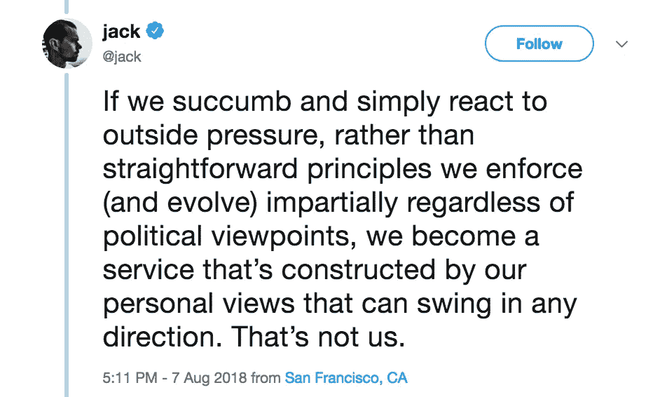

# 技术自恋

> 原文：<https://medium.com/hackernoon/tech-narcisism-493ec0792782>

## 为什么当权的技术人员认为他们知道这么多？

这个家伙让我很不爽。所以今天我想和你们谈谈我对科技自恋的思考。

我们都愿意相信，我们能取得今天的成就完全是基于“优点”——即我们确实是通过成为最佳候选人而公平合理地赢得了我们的位置。首先，这就是我们作为[工程师](https://hackernoon.com/tagged/engineers)被教导思考问题的方式——[逻辑上](https://hackernoon.com/tagged/logically)——这是一个简单的、合乎逻辑的结论。

但在内心深处，我想我们都知道，在某种程度上，我们喜欢认为我们能走到今天完全是基于“优点”，因为这意味着我们更聪明，更值得注意，更光荣。

所以，我们需要理顺几件事:

我们没有一个人能走到今天，是因为我们的“优点”。

我们所有人都是碰运气来到这里的。

我会试着向你证明这一点。

# 个别技术人员掌权的方式完全是偶然的。

所有掌权的技术人员都是靠运气掌权的。当然不仅仅是运气；但是没有运气，他们就没有力量。

我只是想列举一堆偏见，这些偏见可能会妨碍我获得一份有助于创造视觉效果的工作。可以说，对于特定的雇佣，在特定的决策树中有无限的“机会”节点，但无论如何..

首先，有大量因素可能会影响一家科技公司的整体生存——从初创公司到科技巨头。我不会深究这些。但让我们记住我们行业的波动性，以及它如何影响谁有权力(更多的机会)。

每一次技术雇佣和角色转换都是机会主义的。我们有一个空缺，我们查看可用的候选人才库，然后选出“最好的一个”。这已经在我们寻找“最佳候选人”的过程中引入了大量的偶然性。

你的每个职位都有一个“正确时间的正确地点”偏好——身体上的正确地点，生活中的正确地点，以及导致你现在并准备好这份工作的所有时刻(蝴蝶效应)。

面试本身是由偏见和机会造成的——特定面试官的偏见、你的偏见以及它们在面试中的表现、环境因素、签证申请结果、前一天晚上的睡眠、健康问题。

然后是非常明显的性别、种族、残疾、性取向歧视——程度取决于你的面试官、你的老板、你的同事和你自己的特权(都是偶然的)。

然后，你是否会收到一个“符合你胃口”的科技面试问题，你对面试官的特定提问方式有多擅长。

另见《哈佛商业评论》的《如何消除面试中的偏见》，[https://HBR . org/2016/04/How-to-Take-the-Bias-out-of-interests](https://hbr.org/2016/04/how-to-take-the-bias-out-of-interviews)，这解释了技术面试分数和工作表现之间非常低的相关性。

无论如何，我们有很大的机会获得每一份技术工作，获得每一次晋升，以及我们的产品/公司/行业的成功。

现在，让我们想想你公司里所有掌权的人，以及以上有多少也适用于他们。或者，如果你自己有某种领导角色，请在这些思考中以你自己为例。

# 我们因机遇而掌权。

也许，从视觉上来说，我们可以思考一下进入我们职业位置的机会有多少，比如:

(跳槽的雇佣机会 factors)^(number)*(我们行业的波动性)

正如我所说，雇佣机会因素可以说是无限的。但是出于推理的原因，让我们假设它们是有限的，并且权重相等，甚至可能只是我上面的列表。你可以想象，随着你事业的发展，这很大程度上要归功于机遇。

如果我们能理解所有拥有权力的技术人员都是因为运气好，我们也能理解所有的技术领导者都被他们的同事和上级包围着，但头衔要小得多，只是运气不好而已。

在继续阅读之前，请试着接受这一点。

# 无知+权力

软件工程师最不擅长做决策。工程师必须完全理解一个概念或新的想法，才能推进它。

想一想这会有什么后果。

你认为每天有多少伟大的想法被否决？每小时吗？要么是因为员工无法以领导者能够理解的方式解释一个想法，要么是因为领导者无法理解这个想法在特定时刻的力量。

技术人员也仍然全心全意地相信“优点”，即我们确实通过成为最佳候选人赢得了我们的职位，这是公平合理的。

我们对“优点”的迷恋关闭了我们的同理心和体贴，让我们看不到它。我们变得如此执着于我们的个人荣耀，我们的神童，我们的独角兽，以至于我们忘记了自己。我们忘记了“生活是不公平的”，因为机遇常常“公平”地对待**和**。

那么，当我们把这种顽固的自以为是与不能超越他们自己所能理解的事物放在一起，我们会得到什么呢？

Jack Dorsey: CEO, Twitter

我们有思想封闭的领导者，他们认为自己思想开放。

我们有无知的首席执行官，他们认为自己知道什么对公众最好。

我们有自恋的项目领导，他们认为他们知道什么对他们从未见过的用户是最好的。

所以这是我最后的问题:

如果你从事科技行业，你就掌握了权力。如果你掌权，要知道你掌权不是因为你最聪明。你掌权不是因为你最博学。你掌权不是因为你是最好的。

你掌权很大程度上是因为环境。

请试着记住这一点，并在你做日常决定时随身携带。

试着超越“逻辑”和“理性”，认可你自己并不完全理解的想法*，因为*这些想法是由你的员工、你信任的人提出的。

—

保持谦逊。爱你的❤，莎拉