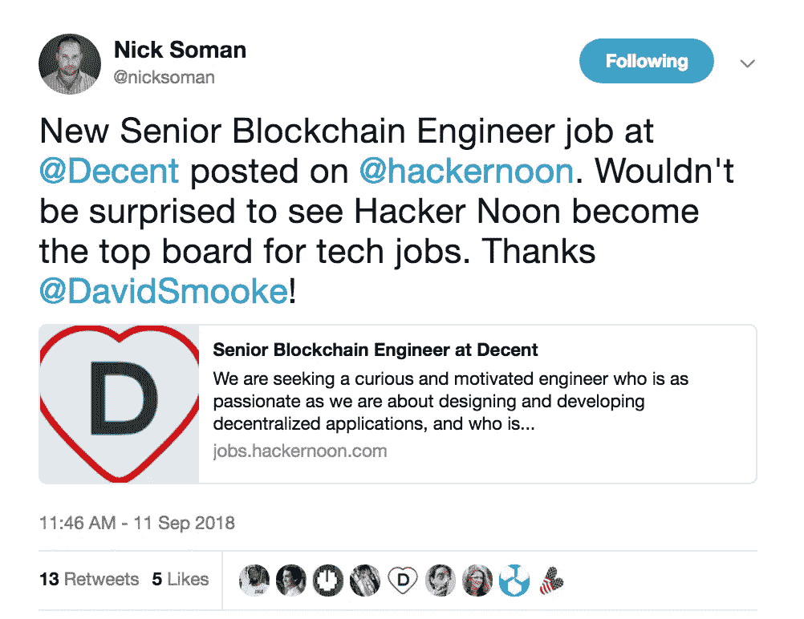

# 重要的科技故事…和科技工作

> 原文：<https://medium.com/hackernoon/tech-stories-that-matter-and-tech-jobs-b15aaaa4408c>

*查看* [***新黑客午间求职板***](http://bit.ly/2LLdEDb) ***，*** *科技领袖在这里招聘，科技领域最聪明的人在这里找工作。一些伟大的公司已经在我们的招聘板上招聘了，像***[***leaf link***](http://bit.ly/2piuhgD)*[***Noson***](http://bit.ly/2QFvpay)*[***中本终端***](http://bit.ly/2xrasHq)****

## ****对于订阅本简讯的用户，我们提供*[***【99 美元】的优惠，优惠代码为“简讯***](http://bit.ly/2NpPDag) *”(限时)。****

# ***Heyo Hacker Noon 订户，***

***我们无法获得所有的[九月最佳科技故事](https://hackernoon.com/archive/2018/09)(到目前为止)，但这篇时事通讯涵盖了[革命](http://bit.ly/2NO6AuD)、百万富翁如何不说话的科学、[开发](https://hackernoon.com/tagged/software-development)、[机器学习](https://hackernoon.com/tagged/machine-learning)、[创业](https://hackernoon.com/tagged/entrepreneurship)、[人工智能](https://hackernoon.com/artificial-intelligence/home)、[营销](https://hackernoon.com/marketing)等等。***

## ***欣赏这 23 个顶级[黑客正午](https://hackernoon.com/)故事:***

# ***革命***

***[**注意力革命:你的下一个浏览器会付钱给你**](https://hackernoon.com/the-attention-revolution-your-next-browser-will-pay-you-b8b12399c3f7) 由前端开发者[引入了一种运行异步操作的方式，真正改变了我们编写并发代码的方式。](https://medium.com/u/6502e16a569a#异步 API:缺失的部分</strong> </a>皇家邮轮公司高级软件工程师皇家邮轮公司高级软件工程师<a class=)**

**[**未来软件开发的五大新兴趋势**](https://hackernoon.com/five-changes-that-are-coming-to-the-software-development-industry-with-the-future-of-work-636ef725cb1c) 由工程负责人[Isabel Nyo](https://medium.com/u/ab8ce31a624d?source=post_page-----b15aaaa4408c--------------------------------)【6 分钟阅读】。*软件开发行业是当今发展最快的行业之一，世界各地都需要软件开发人员。与此同时，未来的工作是一个热门话题——一方面，人们希望未来的工作将意味着任何人、任何地方都有更多的机会，工作时间和天数更少，可以使用更好的工具等等。另一方面，人们提出了许多令人担忧的问题，如机器人会取代人类吗，人工智能会把伦理和道德扔在门外吗，我们在工作和家庭中的联系会更多但更少吗，等等。***

**[**2018 年 GitHub 上流行的 50 个 Python 开源项目**](https://hackernoon.com/50-popular-python-open-source-projects-on-github-in-2018-c750f9bf56a0) 由开源爱好者[Kazz Yokomizo](https://medium.com/u/cbba5a7dcfac?source=post_page-----b15aaaa4408c--------------------------------)【11 分钟阅读】。**

**[**再见 Redux**](https://hackernoon.com/goodbye-redux-26e6a27b3a0b) 作者[杰克·斯科特](https://medium.com/u/f4316fefd8c4?source=post_page-----b15aaaa4408c--------------------------------)，他正在重新思考我们制造产品和经营创业公司的方式🤔[11 分钟阅读]。*在过去的几年里，互联网技术已经转向前端 JavaScript 框架，作为一种为 web 和移动应用程序构建更好的用户体验的方法。这太棒了🔥我个人喜欢这些框架给我们带来的灵活性。但是，这种灵活性是否有些过头了……***

**[**经验教训:软件工程师**](https://hackernoon.com/lessons-learned-code-splitting-with-webpack-and-react-f012a989113)**[Alexander Kondov](https://medium.com/u/3b61246a927e?source=post_page-----b15aaaa4408c--------------------------------)【11 分钟阅读】用 Webpack 和 React** 进行代码拆分。毫无疑问，网络性能非常重要。我们的应用和网站应该快速加载，以保持用户的注意力，让他们参与进来，并提供积极的体验。然而，开发通常是在连接到强大网络的高于平均水平的机器上完成的。然而，并非所有用户都通过强大的设备或强信号访问网络。我们想要实现的是不让用户认为我们的应用程序正在加载。即使我们不能立刻满足他的所有需求，我们也想给他必要的反馈，让他参与进来。为了确保我们的 web 应用程序是高性能的，我们需要为最坏的情况编程，而不是最好的情况。**

**[**个人看板第 1 部分——为什么待办事项行不通**](https://hackernoon.com/personal-kanban-part-1-why-todo-lists-don-t-work-3b5c6dc78708) 作者 org avision CTO[Sven Wiegand](https://medium.com/u/bd6d6cd08a9e?source=post_page-----b15aaaa4408c--------------------------------)【9 分钟阅读】。作为首席技术官，我每周都要处理几十项任务。有些任务很大，比如钻研一项新技术，有些很小，比如浏览新的候选人资料或检查最新的错误报告。但是所有这些任务都必须完成。更糟糕的是:每一次谈话、每一次会议和每一封邮件都会导致新的任务需要处理。因此，拥有一个任务跟踪系统是至关重要的，它可以确保我不会错过任何事情，并帮助我遵守最后期限。作为一名超过 12 年的开发经理，我已经尝试了几种解决方案，直到我最终找到了一个在过去四年里对我很有用的方案。**

**[**用 Webpack**](https://hackernoon.com/the-100-correct-way-to-split-your-chunks-with-webpack-f8a9df5b7758) 拆分你的块的 100%正确的方法，由 Web 开发者[大卫·吉尔伯森](https://medium.com/u/f735d3b0f2f3?source=post_page-----b15aaaa4408c--------------------------------)【13 分钟阅读】。制定向用户提供文件的最佳方式可能是一件棘手的事情。有这么多不同的场景，不同的技术，不同的术语。在这篇文章中，我希望给你你所需要的一切，这样你就可以:(1)知道什么样的文件分割策略最适合你的网站和你的用户，(2)知道如何去做。**

**[**Nodejs 和 MongoDB 中构建 REST API 的实用指南包括**](https://hackernoon.com/the-practical-guide-for-building-rest-api-in-nodejs-and-mongodb-include-passport-and-jwt-476720b70da0)**[Krissanawat Kaewsanmuang](https://medium.com/u/9a9b3bc77027?source=post_page-----b15aaaa4408c--------------------------------)的 Passport 和 JWT** ，他的传记是“达成目标然后死去”【36 分钟阅读】。当我开始学习编程时，我一直在寻找解决问题的方法，并且找到了。但问题是我不知道为什么有些东西在工作的时候会工作，为什么会不工作。我不得不复制别人的源代码，并在不知道为什么的情况下使用它。本教程将帮助你浏览所有你可以使用的样板代码，并理解其中的每一部分。**

# **机器学习**

**[**机器学习——皇帝穿衣服了吗？**](https://hackernoon.com/machine-learning-is-the-emperor-wearing-clothes-59933d12a3cc) 由谷歌首席决策情报工程师[卡西·科兹尔科夫](https://medium.com/u/2fccb851bb5e?source=post_page-----b15aaaa4408c--------------------------------)【8 分钟阅读】。 [*机器学习*](https://hackernoon.com/the-simplest-explanation-of-machine-learning-youll-ever-read-bebc0700047c) *利用数据中的模式来* [*标注事物*](https://hackernoon.com/imagine-a-drunk-island-advice-for-finding-ai-use-cases-8d47495d4c3f) *。听起来很神奇？核心概念实际上简单得令人尴尬。我说“尴尬”是因为如果有人让你觉得这很神秘，他们应该感到尴尬。来，让我帮你修好它。核心概念简单得令人尴尬。我们的事物标签例子将涉及到把酒分为美味或不那么美味，我们将保持所有的想法足够简单，可以和一杯或三杯酒一起享用。***

# **企业家精神(通过[公司杂志](https://medium.com/u/46743f60507f?source=post_page-----b15aaaa4408c--------------------------------)**

**[**学校里没有教你的 7 条创业法则**](https://hackernoon.com/7-rules-of-entrepreneurship-they-dont-teach-you-in-school-6bfe91c8916f) 作者[比尔·格林](https://medium.com/u/b15ebcabc545?source=post_page-----b15aaaa4408c--------------------------------)【6 分钟阅读】。当我还在上大学的时候(我上大学的时间很短)，没有创业的专业。事实上，我认为这是你在学校里无法完全学到的东西，无论课程多么勤奋。没有一门课会教你如何忍受旅途中的起起落落。我没有完成大学学业，但我后来成为了一名成功的企业家。我在自己的书《All In:101 Real Life Business Lessons for Emerging Entrepreneurs》中完整讲述了这个故事，但简而言之，在 1977 年，我还是个孩子，刚刚开始了跳蚤市场的生意，我父亲是我的生意伙伴。我高中的最后一年，我们买了一家五金店来扩大我们的业务，我告诉我爸爸我想试试上大学。有一天，我正在上《企业管理概论》课，老师叫住我说:“你穿西装来学校？”我解释说，“我和我爸有生意。下课后，我离开学校去给客户推销。”**

# **人工智能**

**人工智能如何毁灭宇宙…用回形针！！！ 由[阿德里安书](https://medium.com/u/cf2e6aecb281?source=post_page-----b15aaaa4408c--------------------------------)【8 分钟读完】。我花了 4 小时 5 分钟假装成一个负责制作回形针的人工智能来有效地消灭宇宙。换句话说，我花了 4 小时 5 分钟才有了一次存在危机。这是通过玩 2017 年发布的网络游戏“ [*回形针*](http://www.decisionproblem.com/paperclips/index2.html?utm_source=The+Pourquoi+Pas&utm_campaign=56a9d05660-EMAIL_CAMPAIGN_1_22_2018_COPY_01&utm_medium=email&utm_term=0_ddf41edcf6-56a9d05660-) *”完成的。虽然这个游戏的剪辑制作目标本身很简单，但是从这个游戏中可以吸取很多当代的教训，因此深入探究似乎是必要的。事实上，这款游戏以最有趣的方式探索了我们的过去、现在和未来，尤其是当它涉及到硅谷目前引以为豪的技术进步时。***

# **营销**

**[**打造品牌应该是你产品路线图的一部分**](https://hackernoon.com/building-a-brand-should-be-part-of-your-product-roadmap-ae537fc1a6d)**SchneiderElectricDMS 产品负责人[mom cilo daki](https://medium.com/u/5248f90c1e00?source=post_page-----b15aaaa4408c--------------------------------)【13 分钟阅读】。来自工程背景的我，对问题的高质量解决方案是唯一重要的事情。但后来现实来了，拍了拍我的额头说:“你这个白痴，他们甚至不知道你的产品存在，更不用说他们可以从中受益了”。一些优秀的老广告可以很快显示出一些结果，但我想谈谈长期的游戏——关于建立一个品牌。作为营销策略的一部分，建立品牌通常始于产品完成之时。这里的想法是，一旦你开始打造产品，就开始打造品牌。****

# ****基督教青年会****

****[**黑客中午获得的 Crypto 被打乱，播客由 Trent Lapinski**](https://hackernoon.com/hacker-noon-acquires-crypto-disrupted-the-podcast-by-trent-lapinski-7374b9bd69d1)**3 分钟阅读】。加密货币播客将加入黑客正午，制作一个更主流的技术播客— [黑客正午播客！特伦特·拉平斯基将接任即将到来的每周黑客午间播客的主持人。第一集将于 9 月下旬上映。你今天就可以通过访问 https://Podcast.HackerNoon.com](https://podcast.hackernoon.com)来订阅。在过去的一年里(8 月 17 日至 8 月 18 日)，黑客正午的故事已经产生了 95，000，000+的浏览量。迄今为止，这一直是文本故事，但在最近的黑客正午调查中，71%的读者说他们想听黑客正午播客。******

******直到下一次，不要把这个世界的现实想当然。******

******亲切的问候，******

******大卫·斯穆克******

************

********附言** *查看* [***新黑客午间求职板***](http://bit.ly/2LLdEDb)**科技领袖在哪里招聘，最聪明的人在哪里找工作。一些伟大的公司已经在我们的招聘板上招聘了，像***[***leaf link***](http://bit.ly/2piuhgD)*[***Noson***](http://bit.ly/2QFvpay)**[***中本终端***](http://bit.ly/2xrasHq)************

## ******对于订阅本简讯的用户，我们将为您的第一份工作提供 [$99 的优惠，促销代码为“简讯”](http://bit.ly/2NpPDag)(限时)。******