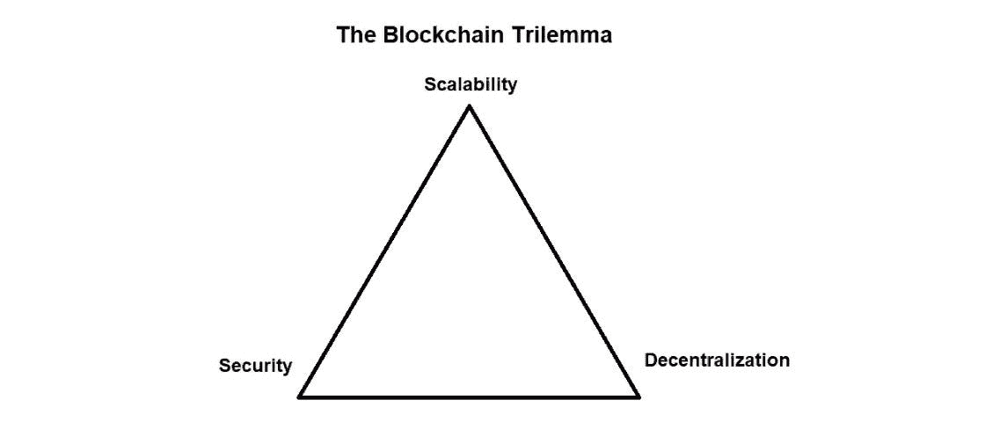
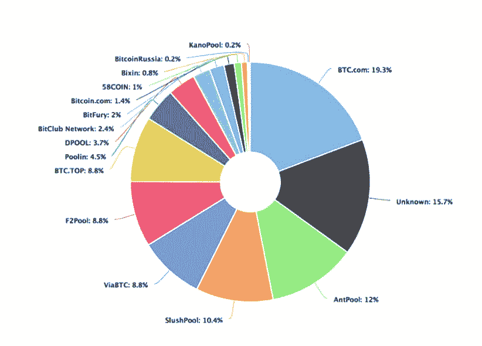
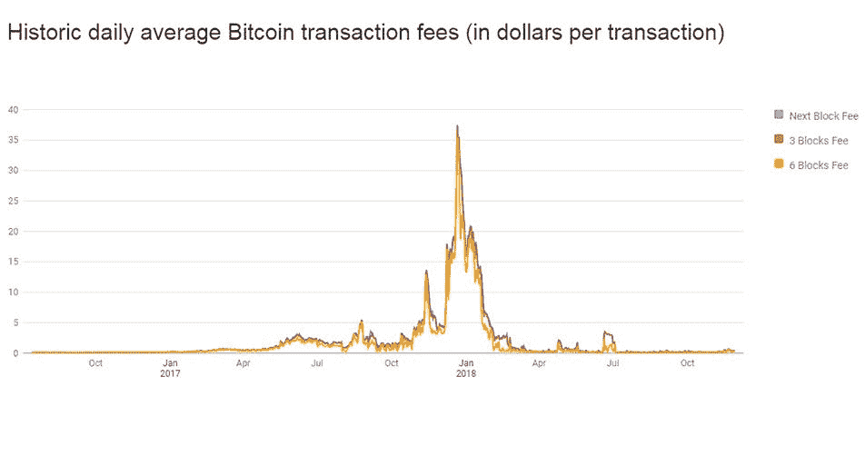
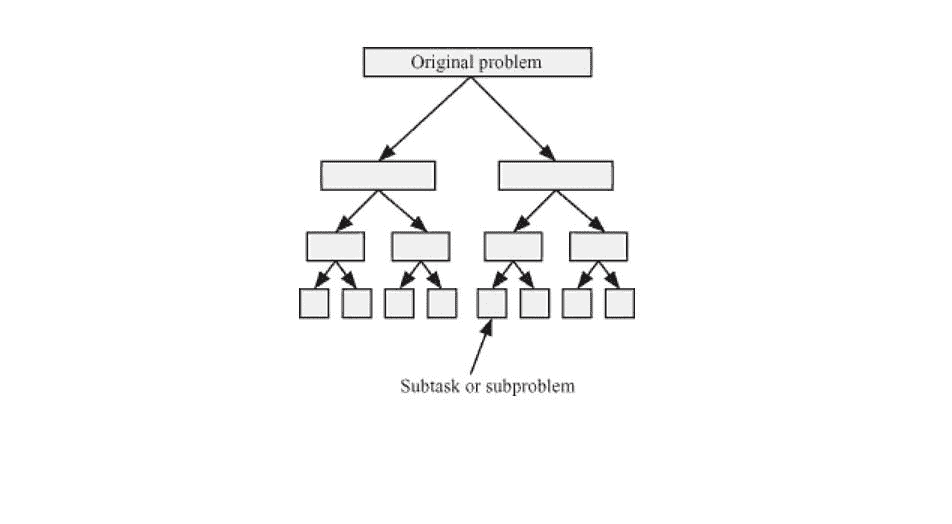
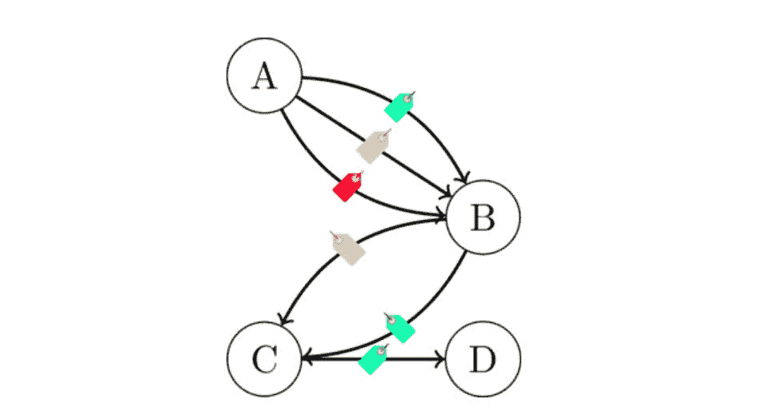
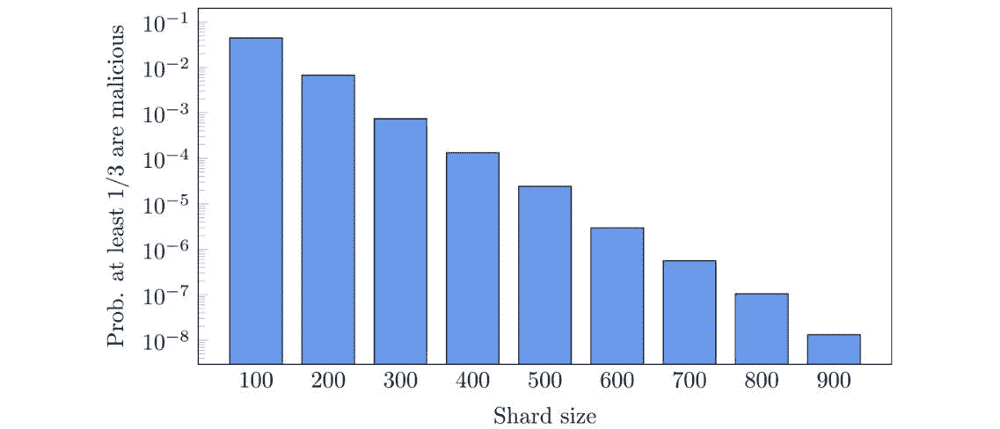

# 技术分析:区块链为面向内容的平台做好准备了吗？

> 原文：<https://medium.com/hackernoon/technical-analysis-is-the-blockchain-ready-for-content-oriented-platforms-b192032bad96>

[https://fineartamerica.com/featured/the-scholar-max-gaisser.html](https://fineartamerica.com/featured/the-scholar-max-gaisser.html)

你们中的一些人可能已经知道，我们最近庆祝了比特币十周年。自中本聪发表历史性白皮书以来，区块链的项目已经增加到数千个。所有这些都像他们的祖先一样，面临着创建一个安全、快速、可伸缩的分散系统的挑战。毫无疑问，这是一个具有挑战性的任务，对于今天的区块链建筑系统来说，这个问题还远远没有解决。问题是，所有这样的网络都不可避免地面临着[“区块链三难困境”](https://www.coinbureau.com/analysis/solving-blockchain-trilemma/)，这是由[维塔利克·布特林](https://twitter.com/VitalikButerin)首次提出的一个术语。这就是为什么今天的工程师正在开发替代解决方案，以便在网络上更快地达成共识。

[https://www.jeffersoncapital.info/the-scalability-trilemma/](https://www.jeffersoncapital.info/the-scalability-trilemma/)

本文将概述网络分片如何能够确保爆炸性的可伸缩性，以及这些技术进步如何能够在像 [BOLT](https://bolt-token.global/) 这样的去中心化、面向内容的平台上实现。

软件仅仅是人类思想的编码，因此拥有几乎无限的设计空间

*克里斯·迪克森*

# 对抗区块链三难困境

创建一个集中的系统是很容易的，在这个系统中，所有的参与者分享一个关于现实的“正确”观点，即*达成共识*。然而，这种观点将由管理网络的某个中心来决定，因此节点必须信任它。然而，在一个分散的系统中，达成共识是一个更加棘手的任务。

比特币的创造者(或可能的创造者)解决的第一个也是主要的问题，与其作为数字货币的功能没有直接关系。这个问题是基本的，并且出现在社会生活的许多领域:如何组织元素系统中的相互作用，假设每个元素都是潜在不可靠的，以便系统得出单一的解决方案？更一般地说，我们需要发明 ***一种方法来确保整个系统的攻击和容错能力，考虑到它的元素可能是利己主义的或者不可靠的*** 。

从头开始想象一个安全的、可伸缩的、快速分散的交互代理系统并不是一件容易的事情。因此，让我们先来看看比特币架构背后众所周知的技术假设。

*   首先，网络上的所有事务都被组合成块，一起处理，以节省时间。
*   这些*块*被打上了时间戳，并通过加密保护的哈希函数以一系列(或一个*链)*的方式链接在一起，因此没有人能够改变区块链中记录的历史。
*   为了确保网络上的事务通过，矿工执行计算新块散列所需的大量计算。
*   分布式注册表的副本被存储在网络的每个完整节点上，并且为了重写历史，附加器将不得不控制超过一半的网络电源。
*   这样的“ [51%攻击](https://www.investopedia.com/terms/1/51-attack.asp)”极难实现，因为比特币在全球范围内的普及以及相关的高网络哈希值。

[https://www.blockchain.com/en/pools](https://www.blockchain.com/en/pools)

因此，网络仅由开源的比特币代码控制，这对每个人来说都是绝对透明的，为中心化机构和第三方中间体的世界带来了去中心化。

听起来不错，对吧？遵循这些原则，我们不可避免地会陷入区块链三难困境中的百慕达三角。它指出*基于区块链的分布式系统最多可以拥有三个最重要属性中的两个:可伸缩性、安全性和去中心化。*例如，比特币是一个安全的系统，具有很好的去中心化，但交易缓慢——因为网络上的所有完整节点必须达成共识。回想一下 2017 年 12 月，当网络严重超载时，交易等待了许多小时，费用达到了 40 美元。

[https://bitcoinfees.info/](https://bitcoinfees.info/)

这些问题是根本性的，是区块链建筑不可避免的一部分。最近几年，一些科学家和软件工程师声称上面描述的架构不是唯一可能的。

看一大群鸟，在天空中创造出迷人的 3D 图形。他们如何同意彼此以协调的方式行动？答案是:每只鸟都记得它的几个最近的邻居在鸟群中的位置，并与他们一起移动，为整体做出贡献。一只鸟不会向鸟群中的每一个人广播它将飞往何处，在这样一个分布式系统中，这个词的通常含义没有一致意见。然而，一个群体表现出完美的同步性，对外部刺激和危险(如捕食者)做出快速有效的反应。

如果我们开始创建基于自然原理的“人工”分布式系统会怎么样？让我们扪心自问:每个网络节点真的需要与所有其他节点通信并保留网络的完整历史吗？例如，我们可以**将网络分成几个更小的网络，这样每个节点主要与其“自己的”子网**的参与者通信，就像一大群中的一只单独的鸟。不同子网之间的信息流将比单个网络中的信息流少得多，这将为可扩展性开辟道路。

[https://www.oreilly.com/library/view/algorithms-and-parallel/9780470934630/c07-sec1-0008.xhtml](https://www.oreilly.com/library/view/algorithms-and-parallel/9780470934630/c07-sec1-0008.xhtml)

有一个强有力的想法有可能克服区块链三难困境——分片。

# 分片:分而治之

分片的概念，即把大量数据分成几部分的想法，并不新鲜。它在“传统的”集中式系统中被成功地用作数据库中数据的水平分区方法。尽管事实上数据库分片并不是一件简单的事情，但是一般来说，如果系统只有一个控制中心，那么将数据分成几个部分是相对容易的。

另一件事是在分散网络中实现分片，在分散网络中，节点可以不断出现和消失，并且区块链上的负载不断变化。

[https://blog.zilliqa.com/the-zilliqa-design-story-piece-by-piece-part-3-making-consensus-efficient-7a9c569a8f0e](https://blog.zilliqa.com/the-zilliqa-design-story-piece-by-piece-part-3-making-consensus-efficient-7a9c569a8f0e)

当 Vitalik Buterin 描述以太坊生态系统中切分的未来时，[他说](https://blockonomi.com/sharding/)，*“想象一下以太坊被分割成了数千个岛屿。每个岛都可以做自己的事。每个岛都有其独特的功能，属于该岛的每个人(即帐户)都可以彼此交互，并且可以自由地享受其所有功能。如果他们想联系其他岛屿，他们将不得不使用某种协议。”*

听起来这是一种简单易行的提高网络可扩展性的方法，不是吗？可惜没那么简单。虽然网络上的每个完整节点被迫存储其分布式系统的区块链的完整记录，但是可伸缩性将受到限制，并且其瓶颈将是不同碎片之间的联系。

想象一下，在一栋公寓楼里，所有的住户都有一项奇怪的任务，那就是维护严格的会计记录，跟踪彼此之间的所有交易。在这个类比中:

*   公寓中的人是网络中的独立部分，即与其他居民交流的紧密社区。
*   借贷代表执行交易。
*   房子和它的居民是使用网络的整个社区。

想象一下，每个居民被迫保留所有交易的完整日志，走过其他人的公寓，询问今天谁借了多少钱。此外，每个小时，所有居民都需要聚集在一起，检查他们的登记册，就网络的历史达成共识，并将其写入单个“主”登记册(区块链)。

这种“分割”有意义吗？这样的分权制会有效吗？当然不是。为了充分体现分片的可伸缩性效果，有必要从根本上减少来自不同分片的节点的接触数量。例如，允许每个家庭只记录其公寓内的交易，并在每月会议上向其他人提供积累的信息。

例如，Zilliqa 项目就采取了这个方向。关键特征是**虽然每个节点仍然知道当前的网络状态，但是不需要存储事务的全部历史**。相反，它被分割成多个部分，分别存储在网络的不同部分。

[https://blog.zilliqa.com/https-blog-zilliqa-com-the-zilliqa-design-story-piece-by-piece-part1-d9cb32ea1e65](https://blog.zilliqa.com/https-blog-zilliqa-com-the-zilliqa-design-story-piece-by-piece-part1-d9cb32ea1e65)

这一成就的实现得益于 Zilliqa 基于 [Bysantine 容错](https://en.wikipedia.org/wiki/Byzantine_fault_tolerance)的特殊 consesus 算法。正如团队[所说](https://docs.zilliqa.com/positionpaper.pdf)，“我们选择 BFT 来设计我们的共识协议，以确保生成的块是确定的，而不需要像现有加密货币中流行的‘最长链’规则所要求的长确认时间。”这种一致性协议的主要特征是它的*终结性*:一旦块被广播到区块链，没有其它块可以声称具有相同的父块。因此，不需要确认和任何工作证明来达成交易协议(形象地说，PoW 是一种旨在修剪错误链的机制，这里不存在)。

由于终结性特征，不必每次都保存整个事务历史，相反，在每个节点中仅存储网络的最新状态就足够了。这个方向看起来很有前途，确实可以帮助解决迫切的可扩展性问题。

如果这种方法成功，基于分片的分布式系统可以广泛应用于需要大量微交易的领域，比如面向内容的平台。

处理分散的媒体内容系统需要难以置信的处理速度，并且还对网络可扩展性提出了严格的要求。事实上，如果内容共享平台获得成功，其用户数量将会增加，而对 1000 人的网络有效的方法可能对拥有 100 万个节点的网络无效。这就是为什么 [BOLT](https://bolt-token.global/) 决定在 Zilliqa 上构建他们的生态系统——实现一个分散的移动优先平台，为东非和东南亚新兴市场的 300 多万现有用户增强数字娱乐体验。

BOLT 的使命是为银行服务不足/没有银行服务的用户提供真实的、精选的数字内容和娱乐。其网络旨在弥合发展中市场中数字服务及其潜在用户之间存在的差距。正如博尔特[白皮书](https://docsend.com/view/yhnw6i9)所说，

“……用户可以选择平台为他们运营的方式——他们可以是贡献者，也可以是消费者，但目前由集中式社交媒体平台赚取的超额利润将不复存在。”

BOLT token 服务允许内容制作者能够将他们的作品货币化，而不需要分销商和第三方中介。这个目标需要大量的微交易，因此 BOLT 网络是 Zilliqa 的区块链分片解决方案的理想候选。因为 Zilliqa 已经成功地在其网络上实现了分片，BOLT 生态系统中的交易将快如闪电，BFT 共识算法将使它们对用户和内容创作者都安全。

所有现存的区块链建筑都受到区块链三难困境的困扰，这限制了它们最重要的特性。如今，解决这些问题的最重要的尝试之一就是分片，而面向内容的平台等应用迫切需要它的好处。在现实中已经有平台有效地实现了这项技术，实现了网络带宽的指数级增长。在未来，我们将会看到更多这样的系统被用来建立包含大量小额交易的生态系统。在这种情况下，面向用户的应用程序的去中心化比我们想象的要近得多！

## 关于作者:

基里尔·希洛夫——geek forge . io 和 Howtotoken.com 的创始人[。采访全球 10，000 名顶尖专家，他们揭示了通往技术奇点的道路上最大的问题。加入我的**# 10k QA challenge:**](http://twitter.com/kirills4ilov)[geek forge 公式](https://formula.geekforge.io/)。