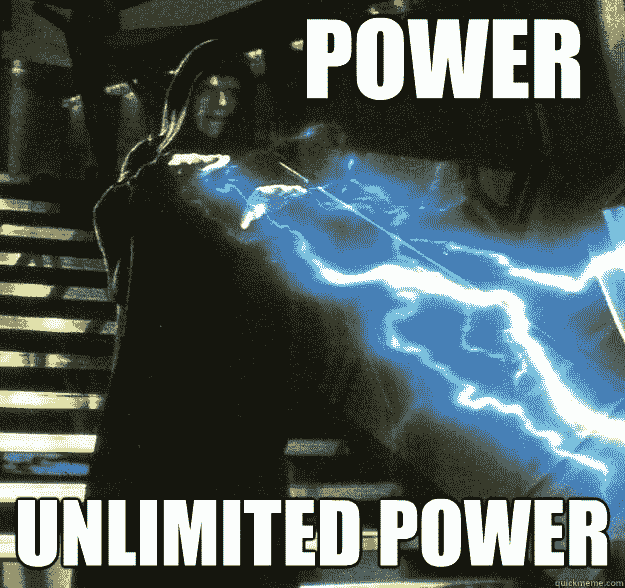

# Circle USDC 的技术概述

> 原文：<https://medium.com/hackernoon/technical-overview-of-circles-usdc-760bca6a90a0>


by Aleksey Shmatov

比特币基地[增加](https://www.coindesk.com/coinbase-adds-its-first-stablecoin-tied-to-the-us-dollar/)第一个与美元挂钩的稳定货币。我们已经进入了一个合法稳定收入的新时代。由高盛支持的 Circle 发行的 USDC。使它尽可能的官方和合法。

与在比特币的 Omni 层上实现的 Tether 相反，USDC 在以太坊上实现了 ERC-20 令牌。

由 [centre.io](https://www.centre.io/) 编写的 USDC 源代码[可在 GitHub](https://github.com/centrehq/centre-tokens/tree/master/contracts)上获得，并有一个像样的[文档](https://github.com/centrehq/centre-tokens/blob/master/doc/tokendesign.md)。源代码在[以太扫描](https://etherscan.io/address/0xa0b86991c6218b36c1d19d4a2e9eb0ce3606eb48#code)上验证。让我们来看看。

# 代理合同

原[地址](https://etherscan.io/address/0xa0b86991c6218b36c1d19d4a2e9eb0ce3606eb48#code)指向[代理合同](https://github.com/zeppelinos/zos/blob/master/packages/lib/contracts/upgradeability/Proxy.sol)，由 OpenZeppelin 编写。本质上，它使管理员能够在任何时候用任何代码替换 USDC 的实现。这完全破坏了 EVM 契约的不变性，以及智能契约的不信任。换句话说， **USDC 是 100%基于信任的企业**。我猜老银行真的喜欢把权力握在手里随时拧谁。

然而与此同时，它也代表了 USDC 自身失败的临界点。在管理私钥被盗的情况下，整个 USDC 令牌可能会被销毁，所有用户/余额都会丢失，因为新合同可能会故意覆盖数据。那将是一场灾难。

# ERC-20

代理本身指向 ERC-20 令牌实现。[代码](https://etherscan.io/address/0x0882477e7895bdc5cea7cb1552ed914ab157fe56#code)在 etherscan 上可用并经过验证。该合同名为`FiatTokenV1`，是 ERC-20 Token heavy 的定制实现，受 OpenZeppelin 的影响，增加了许多功能。

```
contract FiatTokenV1 is Ownable, ERC20, Pausable, Blacklistable
```

FiatTokenV1 实现了 ERC-20 协议，几乎没有例外:

*   黑名单中的地址将无法调用 transfer、transferFrom 或 approve，并且无法接收令牌。
*   如果合同已暂停，则转移、转移自和批准将失败。

换句话说，**他们可以把任何人踢出系统**，让他的资金变得毫无用处。并且**他们可以阻止整个 USDC 令牌移动任何东西**。



# 管理

我真正喜欢 FiatTokenV1 的是角色的分离。它定义了以下角色:

*   主铸币商—添加和删除铸币商，并增加他们的铸币余量
*   铸币者—创建和销毁令牌
*   暂停合约，这将阻止所有转移、铸造和刻录
*   黑名单—阻止所有往来于特定地址的传输，并阻止该地址被伪造或烧毁
*   所有者—重新分配除管理员之外的任何角色
*   管理—升级合同，并重新分配合同本身

这种模式看起来像是对区块链的正确治理！再一次与 Tether 比较，本质上一个公司/个人可能经营它全部。我们有一份清晰的分工合同。

# 实施细节

让我们深入研究源代码。我们不打算讨论 Ownable、Pausable 和 Blacklistable 的实现，因为它们很琐碎。相反，我们关注 FiatTokenV1。

第一件看起来很奇怪的事情是，所有的`internal`变量都是用驼峰命名的，比如`balances`、`allowed`等等。然而`totalSupply_`的末尾有下划线。这是令人困惑的。它与其他字段不一致，并且与 OpenZeppelin 在开始使用下划线来标记合同字段`_field`的符号相矛盾。

此外，FiatTokenV1 对某些函数使用`_parameter`符号，对其他函数使用`parameter`符号。高度不一致。

我会说这可能是由不同的人编写代码的不同部分引起的，但我不明白为什么它可以被检查和修复。

FiatTokenV1 也与其断言不一致。在一些函数中，它会检查不是`0`的地址，但是在一些函数中，它不会。证明。

同样，这只是不一致，并可能导致未来的混乱和错误。OpenZeppelin 的规范 [ERC-20 实现](https://github.com/OpenZeppelin/openzeppelin-solidity/blob/master/contracts/token/ERC20/ERC20.sol)每次都会检查`0`地址是否相等。

[实体风格指南](https://solidity.readthedocs.io/en/v0.4.24/style-guide.html)定义了功能的顺序。我明白这只是一个建议，但 FiatTokenV1 的所有功能都混在一起了。它们按以下顺序排列:

*   构造器
*   修饰语
*   公众的
*   修饰语
*   公共
    …

我认为在 200 行代码中投入一些努力是合理的，这些代码每天将处理数十亿美元。

GitHub 上有相当多的[测试](https://github.com/centrehq/centre-tokens/tree/master/test)，这总是一件好事。我还没有深入研究过。

# 攻击媒介

只有三种角色代表了明显的攻击目标:管理员、所有者和主控者。无论如何，他们都可以为攻击者提供铸造 USDC 的途径。假设在不久的将来，USDC 将在包括分散式交换机在内的许多交换机上得到支持。攻击者可以迅速将 USDC 兑换成 Monero 或其他私人硬币。因此，必须建立对这些地址的持续监控，以防止此类事件的发生。对于管理员角色，情况甚至更糟。管理员实际上可以用攻击者的合同替换合同，这可能会破坏用户的余额和其他数据。使用日志进行恢复可能会花费大量时间，而且有问题。此外，只有管理员密钥可以解决所有者/主密钥的问题。因为管理私钥保护对于整个 USDC 令牌生态系统至关重要。

# 结论

喀尔刻的 USDC 是与美元挂钩的稳定货币的 ERC-20 版。从交易货币的成功来看，USDC 在比特币基地和高盛的支持下可能会取得更大的成功。对所有相关方来说，清楚地理解技术上的细微差别是至关重要的，因为它们在区块链世界举足轻重。臭名昭著的例子是平价钱包[黑客](https://www.theregister.co.uk/2017/11/10/parity_280m_ethereum_wallet_lockdown_hack/)。我们不希望我们的钱卡住了一天，由于有人窃取管理私钥。

# TL；速度三角形定位法(dead reckoning)

*   使用代理合同实现可升级性。
*   提供透明性和互操作性。
*   上帝用角色模型分离治理。
*   实现为 ERC-20 令牌。
*   可以将用户列入黑名单，并暂停整个令牌。
*   代理契约模型是一个严重的漏洞，因为它允许用全新的契约替换契约，并擦除/重写所有数据。

## 如果这篇文章有帮助，请点击拍手👏按钮下面几下，以示支持！⬇⬇

# 社会的

*   在 [LinkedIn](https://www.linkedin.com/in/ylv-io/) 上与我联系。
*   在推特上关注我。

# 阅读更多

[](https://hackernoon.com/how-to-create-and-deploy-your-own-eos-token-1f4c9cc0eca1) [## 如何创建和部署您自己的 EOS 令牌

### 我们将弄清楚什么是 EOS 令牌，以及您如何自己创建和部署它。

hackernoon.com](https://hackernoon.com/how-to-create-and-deploy-your-own-eos-token-1f4c9cc0eca1) [](https://hackernoon.com/how-much-does-it-costs-to-run-dapp-in-2018-87ee11fe1d5d) [## 2018 年办 DApp 要花多少钱

### 你认为你的 AWS 或网站的数字海洋账单正在杀死你吗？

hackernoon.com](https://hackernoon.com/how-much-does-it-costs-to-run-dapp-in-2018-87ee11fe1d5d) 

*原载于 2018 年 10 月 29 日* [*ylv.io*](https://ylv.io/circle-usdc-technical-overview/) *。*