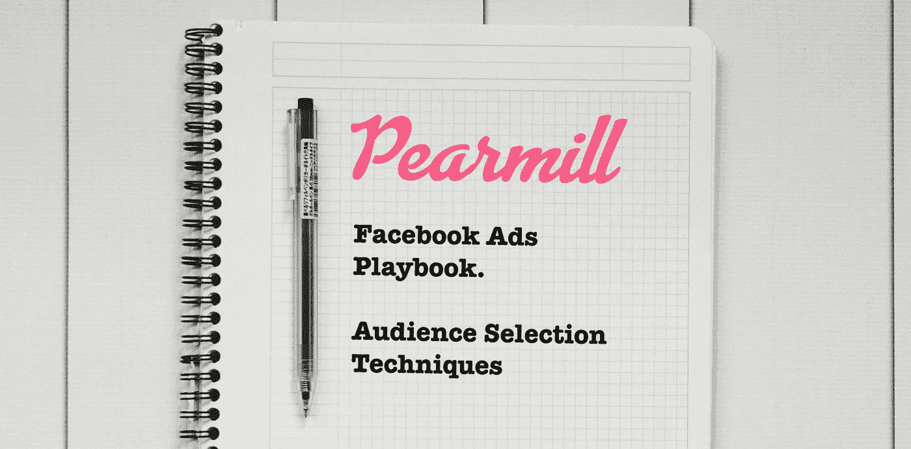

# 为脸书广告建立相关受众的技巧

> 原文：<https://medium.com/hackernoon/techniques-to-build-relevant-audiences-for-facebook-advertising-c1d5fd4c2c9d>

Facebook Ads Playbook: Audience Selection Techniques

## 皮尔米尔[脸书广告手册](/@ngardideh/were-open-up-our-playbook-to-run-facebook-ads-9ea89fe8b212)的一部分

为了理解我们为什么在脸书广告中使用某些策略，我们认为简单了解一下脸书营销引擎是如何工作的是很重要的。

# 脸书定价和节奏动态

脸书可爱的员工[已经做了很好的工作](https://www.facebook.com/business/help/1754368491258883)解释他们的系统是如何工作的，但是我们希望你记住定义他们生态系统的两个简单规则:

1.  每个印象(当广告单元被显示给用户时)基于当前有多少其他广告商对每个特定用户/受众竞价来定价。
2.  脸书使用了一种打折的节奏算法，这意味着他们会试图给你尽可能多的观众中最便宜的用户(也就是最不受欢迎的)。

由于这两个因素，你花的越多(你想要接触的人越多)，任何活动的成本就越高，因为你将与更多的广告商竞争(#1)，你将慢慢耗尽你的受众中最便宜的用户(#2)。

作为一名营销人员，你的工作是与生态系统中的所有其他营销人员战斗，以战胜这些市场动态。通过严格的流程和方法(至少截至 2018 年)，这仍然是可能的。

> 好消息是，要成为一个伟大的脸书广告人，你不一定要成为最好的文案、平面设计师、摄像师，甚至统计学家——你只需要系统化，遵循数据，并不断地加倍努力。

# 观众选择

总的来说，你应该尝试多样化的受众策略。这意味着您应该:

1.  争取多种普通受众(例如，如果你在争取千禧一代，尝试争取他们的特定部分)
2.  找到不同的方法来锁定相同的受众(例如，如果你锁定教师，在一个活动中锁定“教师”头衔的人，在另一个活动中锁定对教师协会感兴趣的人。

为什么？因为当你有多元化的受众时——你会尽可能地利用脸书的打折节奏，找到更具体的目标受众方式(通常)有助于提高转化率，因为你可以为每个细分市场提供更优化的创意。

也就是说，在提出目标选择时，有几种方法可以使用:

## 分段瞄准

这是最广泛的目标受众。你应该尝试根据你的受众可能有的兴趣、他们共同的行为和/或他们的人口统计数据来锁定他们。(例如年龄、地点等。)

广泛的定位解决了这样一个事实，即你会有更多的人在桶里，这意味着有潜在的大量廉价用户为脸书为你锁定目标。

然而，这也意味着除非你卖的是百事可乐，否则很可能会有很多误报。你会想要使用“选择性”创意(我们将在未来的系列中描述更多[)来过滤掉人们和其他受众定位选项(如下所述)来帮助解决这个问题。](/@ngardideh/were-open-up-our-playbook-to-run-facebook-ads-9ea89fe8b212)

综上所述，在创建受众时，请考虑以下几点:

1.  **竞争**——你的竞争对手是谁？锁定跟踪他们的人。
2.  **受欢迎的市场产品**——瞄准你的用户可能使用或购买的其他产品的追随者。
3.  **雇佣** —锁定你产品的用户/购买者中的特定职位、雇主或行业。
4.  **兴趣** —与你的产品直接相关的目标兴趣。
5.  **收入水平** —利用这一点瞄准你认为最有可能购买你的产品的特定市场部分(例如，如果你销售奢侈品，你应该去更富裕的地区)

## 自定义受众

如果你已经有了一批潜在的用户和客户(也就是说，如果你有一份时事通讯)，那么你可以在脸书上利用他们来创造受众。

脸书试图将电子邮件、电话号码、姓名和地址与他们的数据集进行匹配，并让你锁定那些匹配的人。

如果你有这样一个列表，这可能是最简单的方式开始并轻松获胜。这种方法的主要问题是，如果你没有一个足够大的列表(脸书的最低值是 100，但任何低于 500 的列表都没有用)，那么上升空间就相当小。

如果你有一个很大的列表，那么我们甚至建议用你可能有的任何内部数据来分割列表(或者使用 FullContact 这样的工具来丰富它),并用相关的内容分别针对每个部分。例如，您可能希望根据活动、最近或您认为相关的任何其他因素来划分您的列表。

请注意，您也可以在下述相似访问者中使用自定义访问者。

## 长相相似的观众

脸书让营销人员有能力创造看起来像其他受众的受众(即，在他们的行为、兴趣等方面)。)—这可能是一个很好的工具。

> 只要我们在其他活动中取得了一些成功，或者如果我们有机会接触到定制受众，我们就会使用长相相似的受众。

您可以根据以下内容创建相似的受众:

1.  **之前已经触发的应用事件或像素事件**(即购买、添加到购物车、成就解锁)
2.  **自定义受众** —基于您拥有的任何内部列表/数据。

创建外观相似时，请考虑以下事项:

1.  百分位数 —我们很少有超过 1-2%的成功案例。在这里保持简单(除非你每月花费几十万美元，在这种情况下，我们真的希望你现在知道你在做什么)
2.  **时间范围** —如果你正在扩大你的花费(或者每天只有 10 次转化)，那么我们建议将你的相似窗口限制在最近 7、14、30 天的增量内(当基于应用/像素事件时)
3.  **分层受众**——你可以缩小你的受众范围，但只针对那些对长相相似者中的“X”感兴趣的人，这样就更具体了。这通常有助于提高来自受众的用户质量。

## 重新定位

你可以重新定位那些以某种方式参与你的广告的用户，那些在你的网站和/或应用上的用户，或者是你的现有客户。

在你希望用户采取特定行动的场景中(通常是你漏斗中的下一步，或者某种重复购买)，你应该重新定位。

有时候，分多步考虑你的广告策略更有意义:

1.  知名度 —让你的潜在用户了解你的产品/服务的活动。你只是希望他们在这里采取一些简单的行动(看一个视频，像一个帖子等。)
2.  **参与度** —现在你已经有了一批了解你的服务的用户，你会希望他们通过更复杂的行为(例如，订阅时事通讯、下载电子书、试用)开始与你互动
3.  **购买/转化** —对于参与其中的受众，您希望他们做出您希望他们采取的最终行动(例如注册)

对于简单的产品或低价的产品，在重新定位时，你实际上可以合并#2 和#3。但是对于复杂的产品(比如高价的 SAAS 产品)，可能值得使用更全面的策略。

对于这个多步漏斗方法的第一步，你可以使用上面所有的观众想法。但是，对于后两个步骤，您可以根据以下内容来确定目标人群:

1.  **App/Pixel 事件** —将已经做了构成“认知”的事情(例如，阅读一篇文章、登陆特定的登陆页面等)的用户重新定位。)
2.  **参与广告** —重新定位参与你的认知广告的用户(如评论、点赞、分享、观看等)。)
3.  **自定义受众** —您可以使用您认为已经通过第 1 步的自定义受众(或者您希望让他们重复一个操作)

# 结构和学习

重要的是要跟踪已经成功的受众，那些你已经饱和的受众(我们稍后会更详细地解释)，以及那些你想要测试的受众。因此，我们建议如下:

1.  **受众列表**——在脸书和/或电子表格中，记录你每个月想要测试的所有受众。这有助于您团队的现有成员和新成员更快地了解您所做的工作，并且在您需要时轻松接管客户。
2.  **产生想法**——除了你对用户的了解之外，在你获得一些转化后，你可以使用脸书的观众洞察工具来获得更多关于他们的数据。用它来找出你认为应该测试的其他细分受众。

感谢您阅读我们的受众选择小指南(在我们的系列[脸书广告系列](/@ngardideh/were-open-up-our-playbook-to-run-facebook-ads-9ea89fe8b212))。如果你已经登陆这里，并希望获得该系列的其余部分，[请订阅这里](https://upscri.be/f6dae3/)(或以下)。