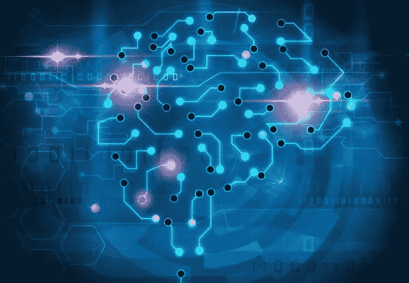

# 追踪癫痫发作的技术突破

> 原文：<https://medium.com/hackernoon/technological-breakthroughs-to-track-epileptic-seizures-6d829b654b05>

癫痫是一种非传染性的慢性疾病，已经影响了全世界数百万人的生活。根据世界卫生组织(who)对癫痫的研究，癫痫是世界上常见的神经系统疾病，大约有 5000 万人患有癫痫。它在 5 岁以下的儿童中非常普遍。此外，这种疾病在中低收入国家很常见，在这些国家，这种疾病的发生被视为一种耻辱。尽管如此，由于医学上的突破帮助控制了这种疾病。

除了药物和治疗之外，技术创新也使得能够检测癫痫发作并及时采取预防措施。以下是[医疗设备追踪癫痫发作](https://www.healthline.com/health/bracelets-and-devices-epilepsy#devices)的一些最新创新。

**医疗器械查封预警**

由于癫痫在 5 岁或 5 岁以下的青少年和幼儿中非常普遍，父母和家庭很难监测他们的健康状况并迅速做出反应。此外，癫痫发作或身体部分或整个身体的不自主运动因人而异。虽然有些人会出现仅持续几秒钟的暂时性失神，也称为失神发作，但其他人会出现抽搐和长时间发作。虽然没有人能阻止癫痫发作，但提前了解它的发生有助于防止严重的副作用。最近，美国美国食品药品监督管理局批准了两种在癫痫预防护理方面取得突破的医疗设备。

**用于提醒的智能手表**

开发智能手表是为了检测一个人癫痫发作的发生率。这些手表提供了许多功能，帮助挽救了许多人的生命。虽然一些手表在癫痫发作时有报警功能，但另一些手表可以使用 GPS 发送信息来提醒看管人。Empatica 公司已经开发了一种这样的设备..在成功测试其功能后，该产品获得了美国食品和药物管理局的批准。这款手表是使用人工智能算法开发的，可以记录皮肤电活动。因此，它有助于改善癫痫患者癫痫发作的诊断和表征。手表在检测到身体的不自主运动时会发出警报。

另一款名为 SmartMonitor 的手表内置 GPS 功能，可以在有人癫痫发作时向看护人员发送位置信息。虽然这些设备不能控制癫痫发作，但可以提醒抽搐发作，并给予足够的反应时间。

**迷走神经刺激疗法**

也称为脑起搏器，已被开发用于治疗患者对药物治疗无反应时的局灶性或部分性癫痫发作。这个[迷走神经](https://www.healthline.com/human-body-maps/vagus-nerve)刺激治疗装置被放置在检查附近的皮肤下，并且一根电线被连接到颈部的迷走神经。该设备作为神经调节器工作，改变脑细胞的工作方式。这些变化是由导致癫痫发作的大脑部分的电刺激引起的。研究表明，VNS 疗法增加了大脑部分的血流量，并提高了与控制癫痫发作有关的神经递质的水平。此外，该疗法在控制大脑的脑电图(EEG)模式方面特别有用。

**监控摄像头**

除了智能手表和 VNS 治疗仪，摄像头是另一项有助于监控大脑无意识活动的技术突破。带有红外眼的摄像头检测睡眠时的晃动等动作，并发出警报。SAMi 就是这样一种设备，它向手机发送信号，并记录下这个人的视频。因此，这些设备使医生能够观察癫痫发作，并准确判断患者的情况，以确定下一步的行动。

**床垫装置**

如果一个人癫痫发作，可以记录床上发生的振动的感觉装置已经被开发出来。这些振动被记录下来，并发出警报。例如，Medpage 运动报警器就是这样一种床垫装置，它被放置在癫痫患者的床垫下，以监测运动并发出信号。

**人工智能如何帮助检测癫痫**

大多数已经脱颖而出的医疗设备，如智能手表、手镯，都使用人工智能或机器学习技术来早期检测癫痫。这项技术是通过使用大量患者的综合脑电图数据集开发的，这些数据集揭示了电极的功能模式，并用于形成人工智能算法。这些算法用于自我训练大脑功能的各个阶段，从而很容易检测到一个人特有的癫痫发作。

这些算法也可以更新或升级，以便为患者提供控制癫痫发作预警提前程度的灵活性。此外，许多研究正在进行，以了解癫痫发作的个别表现以及它可能迫在眉睫。

**展望**

许多技术创新和人工智能改变我们生活的方式值得称赞。但是仍然需要研究和开发可以帮助控制癫痫发作的设备，因为这些设备可能会导致癫痫突然意外死亡。为了拯救生命，更多的创新是当务之急。