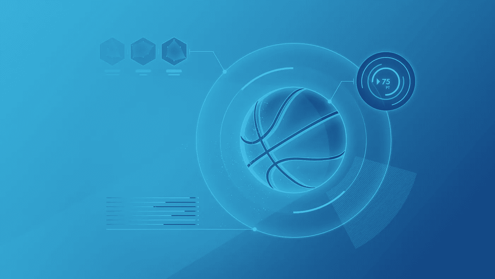

# 今天的技术将对明天的体育产生更大的影响

> 原文：<https://medium.com/hackernoon/technologies-of-today-that-will-make-a-bigger-impact-on-sports-tomorrow-e30237ecfc40>

根据普华永道 2018 年体育展望，今年对北美体育市场来说是令人兴奋的一年，预计 2019 年将达到 735 亿美元。整个体育生态系统都感受到了美国体育博彩合法化的连锁反应，使得投注者和博彩者对体育媒体权和准确体育数据的竞争更加激烈。体育和技术的融合正在推动下一代观看和体育场体验，通过以球迷为中心的产品为数据驱动的体育文化提供支持。让我们来探索一些将塑造体育未来的现有技术。

## 性能跟踪、可穿戴设备等

几年来，智能可穿戴设备、跟踪传感器和其他联网设备在体育行业的势头越来越大。今天，Catapult 的胸带被全球超过 400 个体育组织使用，每个穿制服的 NFL 球员都穿着带有斑马传感器的垫肩。如此广泛采用的原因是这些设备为运动员、教练和体育专业人士提供了大量的表现和健康数据。采用的速度没有放缓的迹象，该技术正在超越集成到运动设备或传统可穿戴设备(如智能手表和活动追踪器)中的跟踪芯片。

随着传感器变得越来越小，几乎看不见，它们可以被织入设备或衣服的织物中。**可穿戴技术**现在正在向智能服装和电子纺织品的方向扩展，比如美国队在韩国冬奥会上穿的[自热夹克](https://www.cbsnews.com/news/team-usas-olympic-jackets-came-with-heating-technology/)，或者耐克的[带有自系鞋带的超适应鞋](https://footwearnews.com/2018/focus/athletic-outdoor/nike-hyper-adapt-sneaker-release-info-1202686092/)。科技巨头如微软、谷歌，甚至苹果都在开发智能面料和互动服装，这意味着我们很快就会看到新产品上市。

芯片本身也变得越来越智能。与人工智能和虚拟助理相结合，他们可以实时分析他们跟踪的数据，并向运动员提供关于他们健康和训练例程的上下文提示。例如，世界上第一款具有步态分析功能的人工智能耳机能够“提供实时语音指导，指导用户完成跑步计划。”想象一下智能棒球棒或智能高尔夫球杆可以测量你的表现，并就如何提高你的技能提出建议！

未来，可穿戴技术公司不仅会关注硬件，还会关注软件和可用性组件，如数据可视化、预测分析和用户体验。

## 人工智能支持的体育分析

体育行业已经进入了一个在分析领域快速采用人工智能(AI)的时期。正如我在[最近的文章](https://hackernoon.com/how-sports-teams-athletes-and-fans-reap-the-rewards-of-big-data-22d07a85f7fc)中所讨论的那样，**体育分析**是体育技术中最丰富的领域之一，预计在 2017 年至 2021 年间 CAGR 将增长 56.66%。人工智能技术的成熟发展是推动这一增长的因素之一，因为人类分析师根本没有办法像机器一样快速或准确地处理当前的数据量并找到模式。此外，人类和人工智能之间的互动终于达到了体育专业人士理解如何向机器提出正确问题的地步。

**辅助人工智能**帮助运动员、团队和教练浏览复杂的表现和比赛分析，并为他们提供由事实和背景数据支持的可操作的见解。今天，基于人工智能的体育分析已经被用于发掘新的人才，为特定的对手制定策略，减少受伤，提高个人表现。

例如，总部位于蒙特利尔的人工智能初创公司 Sportlogiq 与 24 支 NHL 球队合作，它是第一批发现安大略曲棍球联盟 19 岁防守球员 Sean Durzi 的人之一。根据专家的说法，杜尔齐在国家冰球联盟的选秀中是“今年最有希望被选中的球员”。

在足球世界中，一个新的辅助人工智能平台 [STATS Edge](https://www.stats.com/press-releases/stats-delivers-revolutionary-artificial-intelligence-powered-tool-with-stats-edge/) 在克罗地亚国家队历史上首次进入世界杯决赛时取得了巨大胜利。克罗地亚是第一支使用 STATS 比赛准备工具的国家队。

## 计算机视觉

随着体育生态系统越来越关注球迷体验，人工智能在为家庭和赛场的体育观众塑造相关和有影响力的客户之旅方面发挥着重要作用。

**计算机视觉**，机器识别、分析和情境化视觉数据的能力，是体育领域最具影响力和最引人注目的人工智能类型之一。根据 ReportBuyer 的数据，到 2023 年，计算机视觉系统的市场预计将达到 253.2 亿美元，2018 年至 2023 年的 CAGR 为 47.54%。如今，许多专业场馆已经配备了高分辨率和运动跟踪摄像机，可以在比赛期间跟踪数百个运动和数据点，并产生自动视频集锦，但这项技术的全部潜力仍有待探索。

计算机视觉可以为体育运动做什么的一个出色的例子来自一家总部位于加利福尼亚州的名为 [GumGum](https://gumgum.com/sports) 的公司，该公司通过跟踪和分析体育镜头和社交媒体提及的品牌，将其专利技术应用于赞助评估。通过提供几乎即时的投资回报率指标，GumGum 的计算机视觉使版权所有者和品牌能够重新评估他们在数字经济中的赞助支出。

深度学习和计算机视觉的进步导致了**面部识别**技术的兴起。体育和娱乐场所正越来越多地投资于利用这种技术来提高安全性、打击门票欺诈，以及创建新的广告和营销工具。

据报道，Live Nation 和[麦迪逊广场花园](https://www.sporttechie.com/report-msg-adopts-facial-recognition-at-arena-gates-for-security/)测试了面部识别能力。已经证实，面部识别系统将在 2020 年东京奥运会期间在各个场馆使用。然而，这种特殊技术的使用仍然存在严重的隐私问题。如果人脸识别要在体育世界站稳脚跟，体育生态系统应该开始规划如何解决安全问题，并创造安全和迷人的粉丝体验。

## 增强和虚拟现实

计算机视觉对于增强现实(AR)的发展也至关重要，这两项技术在体育领域有着光明的未来。快船 CourtVision 是洛杉矶快船和体育数据分析公司 Second Spectrum 的最新举措，追求的最终目标是创造个性化的观看，让球迷控制他们的体验。计算机视觉、实时人工智能分析和增强现实功能的结合允许用户在提供不同屏幕注释和动画的模式之间切换。亚马逊也在周四晚间足球直播期间测试 Twitch 上类似的统计工具和其他互动功能。最近，ESPN 的标志性节目 *Around the Horn，*将以全新的 AR 外观进行改造。ESPN+流媒体服务会是下一个跟风的吗？

除了体育转播，**增强(和虚拟)现实**可以增强现场体验，并将成为促使球迷回到体育场的一个激励因素。例如，旧金山 49 人队受到特殊 AR 交易卡和收藏品实验成功的鼓舞，最近与 MYXR 合作，进一步扩大李维斯体育场粉丝的 AR 选项。比赛当天使用 team AR 应用程序解锁特殊内容的明尼苏达维京人球迷甚至可以在 U.S. Bank 体育场的维京人博物馆进行虚拟现实之旅，与他们喜欢的运动员比赛。这只是冰山一角。正如 [SportTechie](https://www.sporttechie.com/panasonic-vision-2030-smart-sports-venues-why-realistic/) 通过分析松下在 CES 2018 期间展示的智能体育场的未来前景所证明的那样，未来比我们想象的更近。

## 区块链和加密货币

体育产业也未能幸免于围绕 crypto 的炒作。加密货币在体育领域的第一个真正成功故事发生在 2013 年，当时牙买加雪橇队推出了自己的令牌 Dogecoin，并筹集了超过 30，000 美元来资助他们参加索契冬季奥运会。然而，即使体育界开始探索加密货币及其底层技术区块链，我们迄今为止还没有看到任何重大进展。在加密货币的波动性和大量欺诈性 ICO 计划之间，体育公司大多远离加密市场。然而，现在潮流似乎正在改变。

今年夏天，两大联盟宣布了**加密计划**。NHL 宣布与 [SportsCastr](https://www.investopedia.com/news/online-deal-will-pay-nfl-players-cryptocurrency/) 合作，这是一个分散的直播视频流平台，奖励用户制作和托管独特的内容，如与直播游戏同步的球迷评论。SportsCastr 甚至有自己的货币 FanChain，它得到了前 NBA 专员大卫·斯特恩和其他投资者的支持。几乎在同一时间，美国职业棒球大联盟宣布推出 [MLB 加密棒球](https://mlbcryptobaseball.com/)，这是一种类似于流行游戏 [CryptoKitties](https://www.cryptokitties.co/) 的分散式游戏。MLB 用户可以购买数字头像，交易数字棒球收藏品，赚取奖励，等等。这两项举措都旨在获得新的人口统计数据，同时不断吸引新的和现有的粉丝。此类项目的一个有趣的副作用是，它们可能会对梦幻体育和体育博彩产生巨大影响。

不出所料，**赌博公司**是第一批跳上加密列车的公司之一。博彩业的合作范围从接受加密货币支付的离岸网站到 Edgeless 或 Wagerr 等完全基于区块链的平台。既然美国联邦政府已经取消了体育博彩禁令，博彩运营商和体育联盟正在探索新的机会。如果收取诚信费的想法落空，联盟会尝试自己进入博彩行业吗？例如，MLB 可能会使用他们现有的 MLB 加密令牌来推出他们自己的区块链体育博彩。

尽管目前存在风险，但加密货币为球迷和体育专业人士带来了有趣的机会。加密游戏、数字收藏品、粉丝为运动员提供的小额资金——体育界在未来几年肯定会探索这些和其他应用。

## 技术民主化

在未来的一年里，我们将看到许多技术在小联盟和体育运动中得到更广泛的采用。例如，国家大学体育协会(NCAA)已经批准在今年春季的大学垒球赛季中使用嵌入式球棒传感器，就像美国职业棒球大联盟在 2018 年赛季接受其小联盟在比赛中使用球棒传感器一样。美国足球联合会宣布与 STATSports 达成 15 亿美元的协议，为青少年和业余足球运动员带来专业的表演技术。

技术的民主化也意味着探索新的应用。例如，我们可以看到应用程序将实时运动员数据和比赛动作与视频叠加在一起，以提高观众的参与度，为体育评论员提供更多细节，甚至根据最准确的数据调整你的虚拟运动队。一个很好的例子是 Catapult Sports 的新视频分析工具 [Vision](https://www.catapultsports.com/products/vision) ，它不仅可以将从该公司可穿戴设备接收的跟踪数据与视频同步，还增加了互动功能，如在视频上绘图、自动标记和共享的能力。

## 体育的未来是球迷！

体育行业是时候把粉丝放在第一位了，让他们自由选择想看什么，怎么看，什么时候看。随着体育世界适应以用户为中心的理念，它越来越与技术交织在一起。许多变革性的技术已经可用于专业体育生态系统，以帮助权利持有者实现其内容的真正价值，使场馆能够增强体育场体验，并使运动员和品牌能够与粉丝建立有意义的联系。我毫不怀疑，随着体育未来的成型，我们将在明年看到更多令人兴奋的发展。

*由媒体副总裁罗素·卡普&在* [*娱乐*数据艺术](https://www.dataart.com/industry/media-and-entertainment?utm_source=medium.com&utm_medium=referral&utm_campaign=m-regular&utm_content=rkarp-hn-techs)