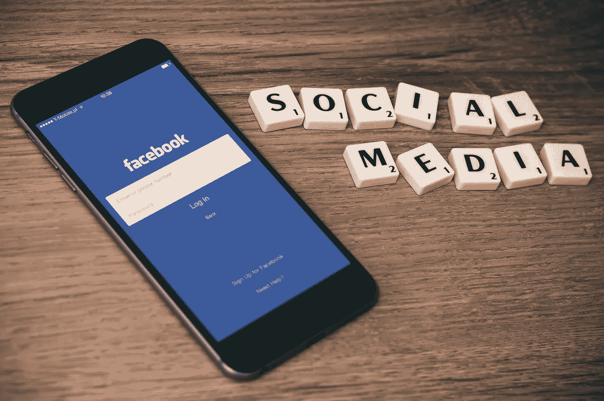

# 技术与心灵:一位存在主义精神治疗师对技术意义的思考

> 原文：<https://medium.com/hackernoon/technology-and-the-mind-an-existential-psychotherapists-thoughts-on-the-meaning-of-tech-308fe7b223f3>

## 随着许多技术领域的人受到脸书 2018 年使其平台更有意义的使命的鼓舞，关于技术对我们心理健康的影响的讨论越来越多。为了进一步调查这一现象，我采访了加州综合研究所职业心理与健康学院院长 Nicolle Zapien 博士，谈论技术及其对我们心理健康的重要影响。

## **问:在心理健康方面，科技行业有哪些不足？**

**答:**技术有两个主要缺点。这两者都源于这样一个事实，即技术促进了与人类的联系，但通过一种强调个人而不是他们之间的联系或他们之间发生的关系现象的媒介。

其中一个缺点是科技如何在社会上塑造了我们的生活。我越来越多的心理治疗客户，其中许多是技术人员，面临着社会挑战，难以识别他们的感受和想要的(或其他人的感受和想要的)，比以往任何时候都多的人正在与性和亲密关系的各个方面进行斗争。与其他任何群体相比，科技工作者花更多的时间在科技平台上与他人互动，通过他们在网上策划的自我意识进行过滤。这似乎塑造了他们思考和感受的方式，更重要的是，塑造了他们理解自我和他人的方式。

我们正处于一个无处不在的优化时期——一种新自由主义心态，认为我们可以找到完成一切的最佳方式。从很多方面来说，这是真的。然而，心理学，尤其是存在主义心理学和哲学提出的观点是，如果我们想要满足，生活的某些方面是不能优化的。事实上，生活中有很多方面通过奋斗变得有意义，尤其是在人际关系中。

第二个问题是，科技深刻地塑造了我们对时间的理解。我们加快速度。越来越多的人无法长时间集中注意力。我们有一种感觉，我们必须跟上机器的时间，它总是开着，总是很快。这种时间感在许多方面与我们身体的需要和创造力的节奏不一致。人们经常不得不通过学习科技来改善他们的心理健康。我们有时会向客户教授有意识的技术参与，以便他们可以在技术使用方面处于主导地位，从而创造时间进行反思。

这在经历倦怠的高级技术高管或有色情使用问题的人身上体现得最为深刻。心理学家现在充斥着这两种情况。临床上的解决方案是在冲动和行动之间创造一个空间来反思，这样我们就可以开始重新获得对我们思想和行动的有意识控制。

## 问:心理疗法如何独一无二地为技术部门提供重要的振兴？

**答:**我们对思维、情感和关系如何运作以及我们如何理解我们的经历有着深刻的理解——这对于洞察以技术为中介的关系和经历如何运作至关重要。此外，因为技术的使用似乎会影响用户的情绪、思想和冲动，而这些反过来又会影响技术的使用，所以心理学的理解是至关重要的。

我们不仅可以利用心理学知识来创造促进健康心理体验的技术，还可以通过我们的服务来帮助那些技术人员重新获得他们目前被围困的生活。漫无目的、精疲力尽、人际关系困难、不自信或过度自信、竞争性、缺乏同理心、冲动控制、抑郁、焦虑——所有这些在我的科技行业客户身上都很普遍。我们一起工作经常帮助他们感觉更自我，更有创造力，更全面。

> 漫无目的、精疲力尽、人际关系困难、不自信或过度自信、竞争性、缺乏同理心、冲动控制、抑郁、焦虑——所有这些在我的科技行业客户身上都很普遍。

心理治疗是一种关系活动，一种内省活动，一种独特的活动。它包括一系列亲密的谈话，致力于促进客户对自己的了解，使他或她有更多的选择和活力。有时生活是痛苦的，有时是愉快的，但最重要的是它非常有价值，因为它为客户提供了治疗上述疾病的解药。

我也发现心理治疗影响整个领域的方式很有趣。例如，除了产品的可用性和粘性之外，技术部门的人尤其可以从对技术的心理后果的更深刻理解中受益。例如，人们赋予一个特定的脸书活动持久的感觉和意义呢？我们使用这些工具后对自己经历的集体理解呢？如果它们都让我们不开心或者更没有创造力呢？如果其中一些对防止社会不公有启发或帮助呢？似乎是时候将更广泛的关于技术伦理和社会心理学的对话应用到当代的技术对话中了。

例如，我们知道人们在开车时发短信，并且会因为冲动控制、习惯性使用智能手机、多巴胺激增以及一系列社会因素而继续这样做。我们可以利用这些理解来构建更好的产品和信息，以帮助拯救生命，但这需要技术人员考虑自己及其心理和社会过程，以便能够在工作中获得这些知识。心理学可以做出很大贡献，因为最终，我们希望技术为人类服务。设计技术的人必须精通心理学。

## 问:你对脸书 2018 年的新目标有什么想法？

答:我认为脸书开始自省是件好事。当他们在 2004 年首次推出时，我记得我认为脸书似乎是高中年鉴场景的产品化版本，人群中/人群外的感觉占主导地位，像群体思维这样的社会心理学原则将占上风。我认为我们集体在技术上有很大的力量来推动社会群体，并有义务推动群体思维有意识地朝着更好的方向发展。“好”的概念也要求我们作为一个群体对价值观进行哲学思考。我们正在成为一个更强大的蜂群思维，我们需要提高我们的社交和移情技能，以适应这些新的工具，这些工具可以用于非常强大的社会行为。

技术伦理学家、教育家和心理学家必须参与对话。我们能造出被广泛使用、有利可图、有用的东西，并不代表它就是好的。那些最能想象人类社会和情感影响的人通常是教育学家和心理学家，他们通常不太懂技术。这座桥必须建在两者之间。我希望看到脸书成长为一家意识到其影响力并承担起这一责任的公司，不仅通过监管特定岗位，还通过更深入地参与社会心理学研究。我们在网上做的事情往往比我们在现实中做的事情更极端。当我们认为自己被一个策划好的图片或一个在线群体所强化时，我们的所作所为可能是非常可怕的，也可能是非常积极的，但不管怎样，它往往被放大了。是否每个人都知道如何熟练地驾驭自己的情绪和关系，以便这些放大是熟练的？

我们可以有效地接触更多的人，并对他们产生巨大的影响。随之而来的是培养几项重要能力的责任。我特别想到的是提前预测自己如何影响他人的能力，这部分与移情和正念有关。现在，许多人并不特别善于反思，许多人坦率地说并不关心他们如何影响他人。这是有问题的，因为心理学认为正念和同理心对心理和社会健康都非常重要。

## 问:在这个数字时代，我们如何实现有意义的互动？

我认为，我们必须将我们的自由和责任结合起来，开始觉醒，选择只参与那些有意义的平台、应用或对话。我们有时需要关掉我们的设备，或者至少意识到我们可以选择。当我们有时间去充实的时候，我们会花多少时间条件反射地看着我们的设备？我们没有做什么，因为我们做了？是我们在驱动我们的注意力和意图，还是它们现在习惯性地为我们所驱动？我们还必须保留一些非技术经验，以便有一个间隙来反思和选择参与技术。即使我们认为我们可以，我们也无法真正跟上机器。

> 对于我们的大脑来说，重要的是在自然和无组织的时间里，不要看着屏幕，看着彼此的眼睛，感受另一个人的拥抱，移动我们的身体，学习和保持社交技能和对话。

对我们的大脑来说，重要的是在自然和无结构的时间里，不是看着屏幕，而是看着对方的眼睛，感受另一个人的拥抱，移动我们的身体，学习和保持社交技能。处于虚无中也很重要——保持距离，只是存在。我们也不得不(不是在网上，而是在现实世界中)遇到一些令人惊讶或面对的事情，并处理它，而不仅仅是寻找那些舒适的事情。这在心理学上等同于健身。如果我们不在社交、情感或性方面挑战自己，我们最终永远不会在关键方面成长。我们只寻找那些能反映我们的兴趣和自我意识的东西。这是一个封闭的系统，它停滞不前，并以自身为食。

## 问:有哪些非技术手段可以实现有意义的互动？

人还是远比任何 app 有趣。虽然技术以非常重要和有趣的方式将我们联系在一起，但亲自参与并凝视他人的脸进行交谈仍然很重要。我们的大脑需要这种互动，以发展社交和情感技能，并关心他人。如果我们在这方面做得不够，我们可能会失去作为人类的一个真正重要的部分。当然，你会以这种方式遇到难相处的人、次优的经历、难闻的气味和乏味的谈话。但你也会感到惊讶。你将学会以缓慢和反思的步伐来对抗这些事情，这是人类心理成长和力量所需要的。独立思考一会儿，和其他人一起思考。这是有意义的。

如果你觉得这篇文章有趣，请👏并与他人分享。