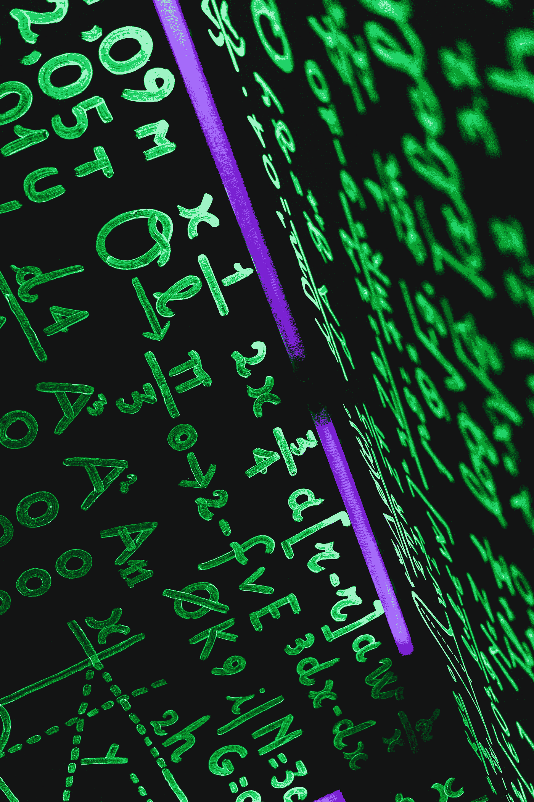
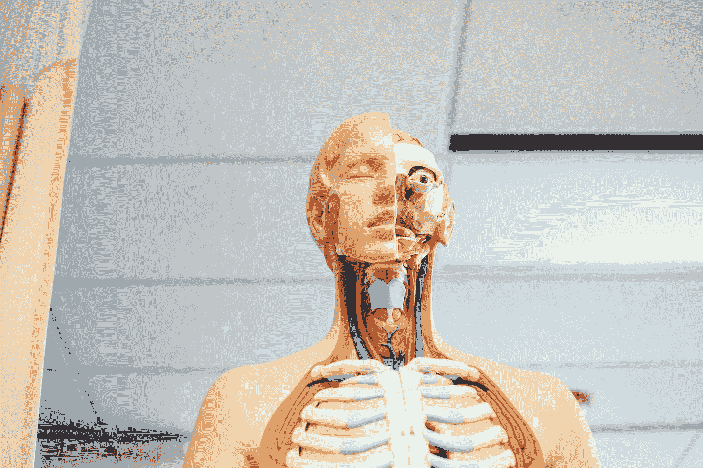

# 技术延伸现实

> 原文：<https://medium.com/hackernoon/technology-extends-reality-dea9b5d4d5ee>

## VR 带你去任何地方。AR 给你带来任何东西。先生带来了新的信息。XR 将用人工智能和人类思维的数据描绘世界。

# 如果你错过了，请阅读本系列的第一部分，看看现实是如何从我们的头脑中延伸出来的。

这是一项改变游戏规则的技术。也许是我们需要的最后一个。我们正在创造蜂群思维。连接一切的电线。我们正在我们的头脑中建造另一个世界，我们正在教人工智能如何在那里茁壮成长。但这是我们最终想要的吗？我们要不要生活在一个由机器生成的伪世界里？还是男人创造的谎言世界？

# 合并

智能手机将超级计算机带到了我们的手中。触摸屏让我们可以轻松地与计算互动，人工智能可以在一秒钟内完成人类几个世纪的工作。对话界面允许我们与 Alexa、Siri 和谷歌交谈，因此我们可以不用思考就获得超人的能力。

> *所有这些都指向大脑和计算机的融合。*

然而，在现代技术的能力和现实如何运作之间仍然存在抽象。通过视频通话，你可以看到一个朋友，但是是通过一个固定视角的小平板屏幕。有了维基百科，你可以阅读一个事实，但看不到这个事实如何影响一个系统。查看谷歌地图时，你可以看到 2D 的图像，但看不到它与你周围街道的关系。

当以任何方式与现代设备交互时，你仍然需要将你的意图转换成微小的手指运动，以符合 UI 设计者的期望。我们都受到物理设备和人机界面的约束。

> 扩展现实将改变这一切。它将带来空间计算和自然界面。

我说的自然是指，它会自然而然地出现在你面前，你不必去学习它。你不必学习打字，或学习强制触摸，或学习在屏幕外滑动，记忆汉堡菜单，理解登录系统或任何其他我们必须组装在一起才能使手机成为可用计算设备的真正神秘的系统。

计算的下一个阶段将会使用一个更符合我们期望的界面，把思维和计算联系起来。它将允许每个人使用先进的计算。每个人都可以在一秒钟内完成几个世纪或更长时间的工作。而这仅仅是扩展现实技术开始的开始。

## 这个世界将会充满看不见的电脑。

我们看不见他们，也不知道他们在想什么，但他们会认出我们，并为我们创造一个共享的现实。

扩展现实将带来沉浸式计算。我们不必盯着小屏幕或坐在显示器前。我们将能够环顾四周，在我们眼前看到所有相关的信息和联系。计算——将我们的意图卸载到另一个基底的能力——在我们的生活中会变得比以前更容易、更重要。

但是，我们将如何滑入数字现实呢？

# 意识

坐在山顶上，看着远处的湖泊，40，000 年的进化将给你的大脑带来一种平静和敬畏的缓慢感觉。这种意识是深刻的、不言而喻的和神秘的。情感永恒不变的真理。把你的大脑连接到互联网上，你就会沉浸在猫、跑车、尖叫的女人、专业广告商的紧急推文和政治巨魔农场的仇恨言论的图片中。一股持续的、美丽的混沌新奇之流。

> 扩展现实在这两个维度之间创建了一个门户，现实的坚实平静和新奇的数字冲击——血清素、皮质醇内啡肽和肾上腺素的令人兴奋的混合。

但是也许你的思想还没有准备好。我们的生物硬件比控制它的技术驱动进化得更慢。我们只是这个旅程中的乘客，我们无法控制。

但是谁在延伸现实呢？为什么呢？

# 持续增长——可持续文化还是癌症？

我们看到科技公司创造了全球文化。他们没办法，这是他们的天性。技术团队是被资本主义的基本驱动力所驱使的。他们不断被他们的财务约束拉向未来。通过新市场实现的增长必须在途中创造。

这种成长是从种在公共领域的欲望种子中产生的。崭新事物的市场必须继续扩大。今天收获的功劳取决于下一季的生长。所有这些两年一次的设备、平台和应用程序必须被种植、培育和出售，而昨天的旧收获被扔进垃圾堆。但是为什么呢？谁控制着这个全球技术农场？为什么我的手机不够好再用 50 年？

众所周知，谷歌的座右铭是“不作恶”。这只可能是对它的开发者悄悄说的，并得到了它的股东的支持。公司的阴谋对这些道德充耳不闻。

# 成长和新奇

扩展现实的新市场将提供另一个大爆炸的扩张机会，并防止“巨型科技明星”和潜在的经济在其自身重量下崩溃。在当前的经济体系中，科技公司需要一种逃逸速度，以保持它们加速前进，逃离无关紧要的事件视界。

> 新奇为推动实用之船前进的创新引擎提供动力。

但是我们应该质疑为什么我们需要技术的车轮不断向前滚动吗？什么时候已经够了？为什么我们需要更多？为什么我们用工厂覆盖更多的世界，用塑料填充更多的海洋？为什么我们需要用更多的技术污染我们的意识世界？

# 奴役

到目前为止，我们可以看到，尽管大自然母亲尽了最大努力，但人造技术奴役人类的程度超过了她所能控制的程度。

在发达国家，已经没有多少人整天为植物挑水了。在过去的四万年里，我们做到了。自从草变成了庄稼，把我们变成了它们的空姐，它们就操纵我们在这个星球和更远的地方种植它们。

相反，我们现在一生都在关注技术。我们的行为慢慢被外部力量所同化。

> 一个狩猎采集者可能在早上第一件事就是检查他当地的苹果树，一个旧石器时代的水稻农民检查他的农田，一个现代人——他们的 twitter feed。

也许“喂养”是一个正确的术语，因为它充满了思想，需要通过日常保养来培养。

# 思想、技术和现实的演变

当第一个人类塑造燧石刀时，这只是一个想法。也许是一点运气。这让狩猎变得更加容易。但是当他分享他的想法给其他人使用——复制——来改进它时，它就变成了技术。

技术不是硬件。它只存在于那些理解它的人的头脑中，并遵循与它的宿主相同的达尔文竞争。新的想法与当前的想法在思维环境中竞争，成功的想法将通过复制被选择出来。

思想传播得越快，通过思想的交流和硬件的复制，技术的发展就越快。像数字现实这样的技术允许自己以指数级的速度进化，因为它完全是虚拟的——它没有所有其他经典达尔文系统的物理包袱来阻碍它的进化。

硬件——无论是支持 AR 的手机、VR 耳机、MR 眼镜还是卫星光束全息图——几乎都无关紧要，因为它只是整个扩展现实概念发展的媒介。

> 关键的结论是，允许人类思想在人脑外部进化的最合适的想法、工具和技术将在竞争中胜过其他技术，并且这些将在未来伴随我们。通过用数字接口扩展现实，我们正在为思想在头脑之间以前所未有的速度传递创造一个新的空间。

# 病毒

这种技术病毒，从一个头脑传播到另一个头脑，进化和竞争，通过硬件工件的种子繁殖。

火石刀和 VR 耳机就是这种病毒的性器官。

这些共生寄生虫——由理查德·道金斯创造为迷因——位于我们的生物结构之上，在我们大脑皮层的波动和模式中发挥作用。

# 影响

> 语言是人类最常见的传染病——通过交谈传播给儿童。

或者在书中潜伏几十年，直到它被重新理解。艺术是另一种精神病毒，它迫使我们去创造美好的事物，互相合作去创造和使用新事物。

技术是另一种感染——但它与众不同——它永久性地改变了我们周围的世界。语言和艺术的目的是改变其他人头脑中的模式，以便这种模式一次又一次地传递下去，而技术的想法是将这种模式永久地印在现实中。技术是思维的产物，但像燧石刀这样的东西能改变的不仅仅是思维模式。它可以通过切割东西反复在现实中留下印记。当我们将现实扩展到数字领域时，我们能够创造出新的工具，以新的方式留下印记。

为了充分理解这一点，我们需要考虑我们所说的改变现实是什么意思，以及我们如何知道一些事情已经被改变了。知识是我们现实中不可分割的一部分。而知识一旦被调用，就很难再消失。这不要与数据和信息的数字概念相混淆。信息是不同的——例如，我可以知道这个句子里有多少单词，而这仅仅是一个事实，以后可能会变成不真实的。然而，关于如何计算字数的知识总是知识，知识与现实有更强的联系，因为它让我们了解我们对现实的改变。

为什么这对扩展现实很重要？因为我们正在创造的技术是不可预测的，因为它改变了现实的法则。每次我试着数这个句子的单词时，单词都会变。人工智能模式发生器与扩展现实世界的耦合——一个我们认为真实的世界——将是一个我们无法预测或控制的世界。

# 理解我们的传感器

神经科学家认为，我们的现实感是由来自传感器的电脉冲产生的。味蕾、视网膜细胞、触觉感受器、鼻神经节和运动神经，在我们大脑内部，只是结构相同的感觉。我们的大脑通过关联传入感觉的时空模式来构建意识，并从中创造一个连贯的现实。有强有力的临床证据表明大脑的可塑性——当接触到新技术时，我们的现实可以从根本上改变。例如，如果照相机连接到压力针阵列，而不是屏幕，并且压力针阵列放置在人类对象的舌头上，不久舌头的触摸传感器将在对象的大脑眼睛中创建图像。大脑不知道也不关心什么信号进来，来自什么，或者来自哪里——它仍然会构建意识现实。

这对扩展现实有着深远的影响。我们创造的工具不必直接映射到任何已知的信号——我们可以创造现实和人工数据的新的新表示，大脑的可塑性将知道如何处理它们。有了扩展现实，我们将为人类大脑创造一个全新的传感器领域。大脑的可塑性表明，只要大脑产生的运动模式能够快速、可重复、持续地与任何感官输入相关联，那么大脑将首先有意识地意识到它，然后将其作为潜意识现实接受。

这使得测试令人震惊的新 UI 和人机界面的网关变得正常。增强人类在如何增加他们在世界上的知识和效用方面可能有令人难以置信的界限。

如果你试着思考一下，世界上有多少过程你不需要尝试就能理解——如何开门、煮咖啡、写电子邮件、猜测你的同事接下来会说什么——所有这些过程都已经毫不费力地硬编码在你的新皮层中。

> 扩展现实将提供我们今天难以理解的功能知识流。

*更新:阅读* [*第三部分*](https://www.ninjar.com/blog/3-digital-reality-and-culture) *在这个系列中我们的社会结构将会受到怎样的影响…*

你喜欢我们的帖子吗？您可以在[媒体](https://medium.com/ninjar-com)上发表评论并加入聊天

我们希望收到您的来信。来推特[、脸书](https://twitter.com/ninjar_com)[、LinkedIn](https://www.facebook.com/Ninjar-1546188488814672/) 上找到我们吧