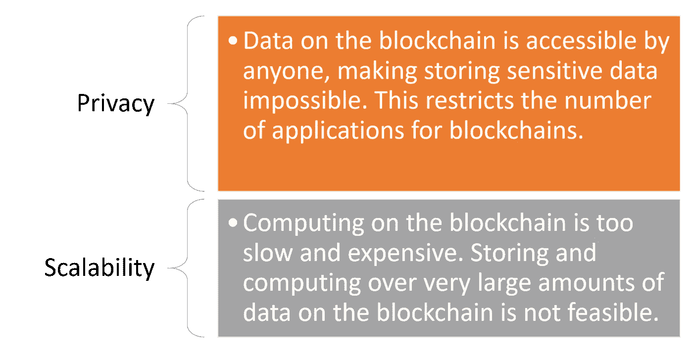
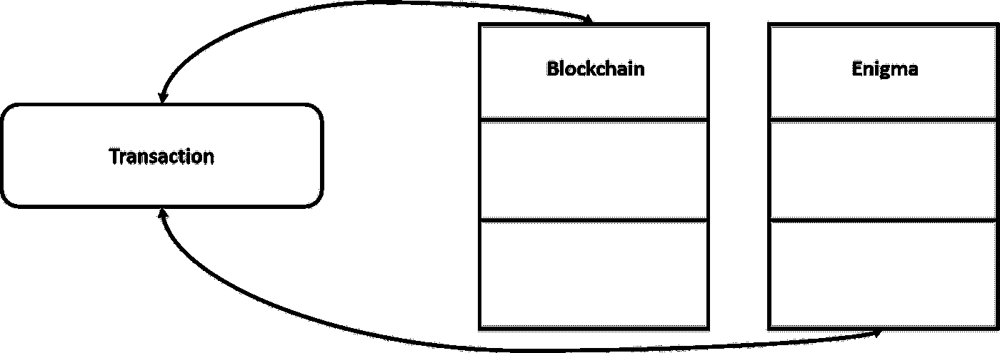
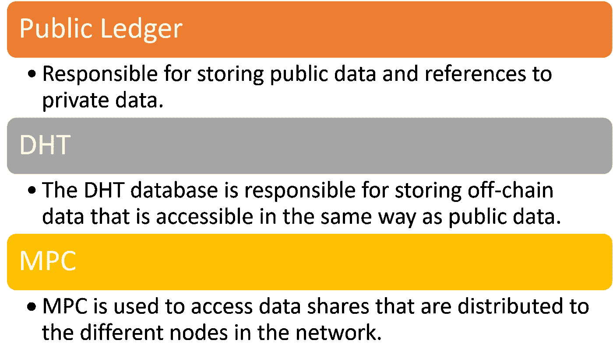

# 技术星期五:英格玛解决了主流采用区块链的两个最大问题

> 原文：<https://medium.com/hackernoon/technology-fridays-enigma-solves-the-two-biggest-issues-for-the-mainstream-adoption-of-blockchains-2655eeac8f47>

区块链可能是几代人中最具突破性的技术，但与其他技术趋势相比，其主流采用仍然相对有限。区块链群体非常清楚，为了简化区块链技术的采用，需要解决几个挑战。在这些挑战中，没有两个比隐私和可伸缩性更重要。

区块链社区内部正在努力解决这些问题，但大多数都依赖于创建全新的区块链基础设施。几年前，麻省理工学院(MIT)媒体实验室的安全研究人员[发表了一篇论文](https://www.media.mit.edu/projects/enigma/overview/)，概述了一种不同的计算模型，可以解决任何区块链的这两个问题。他们称这项技术为“谜”,大概是为了纪念二战期间德国用于加密信息的密码机，它在计算机工业的发展中发挥了重要作用。几个月后，麻省理工学院团队决定超越学院，推出 Enigma，以便为任何区块链带来隐私和可扩展性。

# Enigma 如何解决隐私问题？

从概念的角度来看，Enigma 被设计成可以连接到任何区块链，并将私人的和密集的计算卸载到一个离线网络上。所有交易都由区块链促成，该系统基于数字签名和可编程权限实施访问控制。

Enigma 带来的关键思想是能够在不访问数据本身的情况下对数据进行计算。更具体地说，Enigma 关注的计算类型是智能契约，在 Enigma 的上下文中，这种契约被称为秘密契约，因为它通过堆栈实现了额外的隐私级别。当使用 Enigma 时，秘密合同在区块链上执行它们的公开版本，而对于私有或计算密集型部分则依赖于 Enigma。

秘密合同背后的魔力是通过利用一种被称为安全多方计算(sMPC 或 MPC)的新技术实现的。在这个计算模型中，数据查询是以分布式方式计算的，没有可信的第三方。数据在不同的节点之间分割，它们一起计算功能，而不会将信息泄露给其他节点。具体来说，没有哪一方能够访问全部数据；相反，每个政党都有一个随机的片段。MPC 可以被视为计算机科学中著名的*百万富翁问题*的解决方案，该问题描述了两个百万富翁对知道他们中谁更富有感兴趣，而不透露他们的实际净资产。

# Enigma 是如何解决可扩展性的？

确保可伸缩性的 Enigma 体系结构中的关键构件是链外存储模型。Enigma 包括一个分散的离链分布式哈希表(或 DHT ),可通过相邻的区块链访问。在该模型中，区块链存储对数据的引用，而不是数据本身。在将存储和访问控制协议编程到区块链之前，应该在客户端对私有数据进行加密。

从存储的角度来看，Enigma 可以被认为是分布式节点的集合。每个节点都有不同的份额和加密数据视图，因此计算过程保证了隐私保护和容错。

在体系结构上，Enigma 系统中有三个不同的分散数据库:

# 英格玛令牌

与以太坊类似，Enigma 包含自己的令牌，用于补偿平台中的不同成本。具体来说，ENG 令牌用于三个主要领域:

**计算费用:** ENG 令牌用于支付英格玛网络中的任何请求。

**存储费:** ENG 令牌用于在一定时间内维护网络中的数据。

**保证金:**网络中的节点可以使用 ENG 令牌作为保证金，以确保自己参与交易。

# 使用 Enigma 的两个应用程序

即使在核心的 Enigma 技术还不可用时，该团队已经发布了两个应用程序，大规模地验证了 Enigma 的功能。

Enygma Catalyst 是一个用 Python 编写的加密资产算法交易库。它允许交易策略很容易地表达出来，并根据历史数据进行回溯测试，提供有关特定策略表现的分析和见解。

Catalyst 解决方案由 [Enigma 数据市场](https://enigma.co/marketplace/index.html)提供支持，这是另一个验证 Enigma 平台能力的有趣解决方案。数据市场充当不同数据库的网关，以分散的方式共享对数据的引用，同时确保其隐私性。