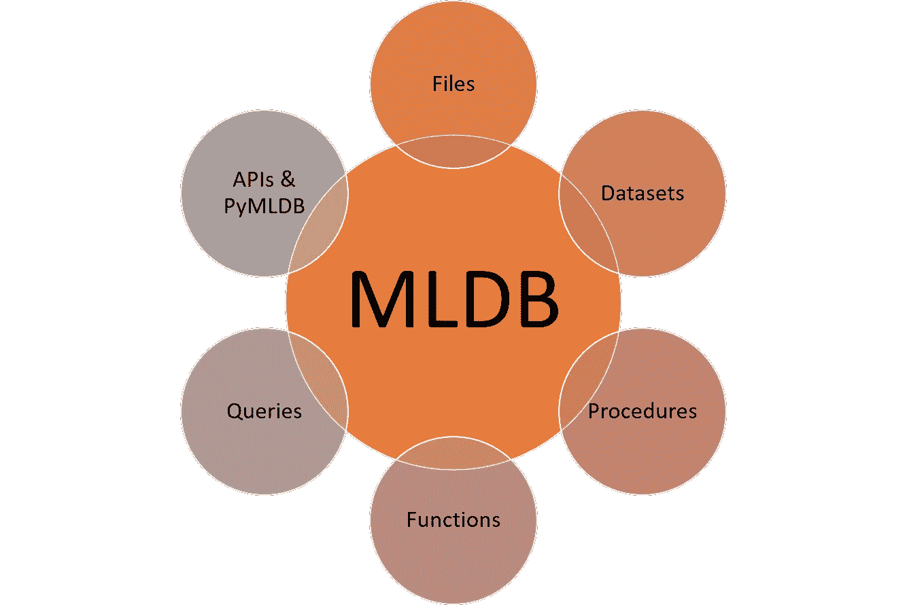

# 技术星期五:MLDB 是每个数据科学家梦寐以求的数据库

> 原文：<https://medium.com/hackernoon/technology-fridays-mldb-is-the-database-every-data-scientist-dreams-of-368b50b5a434>


现实世界中的机器学习解决方案很少只是构建和测试模型的问题。管理和自动化机器学习模型从训练到优化的生命周期是迄今为止机器学习解决方案中最难解决的问题。为了控制模型的生命周期，数据科学家需要能够大规模地持续和查询其状态。这个问题可能看起来微不足道，直到你考虑到任何平均深度学习模型都可以包括数百个隐藏层和数百万个互连节点；)存储和访问大型计算图绝非易事。大多数时候，数据科学团队会花大量时间尝试让商用 NOSQL 数据库适应机器学习模型，然后得出不那么明显的结论:**机器学习解决方案需要一种新型数据库**。

[MLDB](https://mldb.ai/) 是为机器学习时代设计的数据库。该平台针对存储、转换和导航表示机器学习结构(如深度神经网络)的计算图进行了优化。我知道你在想什么😉AWS SageMaker 或 Azure ML 等云机器学习平台已经包含了机器学习图的持久性模型，那么我们为什么需要另一种解决方案呢？事实证明，真实世界的机器学习解决方案有相当多的要求可以从真实的数据库中受益:


# 输入 MLDB

[MLDB](https://mldb.ai/) 为机器学习模型的存储和查询提供了一个开源的原生数据库。该平台最初是在 Datacratic 中孵化的，[最近被 AI 发电站 Elementai](https://betakit.com/element-ai-acquires-mldb-ai-open-source-machine-learning-database/) 收购，作为对数据库引擎在现代机器学习项目中的相关性的验证。MLDB 有不同的形式，例如云服务、VirtualBox VM 或 Docker 实例，它们可以部署在任何容器平台上。

MLDB 的架构结合了不同的工件，这些工件抽象了机器学习解决方案的生命周期的不同元素。从技术上讲，MLDB 模型可以概括为六个简单的组件:文件、数据集、过程、函数、查询和 API。



# 文件

文件代表了 MLDB 架构中常见的抽象单元。在 MLDB 模型中，文件可用于加载模型数据、函数参数或保存特定数据集。MLDB 支持与流行文件系统(如 HDFS 和 S3)的本机集成。

# 数据集

MLDB 数据集表示过程和机器学习模型使用的主要数据单元。从结构上来说，数据集是无模式的、仅追加命名的*数据点*集合，包含在*单元格*中，这些单元格位于*行*和*列*的交叉点。数据点由一个*值*和一个*时间戳*组成。因此，每个数据点可以表示为一个(行、列、时间戳、值)元组，数据集可以被认为是稀疏的三维矩阵。可以通过 MLDB 的 REST API 创建数据集并向其追加数据，也可以通过过程从文件加载或保存到文件。

# 程序

在 MLDB 中，过程用于实现机器学习模型的不同方面，例如训练或数据转换。从技术角度来看，过程是命名的、可重用的程序，用于实现无返回值的长期运行的批处理操作。过程通常在数据集上运行，并且可以通过 SQL 表达式进行配置。过程的输出可以包括数据集和文件。

# 功能

MLDB 函数抽象过程中使用的数据计算例程。函数是命名的、可重复使用的程序，用于实现流计算，可以接受输入值并返回输出值。通常，MLDB 函数封装了表示特定计算的 SQL 表达式。

# 问题

MLDB 的主要优势之一是它使用 SQL 作为查询存储在数据库中的数据的机制。该平台支持一个相当完整的基于 SQL 的语法，包括大家熟悉的结构，比如 SELECT、WHERE、FROM、GROUP BY、ORDER BY 等等。例如，在 MLDB 中，我们可以使用 SQL 查询来为图像分类模型准备训练数据集:

```
mldb.query("SELECT * FROM images LIMIT 3000")
```

# API 和 Pymldb

MLDB 的所有功能都通过一个简单的 REST API 公开。该平台还包括 pymldb，这是一个 Python 库，它以非常友好的语法抽象了 API 的功能。下面的代码显示了如何使用 pymldb 创建和查询数据集。

```
**from** **pymldb** **import** Connection
mldb = Connection("http://localhost")mldb.put( "/v1/datasets/demo",      {"type":"sparse.mutable"})
mldb.post("/v1/datasets/demo/rows", {"rowName": "first", "columns":[["a",1,0],["b",2,0]]})
mldb.post("/v1/datasets/demo/rows", {"rowName": "second", "columns":[["a",3,0],["b",4,0]]})
mldb.post("/v1/datasets/demo/commit")df = mldb.query("select * from demo")
**print** type(df)
```

# 支持机器学习算法

MLDB 支持大量算法，例如可以在过程和函数中使用的算法。该平台还原生支持 TensorFlow 等不同深度学习引擎的计算图。


# 将这一切结合在一起

让我们以机器学习解决方案中的常见工作流为例，如模型的训练和评分。下图说明了它将如何在 MLDB 中实现:


1.  该过程从一个充满训练数据的文件开始，该文件被加载到训练数据集中。
2.  运行训练程序以产生模型文件
3.  模型文件用于参数化评分函数
4.  该评分功能可通过 REST 端点立即访问，以便进行实时评分
5.  评分功能也可以通过 SQL 查询立即访问
6.  批量评分程序使用 SQL 将评分函数批量应用于未评分的数据集，从而生成评分数据集

# 结论

MLDB 第一批数据库实例之一，从头开始设计以实现机器学习解决方案。该平台仍可以进行大量改进，以支持现代机器和深度学习技术，但其灵活性和可扩展性使其成为这个新领域的第一次迭代。