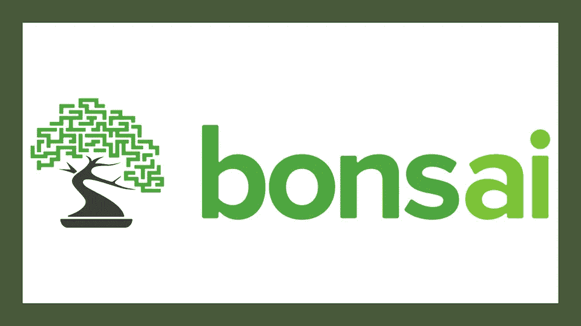
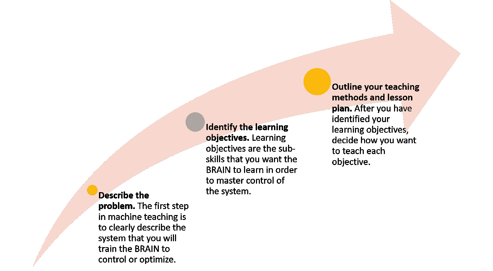
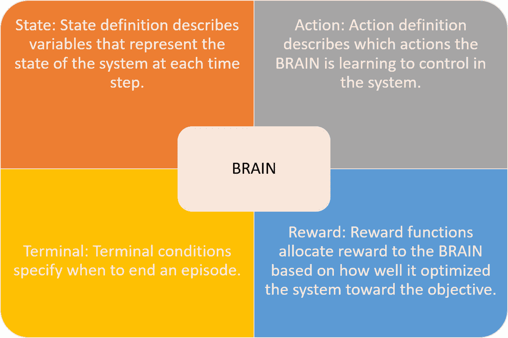
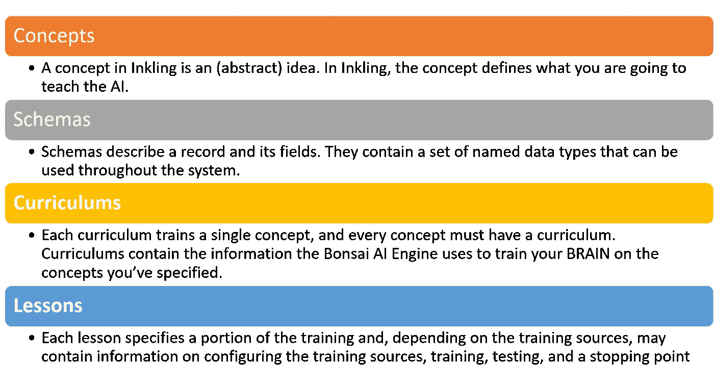

# 技术星期五:为什么 Bonsai 是微软人工智能堆栈的重要补充

> 原文：<https://medium.com/hackernoon/technology-fridays-why-bonsai-brings-is-a-great-addition-to-microsofts-ai-stack-bf8ad832e0c8>



本周早些时候，微软宣布继续其收购狂潮，收购机器学习初创公司 Bonsai。这不应该完全令人惊讶，因为微软已经表示了对 Bonsai 的兴趣，去年[领导了这家初创公司的一轮 760 万美元的投资](http://www.businessinsider.com/microsoft-and-nea-invest-76-million-in-bonsai-ai-2017-5)。我以前写过很多关于 Bonsai 的文章，但今天我想更深入地挖掘使这个平台在深度学习领域独一无二的元素。

在高层次上，你可以将 Bonsai 视为一个平台，它提供了一种更简单的方法来构建、训练和执行深度学习模型，而无需处理 TensorFlow、MxNet 或微软自己的认知工具包等框架的低级构造。不过盆景平台就多了。Bonsai 专注于一个领域，他们喜欢称之为机器教学，可以将其视为强化学习的一种变体。在盆景世界中，机器教学模型的目标是通过遵循强化学习算法的行动奖励模型，对大脑进行编程，以解决复杂环境中的问题。具体来说，Bonsai 用三个简单的步骤描述了机器教学。



# 大脑

Bonsai 平台使用四个简单的概念来抽象大脑，称为 STAR(状态、终端、动作、奖励)。



通常，BRAIN 的实现分为用领域特定语言编写的模型(称为 Inkling)和用 Python 编写的模拟器。


# 模糊的语言

Bonsai 平台中的强化学习问题是使用 Inkling 建模的，Inkling 是一种功能性的、特定于领域的语言，专门用于表示学习场景。学习情景的例子可以是:

*   学习玩游戏
*   学习识别什么是手写数字
*   学习辨别某物是红色还是什么颜色
*   学会在家中省电
*   学习按照特定的指导方针管理流程

暗示是基于三个基本结构:概念，图式，课程和教训。



下面的例子来自 Bonsai 文档，描述了一个用来保持室内温度的程序。您可以看到这种语言是如何结合上述结构的。

```
schema HouseheatState
    Float32 heat_cost,
    Float32 temperature_difference,
    Float32 temperature_difference_t1,
    Float32 temperature_difference_t2,
    Float32 temperature_difference_t3,
    Float32 temperature_difference_t4,
    Float32 temperature_difference_t5,
    Float32 outside_temp_change
end

schema HouseheatAction
    Float32{ 0.0:1:1.0 } heater_on
end

schema HouseheatConfig
    Float32 outside_phase
end

concept thermostat is classifier
   predicts (HouseheatAction)
   follows input(HouseheatState)
   feeds output
end

simulator simulink_sim(HouseheatConfig)
    action (HouseheatAction)
    state (HouseheatState)
end

curriculum my_curriculum
    train thermostat
    with simulator simulink_sim
    objective match_set_temp

        lesson my_first_lesson
            configure
            constrain outside_phase with Float32{0.0:12.0}
            until
                maximize match_set_temp

        lesson my_second_lesson
            configure
            constrain outside_phase with Float32{0.0:24.0}
            until
                maximize match_set_temp

        lesson my_third_lesson
            configure
            constrain outside_phase with Float32{0.0:48.0}
            until
                maximize match_set_temp

end
```

# 使用盆景

开发者可以通过下载平台到他们的本地环境来开始使用 Bonsai。根据项目的不同，平台可能包括对其他技术的依赖，如 Anaconda 或 OpenAI Gym。

使用 Bonsai CLI，我们可以通过使用以下命令行来创建大脑。

```
bonsai create myMountainCarBrain
```

此时，只需要启动 Python 模拟器并处理模糊模型。盆景也可以用在 Jupyter 笔记本上。Bonsai 平台提供了可视化大脑状态监视器的工具。

# 微软从 Bonsai 中得到了什么？

通过收购 Bonsai，微软获得了强化学习领域的领先平台。我们可以期待微软将 Bonsai 平台与其人工智能(ai)堆栈的其余部分进行集成，如 Azure 机器学习或认知工具包。