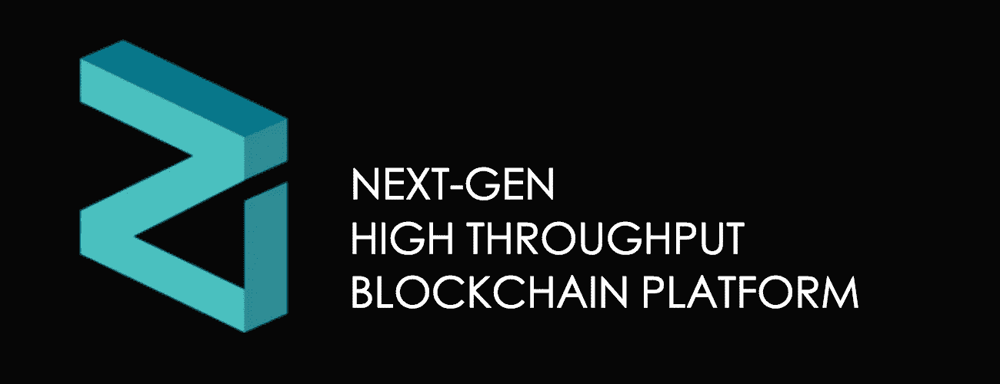
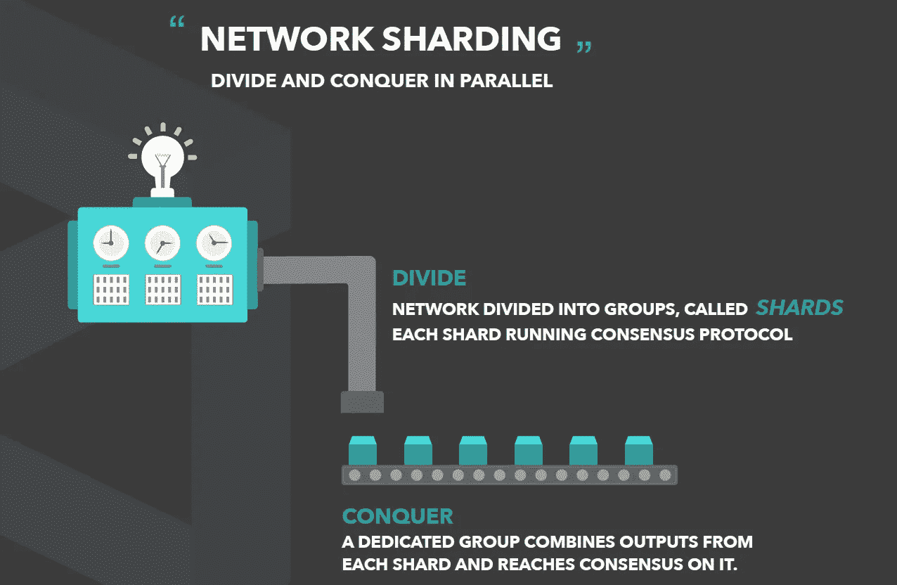
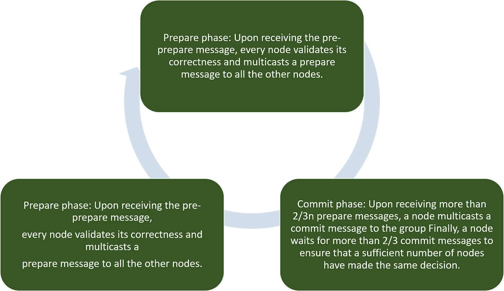
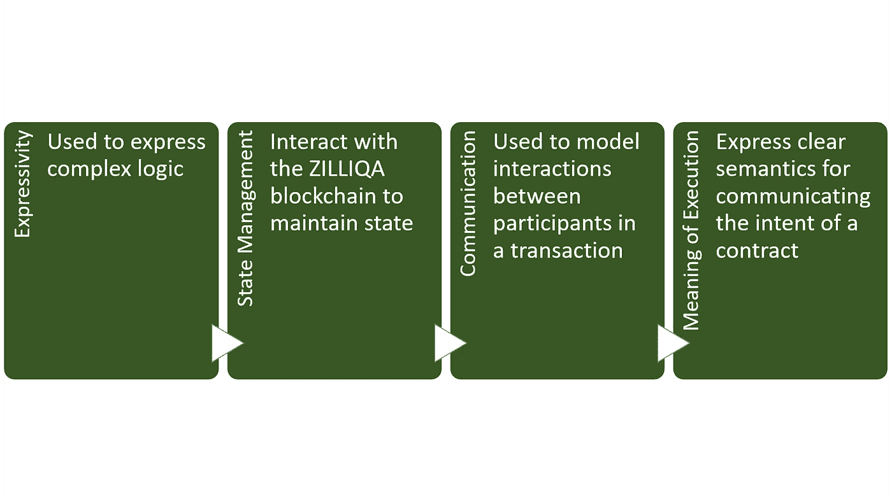

# 技术星期五:ZILLIQA 可以成为区块链的节点

> 原文：<https://medium.com/hackernoon/technology-fridays-zilliqa-can-become-the-nodejs-of-the-blockchain-20235c927058>



在区块链领域，我们没有一天不听到对以太坊等第一代区块链平台的可伸缩性和性能问题的抱怨。提供以太坊的替代品已经成为区块链生态系统中自己的市场，EOS、Stellar 或 Cardano 等解决方案试图成为下一代区块链平台。最近，我开始深入研究 ZILLIQA 项目，并被他们的技术深度和数学严谨性所震撼。在不参与预测游戏的情况下，可以有把握地假设 [ZILLIQA](https://www.zilliqa.com/) 是能够在下一代区块链平台中扮演重要角色的项目之一。

ZILLIQA 最初由新加坡科技公司[安全](https://anquancapital.com/index.html)孵化，但在该领域声名鹊起后很快成为一个独立的实体。乍看之下，ZILLIQA 似乎是一个复杂的平台，这可能是因为该项目建立在区块链 2 年多的可伸缩性技术研究之上。ZILLIQA 背后的主要思想是提供一个区块链运行时，随着更多的矿工进入网络提供无缝的规模经济，它可以线性扩展。ZILLIQA 架构的基石基于三个主要原则:分片、高效共识和智能契约

# 在分割中，我们相信

分片的概念在分布式系统中已经存在了几十年，但是对于区块链生态系统来说还是相对较新的。像以太坊这样的公司一直在研究这个概念的版本，以解决一直困扰他们区块链网络的性能问题。ZILLIQA 是作为一等公民与人分享而建立的。在 ZILLIQA 中，网络被分成更小的被称为碎片的共识小组，每个小组都能够并行处理事务。例如，如果 ZILLIQA 网络有 8000 名矿工，平台会自动创建 10 个子网络，每个子网络的规模为 800 名矿工，以分散的方式创建，无需可信的协调者。



在 ZILLIQA 模型中，不同的碎片可以处理不同的事务，而不会重叠或重复花费。这是通过 ZILLIQA 架构的一个关键组件实现的，该组件被称为目录服务委员会(DSC ),它是网络中负责将事务分配给特定碎片的节点的联盟。

# BFT 共识

ZILLIQA 共识协议的核心依赖于实用的拜占庭容错(PBFT)。在 PBFT 中，共识组中的所有节点都是按顺序排列的，它有一个主节点(或领导节点),其他节点称为备份节点。每一轮 PBFT 都有三个主要阶段:



ZILLIQA 通过使用多签名模型对经典的 PBFT 进行了改进，该模型将不同的签名聚合到一个签名中，该签名的大小只是聚合签名的一小部分。此外，ZILLIQA 共识协议只要求 shard 中 2/3 的节点在提交特定事务之前签署该事务。

# 一种新的智能合同语言

新型区块链需要新型智能合约！ZILLIQA 的智能合约基于 SCILLA，这是一种新语言，借鉴了 Solidity 背后的一些想法，但将其改编为 ZILLIQA 区块链。ZILLIQA 智能合同语言基于四个基本原则:



ZILLIQA 智能合约如下所示:

```
contract Crowdfunding (owner : address, max_block : uint, goal : uint) (* Mutable state description *) { backers : address ⇒ uint = []; funded : boolean = false; }(* Transition 1: Donating money *)transition Donate(sender : address, value : uint, tag : string)(* Simple filter identifying this transition *)if tag == "donate"⇒bs ←& backers;blk ← && block_number;let nxt_block = blk + 1 inif max_block ≤ nxt_blockthen send (<to → sender, amount →0,tag →"main",msg →"deadline_passed">, MT)
.....
```

# 令牌

ZILLIQA 平台包含了自己的令牌 ZILs。该网络提供的 ZILs 数量有限，上限为 210 亿个，将在未来十年内分发。ZILLIQA 还包括许多治理策略，以保证网络中的所有参与者都能从 ZILs 的价值中受益。

# 一种新型的区块链

ZILLIQA 是第二代区块链的一部分，他们正在学习以太坊这样的平台。除了提供解决其前身的一些性能限制的健壮架构之外，ZILLIQA 还在平台协议的核心构建了公平和正确性等原则。如果团队继续朝着这一愿景执行，ZILLIQA 可以成为区块链平台生态系统下一阶段的主角之一。