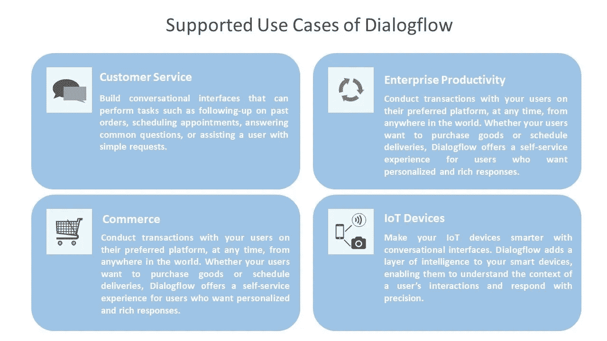
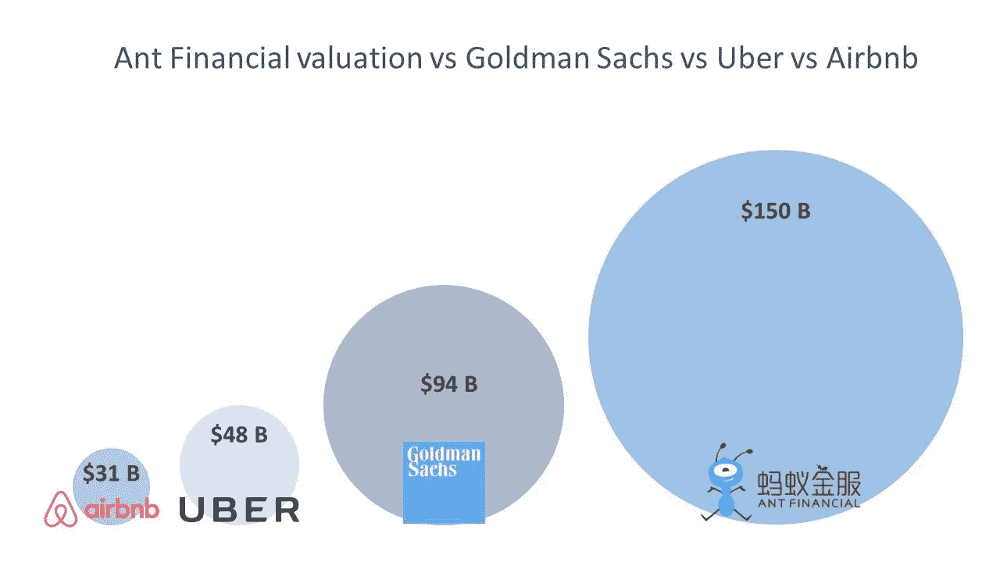

# 技术行业新闻与趋势，2018 年 4 月

> 原文：<https://medium.com/hackernoon/technology-industry-news-trends-april-2018-f7a8a27931e1>

四月有许多重要新闻。谷歌推出了对话界面的新功能，包括 Dialogflow 企业版。这个跨平台套件简化了聊天机器人和语音代理的开发和支持。随着家庭共享成为一种新的酒店趋势，共享经济颠覆了传统的商业模式。万豪以其现有品牌之一进入私人租赁市场。让我们来谈谈这些以及其他一些定义了这个月技术世界的新闻和趋势。

# 亚马逊走向国际

零售巨头亚马逊[将业务扩展到美国、西欧、中东、新加坡和澳大利亚之外。该公司增加了新的运输目的地，现在购物者可以在 100 多个国家使用亚马逊服务。然而，这家零售巨头并没有在当地建立业务。亚马逊刚刚通过移动应用程序在新的地区提供产品运输，该应用程序可以帮助客户计算全部运输成本和额外费用。](https://techcrunch.com/2018/04/17/amazon-finally-made-its-e-commerce-service-usable-for-international-customers/)

亚马逊的扩张是电商行业的一个重要标志:美国零售战走向全球。四月，有传言称沃尔玛和亚马逊都有兴趣收购印度电子商务公司 Flipkart。5 月下旬，沃尔玛在争夺 Flipkart 的竞争中击败了亚马逊。这家线下零售商将以 160 亿美元收购这家印度电子商务公司 77%的股份。在印度，在线零售市场预计到 2026 年将达到 2000 亿美元。两家公司都试图在印度建立业务，然而，两个竞争对手都没有成功。亚马逊投资数十亿美元与 Flipkart 竞争，而沃尔玛受外国投资政策限制，仅在全国开设了 21 家实体店。最后，传言得到了证实:沃尔玛即将收购这家印度在线零售商。Flipkart 将受益于与沃尔玛线下业务的合并。

# 谷歌提升对话界面产品

谷歌使 [Dialogflow 企业版](https://cloudplatform.googleblog.com/2018/04/Dialogflow-Enterprise-Edition-is-now-generally-available.html)全面上市。Dialogflow 是一个开发套件，用于构建基于人工智能的对话界面。该技术包含 30 多个预建模板，可加快项目交付。Dialogflow 简化了文本和语音应用程序的开发，而且非常简单，即使没有对话界面经验的工程师也可以使用它。

*Dialogflow targets these four main areas*

这项新技术是作为跨平台解决方案构建的，这确保了它可以跨主要设备使用，并支持谷歌助手、亚马逊 Alexa 和 Facebook Messenger。谷歌云服务的扩展和跨平台的性质使该套件更具竞争力，因为企业必须花费更少的钱来支持他们的产品。

# Lyft 扩大商务旅行业务

Lyft [宣布与美国运通商务旅行](http://travolution.com/articles/107156/lyft-to-be-integrated-into-american-express-global-business-travels-offering)整合。目前，公司旅行者可以从在线公司预订地面交通。但美国运通官员声称，这一合作将重新定义地面运输的传统转售模式，因为 Lyft 允许建立高度个性化的乘车共享计划。

作为优步的直接竞争对手，Lyft 正把很大一部分精力放在商务旅客身上。因此，优步在受欢迎的旅行和费用管理平台 Certify 上的地面转移份额从 2014 年的 99%下降到 2018 年 Q1 的 81%。这是传统地面运输提供商开始转变业务的又一个迹象。否则，优步和 Lyft 等数字打车公司将把出租车和汽车租赁挤出市场。

# 万豪推出家庭共享产品

家庭共享市场是旅游行业地图上的一个热点，因为它吸引了大型在线旅行社和主要酒店品牌。Airbnb、Booking.com、Expedia、[雅高酒店](http://www.accorhotels.group/en/investors)和凯悦已经开始了家庭共享。他们中的一些人拥有家庭共享品牌，如 Expedia 和 HomeAway，一些人经营自己的品牌，如 Airbnb。

2016 年，美国私人住宿租赁市场的价值为 320 亿美元。Phocuswright 预计，到 2018 年底，家庭共享行业将增长至 370 亿美元。共享经济帮助 Airbnb 从一家普通的初创公司成长为旅游行业巨头，寻找与 Expedia、Booking Holdings 和其他主要参与者竞争的方法。

最近，万豪也加入了竞争。连锁酒店[与 Hostmaker 合作推出了一个试点项目](https://skift.com/2018/04/23/marriott-experiments-with-homesharing/):万豪的客户将可以通过 Hostmaker 预订 200 套入围房屋中的任何一套，这些房屋是万豪的组合品牌之一——TributePortfolioHomes.com。万豪客户可租用的房屋符合所有安全、设计、安保和服务标准。客人还将获得 24/7 全天候的专门支持，亲自办理入住手续，并参与忠诚度计划。万豪的运营模式非常独特，因为他们希望将现有品牌之一转变为家庭共享专家。

# 蚂蚁金服接近成为 1500 亿美元的公司

中国初创公司蚂蚁金服即将成为[有史以来最大的初创公司](https://www.bloomberg.com/news/articles/2018-04-10/jack-ma-s-ant-is-raising-9-billion-ahead-of-an-ipo-wsj-says)。金融科技公司计划筹集约 100 亿美元。由此，其估值将达到 1500 亿美元。是世界著名投资银行高盛的两倍。蚂蚁金服在商业支付、财富管理和小额信贷领域开展业务。该公司已经得到了持有约 30%股份的阿里巴巴的支持。它还实现了盈利，去年实现利润 21 亿美元。

蚂蚁金服的大型融资是中国金融科技活动复兴的标志。随着金融科技监管变得更加透明，投资者准备向该行业投入资金。如今，越来越多的中国独角兽能够成功完成首次公开募股(IPO)，蚂蚁金服很可能会筹集上市前资金。

# SenseTime 是价值最高的人工智能初创公司

商汤科技是目前人工智能领域估值最高的初创公司。这家中国公司致力于动态和静态面部识别、身份认证解决方案、AR 平台和 BI 解决方案。他们的客户组合包括金融科技、汽车和硬件行业的约 400 家企业。在最后一轮融资中，[公司成功筹集了 6 亿美元。商汤科技将利用这笔资金将业务扩展到亚洲以外，并开发新的人工智能解决方案。最后一轮让该公司的估值达到 45 亿美元。](https://techcrunch.com/2018/04/08/sensetime-raises-600-million/)

2012-2017 年期间，超过 200 家人工智能公司在中国获得了 45 亿美元的资金，这使中国能够在 2030 年前成为人工智能技术的全球领导者。中国当局已经计划在未来几年投资超过 70 亿美元。这些投资将为其他人工智能初创公司创造机会，复制 SenseTime 的成功。在中国，人工智能公司通常是由科技巨头支持的独立实体，而在美国，人工智能开发主要由科技巨头或其全资子公司驱动。

# 生物识别技术使墨西哥和英国的跨境自动化

自从 JetBlue 和 SITA 开始测试采用面部识别的登机解决方案以来，生物识别技术在旅游业中引起了广泛关注。SITA 亭通过嵌入式摄像头拍摄乘客照片，或使用机器学习要求指纹和检查身份。这一趋势正在形成，SITA 的技术正在将生物识别解决方案的覆盖范围扩展到澳大利亚的布里斯班机场和奥兰多国际机场的英国航空公司。这项技术也得到了印度政府的支持。最后，4 月份墨西哥政府和旅游软件公司[同意在三个主要机场安装 100 个信息亭](https://www.sita.aero/pressroom/news-releases/mexico-strengthens-border-with-sita-biometrics)。这项技术将通过使用指纹识别检查身份来实现边境控制的自动化。

由于低竞争和早期采用阶段，旅行中的生物识别是一个有吸引力的创业机会。例如，[iprov](https://www.iproov.com/)，一家面部识别初创公司，计划与政府合作[解决北爱尔兰和爱尔兰共和国之间的过境问题](https://skift.com/2018/04/16/facial-recognition-startup-hoping-to-solve-brexits-ireland-border-conundrum/)。该公司将应用 Iproov 的金融行业客户已经使用的算法:挪威的 DNB 和荷兰的 Rabobank，英国的税务机构。该解决方案主要使用移动设备来拍摄短视频记录，然后检查身份。该公司声称，他们的系统比标准的身份检查程序精确 100 倍。

# 苹果在医疗保健领域的野心太高了

苹果医疗保健的雄心可能被夸大了。我们仍然不太了解他们在 glucometer 与 Apple Watch 集成方面的进展。到目前为止，怀疑论者对苹果健康、健康记录 app 的成功有很多疑虑。该应用程序允许收集、存储和共享患者的医疗数据。Apple Health 已经与全美超过 39 家临床解决方案提供商建立了联系。

尽管该解决方案似乎是对标准 EHR 系统的一大补充，但实际上，用户对其记录的访问仍然非常有限。此外，医生表示，如果安卓用户不能参与，这项倡议的影响将会有限。这种情况仍然存在争议，因为[医疗保健 IT 新闻调查](http://www.healthcareitnews.com/news/apple-health-records-readers-optimistic-adoption-skeptical-small-providers-can-use-it)声称用户对应用程序的采用持乐观态度，但怀疑者暗示该功能将不会用于小医院和私人诊所的患者。

# 一锤定音

共享经济是改变旅行和交通格局的强大力量。拼车和家庭共享平台颠覆了传统的商业模式。优步和 Lyft 采取一致措施，将汽车租赁和出租车公司挤出商务旅行领域。Airbnb 迫使酒店业的其他数字和传统参与者加入私人租赁市场。为了进入市场，大型旅游品牌建立新的家庭共享品牌，其他人收购或合并细分市场的现有企业。

私人租赁是非标准化的，控制较少，而且安全。因此，主要的酒店品牌更愿意被视为独立于其公寓共享子公司。今年 4 月，万豪打破了这一规则，推出了旗下一个组合品牌的私人租赁产品。这一决定将推动标准和监管活动，因此，旅行者将获得更便宜的公寓，酒店品牌将从 400 亿美元的市场机会中受益。

**喜欢这个故事吗？鼓掌让我们知道，这样更多的人可以找到它！👏**
原载于 AltexSoft 的博客:*[*科技行业动态&2018 年 4 月*](https://www.altexsoft.com/blog/business/technology-industry-news-trends-april-2018/?utm_source=MediumCom&utm_medium=referral)*