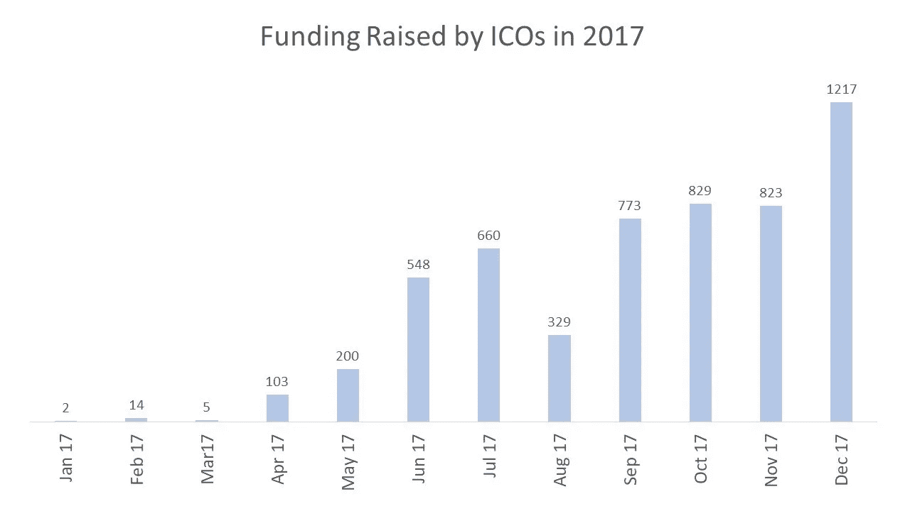
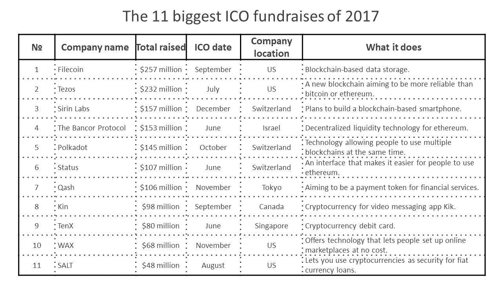
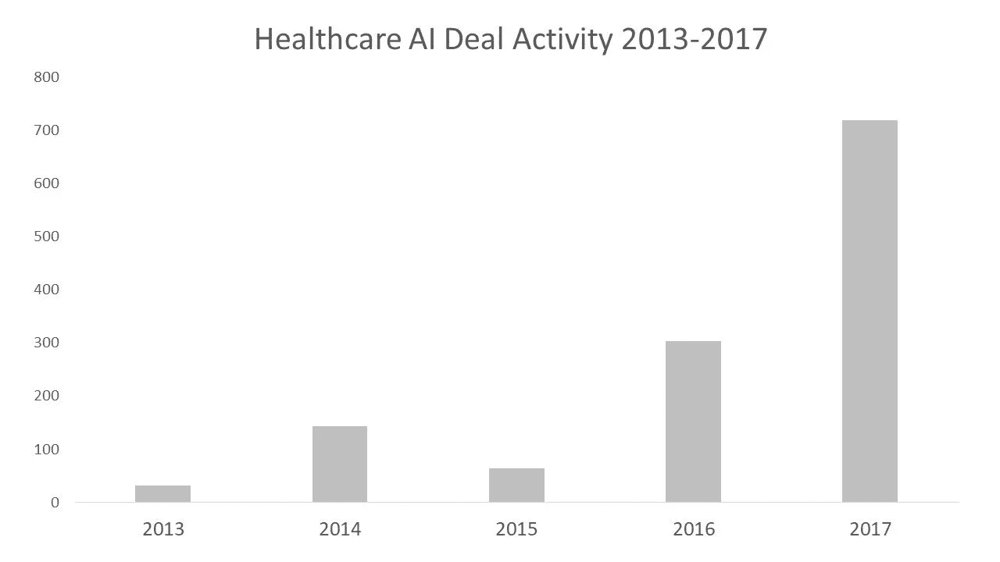

# 技术行业新闻和趋势，2018 年 2 月

> 原文：<https://medium.com/hackernoon/technology-industry-news-trends-february-2018-fb314c8e561c>

二月，冬季的最后一个整月，给我们中的一些人带来了大量的雪，也给我们所有人带来了大量有趣的消息。Airbnb 计划改变旅游业的竞争空间，从简单的公寓共享转变其商业模式，因为它创造了端到端的旅行体验。随着 46%的项目在筹资活动后关闭，ico 似乎对投资者的财务健康有害。区块链在旅游技术领域取得了成功——TUI 和 Travel Ledger 正在利用以太坊平台进行库存管理。我们在 2 月份的《技术行业评论》中介绍了这些产品和其他产品。

# Airbnb 计划征服航空业

Airbnb 逐渐朝着成为端到端旅行解决方案的方向前进。去年，该公司与酒店发展公司合作推出品牌酒店。2 月初， [Airbnb 开放了酒店配送平台](https://www.phocuswire.com/Airbnb-hotel-distribution-launch)。然后，租赁巨头宣布进一步扩展到活动市场，目标是音乐会细分市场。但是现在他们走得更远——Airbnb 首席执行官 Brian Chesky 说他们正在考虑[在他们的服务中增加机票预订](http://www.travelmole.com/news_feature.php?news_id=2031226&c=setreg&region=2)。最有趣的问题是该公司计划如何进入这个市场:他们是否会收购一家在线旅行社，与 GDS 供应商合作，或者直接与航空公司合作。

传统租赁业务之外的扩张并不令人惊讶。该公司寻求额外的收入来源，因此潜在 IPO 的传言可能会在 2019 年成真。如果扩张成功，Airbnb 将成为类似于 Expedia 和 Booking Holdings(例如 Priceline 集团)。Airbnb 战略的变化证实了旅游市场对一体化解决方案需求的巨大转变。航班、酒店和汽车现在有望在一个界面中找到。

# 总部位于以太坊的区块链首次涉足旅游业

今年 1 月，我们说过区块链的初创公司未能颠覆旅游业——迄今为止*。然而，随着春天的到来，区块链有一些萌芽的倡议值得讨论。领先的旅游公司途易集团 [ses 区块链](https://skift.com/2018/02/15/tui-is-relying-on-its-blockchain-to-help-boost-profits/)提高透明度，改善库存管理。途易的问题在于它的组织结构。该公司拥有几个半独立的品牌，因此，它没有一个统一的数据库。TUI 计划使用一个基于以太坊的解决方案来引入智能合同，该合同将统一 TUI 实体之间的数据交换。这可以解决数据治理问题，并可能提高收入管理能力:旅行社将能够在极端需求的情况下在子公司之间交换库存。*

*另一个值得讨论的项目是[旅游账本](http://travelledger.org/)。英国的直觉，澳大利亚的旅游技术，和海豚动力[合作提供](https://www.ttgmedia.com/news/technology/dolphin-dynamics-launches-blockchain-based-travel-ledger-project-13164)一个基于区块链的旅游行业的计费平台。所有支付交易都将被记录并存储在一个分散的数据库中。该平台将使旅行支付更加安全、透明和划算。合作伙伴也将在以太坊技术的基础上建立一个项目。该网络将由开发者建立的非营利组织管理。*

*去年有将近一半的 ico 失败了(我们将在下一节讨论这一点)，但是区块链作为一种数据交换技术可能会成为那些努力实现透明性、一致的数据交换和安全性的大中型组织的战略重点。*

# *46%的 ico 失败了，但也有一些例外*

*News.Bitcoin.com 的研究显示去年 46%的 ico 失败了。投资者在被烧坏的项目上损失了超过 1.04 亿美元。该研究涵盖了放置在 Tokendata 上的 902 家初创公司。ICO 项目通常表现得像骗局:创始人筹集资金后消失。除了彻头彻尾的欺诈，还有数百家僵尸创业公司。这些公司通常有令人质疑的商业理念和不连贯的模式。一旦他们无法围绕他们的项目建立一个强大的社区，这些企业就会选择沉默。目前，大约 12.5%的项目处于半死不活的状态。这种情况可能会导致对 ICO 监管达成更广泛的共识，这将类似于 IPO 程序和证券交易所上市要求。*

**

**Source:* [*TokenData*](https://www.tokendata.io/)*

*另一方面，一些 ICO 代表在 2018 年展示了令人印象深刻的成果。加密信息平台 Telegram 已经在 ICO 前期筹集了 8 . 5 亿美元，并计划在第二次预售期间筹集相应的资金。潜在的电报交易令人震惊。该公司计划获得超过 16 亿美元。值得注意的是，2017 年的 ICO 总量达到 56 亿。Telegram ICO 可能成为迄今为止最大的 ICO。*

**

**Source:* [*Business Insider UK*](http://uk.businessinsider.com/the-10-biggest-ico-fundraises-of-2017-2017-12/#1-filecoin-257-million-11)*

# *IBM 和 Unity 旨在将 AR/VR 技术提升到企业规模*

*IBM 和 Unity [发布了 IBM Watson Unity SDK](https://blogs.unity3d.com/2018/02/20/bringing-the-power-of-ai-to-developers-with-the-ibm-watson-unity-sdk/) ，为 Unity 开发者提供了与[基于云的人工智能服务](https://www.altexsoft.com/blog/datascience/comparing-machine-learning-as-a-service-amazon-microsoft-azure-google-cloud-ai/#utm_source=MediumCom&utm_medium=referral)的轻松集成。Unity 是目前为止 AR 和 VR 应用中应用的领先图形引擎。将它与 IBM 的人工智能能力相结合，该计划将为企业 AR/VR 的使用奠定基础。新的 SDK 提供了强大的视觉和语音识别支持。潜在的用例是语言翻译、语音驱动的交互和实时视觉识别。*

*目前，这些公司的目标是继续在教育和游戏行业开展工作。此外，一旦 AR/VR 技术成熟，它们将在营销、建筑和制造领域得到积极应用。*

*混合现实和人工智能市场预计将快速增长。因此，对于从事复杂可视化工作的公司来说，来自 IBM 和 unity 的新机会是早期采用的一个很好的考虑点。*

# *基于人工智能的推荐引擎将预测最佳服装选择*

*电子商务和零售公司努力实现个性化，这是可接受的客户体验的新标准。像零售 B2B 技术创业公司 Trendage 和美容零售商丝芙兰这样的公司将个性化推向了一个新的高度。*

*Trendage 致力于利用人工智能和视觉搜索的推荐技术。该算法有助于将用户选择的配饰和衣服与其他将服装搭配在一起的物品进行匹配。除此之外，该平台还会分析用户的身体参数、年龄、地区时尚趋势及其变化，从而做出更加具体的预测。目前，Trendage 解决方案使用用户创建的数百万套服装来推荐衣服、配饰和鞋子。该公司本月筹集了 150 万美元的资金。*

*有趣的是，Trendage 并没有在[个性化技术](https://aiukraine.com/wp-content/uploads/2017/10/1_7-Konduforov.pdf)方面提出什么革命性的东西。但考虑到它们使用的新角度，它可能会对现有的服装零售业务产生巨大影响。*

# *人工智能初创公司将使用 2500 万个记录数据集来改进癌症诊断*

*IDG [研究声称](https://healthitanalytics.com/news/cios-plan-to-invest-more-in-ai-predictive-analytics-big-data-tools)43%的医疗保健首席信息官计划明年增加人工智能投资。总体而言，该研究证实，医疗行业技术人员和决策者正在积极讨论数据科学。但是，与健康数据可用性相关的问题大大减缓了该行业的创新。*

*然而，对人工智能医疗创业公司的投资继续增长。比如说，[佩奇。AI](http://paige.ai/) 是一家癌症病理检测初创公司。该公司计划使用 2500 万张诊断幻灯片来训练其机器学习算法。这家初创公司的目标是让癌症诊断更准确、更快速。[佩奇。人工智能解决方案可能非常具有破坏性，因为他们已经收集了大量数据集。项目](http://paige.ai/)[获得了 2500 万美元的首轮](https://beta.techcrunch.com/2018/02/05/paige-ai-nabs-25m-inks-ip-deal-with-sloan-kettering-to-bring-machine-learning-to-cancer-pathology/)融资。*

*医疗保健 AI/ML 资金在 2017 年飙升至 7 亿美元以上，同比增长 126%。最需要的创新是自动化解决方案、计算机视觉、人口健康等。*

**

**Source:* [*PitchBook*](https://files.pitchbook.com/website/files/pdf/PitchBook_1Q_2018_Analyst_Note_AI_ML_Healthcare.pdf)*

# *预订控股公司是 Priceline 集团的新名称*

*Priceline Group [更名为 Booking Holdings](https://www.cnbc.com/2018/02/21/priceline-changes-name-to-booking-ceo-weighs-in.html) 。Booking.com 是集团产品组合中的核心品牌。该子公司生成了超过 100 万个资产，并提供了超过 150 万个资产库存的访问权限。Booking Holdings 的首席执行官格伦·福格尔(Glenn Fogel)表示，新名称将更准确地反映企业的性质。这一步骤也有助于公司提高其品牌知名度。因此，如果您正在从 Priceline Group 寻找旅游 API，请记住，您应该搜索预订信息。*

# *谷歌展示新移动框架的测试版*

*谷歌宣布为移动开发者发布新工具 [Flutter](https://flutter.io/?utm_source=google&utm_medium=blog&utm_campaign=beta_announcement) 的测试版。这是一个新的移动跨平台 UI 框架，允许工程师加快 iOS 和 Android 上的原生界面开发。尽管这个框架还没有准备好稳定的发布，但是它已经在生产应用中使用了。Flutter 要求开发人员使用 Dart，这是作为 JavaScript 的替代产品上市的。类似于 [Xamarin 方法](https://www.altexsoft.com/blog/mobile/the-good-and-the-bad-of-xamarin-mobile-development/#utm_source=MediumCom&utm_medium=referral)，Flutter 在构建阶段将源代码编译成本机代码。*

*这家搜索巨头声称，Flutter 的主要优势是:*

*   *高速的*
*   *富有表现力和灵活性的设计*
*   *本地性能*

*如果您正在考虑选择哪种跨平台移动框架，Flutter 是您的工程团队需要考虑的另一个选择。*

# *一锤定音*

*ico 似乎是一种值得怀疑的技术投资方式，因为 2017 年 46%的区块链创业公司失败了。然而，这项技术似乎是解决商业问题的可行工具。TUI 和 Travel Ledger 就是很好的例子:TUI 使用它来改善数据管理和信息交换。Travel Ledger 致力于安全透明的支付。*

*这些项目证实，可行且有价值的区块链项目远远超出了被夸大的加密货币领域。以太坊为这两个项目提供动力。对于这项技术来说，这是一个好兆头，因为关键参与者的信任将提高行业兴趣，并将采用率提高到一个新的水平。*

*不管失败与否，ICO 作为筹资方式继续创纪录。Telegram 创造了 cryptoinvest 历史上最大的 ICO 回合。*

*喜欢这个故事吗？帮助更多的人找到它！👏👏👏
原载于 AltexSoft 的博客:*[*科技行业动态&2018 年 2 月*](https://www.altexsoft.com/blog/business/technology-industry-news-trends-february-2018/#utm_source=MediumCom&utm_medium=referral)**