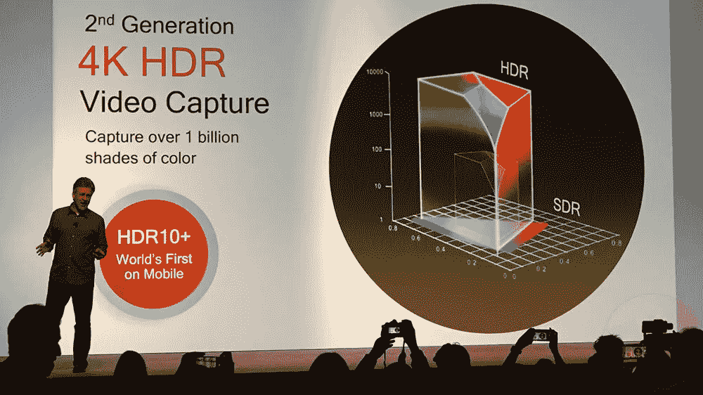

# 技术遇上真货:高通的骁龙 855 和骁龙 8cx

> 原文：<https://medium.com/hackernoon/technology-meets-the-real-deal-qualcomms-snapdragon-855-and-snapdragon-8cx-bbec5458e017>

自从第一次发布以来，高通就一直征服着智能手机和机器人的世界。智能手机处理器的演变一直都是通过高通骁龙之手。不仅是智能手机，它还将许多现代技术推向了一个新的高度。现在，高通骁龙正借助最新的骁龙处理器——骁龙 855 和骁龙 8cx，迈向 T2 技术的未来。

先说说**骁龙 855**……..

首款支持 **5G 的处理器。**简单解释 5G，它是 4G 的继任者，承诺提供高达 **20 千兆位每秒** (Gbps)的不间断高速互联网。骁龙 855 提供可转换的 5G 体验。 ***它是全球首款 5G 毫米波和 6 GHz 以下移动解决方案，也是全球首款 2 Gbps LTE 调制解调器，包括全球首款 7x 载波聚合和全球首款 14nm 射频芯片*** 。它配有高通骁龙 X50 调制解调器。

虽然 snapdragon 855 不会内置 5G 调制解调器，但它将使用外部调制解调器来支持 5G。

骁龙 855 的性能由 **Kryo 485 CPU 提供动力。**基本上，我们的八核处理器拥有四个高性能内核和四个高能效内核。但是这次的核心分布有所不同。它有一个主内核，时钟速度高达 2.84 GHz，三个性能内核，时钟速度高达 2.42 GHz，四个效率内核，时钟速度高达 1.80GHz。这些内核可在多线程或多任务处理的情况下提升性能。当有任务需要尽快结束时，或者如果有单线程任务，那么主内核可以更容易地解决这个问题，因为与其他内核相比，它具有更高的时钟速度和更多的高速缓存；当有多线程任务时，它将使用高性能内核来提升性能，我们还拥有高能效内核来提升多任务处理性能。

在 GPU 的情况下，它也不落后。它拥有最新的 Adreno 640 GPU。它承诺与以前的 snapdragon 处理器相比，性能提高 20%。凭借下一代 Adreno 640 GPU、 **Vulkan 1.1(首个移动游戏)**、 **HDR 游戏(首个真正的移动 HDR 游戏)**，以及基于物理的渲染，实现了移动上的精英游戏。它承诺促进基于物理的渲染，因此对象被重新创建以模仿现实生活中的外观、感觉、深度和材料，呈现极其真实、深度的视觉效果。它还将为您提供长时间的稳定性能，同时游戏和应用程序启动时间也将减少。

高通骁龙 855 的人工智能引擎还包括**高通 Hexagon 690 处理器**，高通 Hexagon 矢量加速器，高通 Hexagon 张量加速器，高通 Hexagon 语音助手，高通全向感知技术。神经网络或神经处理形成了每个人工智能处理器的主干，对于 snapdragon 也是如此，与之前的处理器相比，高通 Hexagon 690 处理器提升并改善了神经处理。它拥有第四代人工智能引擎，配备张量加速器。它提升和改善了智能手机中所有基于人工智能的活动和安全性的性能。

**全球首款 HDR10+移动视频捕捉和回放功能，可拍摄对比度和细节更高的图像。世界上第一个具有肖像模式(散景)的 4K HDR 视频捕捉，因此您可以拍摄电影级视频。**

**世界上第一个计算机视觉 ISP (CV-ISP)提供实时对象识别、分割和替换，允许用户实时隔离和交换背景和对象。**它配备了双 14 位 CV-ISP、计算机视觉硬件加速器(CV-ISP)、**高通光谱** 380 图像信号处理器。它有助于在更短的时间内更高效地点击高质量的照片。这里更少的时间意味着，当你点击一个高质量的图片时，你需要在点击后拿着相机一会儿，以获得完美的图像。但是随着**计算机视觉 ISP** 的推出，时间缩短了，你可以在点击后立即获得高质量的图片，并且电池消耗低。它还支持 10 位颜色深度视频捕捉和高达 720p、480fps 的慢动作视频捕捉。它还提供基于硬件的电子图像稳定解决方案和相机子系统。

借助这款处理器，我们将能够全面提升智能手机在游戏、娱乐、互联网连接和安全性方面的性能。有人猜测，小米 Mix 3 5G 版和一加 6T 可能会在 2019 年采用骁龙 855 处理器。

现在让我们看看**骁龙 8cx………**

该处理器也被称为**有史以来最极端的 snapdragon】。这款处理器是专门为 windows 10 打造的，而且只针对 PC。虽然高通开发骁龙只是为了移动平台，但它的旅程也是为了征服个人电脑和笔记本电脑的世界。对于那些不知道高通在个人电脑和笔记本电脑世界的旅程的人，请[点击这里](/@basu369victor/could-qualcomm-snapdragon-conquer-the-market-of-pc-and-laptop-processors-7f77fdd5b76f)。这也是我的出版物之一，我希望你会喜欢这篇文章，它会帮助你了解更多的技术世界。**

骁龙是世界上第一个用于个人电脑的 7 纳米芯片。有 Kyro 495，Adreno 680 和 Hexagon 690 用于 GPU 和 CPU，它允许 2 倍的图形和 2 倍的 4K 显示器。Adreno 680 比上一代产品快 2 倍，比骁龙 850 移动计算平台中的 GPU 效率高 60%。这些 GPU 组件提供了卓越的移动 PC 性能，而不会不必要地影响电池寿命。Kryo 495 采用八核 CPU 设计，具有更大的 L2 高速缓存、L3 高速缓存和系统高速缓存。更多的缓存是可用的，所以它将平滑的多任务活动。

它还拥有 Spectra 390 和骁龙 X24 调制解调器(世界上第一个宣布支持 20 类 LTE 的调制解调器，速度高达 2.0 Gbps。).集成的骁龙 X24 调制解调器还允许 90%以上的全球运营商获得千兆速度。它支持超高速的第二代 USB 3.1，借助第三代 PCI-E，您可以获得无限的外围设备和快速存储。骁龙 8cx 支持双 4K HDR 显示器和尖端的高保真音频。内置高通 Aqstic 音频编解码器和高通 aptX HD 编解码器。它还支持高通快速充电 4+技术，这意味着您可以快速恢复供电，恢复工作效率。它还确保了高电池寿命。

**永远在线、永远连接的电脑通过其类似智能手机的 LTE 连接能力赋予了一类新的用户体验。**骁龙 8cx 还支持 4X4 MIMO 和 7X 载波聚合，与竞争对手的解决方案相比，在边缘、弱环境或拥挤环境下的吞吐量提高了 70%

这种处理器肯定会给英特尔和 AMD 带来强有力的竞争。该处理器最显著的改进是，它可以在轻薄、无风扇的设计中带来高性能，并且以节能的方式提高用户的性能，从而延长系统的电池寿命。

高通的骁龙将给科技世界带来许多进步，同时也将唤醒智能处理器竞赛中的另一个竞争者。高通的骁龙会以其世界第一的头衔在科技领域占据上风，还是很快会被其他公司夺走？在那之前，让我们看看人们会如何接受拥有世界第一头衔的最新高通骁龙处理器。

# 请在下面评论，让我知道你对这个话题的看法