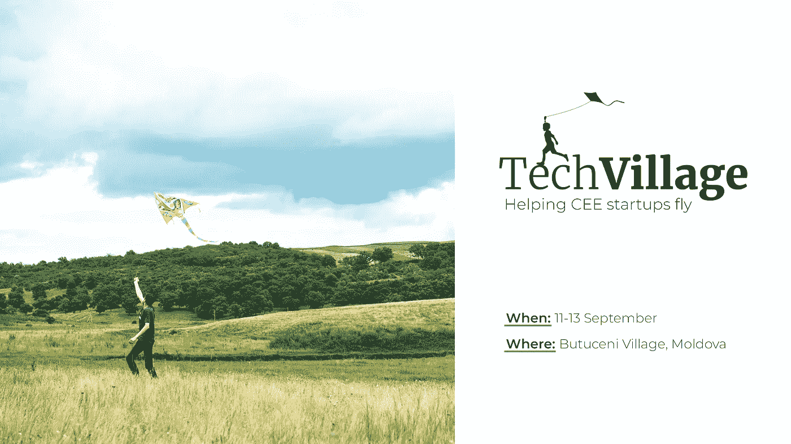
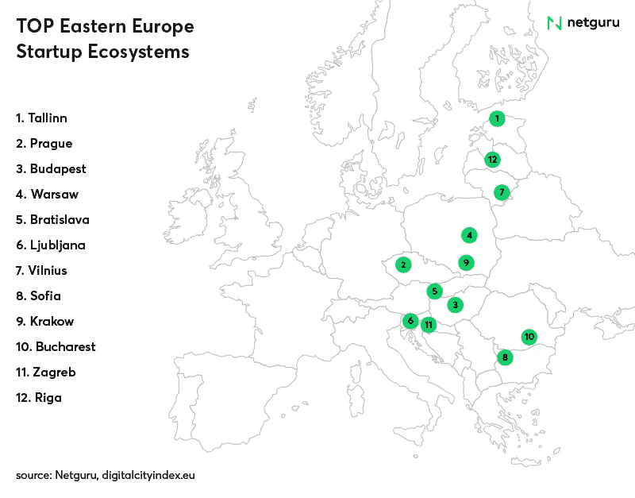
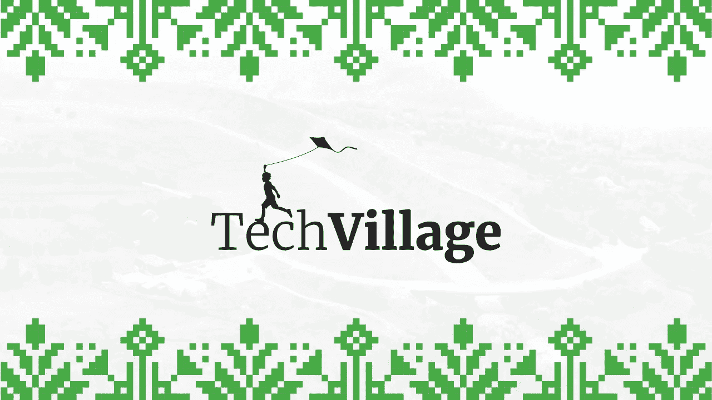

# 集体潜力超过 1 亿美元的 50 个国际投资者将来到摩尔多瓦的技术村

> 原文：<https://medium.com/hackernoon/techvillage-2018-in-moldova-3ab2a421cfe0>

techvillage.md

九月，摩尔多瓦点亮了全球创业地图。50 名国际投资者将在摩尔多瓦的一个小村庄 Butuceni 会见来自摩尔多瓦、乌克兰和罗马尼亚(RUAMD 地区)的 50 家初创企业。在 9 月 11 日至 13 日的三天时间里，布图塞尼将成为一个独特的创业活动 TechVillage 的举办地。

TechVillage 将发生在大自然的怀抱中，一个乡村环境中。这是一个注重质量而非数量的小型活动，面向厌倦了传统会议、推介比赛和商业论坛的投资者和初创公司。但是为什么是摩尔多瓦？为什么是现在？

# 所有的眼睛都看着东方

乍一看，摩尔多瓦、罗马尼亚和乌克兰并不是值得关注的热门科技创业中心。这些国家更多地与后苏联心态、中世纪教堂和糟糕的道路联系在一起。然而，在过去的几年里，他们的创业场景已经发生了变化，现在显示出真正的潜力。就在 10 年前，整个中东欧地区还不在科技投资者的关注范围内。但在 Skype、Prezi、TransferWise、Avast 等产品成功之后；以及该地区众多小型创业中心的突然增长，中东欧开始崭露头角。

# 乌克兰、罗马尼亚和摩尔多瓦的创业生态系统

乌克兰人已经在硅谷留下了他们的足迹，参与了像 [Whatsapp](https://www.whatsapp.com/) (简·库姆) [Paypal](https://www.paypal.com/us/home) 和 [Affirm](https://www.affirm.com/) (麦克斯·拉夫琴)这样的巨头的发展。乌克兰的外包业务在过去几年里呈指数级增长，至少有 20 万廉价的技术专业人员。乌克兰 IT 部门在全国 GDP 中的份额在短短 5 年内从 0.06%增长到 3.3%，增幅高达 5500%。它很快将成为乌克兰最大的外包产业。今天，超过 100 家大公司，如三星、波音、西门子和甲骨文都在乌克兰。乌克兰可能会接近独角兽级别的公司，如 [Grammarly](https://www.grammarly.com/) 、 [bpm on-line、](https://www.bpmonline.com/)Genesis、 [Readdle](https://readdle.com/) 和 [Jooble](https://ua.jooble.org/) 。

在街对面的罗马尼亚，科技行业有自己值得骄傲的后代——BitDefender 和 T2 soft。罗马尼亚创业工厂的一个成功案例是 [Clever Tax](https://www.clevertaxi.com/) i，成立于 2010 年，目前在罗马尼亚拥有超过 17，000 名司机和超过 600，000 名客户。考虑到当地的市场规模，这些数字是巨大的。根据[欧洲数字城市指数](https://digitalcityindex.eu/)，布加勒斯特是中东欧十大最佳创业城市之一。

# RUAMD 的资助场景

长期以来，东欧的一大劣势是不发达和分散的融资环境。但是事情正在改善。

2016 年，一系列罗马尼亚初创公司获得了资助:

*   电子商务——550 万欧元
*   [Omniconvert](https://www.omniconvert.com/) (A/B 测试)——100 万欧元
*   [智能账单](https://www.omniconvert.com/)(账单)——100 万欧元
*   智能梦想家(招聘)——70 万欧元
*   [购物支付](http://symphopay.ro/)(智能 POS) — 60 万欧元

其他一系列在国外推出的罗马尼亚初创公司也获得了大量资金: [Databricks](https://databricks.com/) (美国，6000 万美元) [Branch Metrics](https://branch.io/) (美国，3500 万美元) [Midokura](https://branch.io/) (美国，2000 万美元) [Knotch](https://www.knotch.it/) (美国，1000 万美元) [Vector Watch](http://vectorwatch.com/) (英国，500 万美元)[大步](https://bigstep.com/eu/)(英国，220 万美元)[StatusToday【t33](https://www.statustoday.com/)

在乌克兰，[avenues](http://aventurescapital.com/)、 [TA Ventures](https://taventures.vc/) 、 [Wannabiz](http://wannabiz.com.ua/) 和 [Imperious](http://imperiousgroup.com/en/) 等风投基金看到了机会，决定利用地缘套利，从而帮助乌克兰企业家成为顶级企业家。根据 UVCA 对乌克兰投资和私人资本的研究，2015 年总投资价值达到 1.32 亿美元，比 2014 年增长了 237%。

相比之下，摩尔多瓦在投资方面仍有很多需要追赶的地方。没有本地基金可言，外国投资者不知何故有些胆怯，或者根本没有意识到这种可能性。摩尔多瓦是一个发展中国家，市场尚不发达，创业投资量低。然而，在过去的几年里，40 家摩尔多瓦初创企业总共获得了 100 万美元的资金。一些比较成功的是 [xor.ai](https://www.xor.ai/) 、 [Planable](https://planable.io/) 、 [Gaus](http://gaus.live/) 、 [nemo.ai](https://visely.io/#) 和 [BubbleWits](https://bubblewits.com/) 。为了能够发展处于萌芽阶段的创业生态系统，摩尔多瓦需要能够激励年轻一代成为企业家的成功故事。

# TechVillage 如何填补空白

增长是目标，只有通过在创业公司和投资者、中心和加速器之间建立真正的、持久的合作才能实现。谈到创业，摩尔多瓦的杯子是半满的，当地社区正在往里面倒更多的水——实际上是葡萄酒，如果你不知道的话，摩尔多瓦拥有两个世界上最大的酒窖和葡萄酒收藏..一群积极进取的社区领袖决定组织一次前所未有的活动，将 50 名集体投资潜力为 1 亿美元的外国投资者和 50 家摩尔多瓦、罗马尼亚和乌克兰的初创企业聚集在一个真正的摩尔多瓦村庄，为期三天。

techvillage.md

TechVillage 的最终目的是向欧洲各地的投资者、加速器和社区领袖展示中东欧创业公司的潜力，同时为中东欧的外国投资创造一个友好的环境。然而，除此之外，该活动还旨在为摩尔多瓦技术市场带来价值，并促进 Butuceni 村的发展，这是一个距离摩尔多瓦首都基希讷乌 30 分钟车程的小村庄。布图塞尼因其风景而闻名，这是一个传统被及时保存下来的地方，这就是为什么这个村庄是逃避日常繁忙的最佳去处。整个活动预算将注入布图塞尼企业家提供的服务和产品中。

在三天的时间里，参与者将参加各种农村活动，旨在建立有意义的联系和潜在的合作，同时熟悉摩尔多瓦文化。该活动是一种非会议类型，关注参与者之间的互动，而不是听演讲和小组讨论。[活动门票](http://techvillage.md/tickets)创始人低至€249，投资人低至€399，包含住宿、当地交通、餐饮及 3 天停留的所有活动。为了确保创业公司和投资者之间的良好匹配，所有参与者在付款前都将经历一个选择过程。

要了解更多关于科技村的信息，请在[脸书](https://facebook.com/techvillage.md)和 [Instagram](https://instagram.com/techvillagemd) 上关注他们，并查看他们的[网站](http://techvillage.md)。