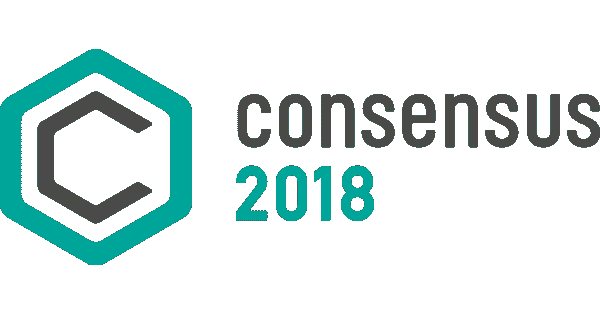

# Consensus’18 上的构造变化

> 原文：<https://medium.com/hackernoon/tectonic-shifts-at-consensus-18-561754d4c037>

纽约的 2018 年共识充满了惊喜。

与会者中数量惊人的秘密基金——包括我自己——不在其中。

安全令牌初创公司和 ico 大量涌现，抓住机会将“加密经济学”的好处带到传统金融世界，并为现在涌入加密市场的不可避免的机构资金洪流做好准备。

这些都不令人惊讶。

令人惊讶的是，这一切都与加密技术本身的状态以及我们作为投资者对它的集体态度有关。

简而言之:科技和社区领袖已经不再向投资者展示这个空间是一个快速致富的计划。也是时候了。

投资者会记得，就在今年 1 月，由自称“连续创业者”的人在以太坊上构建的终端用户 DApps 还随处可见。BTC 迈阿密实际上是一个狂欢节，奖励代币和区块链艺术展以及分散的 YouTubes 在营销活动上花费了数百万美元，并筹集了数百万美元。

每个人都想成为下一个杰夫·贝索斯。一切都像是骗局。

令人欣慰的是，共识反映出我们从那以后都冷静了一点，并意识到这项技术最大的增长潜力是在长期，而不是短期。

大会在保持热情的同时，抑制了我们的过度期望。它通过精心挑选的 ICO 展位和技术含量高的战略性讲座，以微妙但有效的方式重新定位与会者的视角。

以下是我注意到的一些迹象，它们让我感受到了加密社区正在发生的深刻变化。(以上当然是我自己的个人解读。你可以不同意我的推理):

1.面向普通消费者销售的 ico 要少得多。

出席 Consensus 的大多数初创公司似乎都倾向于为开发者或企业家提供某种服务，以帮助加速或孵化初创公司的发展。

这些是下一层的**中间件**平台，它们的成功或失败将允许加密业务模式的下一次演变:“网关”业务，其目的是将无经验的用户/投资者无缝地带入加密领域。

想想微软、IBM 和德勤设立的大型展台，它们都提供“打造自己的区块链”的服务。

普遍的感觉是，任何人都可以构建一个[区块链](https://hackernoon.com/tagged/blockchain)应用程序——而且，如果他们需要帮助来发展他们的网络，一个蓬勃发展、竞争激烈的咨询和战略市场就在那里。“建起来，他们就会来”——自[比特币](https://hackernoon.com/tagged/bitcoin)以来这个行业的*惯用手法*。

2.尽管经历了一月份的崩盘，但没有人准备或愿意放弃工作证明。至少，没有我预期的那么多，考虑到该行业最近走向利益证明(PoS)的轨迹。

上个月，EOS 一周内从 3 美元攀升至 20 美元；Vitalik Buterin 继续公开指责以太坊没有他提议的 PoS hardfork 就无法扩展，他仍在努力；卡尔达诺仍然是业内领先学者最期待的项目之一。所有这些都是非常明显的迹象，表明人们正在寻找他们可以信任的工作证明。

也不是白来的。看一眼 BTC 在 blockchain.info 上的 block confirmations，你就知道你需要知道的一切:5 个矿池执行了比特币网络上几乎所有的确认。以太坊也好不到哪里去。这就是工作证明的作用。把整个企业的诚信交到这么几个矿工手里，哪个严肃的企业会心安理得？

然而，Blockstack 和 DCI 等行业领导者并没有试图引导行业走向更新、更可持续的共识算法，而是推出了一个非常出人意料的位置:他们同意，没有一个可行的第 2 层解决方案，*没有*区块链——PoW 或 PoS——应该可持续地执行网络的所有功能。

换句话说，一个可扩展、可持续、低成本的区块链网络离不开圆滑的二层协议(oracle 链、二层交易网络等。)来协调网络最劳动密集型的活动链外。

为此，比特币新提议的 RSK 智能合约层有望将交易速率从 6 万亿次提高到 100 万亿次以上，然后——如果展位上的人告诉我的是真的——超过 2 万万亿次。如果属实，这将使比特币交易与 Visa 交易处于同一数量级，并将允许多工具智能合约应用程序可持续运行。

此时我们应该问自己的问题是:

这最终会让比特币成为一种有竞争力的支付方式吗？

这对目前支持它的矿池的力量意味着什么？

有这么多投资者，矿池甚至有兴趣攻击网络吗？

有这么多潜在的使用案例和经过验证的可靠性，用户会关心谁是幕后黑手吗？

不管怎样，这看起来像是工作的证明，特别是比特币，在他们面前还有很长的进化路要走。

出于同样的原因——当然，这不是一句双关语——最终用户应用仍有很长的路要走，与此同时，通过帮助它们实现，仍有大量的商业和投资机会。

与此同时，希望世界各地的其他公约能够效仿 Coindesk 的共识，并认识到他们在帮助世界将这一领域重新想象为一项严肃的长期投资方面的作用。