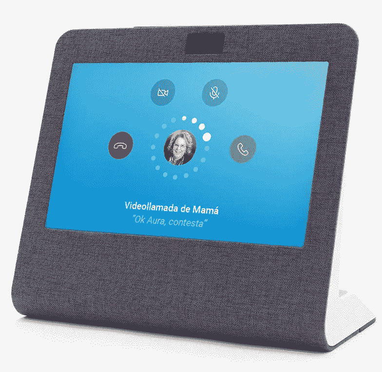

# 电信运营商想在家庭操作系统大战中一战

> 原文：<https://medium.com/hackernoon/telco-operators-want-to-fight-in-the-home-os-wars-5dc8066c9e72>

## MWC 2018 已经围绕语音助手、智能家居和家庭操作系统之战(如 Telefonica 的 Aura)发布了几项声明。

[移动网络大会](https://www.mobileworldcongress.com)每年都聚集[电信行业](https://hackernoon.com/tagged/telco)来展示新产品和计划(其中一些从未真正进入市场)。今年，电信公司和谷歌等互联网公司发布了几项公告，与我正在进行的家庭操作系统领域的[分析相关。我将特别关注](https://hackernoon.com/how-amazon-is-winning-the-battle-for-the-home-operating-system-d794ab48fb82) [Telefonica 围绕其“认知智能”解决方案光环](https://www.reuters.com/article/us-telecoms-mobileworld-telefonica/telefonica-launches-aura-voice-assistant-in-six-countries-idUSKCN1G90KX)发布的公告；但相关方面还将是[沃达丰与 V-Home](https://www.telecompaper.com/news/vodafone-samsung-launch-european-smart-home-product-portfolio--1233546) 联合三星的 SmartThings 在智能家居中的应用，以及谷歌通过其[助手载体程序](https://www.blog.google/products/assistant/google-assistant-going-global/)在谷歌助手中的运营商特定功能。

# 西班牙电信的光环:助手还是“技能”？

Telefonica 的声明集中在他们的语音助手 Aura 上。Aura 将允许管理运营商服务:主要是围绕计费或找出本月你的资费中剩余的数据，但在西班牙，它也将提供运营商电视节目的节目信息。其他运营商过去也发布过助手，比如 Orange 的 Djingo，但是 Telefonica 的 Aura 已经在它的六个市场推出。

要访问该助手，在阿根廷或英国等一些国家将提供特定的应用程序，但在德国或智利等其他国家，该功能将通过 Facebook Messenger 或谷歌助手提供。

在介绍 Aura 的过程中，西班牙电信坚持其开放的方法，认为 Aura 的开放性的一个证明它可以在谷歌或脸书的平台上使用。

但考虑到演示视频中看到的行为，Aura 实际上应该是一个[“谷歌行动”](https://developers.google.com/actions/)，谷歌生态系统中的第三方应用程序，而 Facebook Messenger 中的[则是一个机器人](https://developers.facebook.com/docs/messenger-platform)。这意味着 **Aura 实际上通过在脸书和谷歌的开放平台上工作来利用它们**。

这就是谷歌宣布他们的助理运营商计划变得相关的地方。谷歌是这样介绍的:

> 我们的 Assistant Carrier 计划帮助移动运营商使用 Assistant 中的功能，为他们的客户提供对其服务的更多洞察和控制。**这包括帮助人们更多地了解他们的计划、添加新服务(如国际数据漫游)、获得客户支持等**。这为运营商提供了一种新的方式来支持他们的客户，同时减少响应时间。

谷歌提供给运营商的功能，不需要调用特定的动作，与 Aura 目前提供的功能非常相似。因此**我的期望是，西班牙电信最终也会进行这种整合，Aura 的身份将隐藏在谷歌助理的体验中。**

我还发现非常有趣的是，Aura 的声明没有包括家庭操作系统战争的[当前主要玩家:亚马逊](https://hackernoon.com/how-amazon-is-winning-the-battle-for-the-home-operating-system-d794ab48fb82)。特别是考虑到西班牙电信(通过其英国品牌 O2)已经通过 Alexa 技能提供类似光环的功能:

我想这有两个原因:

*   Alexa 与 Telefonica 的大部分市场无关，因为它只在其中两个市场有售:英国和德国(尽管 Aura 在这六个市场中有两个市场有售)。
*   要展示 Alexa 很难，更不用说他们的主要交付渠道:Echo 设备。当西班牙电信公司宣布他们自己的联网扬声器:Movistar Home 时，这可能会造成混乱。

# Movistar Home:西班牙电信的回声节目

一个令人惊讶的消息是西班牙电信推出了他们自己的设备来支持他们的助手[Movistar Home](https://aura.telefonica.com/movistar-home)。

同样，其他运营商此前也发布了智能扬声器，如 [Orange 的 Djingo](https://www.orange.com/en/Human-Inside/SH2017/Djingo-your-multi-service-virtual-assistant) 或[德国电信的 Hello Magenta](https://www.telekom.com/en/media/media-information/consumer-products/with-smart-speaker-your-home-listens-to-your-command-508276) ，但 Telefonica 的方法带有屏幕(这让我想起了 Telefónica 过去在联网设备领域的另一次尝试: [O2 Joggler](https://en.wikipedia.org/wiki/O2_Joggler) )。这使得该设备更类似于[亚马逊 Echo Show，](https://developer.amazon.com/echo-show)并允许该节目的主要功能之一:视频通话。

该产品尚未上市(预计今年秋季上市)，但根据提供的信息，Movistar Home 功能将包括:

*   Aura 提供的相同的“公用事业账户管理”功能:检查您的运营商账单、数据消耗、充值能力等。
*   电视内容管理，包括打开电视、通过语音切换频道和录制节目。
*   一些智能家居功能(只提到开灯)。
*   通信:通话和视频通话。

# Movistar 主页中的通信

西班牙电信正试图通过一种新设备夺回他们的一项基本服务(“通话”)，Movistar Home 作为固定电话线路的重新发明的方式引起了有趣的共鸣。

亚马逊为 Echo 扬声器提供的[Echo Connect accessory](https://www.amazon.com/Echo-Connect-requires-service-smartphone/dp/B076ZRFP6Y)已经涵盖了让智能扬声器成为固定电话免提选项的想法，但 Movistar Home 承诺了一些有趣的差异化功能:

*   将常规的语音通话变成视频通话。
*   将视频通话转移到电视上。
*   将正在进行的通话从 Movistar 主页转移到手机。

目前还不清楚这些具体功能将如何工作，我对一些开放性的问题特别感兴趣(视频电话将如何转移到手机上？它需要一个特定的应用程序还是会有一些设备限制？我可以将呼叫发送到任何手机，还是只发送到范围内的一部手机？如何识别设备？会有以前的注册吗，会给他们分配一个名字吗？)但是其中一些功能，在跨家庭通信的背景下(例如，祖父母与孙子孙女视频通话),似乎是传统固定电话线路的有趣复兴。

此外，如果 Movistar Home 支持的话，能够使用语音命令触发紧急呼叫(如果设备开放提供自己的 accesory 生态系统，还有其他选择)对老年人来说可能非常有用。

# 智能家居问题

目前可用的信息无助于理解 Movistar Home 将在多大程度上帮助提供智能家居的控制元素。是的，视频显示了用于开灯和关灯的设备，但哪些设备是兼容的？Movistar Home 会像亚马逊 Echo Plus 那样包含某种中枢吗？还是该设备只链接到某个特定的提供商 API(比如[飞利浦 Hue](https://www.developers.meethue.com) 的那个)？有太多关于将使用扩展到更多设备的策略或创建智能家居策略的问题。

已经拥有某种智能设备的用户可能已经有了控制它们的解决方案，因此 Movistar Home 的优势尚不清楚。收购智能音箱后购买更多联网设备的动力并不明确。亚马逊也面临着同样的问题，这就是为什么他们的 [Echo Plus 选项不仅包括一个智能家居中心，还增加了一个飞利浦 Hue 灯泡](https://www.amazon.com/Echo-Plus-built-Hub-included/dp/B075RWFCHB)，这样它就可以让用户进入联网设备领域。

这也是为什么我觉得[沃达丰跟 V-Home](http://www.vodafone.com/content/index/media/vodafone-group-releases/2018/Vodafone-and-samsung-strategic-partership.html) 玩的挺有意思的。沃达丰正在提供一套设备(安全摄像头、烟雾探测器、漏水传感器、智能照明和智能加热)，这些设备通过一个家庭中枢(三星 SmartThings Wifi 中枢**)、一项报警系统服务和视频安全记录的云存储来管理。**

# 运营商的优势

在这个领域，提供智能家居套件并为其提供支持，我认为运营商在家庭操作系统中有机会。

因为像沃达丰和西班牙电信这样的运营商不仅为客户提供计费渠道和连接。他们还训练有素的人员到客户家中安装光纤或 DSL 线路所需的连接和设备。因此**为其设置和使用提供套件和支持可能是阻碍智能家居在一些市场普及的关键因素。**

将 Telefonica 的 Aura/Movistar Home 方法与沃达丰的 V-Home 相结合，我们可以看到客户从支持助理的扬声器中获得更多价值，这种扬声器允许他们通过连接的恒温器和智能照明来管理他们的家庭环境，智能照明也是由他们的运营商提供和安装的。这可以作为一种忠诚化工具，因为如果客户不清楚这将如何影响他们控制家庭照明或温度，他们会变得更加谨慎地更换提供商，并且**为运营商开辟了一条道路，使其成为客户的最终公用事业提供商**。

# 运营商的劣势

但用 Movistar Home 这样的运营商专用设备来支持它会让创建这种生态系统变得更加困难。

Telefónica 可能很快会在西班牙语市场和巴西推出，这可以给他们带来优势，而亚马逊或谷歌还没有在那里销售他们的设备。但他们最终会的，当亚马逊登陆西班牙时，它将得到他们的支持[超过 15，000 项 Alexa 技能](https://techcrunch.com/2017/07/03/amazons-alexa-passes-15000-skills-up-from-10000-in-february/)已经可用，全球超过 4000 万台设备具有潜在的网络效应。

**联网设备的价值不仅仅在于它的可用性，还在于它能够创造一个生态系统，在这个生态系统中，开发人员希望通过应用程序和新的关联设备来提供附加价值** 。像 Movistar Home 这样的运营商专用设备在这方面有局限性:

*   它**减少了用户群的潜在覆盖面**,因为大多数运营商最多覆盖特定市场的 40 %- 50 %,通常要少得多。
*   它**提供了一种人为的细分**,因为您只能接触到那些也拥有该设备的运营商客户。这并不一定适合开发者应用的任何目标受众。
*   它**减少了网络效应** ( [如果智能音箱市场有网络效应这种东西](https://twitter.com/benedictevans/status/957876664855281665?lang=en))。亚马逊正试图通过 [Alexa 呼叫和信息服务](https://www.amazon.com/b?node=16713667011)创造上述网络效应，Movistar 的视频呼叫功能也是如此……但在这两种情况下，它都要求通信双方都是网络的一部分。在亚马逊的情况下，这可以通过购买 Echo 设备来解决，但对于 Movistar Home，它不仅需要购买设备，还需要成为 Movistar 的客户。其他为该设备开发并依赖于 netwok effects 的应用程序也将受到同样的限制。

最重要的是，要让[开发者](https://hackernoon.com/tagged/developer)参与进来，一个关键因素是提供良好的开发程序和工具来为设备创建应用程序。亚马逊有一个[计划，奖励为他们的 Alexa 生态系统培养技能的开发者](https://developer.amazon.com/alexa-skills-kit/rewards)。西班牙电信能为 Aura 和 Movistar Home 做类似的事情吗？

当开发者决定是否为亚马逊 Alexa、谷歌助手或 Aura 创建应用程序时，他们会考虑所有这些因素(这总是一个决定，因为开发应用程序的资源总是有限的)，在这种情况下，以运营商为中心的产品将很难生存。

# 合作而不是竞争

因此，虽然我认为 Movistar Home 是扩大运营商服务潜在语音控制功能意识的一个伟大举措，也是发展固定通信的一个伟大举措，但我认为这将促使其他运营商(如沃达丰)通过他们的渠道推出通用设备，并试图利用现有的生态系统支持类似的功能。

**我希望像沃达丰这样的人开始销售亚马逊 Echos 和谷歌家园，并通过这些设备中的技能提供对他们服务的访问。**

但是，如果运营商也能成为智能家居的推动者，他们仍然有机会，他们可以基于以下因素严重影响家庭操作系统大战:

*   帮助他们的客户获得和连接更多的智能家居设备，充分利用他们的家庭安装人员。
*   排他性或优先伙伴关系方法，这将优先考虑一个发言者或另一个。
*   将他们的服务和通信产品链接到这些设备的能力(即，提供视频通话和移动到电视功能，但在任何连接的扬声器之上)。

因此，我们最终可能会看到 Telefonica 的光环在亚马逊 Echo ( [我们今天有点这样做](https://www.o2.co.uk/help/digital-services/my-o2-alexa-skill))或谷歌 Home 上工作，而不仅仅是在 Movistar Home 上。但是，在更多的设备上展示这些功能，并在“客户的最后一英里”中利用它们的一些独有优势，可以将它们变成家庭操作系统中非常重要的角色。