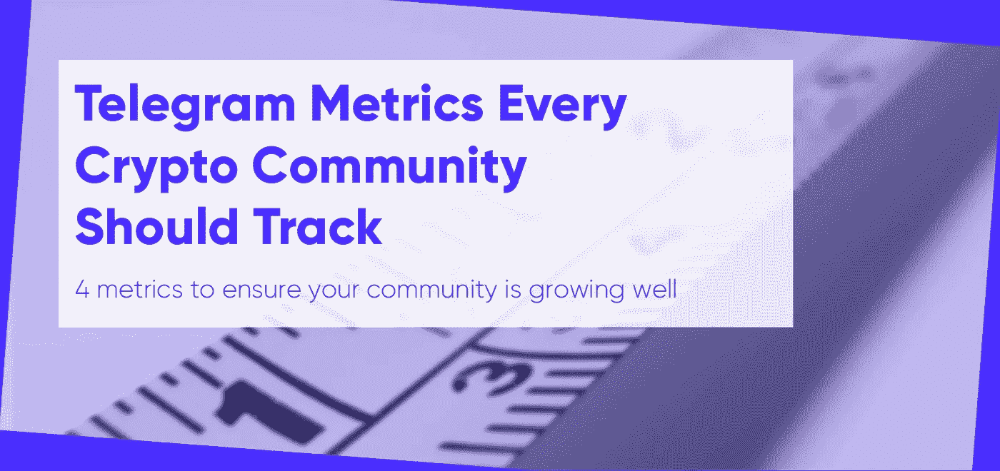
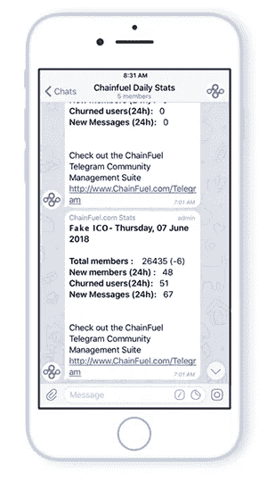
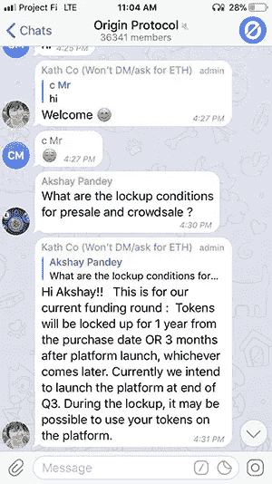
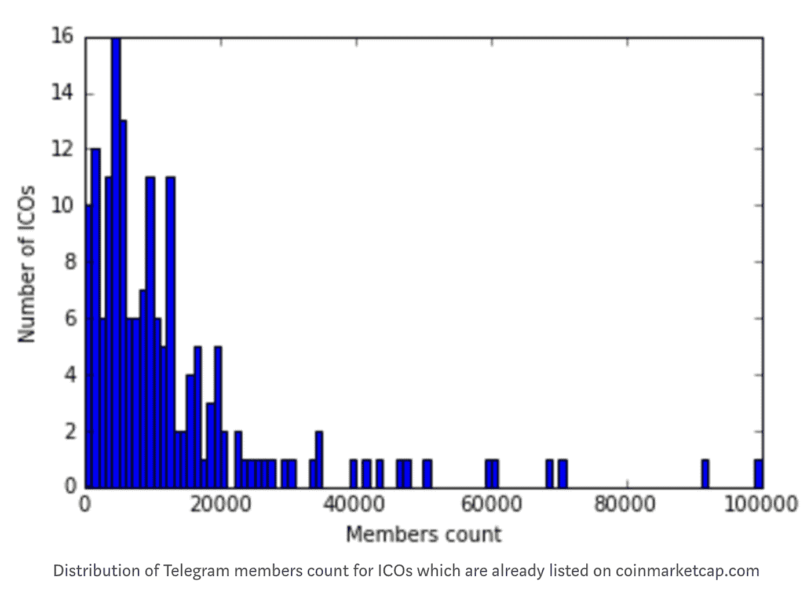

# 每个加密社区都应该跟踪的电报指标

> 原文：<https://medium.com/hackernoon/telegram-metrics-every-crypto-community-should-track-2e345d548fc7>

*安装* [*Chainfuel 的免费电报分析、反垃圾邮件和参与机器人*](https://www.chainfuel.com) *，你可以在* [*Chainfuel 博客*](https://www.chainfuel.com/blog) *上找到关于建立和运行一个成功的密码社区的有用资源。*

如果你衡量你的[电报](https://hackernoon.com/tagged/telegram)渠道，你就增强了它的增长潜力。度量是衡量您的加密项目的性能，应该每天测量。

与社区保持同步使您能够辨别趋势，保持策略的敏捷性，并操纵您的项目走向成功。相比之下，忽略这些数据点会让你盲目。使用您的指标来制定最佳决策，并引导您走向成功的 ICO。

要访问这些数据，你需要一个电报分析机器人。 *(Chainfuel 在这里提供免费的电报分析、反垃圾邮件、交战机器人:*[*https://www.chainfuel.com*](https://www.chainfuel.com)*)*。

电报机器人为应用程序添加了急需的功能，将对话界面转变为更好地了解您的社区的工具。

通过分析机器人监控您的指标，您可以:

*   查看和测量您的日常聊天活动
*   监控受众的成长和参与度
*   最大限度地减少流失，最大限度地留住人才
*   确定并支持你最重要的成员
*   淘汰坏演员

最好的分析机器人预装了有价值的指标，以帮助您衡量增长、保留，并发现可操作的见解，以帮助您改善会员的渠道体验。

这一部分着眼于您的加密项目的四个关键指标，以及它们为什么重要:

1.  增长
2.  约会
3.  搅拌
4.  成员情绪

# 1.增长

增长意味着牵引力，这意味着潜在投资者的价值。当你迈向你的 ICO 时，前进的动力是保持社区信心的关键。如果渠道开始停滞，不安的成员将失去兴趣和保释，这可能导致更多的遗弃。

为了避免这种情况，注意新的团队成员，但也要计算你的增长率。给增长分配一个量化值将帮助你确定你是否瞄准了正确的渠道。比如，你最近发表的那篇文章有什么影响？你的广告努力有效吗？哪个频道给你带来的流量最大？

实施营销计划后，观察会员数量的变化。这将有助于你明确增长战略中最有效的策略。

要找到你的增长率，确定在一个给定的时期内新用户的数量。然后用这个数字除以期初的用户总数。这个百分比将显示你的 ICO 项目吸引新的加密投资者的速度有多快。

为了方便获取数据，查看你的分析机器人的新会员和会员总数。

([Source](https://www.chainfuel.com/free-telegram-analytics))‍

从这里开始，你可以了解到你所在社区的实时健康状况。随着对会员数量和动向的深入了解，您可以在保持前进的同时保持敏捷。

# 2.约会

如果在您的渠道中对话稳定，社区会对您的项目感到兴奋。但如果渠道参与度持平，会员可能会在其他地方活跃起来。监督参与度是学习如何最好地与潜在投资者建立并保持有意义的对话的关键。

发送的新消息数量是评估成员参与度的最简单方法。对话越多，你的社区成员就越满意，越有粘性。

向您的频道添加分析机器人将允许您查看关于消息量的每日报告。

参与度也是一个关键指标，用来确定成员认为什么有价值。通过向您的手机发送例行更新，您可以更细致地测试您的参与策略。

假设你刚刚分享了一篇你写的文章。这篇文章的影响范围有多大？之后你有没有看到大量的信息？查看回复率意味着您可以为您的渠道确定和优化理想的内容组合，无论是新闻、原创文章还是策划材料。

要深入了解用户参与度，请跟踪每小时的平均活跃用户数。用户链接的数量、用户消息的平均长度和用户图像都可以被监控以测量参与度。评估这些指标如何随时间变化将表明您的渠道的总体健康状况。

也许你想知道新成员的参与程度。要找到这一点，用新成员的总数除以新消息的总数。为了获得最大的准确性，首先计算平均对话次数，然后从新消息中减去这个数字。

如果新成员的参与度下降，这表明你的声音在团队中缺失，或者也许你需要传播更多相关或及时的内容来增加参与度。新成员参与度的上升是你的社区繁荣的信号。

最后，确定您的社区何时活跃将向您显示向群组发布内容的最佳时间。如果午餐前后参与度激增，在这段时间分享你最吸引人的内容。与你的社区在一起将帮助你最大化你的存在，并促进进一步的参与。

# 3.搅拌

成员数量被广泛认为是表明加密项目成功的关键指标。虽然你应该预料到一定数量的客户流失，但留住会员对扩大你的社区至关重要。

评估您的会员流失率将有助于了解您的渠道的健康状况，并帮助您确定您的增长战略的有效性。

要计算流失率，请确定在给定时间内流失的会员总数。将这个数字除以该时间段开始时的成员总数。这个百分比将向你展示你失去会员的速度——并提供一个你需要保持的增长率的概念。

下图为 2018 年 3 月从 icodrops.com截取的[上市 ico](/@MLJARofficial/how-does-telegram-members-count-impact-the-ico-investment-returns-50f37aff27ee)电报渠道内会员分布。

‍( [来源](/@MLJARofficial/how-does-telegram-members-count-impact-the-ico-investment-returns-50f37aff27ee)

每个 ICO 的电报成员平均数量为 13，077，中位数为 8，632。近 85%的 ico 成员不到 2 万人。使用这些数据来衡量你的会员保持目标。如果与您的增长率进行比较，这将允许您估计达到 ICO 临界质量的时间表。

如果你有 [Telegram analytics](https://www.chainfuel.com) ，你可以简单地查看你的应用程序，看看用户流失的数量，流失率，你的机器人被阻止的次数，以及管理员删除的消息的数量。有了找出不开心的成员的能力，你可以调整你的信息来留住这些成员。

# 4.成员情绪

‍( [来源](http://observer.com/2015/10/love-haha-wow-sad-angry-facebook-debuts-new-reaction-emojis/)

虽然参与量至关重要，但参与质量也至关重要。毕竟，如果你的团队成员不开心，你的投资者资源很快就会枯竭。

情绪分析可以让你识别个人互动的基调，并衡量更大的社区的情绪。通过使用分析机器人[监控关键词](https://www.chainfuel.com)，您可以降低负面聊天的风险，同时实时识别趋势和机会。

您应该何时部署一部分内容？去空投吗？宣布比赛？情绪分析让您深入了解团队的感受，帮助您预测您的发展战略的影响。

情绪分析还能让你找出不良行为者，并在他们损害你的声誉之前将他们踢出团队。在投资者信心如此脆弱的情况下，减少不利信息的传播有助于留住你的会员资格。

同样，你的分析机器人可以帮助发现你最有价值的贡献者。邀请这些成员参加奖金计划或奖励礼物来巩固你的最佳微影响力者的忠诚度。

# 指标是改善您的社区的关键

指标是了解电报通道健康状况的窗口。为了获得最佳效果，请定期查阅这些数据，以了解 ICO 项目的性能。由于分析机器人提供现成的信息，使用这些数据来更好地吸引、留住和回报您的社区。记住你衡量的地方，你就提高了。

Alan VanToai 是 Chainfuel 的联合创始人之一，chain fuel 是一个免费的电报管理仪表板，提供分析、反垃圾邮件、参与等服务。

你可以在他们的[博客](https://www.chainfuel.com/blog)上找到更多关于建立和运营一个成功的加密社区的有用资源，以及他们的免费电子书:[加密社区管理的 7 大支柱](https://www.chainfuel.com/pillars)。