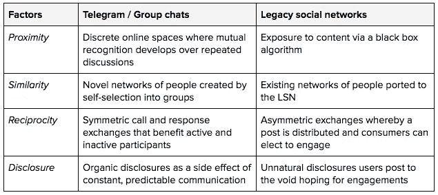

# 电报的设计顺风

> 原文：<https://medium.com/hackernoon/telegrams-design-tailwind-ca777cf5e067>

对大型科技公司的信任正在减少。在#删除 facebook 运动之前，谷歌和苹果在哈里斯民意调查中的品牌排名下降，这是一项关于最“可见”企业品牌声誉的调查([来源](https://www.reuters.com/article/us-companies-reputation/apple-google-see-reputation-of-corporate-brands-tumble-in-survey-idUSKCN1GP1CI))。与此同时，群发消息应用 Telegram 的月活跃用户突破了[的 2 亿](https://telegram.org/blog/200-million)，在[的代币销售也进行了一半，筹集了 25 亿多美元](https://www.nytimes.com/2018/03/04/technology/telegram-initial-coin-offering.html)。

本·汤普森在他的最新文章“[脸书品牌](https://stratechery.com/2018/the-facebook-brand/)”中讲述了这些互联网 2.0 巨头的问题所在那么 Telegram 的前景如何呢？

许多因素促成了 Telegram 的成功[，如数据加密](https://thenextweb.com/apps/2018/01/23/signal-and-telegram-are-growing-rapidly-in-countries-with-corruption-problems/)(尽管 Telegram 的加密值得怀疑)、高性能的 UX，以及区块链社区等群体的采用激增。但我想着重解释一下游戏设计的根源。具体来说，丹尼尔厨师的[“建立友谊的游戏设计模式。”](http://www.lostgarden.com/2017/01/game-design-patterns-for-building.html)

他解释道:

> 为了建立友谊，你的游戏应该促进四个关键因素。当这些因素都存在时，友谊就会形成。
> 
> **接近度**:让玩家在偶然的情况下经常遇到其他玩家。允许他们在多个游戏会话中相互识别。
> 
> **相似性**:创建共享的身份、价值观、背景和目标，以便于协调和联系。
> 
> 互惠:促成对双方都有利的双向交流(不一定是实质性的)。随着重复，这建立了关系。
> 
> **揭露**:通过揭露弱点、测试界限等，进一步增进双方的信任。

群聊应用(尤其是 Telegram)在这些关键因素上表现突出。

*   **接近度**:用户进入一个在线房间，在这里通过多次讨论形成相互认可
*   相似性:群聊中的成员是由一个共同的原因组成的，这保证了一定程度的相似性
*   **礼尚往来:**交流很大程度上是号召和响应。有人提问，有人帮忙解答。个人成员的参与有益于集体
*   **披露:**作为持续交流的一个副作用，人们自然会敞开心扉，试探界限

将这些动态与传统社交网络(LSN)的动态进行比较，在传统社交网络中，主要交互是发布内容、查看内容提要以及参与提要上的内容(例如，评论、喜欢)。

在 LSN 中，邻近性和相似性(显示在您的订阅源上的内容)由黑盒算法决定，该算法优化了对 LSN 有利的结果，但不一定对用户有利。互惠是不对称的:有一张海报和一个参与者。海报寻求参与，参与者最频繁地通过对参与的最无意义的抽象(例如，类似的)进行交互。最后，LSN 是一个糟糕的披露环境，因为它的邻近性、相似性和互惠性都很差。披露(例如在帖子中分享一个脆弱的想法)是异常和尴尬的，因为它们的背景(与他们的披露无关的提要)。

LSN 利用你现有的朋友图表，并试图激励参与，以利于 LSN 数据聚合，群聊应用程序创建了一个与相似的人偶然分享交流的地方。群聊应用的物理特性对用户来说更好。

群聊应用完美吗？当然不是。

群聊缺乏算法内容监管。如果没有监管，用户体验的噩梦可能会出现，比如太多的内容(垃圾聊天群)、偏离主题的内容和不够的内容(不活跃的群)。运行在 Telegram 内部的第三方应用程序 bot 可以帮助解决这些问题。

这些应用也面临着与 LSN 相同的数据保管风险(用户数据的滥用)。对中国监视微信对话的焦虑是这种风险的最好例子。关键在于应用开发者的激励。如果他们的应用程序的增长需要用户数据的货币化(如 lsn)，最终他们的产品决策将导致与用户利益冲突的应用程序。我在“[互联网 3.0 和国家聚合器的消亡](http://www.tonysheng.com/stateful-protocols)”中写了这种反用户趋势——以及去中心化网络的前景

简而言之，群聊的自然设计更适合社交和交友。LSN 的自然设计更适合传送内容提要。这两种类型的应用都有数据保管风险，尽管糟糕的数据保管的负面影响在 lsn 中更加明显。

像群聊这样的环境感觉像是我们未来的一个重要部分，去中心化提供了一条扩展群聊应用的途径，同时调整了开发者和用户的动机。问题是用户是否会在这次为时已晚之前提出要求。

*感谢* [*居延阿章*](https://twitter.com/Juyan_Azhang) *为阅读初稿*

*原载于 2018 年 3 月 27 日*[*www.tonysheng.com*](https://www.tonysheng.com/telegram-tailwind)*。*