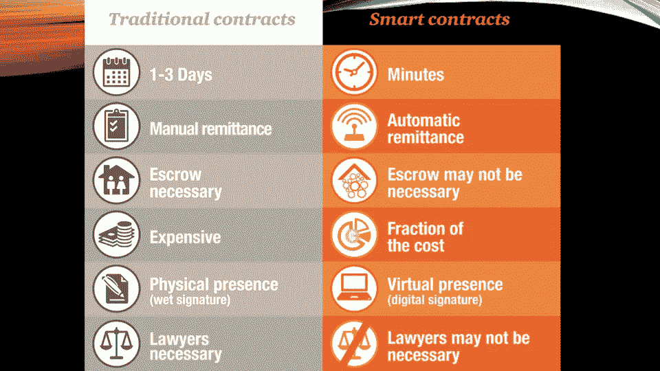

# 两分钟后告诉我区块链的情况

> 原文：<https://medium.com/hackernoon/tell-me-about-blockchain-in-2-mins-8424e6fab4a8>

我的一个朋友问“两分钟内告诉我关于区块链的事”

让我试试吧！

# **什么事？**

> 区块链技术支持点对点交易，无需中介，同时以分散存储和防篡改的方式保持所有交易数据透明。

*   这是一项**基础技术**。
*   它提供**价值互联网** (WWW 提供信息互联网)。
*   它实现了 trus 的分布，取代了传统的可信功能。
*   存储在区块链的数据或记录是**不可变的**(不可更改)。
*   其记录自始至终都是**可追踪/可审计的**。
*   **智能合约**功能支持在满足某些预定义条件时自动触发和执行事件。
*   当应用并与物联网等其他技术一起工作时，它将实现**自动治理**。

# 区块链的阶段

最初，开发区块链是为了扰乱金融部门，并作为虚拟货币(如比特币)的基础。区块链发展的这一阶段通常被称为“**区块链 1.0** ”。

随着智能合同在下一个发展阶段的引入，称为“**区块链 2.0** ”，许多行业都在尝试这项技术。

# 智能合同

智能合同是一种计算机协议，旨在促进、验证或加强合同的协商或履行。智能合约允许在没有第三方的情况下进行可信的交易。这些交易是可追踪和不可逆转的。”

# 区块链的目标

*   抵制审查(即第三方干涉，如互联网公司)
*   抗欺诈
*   透明度
*   稳健性
*   互用性
*   数字资产

列出的目标尚未完全实现，研发仍在进行中。

# 它不是什么

*   它通常不是一种在组织内部实施的技术，而是一种跨国家、跨组织、跨部门或跨社区实施的技术。
*   它不可能在短期内实施。需要仔细的系统和公共建筑规划。
*   这不是一个一刀切的解决方案。