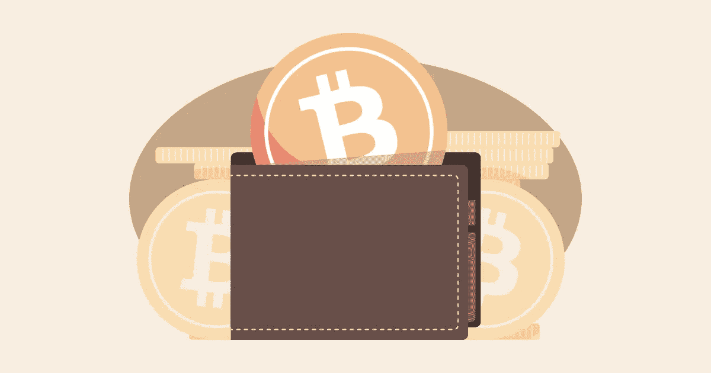

# 保护您的加密资产的十个防黑客步骤

> 原文：<https://medium.com/hackernoon/ten-hacker-proof-steps-to-secure-your-crypto-assets-b564fe938e8>

Source: [https://www.flickr.com/photos/159526894@N02/38210269751/](https://www.flickr.com/photos/159526894@N02/38210269751/) ([descryptive.com](https://descryptive.com/))

这篇文章的目的是帮助你理解——用 10 个步骤——如何将攻击者获取你私人密码的机会降到最低。此外，你将学会如何保存你的钥匙，在任何情况下都不会丢失你的钱包。

据 *CNN 报道，*数亿美元(比特币)被黑客从世界各地人们的账户中窃取。加密钱包每天都在遭到黑客攻击，攻击者正在窃取人们的资产。

此外，另一份报告，这次是由 *The Genesis Block* 在 2015 年发布的，声称自 2011 年以来，当时开采的 1400 多万比特币中有近 35%没有被消费或访问。假设是:这一数字中的很大一部分(490 万 BTC)由于所有者的粗心大意而丢失了。

关于加密货币，上述两种情况成为当前危险的原因很简单。如果黑客获得了你的钱包，并发送出你的硬币，交易是不可逆的，黑客的身份很难追踪。此外， [crypto](https://hackernoon.com/tagged/crypto) 资产放在钱包里，钱包的 id 无法从母公司处恢复；一旦你失去了它，它就永远失去了。

因此，以尽可能广泛的方式保护您的加密资产不再是可选的，而是必须的。

***由于以下列出的服务费用，本指南最适合拥有价值 2000 美元或以上加密资产的个人。***

这些步骤是:

1.  购买两台 [**莱杰 Nano S** 。](https://www.ledgerwallet.com/r/3793?path=/products/ledger-nano-s&tracker=et-medium)

**2。**安装 [**1Password**](https://1password.com/downloads/) 并订阅他们的“For Families”计划，自动同步并在云中存储您的密码(以消除您可能无法访问数据库的机会，至少只要您记得您的主密码)。

**3。**在 2 台设备(最好是一台手机和一台笔记本电脑)上安装 [**Authy**](https://authy.com/) ，并确保其在两台设备上同步 OTP 和 2FA 密钥。

**4。**为 1Password 创建主密码；密码越长越好。最难破解的密码是长句和/或随机生成的字符，例如

*   ***【作用-反作用-相等且相反——除了星期三***
*   **AW<VBHF %&(# @)19083 t27 {+/[}BDWOKG5** *。*

**5。**为 Authy 创建另一个主密码(切勿对两个网站或应用程序使用相同的密码)。

**6。**如果您交易密码，请创建一个交易时使用的专用电子邮件，并使用 1 密码生成的强密码保护它。然后用 OTP 2FA 保护它，并将种子密钥存储在 Authy 中。

*   不要用 Google Authenticator(不像 Authy，它不会给你备份种子，你得自己做)。
*   永远不要使用 2FA 恢复码(你容易受到社会工程的攻击)。
*   禁用 SMS 2FA(它们可能被[利用](https://www.forbes.com/sites/laurashin/2016/12/20/hackers-have-stolen-millions-of-dollars-in-bitcoin-using-only-phone-numbers/#3453b0eb38ba))。

**7。**用上面 6 中创建的电子邮件地址注册您的所有 exchange 帐户。使用强密码保护每个帐户，并将其存储在 1Password 中。使用 OTP 2FA 进一步保护每个帐户，并将密钥存储在 Authy 中。

**8。**设置从步骤 1 购买的 [**分类账 Nano S**](https://www.ledgerwallet.com/r/3793?path=/products/ledger-nano-s&tracker=et-medium) 之一，并按如下方式保护您的助记符:

*   将你的 24 个字符的助记符分成两部分。
*   用您选择的工具对两部分进行加密，然后将加密密钥存储在[1 密码](https://1password.com/downloads/)中。
*   获得支持 2FA 的 4 种存储服务。好的选择包括 Google Drive、AWS S3、GitHub 私人回购和 Dropbox。
*   在所有四个服务器上启用 2FA，并将 OTP 2FA 种子存储在 Authy 中。
*   将加密助记符的一部分放在 2 个存储服务中，另一部分放在剩余的 2 个中。

9。在发送任何资产之前，用你的记忆法删除并恢复分类账，以确认一切正常。

**10。**拿你的第二本账本，用同样的助记符恢复；万一你把它弄丢了，它将作为第一个的镜像。把这个账本冷藏起来，放在你一天之内就能拿到的地方。

我们结束了。唷！相当广泛，不是吗？嗯，这是让你的加密货币资产远离潜伏的攻击者所必须付出的代价。如果你严格按照规定的步骤去做，你的资产将会和以前一样安全，除非你给别人权限，否则除了你，没有人能接触到它们。

**重要免责声明**

1.  永远把你的硬币存在你的账本里，永远不要在交易所里。
2.  不要悠闲地使用你的记忆法；仅在绝对需要时访问它。
3.  消除关键人物风险:如果你受到致命伤害或患了健忘症，你的资产不应该永远失去。选择一个你信任的人，教他/她如何将密码转换成现金并取出你的资金。
4.  您可以通过将私人信息(如您的分类帐 pin 码)放在律师/托管/保险箱中，并要求其他人只能在您去世后才能访问，来消除上述步骤中的第三方风险。

加密货币正在开始大规模兴起，全世界都在关注它。这意味着诈骗者将加强他们的游戏，以减轻人们的资产，我相信你不需要被告知，这是最糟糕的可能失去你的密码。因此，重要的是你也要加强你的游戏，并广泛支持你的账户[安全](https://hackernoon.com/tagged/security)。

本文由[尤金·塔尔塔可夫斯基](https://www.linkedin.com/in/etartakovsky/)和[马克·杰德](https://www.fiverr.com/markjedd)撰写和编辑。

鼓掌，分享和关注，以获得更多有用的加密技巧。

如果你觉得这篇文章很有帮助，并想表达谢意——使用文章中的一个附属链接，或者在我推荐的一个交易所注册:[币安](https://www.binance.com/?ref=10191219)， [CEX](https://cex.io/r/0/up103559556/0/) ，[隐见](https://www.cryptopia.co.nz/Register?referrer=flar)， [HitBTC](https://hitbtc.com/?ref_id=5a4d35961c7cd) 。