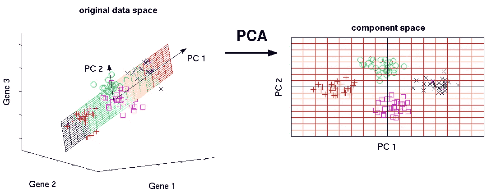
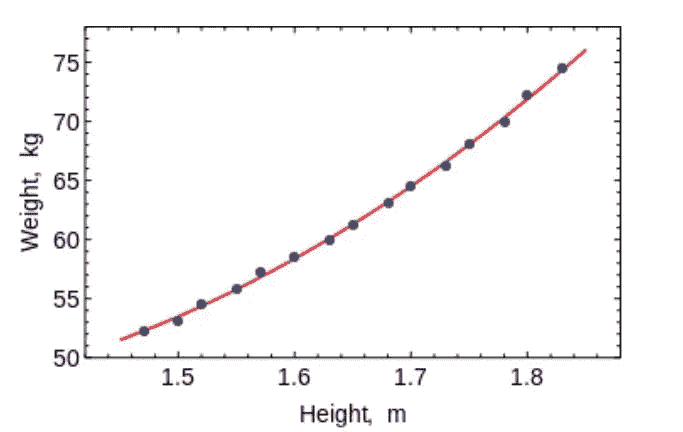
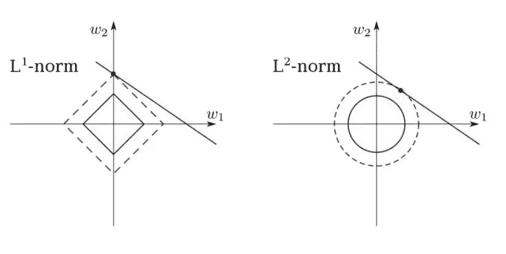
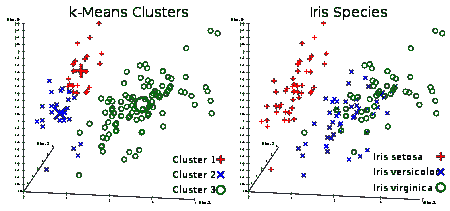
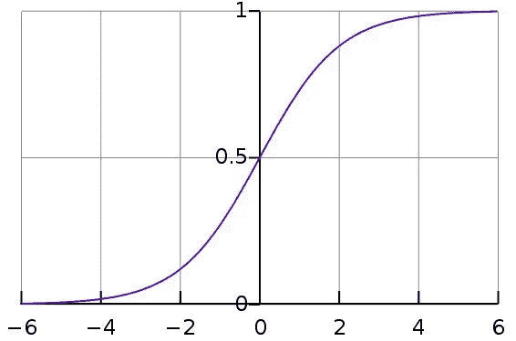
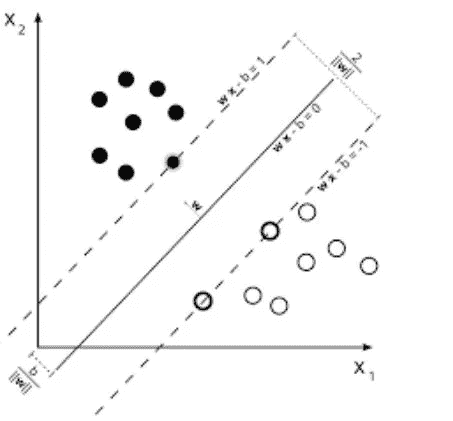
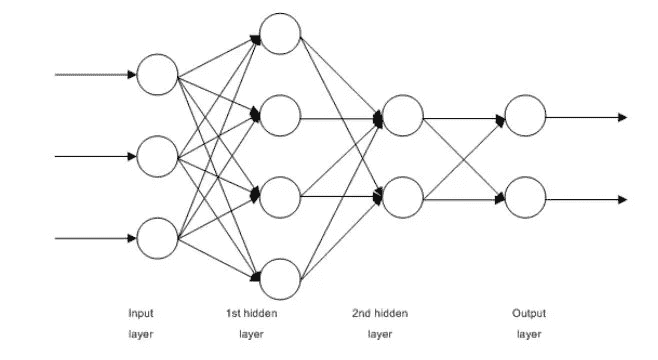
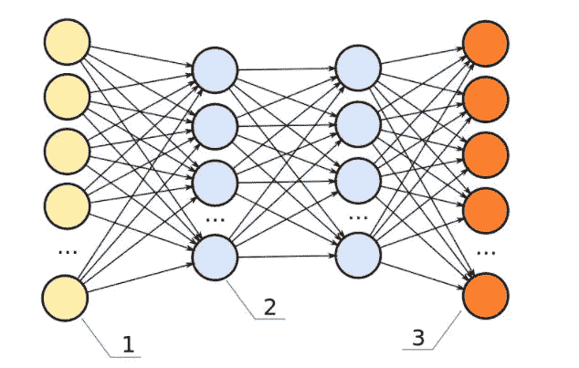
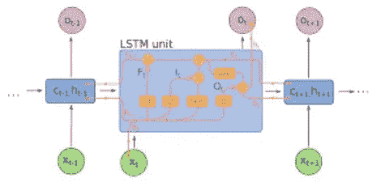

# 成为数据科学家应该知道的十个机器学习算法

> 原文：<https://medium.com/hackernoon/ten-machine-learning-algorithms-you-should-know-to-become-a-data-scientist-c11a3e735f93>

机器学习从业者性格各异。虽然其中一些是“我是 X 方面的专家，X 可以对任何类型的数据进行训练”，其中 X =某种算法，但其他一些则是“适合合适工作人员的合适工具”。他们中的很多人还订阅了《百事通》。“一个硕士”战略，他们在一个领域有深厚的专业知识，对机器学习的不同领域略有了解。也就是说，没有人可以否认这样一个事实，即作为实践数据科学家，我们必须了解一些常见的机器学习算法的基础知识，这将有助于我们处理我们遇到的新领域问题。这是一个关于常见机器学习算法和快速资源的旋风式旅行，可以帮助你开始使用它们。

# 1.主成分分析/奇异值分解

PCA 是一种无监督的方法，用于理解由向量组成的数据集的全局属性。这里分析数据点的协方差矩阵，以了解哪些维度(大多数)/数据点(有时)更重要(即，它们之间的方差高，但与其他维度的协方差低)。考虑矩阵的顶部 PC 的一种方法是考虑其具有最高特征值的特征向量。SVD 本质上也是一种计算有序分量的方法，但是你不需要得到点的协方差矩阵来得到它。

这种算法通过获得维数减少的数据点来帮助人们对抗维数灾难。

# 图书馆:

[https://docs . scipy . org/doc/scipy/reference/generated/scipy . Lina LG . SVD . html](https://docs.scipy.org/doc/scipy/reference/generated/scipy.linalg.svd.html)

[http://sci kit-learn . org/stable/modules/generated/sk learn . decomposition . PCA . html](http://scikit-learn.org/stable/modules/generated/sklearn.decomposition.PCA.html)

# 入门教程:

【https://arxiv.org/pdf/1404.1100.pdf 

# 2a。最小二乘法和多项式拟合

还记得你大学时的数值分析代码吗，你曾经用直线和曲线来拟合点，得到一个方程。您可以使用它们在机器学习中拟合低维度的非常小的数据集的曲线。(对于大型数据或多维数据集，您可能最终会过度适应，所以不要费心)。OLS 有一个封闭形式的解决方案，所以你不需要使用复杂的优化技术。

显而易见，使用该算法来拟合简单曲线/回归

# 图书馆:

[https://docs . scipy . org/doc/numpy/reference/generated/numpy . linalg . lstsq . html](https://docs.scipy.org/doc/numpy/reference/generated/numpy.linalg.lstsq.html)https://docs . scipy . org/doc/numpy-1 . 10 . 0/reference/generated/numpy . poly fit . html

# 入门教程:

[https://lag unita . Stanford . edu/c4x/humanitisescience/StatLearning/asset/linear _ regression . pdf](https://lagunita.stanford.edu/c4x/HumanitiesScience/StatLearning/asset/linear_regression.pdf)

# 2b。约束线性回归

最小二乘法可能会与数据中的异常值、伪场和噪声混淆。因此，我们需要约束来减少我们在数据集上拟合的线的方差。正确的方法是拟合线性回归模型，这将确保权重不会出现错误。模型可以有 L1 范数(LASSO)或 L2 (Ridge Regression)或两者都有(弹性回归)。均方损耗得到优化。

使用这些算法用约束条件拟合回归线，避免过度拟合并从模型中屏蔽噪声维度。

# 图书馆:

[http://scikit-learn.org/stable/modules/linear_model.html](http://scikit-learn.org/stable/modules/linear_model.html)

# 入门教程:

[https://www.youtube.com/watch?v=5asL5Eq2x0A](https://www.youtube.com/watch?v=5asL5Eq2x0A)

[https://www.youtube.com/watch?v=jbwSCwoT51M](https://www.youtube.com/watch?v=jbwSCwoT51M)

# 3.k 表示聚类

大家最喜欢的无监督聚类算法。给定一组向量形式的数据点，我们可以根据它们之间的距离进行聚类。这是一种期望最大化算法，它迭代地移动聚类的中心，然后用每个聚类中心来增加点数。该算法采用的输入是要生成的聚类的数量以及它将尝试收敛聚类的迭代次数。

顾名思义，您可以使用该算法在数据集中创建 K 个聚类

# 图书馆:

[http://sci kit-learn . org/stable/modules/generated/sk learn . cluster . k means . html](http://scikit-learn.org/stable/modules/generated/sklearn.cluster.KMeans.html)

# 入门教程:

[https://www.youtube.com/watch?v=hDmNF9JG3lo](https://www.youtube.com/watch?v=hDmNF9JG3lo)

[https://www.datascience.com/blog/k-means-clustering](https://www.datascience.com/blog/k-means-clustering)

# 4.逻辑回归

逻辑回归是在应用权重后进行非线性(sigmoid 函数最常用，或者您也可以使用 tanh)应用的约束线性回归，因此将输出限制为接近+/-类(在 sigmoid 的情况下为 1 和 0)。使用梯度下降来优化交叉熵损失函数。新手注意:逻辑回归用于分类，而不是回归。您也可以将逻辑回归视为一个单层神经网络。使用梯度下降或 L-BFGS 等优化方法来训练逻辑回归。NLP 的人会经常把它用在最大熵分类器的名字上。

这是乙状结肠的样子:

使用 LR 训练简单但非常健壮的分类器。

# 图书馆:

[http://sci kit-learn . org/stable/modules/generated/sk learn . linear _ model。LogisticRegression.html](http://scikit-learn.org/stable/modules/generated/sklearn.linear_model.LogisticRegression.html)

# 入门教程:

https://www.youtube.com/watch?v=-la3q9d7AKQ

# 5.SVM(支持向量机)

支持向量机是线性模型，如线性/逻辑回归，区别在于它们具有不同的基于边际的损失函数(支持向量的推导是我见过的与特征值计算一起的最漂亮的数学结果之一)。您可以使用优化方法优化损失函数，如 L-BFGS 甚至 SGD。

支持向量机的另一个创新是在数据上使用内核来支持工程师。如果你有很好的领域洞察力，你可以用更聪明的内核替换旧的 RBF 内核并从中获利。

支持向量机可以做的一件独特的事情是学习一类分类器。

支持向量机可用于训练分类器(甚至回归器)

# 图书馆:

[http://sci kit-learn . org/stable/modules/generated/sk learn . SVM . SVC . html](http://scikit-learn.org/stable/modules/generated/sklearn.svm.SVC.html)

# 入门教程:

[https://www.youtube.com/watch?v=eHsErlPJWUU](https://www.youtube.com/watch?v=eHsErlPJWUU)

**注:**在 SKLearn 的[http://sci kit-learn . org/stable/modules/generated/sk learn . linear _ model 中可以找到基于 SGD 的逻辑回归和支持向量机训练。SGDClassifier.html](http://scikit-learn.org/stable/modules/generated/sklearn.linear_model.SGDClassifier.html)，我经常使用它，因为它让我用一个通用的界面检查 LR 和 SVM。您还可以使用迷你批处理在> RAM 大小的数据集上训练它。

# 6.前馈神经网络

这些基本上是多层逻辑回归分类器。由非线性(sigmoid、tanh、relu + softmax 和酷炫的新卢瑟)分隔的多层权重。它们的另一个流行名称是多层感知器。FFNNs 可以作为自动编码器用于分类和无监督的特征学习。

*Multi-Layered perceptron*

*FFNN as an autoencoder*

FFNNs 可用于训练分类器或提取特征作为自动编码器

# 图书馆:

[http://sci kit-learn . org/stable/modules/generated/sk learn . neural _ network。MLP classifier . html # sk learn . neural _ network。MLP 分类器](http://scikit-learn.org/stable/modules/generated/sklearn.neural_network.MLPClassifier.html#sklearn.neural_network.MLPClassifier)

[http://sci kit-learn . org/stable/modules/generated/sk learn . neural _ network。MLPRegressor.html](http://scikit-learn.org/stable/modules/generated/sklearn.neural_network.MLPRegressor.html)

[https://github . com/keras-team/keras/blob/master/examples/Reuters _ MLP _ relu _ vs _ selu . py](https://github.com/keras-team/keras/blob/master/examples/reuters_mlp_relu_vs_selu.py)

# 入门教程:

[http://www.deeplearningbook.org/contents/mlp.html](http://www.deeplearningbook.org/contents/mlp.html)

[http://www.deeplearningbook.org/contents/autoencoders.html](http://www.deeplearningbook.org/contents/autoencoders.html)

[http://www . deep learning book . org/contents/representation . html](http://www.deeplearningbook.org/contents/representation.html)

# 7.卷积神经网络

当今世界上几乎任何基于视觉的机器学习结果都是使用卷积神经网络实现的。它们可以用于图像分类、对象检测甚至图像分割。由 Yann Lecun 在 80 年代末 90 年代初发明的 Convnets 具有卷积层的功能，卷积层充当分层特征提取器。你也可以在文本中使用它们(甚至是图表)。

使用 convnets 进行最先进的图像和文本分类、对象检测、图像分割。

# 图书馆:

[https://developer.nvidia.com/digits](https://developer.nvidia.com/digits)

[https://github.com/kuangliu/torchcv](https://github.com/kuangliu/torchcv)

[https://github.com/chainer/chainercv](https://github.com/chainer/chainercv)

[https://keras.io/applications/](https://keras.io/applications/)

# 入门教程:

[http://cs231n.github.io/](http://cs231n.github.io/)

[https://adeshpande 3 . github . io/A-初学者% 27s-理解指南-卷积神经网络/](https://adeshpande3.github.io/A-Beginner's-Guide-To-Understanding-Convolutional-Neural-Networks/)

# 8.递归神经网络(RNNs):

RNNs 通过在时间 t 对聚合器状态和时间 t 的输入递归地应用相同的权重集来对序列建模(假设序列在时间 0 具有输入..t..t，并且在从 RNN 的 t-1 步输出的每个时间 t 具有隐藏状态)。现在很少使用纯 rnn，但是它的对应物如 LSTMs 和 GRUs 在大多数序列建模任务中是最先进的。

RNN(如果这里是一个密集连接的单元和一个非线性，现在 f 一般是 LSTMs 或 GRUs)。LSTM 单位，在纯 RNN 中用来代替普通致密层。

将 RNNs 用于任何序列建模任务，特别是文本分类、机器翻译、语言建模

# 图书馆:

https://github.com/tensorflow/models[(谷歌的很多很酷的 NLP 研究论文都在这里)](https://github.com/tensorflow/models)

[https://github.com/wabyking/TextClassificationBenchmark](https://github.com/wabyking/TextClassificationBenchmark)

[http://opennmt.net/](http://opennmt.net/)

# 入门教程:

[http://cs224d.stanford.edu/](http://cs224d.stanford.edu/)

[http://www . wild ml . com/category/neural-networks/recurrent-neural-networks/](http://www.wildml.com/category/neural-networks/recurrent-neural-networks/)

[http://colah.github.io/posts/2015-08-Understanding-LSTMs/](http://colah.github.io/posts/2015-08-Understanding-LSTMs/)

# 9.条件随机场

CRF 可能是概率图形模型(PGM)家族中最常用的模型。它们像 RNNs 一样用于序列建模，也可以与 RNNs 结合使用。在神经机器翻译系统出现之前，CRF 是最先进的，在许多具有小数据集的序列标记任务中，它们仍然会比 rnn 学习得更好，rnn 需要更大量的数据来概括。它们还可以用于其他结构化预测任务，如图像分割等。CRF 对序列的每个元素(比如一个句子)建模，使得相邻元素影响序列中组件的标签，而不是所有标签都彼此独立。

使用 CRF 标记序列(文本、图像、时间序列、DNA 等)。)

# 图书馆:

[https://sklearn-crfsuite.readthedocs.io/en/latest/](https://sklearn-crfsuite.readthedocs.io/en/latest/)

# 入门教程:

[http://blog . echen . me/2012/01/03/有条件随机字段简介/](http://blog.echen.me/2012/01/03/introduction-to-conditional-random-fields/)

Hugo Larochelle 在 Youtube 上的 7 部分系列讲座:【https://www.youtube.com/watch?v=GF3iSJkgPbA 

# 10.决策树

比方说，给我一张 Excel 表格，里面有各种水果的数据，我必须说出哪些看起来像苹果。我要做的是问一个问题“哪些水果又红又圆？”把所有回答是和不是的水果分开。现在，所有又红又圆的水果可能不是苹果，也不是所有的苹果都是又红又圆的。所以我会问一个问题“哪些水果上有红色或黄色的颜色提示？”红色和圆形的水果，并会问“哪些水果是绿色和圆形的？”不是红色和圆形的水果。根据这些问题，我可以相当准确地说出哪些是苹果。这一连串的问题就是决策树。但是，这是一个基于我直觉的决策树。直觉无法处理高维复杂的数据。我们必须通过查看标记数据来自动提出一连串的问题。这就是基于机器学习的决策树所做的事情。像 CART trees 这样的早期版本曾经用于简单数据，但是随着数据集越来越大，偏差-方差权衡需要用更好的算法来解决。现在使用的两种常见的决策树算法是随机森林(在属性的随机子集上构建不同的分类器，并将它们组合起来输出)和提升树(在其他树的顶部训练一系列树，纠正下面的树的错误)。

决策树可以用来分类数据点(甚至回归)

# 图书馆

[http://sci kit-learn . org/stable/modules/generated/sk learn . ensemble . randomforestclassifier . html](http://scikit-learn.org/stable/modules/generated/sklearn.ensemble.RandomForestClassifier.html)

[http://sci kit-learn . org/stable/modules/generated/sk learn . ensemble . gradientboostingclassifier . html](http://scikit-learn.org/stable/modules/generated/sklearn.ensemble.GradientBoostingClassifier.html)

[http://xgboost.readthedocs.io/en/latest/](http://xgboost.readthedocs.io/en/latest/)

[https://catboost.yandex/](https://catboost.yandex/)

# 入门教程:

[http://xgboost.readthedocs.io/en/latest/model.html](http://xgboost.readthedocs.io/en/latest/model.html)

https://arxiv.org/abs/1511.05741

【https://arxiv.org/abs/1407.7502 

[http://education . parrot prediction . teachable . com/p/practical-xgboost-in-python](http://education.parrotprediction.teachable.com/p/practical-xgboost-in-python)

# TD 算法(最好有)

如果你仍然想知道上述任何方法如何解决像 DeepMind 那样击败围棋世界冠军的任务，它们不能。我们之前讨论的所有 10 种算法都是模式识别，而不是策略学习器。为了学习解决多步骤问题的策略，如赢得一盘棋或玩雅达利游戏机，我们需要让世界上没有代理，并从它面临的奖励/惩罚中学习。这种类型的机器学习被称为强化学习。该领域最近的许多(不是全部)成功是将修道院或 LSTM 的感知能力与一套称为时间差异学习的算法相结合的结果。其中包括 Q-Learning、SARSA 和其他一些变体。这些算法是对贝尔曼方程的巧妙运用，以获得一个损失函数，该函数可以用代理从环境中获得的回报来训练。

这些算法主要用于自动玩:D 游戏，也用于语言生成和对象检测中的其他应用。

# 图书馆:

[https://github.com/keras-rl/keras-rl](https://github.com/keras-rl/keras-rl)

[https://github.com/tensorflow/minigo](https://github.com/tensorflow/minigo)

# 入门教程:

抢免费的萨顿和巴尔托的书:[https://web 2 . Qatar . CMU . edu/~ GDI caro/15381/additional/Sutton barto-RL-5 nov17 . pdf](https://web2.qatar.cmu.edu/~gdicaro/15381/additional/SuttonBarto-RL-5Nov17.pdf)

观看大卫·西尔弗课程:[https://www.youtube.com/watch?v=2pWv7GOvuf0](https://www.youtube.com/watch?v=2pWv7GOvuf0)

这是 10 种机器学习算法，你可以通过学习成为一名数据科学家。

你也可以在这里阅读关于机器学习库[。](https://blog.paralleldots.com/data-science/lesser-known-machine-learning-libraries-part-ii/)

我们希望你喜欢这篇文章。请[注册](http://https//user.apis.paralleldots.com/signing-up?utm_source=blog&utm_medium=chat&utm_campaign=paralleldots_blog)免费的 ParallelDots 账户，开始你的 AI 之旅。你也可以在这里查看我们的 API[的演示。](https://www.paralleldots.com/ai-apis)

点击阅读原文[。](https://blog.paralleldots.com/data-science/machine-learning/ten-machine-learning-algorithms-know-become-data-scientist/)