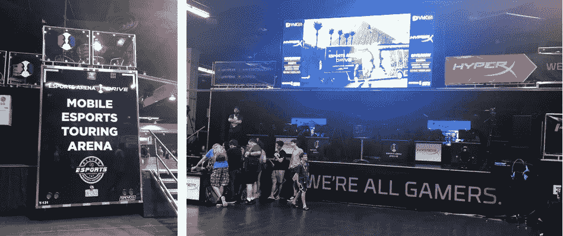
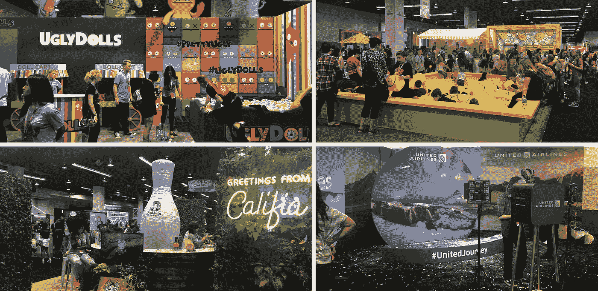

# 风投从 VidCon 获得的 10 大收获

> 原文：<https://medium.com/hackernoon/ten-takeaways-on-gen-z-culture-media-and-consumer-marketing-from-vidcon-8d8a9e7d3bac>

## 我们花了 3 天时间和 25，000 名青少年在一起——以下是我们了解到的情况！

上周，我们参加了我们的第一次[视频会议](http://vidcon.com/)，这是一个面向创作者、粉丝和媒体行业的在线视频会议，由[挫折感](https://medium.com/u/4681f189a24e#3b7175e42b0f)，即 VidCon 不会邀请像她这样有争议的创作者。尽管 TanaCon 组织不力并最终关闭，Mongeau 还是吸引了超过 2 万名青少年粉丝以及像 Shane Dawson、TheGabbieShow、Casey Neistat 和 Miranda Sings 这样的大制作人。

TanaCon sold 5,000 tickets but was [reportedly mobbed](https://twitter.com/tanamongeau/status/1010281798046060544) by another 15,000 teens eager to meet their favorite YouTubers. Photo courtesy of [@SocialBlade](https://twitter.com/SocialBlade/with_replies).

**6。参与度>视图**。为了从活动中产生真正的价值，许多品牌为他们合作的影响者设定了以下优先事项:(1)参与度(喜欢、评论)；(2)观点；(3)订户。随着购买行为继续向移动和社交平台转移，影响者有巨大的能力推动销售，但关键是观众实际观看和参与内容，并使用它来做出购买决定。

品牌和出版商也越来越关注参与度而非覆盖面，他们对内容的 KPI 已经从单纯的观点转变为关注点。Tastemade 的线性编程负责人杰伊·霍尔泽(Jay Holzer)提到，他的团队主要关注的是观看时间而不是观看次数——他们希望确保他们与将返回他们页面的观众建立真正的联系。同样，NBC 与 40 家音乐 YouTubers 合作开展了一场[*《T2 之声》*](https://deadline.com/2018/02/nbc-youtube-mashup-kelly-clarksons-medicine-premiere-the-voice-1202302955/)——在他们追踪浏览量的同时，他们特别关注提升【T4 之声】的搜索流量，该流量在整个活动过程中增长了 170%。

**7。品牌需要在电竞上迎头赶上**。电子竞技的快速崛起让许多品牌措手不及，他们继续努力以真实的方式接触这些观众。这是一个有价值的人口统计——观众经常不间断地观看数小时的内容，并渴望有机会模仿游戏生活方式。品牌需要想出创造性的方法来在这个领域建立增值存在 Zebra Partners 的 Perrin Kaplan 引用宜家为游戏玩家设计的新[人体工程学家具](https://qz.com/1299865/ikea-is-designing-an-ergonomic-chair-the-ubik-for-gamers-and-e-sports-players/)作为例子。

HyperX and Allied Esports [partnered](https://www.prnewswire.com/news-releases/esports-arena-las-vegas-announces-hyperx-as-official-peripheral-and-arena-partner-300632760.html) on a mobile touring arena that made a stop on the VidCon Expo Hall floor — conveniently located next to the Axe (yes, the body spray company) Gaming Lounge.

其他行业专家鼓励品牌更战略性地考虑哪些游戏最符合他们的精神，而不是像《堡垒之夜》那样争相赞助热门游戏。UEG 的 Lauren Flanagan 说，目前的环境让她想起了青年足球，在那里“每个人都在场上追着同一个球跑”，而不是分散开来，追求不同的属性。VidCon 展示了该领域一个成功合作伙伴关系的案例研究——Hot Pockets 在 2017 年开展了一场社交[活动](http://www.ion.co/hot-pockets-steps-game-influencer-partnerships)，他们将大部分营销预算用于 20 名游戏影响者，并看到了 6–7%的业务增长。

**8。Z 世代想要互动和不可编程的体验。**漫步在 VidCon 的巨型展厅，我们[很快意识到](https://twitter.com/venturetwins/status/1010291945761935361)几乎每个展位都有两个共同点:它们是互动的，并且它们针对 Instagram 进行了优化。至少，这意味着可以对着一面时髦的墙拍照(脸书有专门的迷你照相馆)，但大多数品牌都更有创意。休伯特的柠檬水有一个装满柠檬水漂浮物的球坑和一个 merch 的爪式机器，而 Nickelodeon 建造了一个巨大的障碍跑道。品牌并不羞于鼓励社交帖子，张贴带有标签的标志，并请求在 Instagram 上分享。

A few of the brand booths in VidCon’s expo hall. Clockwise from upper left: Ugly Dolls, Hubert’s Lemonade, United Airlines, and Califia.

让实体展台变得互动很容易，但内容创作者如何为 YouTube 做到这一点呢？ [pocket.watch](http://pocket.watch/) 合作伙伴副总裁蔡斯·兰道(Chase Landau)表示，该公司的创作者专注于孩子们可以在家里复制的东西的视频。关于烹饪、建筑和游戏的操作视频通常是最受欢迎的内容。在另一个有趣的互动内容的例子中，Twisted Food 推出了一家外卖餐厅，允许观众订购他们在该公司的病毒[脸书视频](https://www.facebook.com/JungleTwisted/)中看到的食物。

*社交和娱乐平台*

**9。平台负责内容。** UGC 平台经常在平衡言论自由和创建安全社区之间挣扎。在 VidCon 上，许多创作者表示，YouTube 和其他平台应该采取更多措施来确保用户不会受到骚扰或不适当的内容。在一个名为“为什么 2017 年在线视频如此糟糕”的小组中，vlogger [Jana Hisham](https://www.youtube.com/channel/UCaaFdzZqxEdlK1v2V9Yvt2w) 批评 YouTube 将罗根·保罗的“自杀森林”视频保留了 12 个多小时，并认为真人(而不是机器人)应该审查和批准特色或趋势内容。

技术高管历来不同意他们对用户内容负责的观点，但趋势似乎开始转变。在 Twitch 的主题演讲中，联合创始人林义杰表示，公司有“责任为创作者和粉丝创造一个安全的环境”巨魔们，注意了——平台正在大步前进，以控制互联网的狂野西部。

10。平台向多格式视频融合。 YouTube、IG/脸书、Snap 和 Twitch 正在竞相成为视频的主要目的地。YouTube 推出了针对休闲短片的[“故事”产品](https://www.thevideoink.com/2018/06/21/youtube-goes-vertical-with-new-stories-feature/)，正在蚕食 Instagram。与此同时，Instagram 在[推出 IGTV](https://www.engadget.com/2018/06/21/instagram-igtv-youtube/) 时掀起了波澜，它允许用户创建更长形式的 YouTube 风格的视频。脸书的产品副总裁 Fidji Simo 表示，由于消费者的需求，她的团队正在努力鼓励 Facebook Watch 上更多的创作者内容。虽然 Snap 在创作者视频方面落后，但该公司有一个重大的 [VidCon 公告](https://variety.com/2018/digital/news/snapchat-shows-format-creators-1202853556/)——Snapchat 秀功能将向创作者开放，从 *Face Forward 的 [Patrick Starrr](https://www.youtube.com/channel/UCDHQbU57NZilrhbuZNbQcRA) 的改头换面秀开始。*

You can catch the full YouTube keynote above — other than YouTube Stories, some of the biggest announcements were the launch of monthly memberships, expanded merch opportunities (including a partnership with Teespring), and a new Premieres feature for the live debut of pre-recorded videos.

创作者对平台整合的想法喜忧参半。一些人似乎被制作内容以适应每个平台的人口统计、格式和观看习惯的挑战所累，并欢迎专注于一个平台的能力。其他人，尤其是新的创作者，欣赏跨许多平台发布的能力，并找出他们的内容“命中”的地方 NBA 娱乐 SVP 大卫·登能伯格表示，NBA 已经从平台多样性中受益——他们可以在脸书直播比赛，在 YouTube 上发布集锦，并在 Instagram 上进行球员问答。Denenberg 表示，NBA 与社交平台合作，为观众提供最佳内容——在脸书的一位联系人推荐了角度更小的视频后，NBA 在竞技场安装了新的摄像机，参与度提高了 2.5 倍

感谢阅读——我们希望这篇文章对你有所帮助！如果你参加了今年或过去几年的 VidCon，我们希望听到你的反馈，或者你可以发邮件到 twins@crv.com 或者发推特[@ venture wins](https://twitter.com/venturetwins)联系我们。

喜欢这个帖子？**为它鼓掌**帮助更多人看到我们的故事，分享给你的朋友们！

有兴趣阅读我们的更多内容吗？你可以订阅[我们的每周简讯](https://accelerated.carrd.co/)、**加速**，了解更多关于千禧一代和 Z 世代趋势的见解。