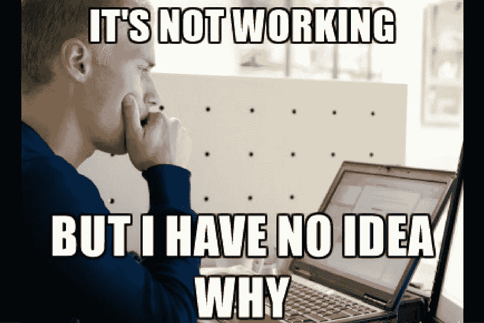

# 我从创业失败中学到的十件事……第一部分

> 原文：<https://medium.com/hackernoon/ten-things-i-have-learned-from-failing-miserably-at-building-startups-part-1-4a1875f01e28>

你们都必须知道这一点，创建一家创业公司最简单的部分就是创建它，最难的部分是让别人在乎它…

我写这篇文章是为了那些刚开始第一个项目或者正在进行中的人。

我是凭经验说话的，过去几年我一直在做东西，虽然我还没有成为大人物，但我一直在[学习](https://hackernoon.com/tagged/learning)很多关于这个过程的东西。

我可以说我没有住在硅谷或任何其他想成为企业家的地方或其他借口，但实事求是地说，没有人关心你的局限性是什么，这并不意味着你的局限性不存在，这只是意味着没有人关心…

很简单，当我去餐馆点汉堡时，我不会去想餐馆老板可能面临的艰难生活，没有人会这样做，这在两个方面都适用。

失败中最艰难的部分是，至少对我来说，你和支持你的人付出了所有的努力，然后一切都不顺利。

但我们不是来这里为我们的失败哭泣和后悔的，那不适合我们。

所以，我从这个泪谷中学到的第一件事是:

## **1。-做作业**

如果你称自己为企业家或你想给自己起的任何花哨的头衔，那么你需要明白，除非你有大量的钱来承担，否则你将需要自己做必须的艰苦工作，这包括所有那些我们不喜欢做的任务，就我个人而言，我不喜欢销售，我讨厌与人交谈，等等。我是一名程序员，我喜欢我的桌子，我的椅子，我的笔记本电脑，我的耳机，还有我悲惨的孤独，这是我更喜欢的，但是正如我之前说过的，没有人在乎我喜欢做什么或者不喜欢做什么。所以我不得不做所有我不喜欢或不想做的事情，此外，我不得不做所有这些事情，就好像我喜欢它一样。

在我创业之初，我希望一切都很快，事情不是那样运作的，成功没有捷径，你必须首先完成所有的工作。

你需要用户前景的反馈吗？然后找到这些人，和他们取得联系。

你需要创造更好看的内容来脱颖而出吗？然后创建内容或找到可以帮助你的人，我们生活在辅导时代，你可以从互联网上学习一切，只是跳过这个周末的网飞之夜，专注于学习你需要什么来完成工作，当然你会在这方面很糟糕，但如果你需要做的事情，没有预算，那么有什么选择？

你需要一种“我能做这件事”的心态，来了解如果你不能付钱给别人帮你做这件事，需要付出什么代价。

所以我总结学到的第一件事是:

> 尽一切努力让你的创业公司成长。

## 2.——别自欺欺人了，最有可能的是，你的“想法”不是新脸书

我去过那里，你有这个伟大的新想法，但相信我，一旦你明白你的想法只是一个想法越好。

唯一能证明你的想法是好的是市场，如果市场为一个可行的想法买单，那么你是对的，你在你的眉毛之间有一个好想法，但在它发生之前，你将不得不建立狗屎出来，直到它发生，你只是猜测。当然，你必须通过咨询和潜在客户或用户来验证市场，但老实说，这只能给你整体的一部分，直到你的 MVP 出来并被使用，你才会知道它是多么糟糕。

这并不意味着你会放弃你的创业想法，坐在角落里哭泣，但你必须明白，如果你认为你有历史上最好的商业想法，这并不重要，但很可能不是，这将帮助你超越自我，专注于市场真正需要或想要的东西。

一件很好的事情是尽可能多地找到负面反馈，在过去的几个月里，我一直在寻找导师，听到你的想法很糟糕，你的商业计划很糟糕，甚至有人告诉我应该改变一切，但这一切都是成长所必需的，你必须厚脸皮才能承受所有的批评，更重要的是，向那些比你更有经验的人学习。

总而言之:

> 不要把你自己或你的想法放在一个基座上，寻找负面反馈，学会在你的项目中寻找缺陷。做你最严厉的批评家。

## 3.-不要等一年才失败

正如我所说的，我已经失败了很多次，在我的第一次尝试中，我常常等待太久才能推出产品，总是对推出产品，对技术，对模型，对我正在做的方法有不合理的恐惧，但相信我，不管你等多久才能治愈所有这些愚蠢的恐惧，失败的概率仍然很高。

因此，如果最有可能的是你无论如何都将失败，那么不要等待数月，只要启动你的 MVP 并开始吸引用户或客户，他们会告诉你你的恐惧是真实的还是你只是在一杯水上制造风暴。

你的顾客会告诉你真相，至少是他们对你产品的看法。

所以这一点很简单:

> 只是不要永远等待，最好从现实生活中的问题和真正的客户那里不断学习。

## 4.-对一个人有效的对另一个人无效

我喜欢大量阅读，我喜欢了解其他人做的很棒的事情，但这并不意味着我必须做他们做的事情才能成功，当然成功人士也有很多有用的建议，但我们都是不同的，有我们自己的背景，我们自己的可能性，技能等。因此，我们不能认为，如果我们像埃隆·马斯克一样规划我们的一天，我们就会成功，认为这种方式是愚蠢的。我不去模仿别人的做法，而是努力寻找自己的流程，寻找适合自己的方式。

找到自己的方式去做事情并不意味着你在工作中会一团糟，例如，你仍然需要纪律和努力工作，但也许事情并不适合你五分钟的时间表，也许你是一个夜猫子，或者你更喜欢工作两个小时，休息一个小时，我不知道，无论什么对你来说都是好的，你总能达到你的目标。

关于这一点，另一件重要的事情是不要拿自己和别人比较，我们通常倾向于消极地拿自己和别人比较，那会让你痛苦，和别人比较也是把我们的错误归咎于别人的原则。你最好的参考点应该是你自己，以便找到一种方法来一天天提高自己。

总而言之:

> 接受建议是好的，但是总是做你自己的事情，仅仅靠模仿是不会成功的。

## 5.-做你愿意流血的事情

如果你对创业或任何企业都很认真，那么在创业或任何企业工作的过程中都会有很多艰苦的工作、挫折和压力，事实上，你真的喜欢这个项目及其所有部分，这有助于忍受最艰难的部分。

我必须告诉你，一开始你也可能从你的创业中赚不到任何东西，至少在最初的六个月，所以你最好热爱你所做的事情。

最重要的是，我们中的许多人选择创业是因为我们寻求追随我们的激情，如果是这样，那么我们为什么要做我们不喜欢的事情呢？

这是我在过去几年里学到的一些东西，我希望它能以某种方式帮助你。

下次再见。

如果你有任何问题，你可以打电话给我:[https://twitter.com/luis_acervantes](https://twitter.com/luis_acervantes)