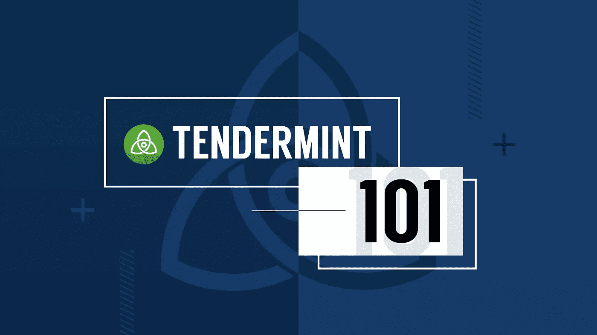

# Tendermint 解释说——将 BFT 的 PoS 带入公共区块链领域

> 原文：<https://medium.com/hackernoon/tendermint-explained-bringing-bft-based-pos-to-the-public-blockchain-domain-8e5b0d360fa3>

## 开胃菜

*   关于定义，请阅读由[一个](https://medium.com/u/199d4ef6bb67#consensus-overview) `[round](http://tendermint.readthedocs.io/projects/tools/en/master/introduction.html#consensus-overview)` [。像蜜獾 BFT 这样的协议在异步下就属于这类非确定性协议。通常，对于单轮通信，它们需要三次可靠的广播。](http://tendermint.readthedocs.io/projects/tools/en/master/introduction.html#consensus-overview)

    Tendermint 是一个完全确定的协议；协议中没有任何随机性。领导者是通过实施中定义的数学函数确定性地选出的。因此，我们能够从数学上证明该系统是活的，并且该协议保证做出决定。

    ## 轮流领导人选举

    Tendermint 以加权循环方式在验证器集(即块提议器)中循环。验证者授予他们的股份(即投票权)越多，他们的权重就越大，相应地，他们当选领导人的次数也就越多。举例来说，如果一个验证者与另一个验证者具有相同的投票权，那么他们将被协议选举相同的次数。

    **算法工作原理的简化解释如下:**

    1.  建立验证器权重
    2.  验证者当选后，轮到他们提出阻挠
    3.  重量被重新计算，在回合结束后减少一些数量
    4.  随着每一轮的进行，权重随着投票权的增加而递增
    5.  再次选择验证器

    因为[协议确定性地选择区块提议者](https://github.com/tendermint/tendermint/blob/master/docs/specification/new-spec/reactors/consensus/proposer-selection.md)，假设你知道验证者集合和每个验证者的投票权，你可以准确地计算出下一轮`x`、`x + 1`，...，`x + n`。正因为如此，批评家认为 Tendermint 不够分散。当您可以预测谁将是领导者时，攻击者可以瞄准这些领导者并对他们发起 DDoS 攻击，并有可能阻止链的发展。我们通过在 Tendermint 中实现一种叫做[哨兵架构](https://github.com/tendermint/tendermint/blob/master/docs/specification/new-spec/p2p/node.md)的东西来缓解这种攻击媒介。

    # P2P 网络协议

    ## 哨兵节点体系结构

    正确设置的验证器永远不会暴露其验证器节点的 IP 地址，也不会接受到其验证器节点的传入连接。一个设置正确、防御良好的验证器会主动产生[哨兵节点](https://github.com/tendermint/tendermint/blob/master/docs/specification/new-spec/p2p/node.md)，它们充当网络的完整节点代理，以混淆它们的验证器节点的真实位置。p2p 层的 IP 地址永远不会暴露。

    也就是说，利用哨兵节点架构是选择加入；验证器有责任维护一个容错的完整节点。这就是我们基于秘密经济激励做出协议外假设的地方。假设是，验证器想要采取所有的预防措施，以便保持容错，保持可用，并最终在保持网络活动中发挥作用。因为如果他们不这样做，他们就会因为离线超过一定时间而被踢出验证器集。

    ## 对等交换(PEX)反应堆

    Tendermint 借鉴了比特币的对等发现协议。更具体地说，Tendermint 采用了来自 [btcd](https://github.com/btcsuite/btcd) 的 p2p 通讯录，这是 Go 中比特币的替代实现。默认情况下， [PEX 启用动态对等点发现](https://github.com/tendermint/tendermint/blob/master/docs/specification/new-spec/reactors/pex/pex.md)。

    # 实践中的新技术

    说到底，除了花哨的算法设计和学术术语，Tendermint 到底有什么用途？

    坏消息是，日常生活中人们不会发现 Tendermint 有用。好消息是，应用程序开发人员可以在协议和最终用户之间架起一座桥梁。Tendermint 的设计具有足够的可定制性和灵活性，适合任何需要共识协议的环境，无论是公共环境还是企业环境。

    Tendermint 非常适合希望在自己的区块链上实现应用程序的开发人员。它是预组装的，所以如果开发者选择一个纯粹的、基于 BFT 的共识引擎来驱动他们的 dapp zone T1，他们可以很容易地做到。

    当用户开始用 Cosmos-SDK 实现他们的高级业务逻辑时，有趣的部分就来了。与 Tendermint 的共识/网络层的接口是通过 Tendermint 套接字协议完成的，我们称之为应用区块链接口，或 [ABCI](http://tendermint.readthedocs.io/projects/tools/en/master/introduction.html#abci-overview) 。

    *   **应用层:** [**Cosmos-SDK(区块链应用框架)**](https://blog.cosmos.network/hello-world-the-cosmos-sdk-is-ready-for-takeoff-b8857b4057db)
    *   [Cosmos-SDK Alpha 版本](https://blog.cosmos.network/cosmos-sdk-alpha-release-9618e9479638)
    *   [ABCI 嫩薄荷](http://tendermint.readthedocs.io/projects/tools/en/master/introduction.html#abci-overview)

    ## 正在进行的研究

    目前，我们正在深入研究 BLS 签名，这可能会导致 Tendermint 块头的大小从 3.2 KB(约 100 个验证器)减少到 64 字节。

    我们还设计了一种以安全的方式随机化循环提议者选择函数的方法，使 DDoS 攻击下一个提议者变得更加困难，但最初的步骤是哨兵节点架构。

    # 宇宙学院成立大会！

    我们将与 BFT 分布式系统高级研究员扎科·米罗舍维奇在加州柏克莱举办一场即将到来的会议，他将会就 Tendermint 的一切进行问答。我们将直播这次聚会，并在[宇宙网的 YouTube 频道](http://bit.ly/2GTuJgx)上发布。

    *   **5 月 26 日报名参加第一届宇宙学院聚会:** [**这里**](https://www.eventbrite.com/e/cosmos-academy-tendermint-101-tickets-45851274396) **。**

# 我是谁

被解放的强哥是 Tendermint 通信和宇宙学院的负责人。她是 Cosmos 博客的主编，为所有来自 Cosmos 的视频和文字内容提供创作方向。首先，她撰写关于协议、分布式系统和区块链理工大学的技术主题的文章，面向各个层次的广大读者。在宇宙号之前，她来自美国宇航局的喷气推进实验室，从未离开过太空。

## 额外资源

*   阅读对 Tendermint 核心高级研究科学家扎科·米罗舍维奇的采访:[这里](https://github.com/tendermint/aib-data/blob/develop/medium/TendermintBFT.md)。
*   Jepsen 的 Kyle Kingsbury 展示 BFT 嫩薄荷:

*   有关 Tendermint 的技术规范，请参见[扎克拉姆齐](http://tendermint.readthedocs.io/projects/tools/en/master/)[的](https://medium.com/u/98ae03465a1a?source=post_page-----8e5b0d360fa3--------------------------------)[阅读文档](http://tendermint.readthedocs.io/projects/tools/en/master/)。
*   阅读原 [Tendermint 白皮书](https://tendermint.com/static/docs/tendermint.pdf)作者 [Jae Kwon](https://medium.com/u/c010ef5a0ddf?source=post_page-----8e5b0d360fa3--------------------------------) 。
*   阅读[伊森·布赫曼](https://medium.com/u/8e80eeab82e4?source=post_page-----8e5b0d360fa3--------------------------------)的[分布式国家](https://atrium.lib.uoguelph.ca/xmlui/bitstream/handle/10214/9769/Buchman_Ethan_201606_MAsc.pdf)的历史。
*   请听软件工程每日播客中 Ethan Buchman 与[的](https://medium.com/u/8e80eeab82e4?source=post_page-----8e5b0d360fa3--------------------------------)[分布式状态](https://softwareengineeringdaily.com/2018/03/26/consensus-systems-with-ethan-buchman/)的历史。
*   与[扎基·马年](https://medium.com/u/27171bfe37f1?source=post_page-----8e5b0d360fa3--------------------------------)一起在比特币播客网上听[早期的区块链生态系统](http://thebitcoinpodcast.com/hashing-it-out-5/)。