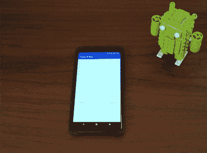
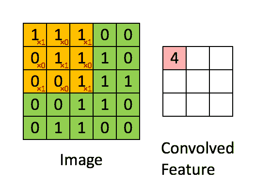
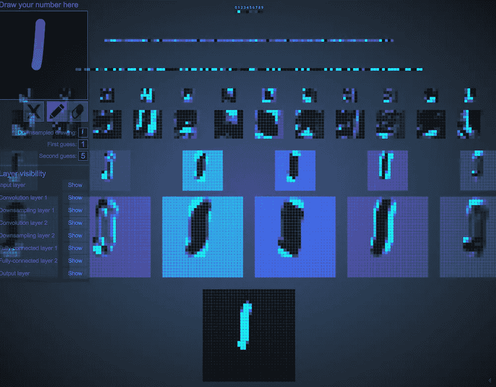
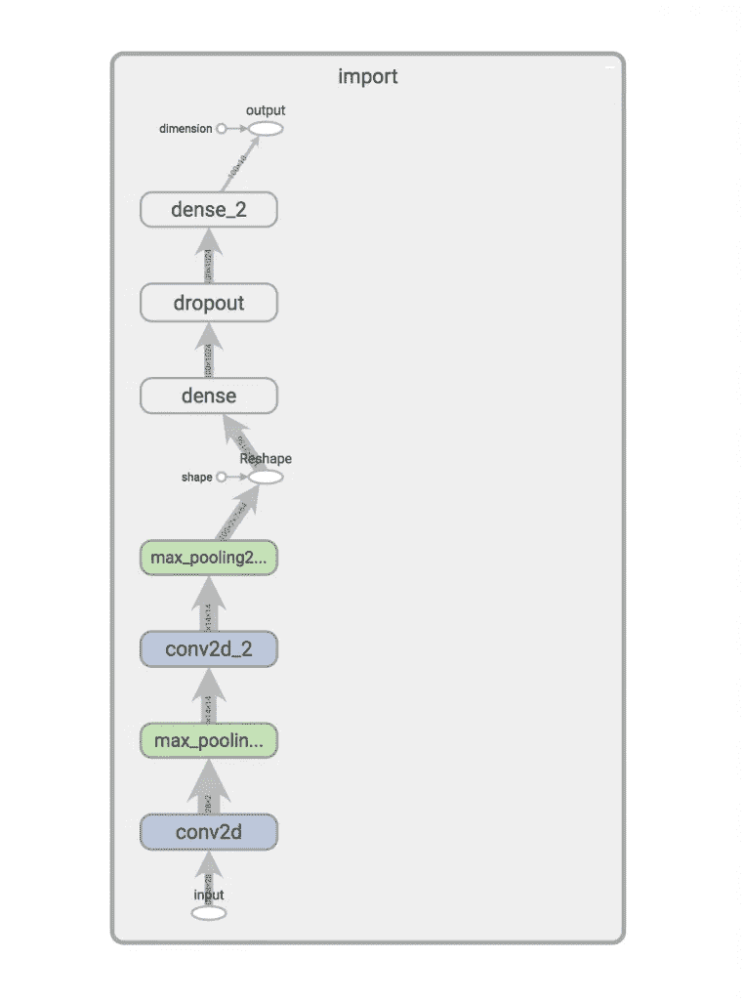
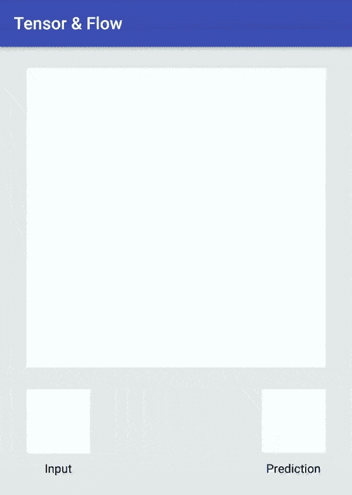

# 张量和流:第 1 部分，Android 上的张量流和机器学习

> 原文：<https://medium.com/hackernoon/tensor-flow-part-1-tensorflow-machine-learning-on-android-73fd536a1a7c>

Android 和 iOS 上的许多流行应用广泛使用了设备上的 T2 机器学习。Gmail 或 Siri 的 Inbox 等应用程序利用了设备上的机器学习，因为它速度更快，在保护用户隐私方面做得更好。 [iOS](https://developer.apple.com/machine-learning/) 和 [Android](https://developer.android.com/ndk/guides/neuralnetworks/index.html) 都有适当的 API 支持在设备上使用，神经网络用于预测目的。在这两个平台上，您可以连接自己的神经网络，或者使用 TensorFlow 这样的高级框架来为您完成繁重的工作。

Tensor & Flow 是一个由两部分组成的系列，其中我们将探索将机器学习模型部署到 Android 应用程序所需做的细节。我将在第 1 部分使用 TensorFlow Mobile，在第 2 部分使用 TensorFlow Lite。



Tensor & Flow demo app on Android

# 训练神经网络

这个旅程的第一步是训练一个我可以部署的神经网络。有大量的教程指导有抱负的机器学习工程师构建模型，这些模型可以对花朵进行分类，识别图片中的对象，检测垃圾邮件，甚至对图片应用过滤器。我选择了一个相当容易理解的教程，建立一个识别手写数字的模型。

[TF 层指南:构建卷积神经网络](https://www.tensorflow.org/tutorials/layers)向我们展示了配置和训练神经网络以识别手写字符的整个过程。本指南向我们介绍神经网络配置、下载用于训练的数据集以及训练过程。

第一步是配置我们的神经网络。

# 神经网络

MNIST 教程训练了一个卷积神经网络(CNN)来识别手写数字。



Feature extraction using convolution — [Source](http://deeplearning.stanford.edu/wiki/index.php/Feature_extraction_using_convolution)

CNN 由几个不同的层组成:

*   卷积层，使用卷积运算从图像中提取特征。
*   合并图层，对图像进行下采样，这减少了处理时间，提高了训练和推理性能。
*   密集层，使用卷积层中提取的特征预测类别。

在继续之前，我鼓励你访问一下[数据科学博客](https://ujjwalkarn.me/)，在那里，Ujjwal Karn 写了一篇非常直观的博文，名为[“卷积神经网络的直观解释”](https://ujjwalkarn.me/2016/08/11/intuitive-explanation-convnets/)。一旦你写完博文，请访问 [2D 卷积神经网络可视化](http://scs.ryerson.ca/~aharley/vis/conv/flat.html)，观看 CNN 的精彩演示。



2D Visualization of a CNN

关于神经网络的更多细节在此示例中，输入层是输入数据大小的一对一映射。MNIST 数据集包含数万个手写数字样本和标签。每个样本都是手写数字的单色图像，28 像素 x 28 像素。图像是一个二维数组，包含像素数据，这意味着我们的输入层有 784 个输入节点(28 x 28 = 784)。

输出层是一个 [Logits](https://en.wikipedia.org/wiki/Logit) 层，它将我们的预测作为原始值发出。网络使用几个附加函数将原始数据转换成预测和概率(用于训练)。

# 集成的培训和准备

训练神经网络模型并将其集成到 Android 应用程序中的过程类似于:

1.  训练神经网络。
2.  冻结和优化用于推理的张量流图。
3.  在 TensorBoard 中查看神经网络模型。(可选)
4.  将优化的图形导入我们的 Android 项目。

根据您的计算平台，为培训做好一切准备可能比实际培训更困难。我的设置:

*   运行 MacOS 10.13 的 MacBook Pro (2015)
*   IDE: PyCharm，通过自动导入 Python 依赖项和提供代码调试功能使这变得更加容易
*   Python 2.7.13
*   张量流 1.5
*   安卓工作室 3.0.1

我们的指南“TF 层指南”引导我们建立我们的神经网络和训练。在浏览了几遍指南后，我做了一个调整，使集成到 Android 应用程序变得更加容易，我给我的输入和输出层分别起了明确的名字，“输入”和“输出”。我在花了几个小时试图自己找出答案后这样做了。如果不命名神经网络中的层，它们将被赋予默认名称。您需要在 TensorBoard 中打开您的训练图，以确定您的图层的名称。

我们将以这个 Python 脚本结束:

```
from __future__ import absolute_import
from __future__ import division
from __future__ import print_function# Imports
import numpy as np
import tensorflow as tftf.logging.set_verbosity(tf.logging.INFO)def cnn_model_fn(features, labels, mode):
    """Model function for CNN."""
    # Input Layer
    input_layer = tf.reshape(features["x"], [-1, 28, 28, 1], name="input")# Convolutional Layer #1
    conv1 = tf.layers.conv2d(
      inputs=input_layer,
      filters=32,
      kernel_size=[5, 5],
      padding="same",
      activation=tf.nn.relu)# Pooling Layer #1
    pool1 = tf.layers.max_pooling2d(inputs=conv1, pool_size=[2, 2], strides=2)# Convolutional Layer #2 and Pooling Layer #2
    conv2 = tf.layers.conv2d(
      inputs=pool1,
      filters=64,
      kernel_size=[5, 5],
      padding="same",
      activation=tf.nn.relu)
    pool2 = tf.layers.max_pooling2d(inputs=conv2, pool_size=[2, 2], strides=2)# Dense Layer
    pool2_flat = tf.reshape(pool2, [-1, 7 * 7 * 64])
    dense = tf.layers.dense(inputs=pool2_flat, units=1024, activation=tf.nn.relu)
    dropout = tf.layers.dropout(
      inputs=dense, rate=0.4, training=mode == tf.estimator.ModeKeys.TRAIN)# Logits Layer
    logits = tf.layers.dense(inputs=dropout, units=10)predictions = {
      # Generate predictions (for PREDICT and EVAL mode)
      "classes": tf.argmax(input=logits, axis=1, name="output"),
      # Add `softmax_tensor` to the graph. It is used for PREDICT and by the
      # `logging_hook`.
      "probabilities": tf.nn.softmax(logits, name="softmax_tensor")
    }if mode == tf.estimator.ModeKeys.PREDICT:
        return tf.estimator.EstimatorSpec(mode=mode, predictions=predictions)# Calculate Loss (for both TRAIN and EVAL modes)
    loss = tf.losses.sparse_softmax_cross_entropy(labels=labels, logits=logits)# Configure the Training Op (for TRAIN mode)
    if mode == tf.estimator.ModeKeys.TRAIN:
        optimizer = tf.train.GradientDescentOptimizer(learning_rate=0.001)
        train_op = optimizer.minimize(
            loss=loss,
            global_step=tf.train.get_global_step())
        return tf.estimator.EstimatorSpec(mode=mode, loss=loss, train_op=train_op)# Add evaluation metrics (for EVAL mode)
    eval_metric_ops = {
      "accuracy": tf.metrics.accuracy(
          labels=labels, predictions=predictions["classes"])}
    return tf.estimator.EstimatorSpec(mode=mode, loss=loss, eval_metric_ops=eval_metric_ops)def main(unused_argv):
    # Load training and eval data
    mnist = tf.contrib.learn.datasets.load_dataset("mnist")
    train_data = mnist.train.images  # Returns np.array
    train_labels = np.asarray(mnist.train.labels, dtype=np.int32)
    eval_data = mnist.test.images  # Returns np.array
    eval_labels = np.asarray(mnist.test.labels, dtype=np.int32)# Create the Estimator
    mnist_classifier = tf.estimator.Estimator(model_fn=cnn_model_fn, model_dir="/tmp/mnist_convnet_model")# Set up logging for predictions
    tensors_to_log = {"probabilities": "softmax_tensor"}
    logging_hook = tf.train.LoggingTensorHook(tensors=tensors_to_log, every_n_iter=50)# Train the model
    train_input_fn = tf.estimator.inputs.numpy_input_fn(
        x={"x": train_data},
        y=train_labels,
        batch_size=100,
        num_epochs=None,
        shuffle=True)
    mnist_classifier.train(
        input_fn=train_input_fn,
        steps=20000,
        hooks=[logging_hook])# Evaluate the model and print results
    eval_input_fn = tf.estimator.inputs.numpy_input_fn(
        x={"x": eval_data},
        y=eval_labels,
        num_epochs=1,
        shuffle=False)
    eval_results = mnist_classifier.evaluate(input_fn=eval_input_fn)
    print(eval_results)if __name__ == "__main__":
    tf.app.run()
```

它在`cnn_model_fn`中配置我们的神经网络。培训在`main`进行。在我们的训练步骤中，我们下载 MNIST 数据集，它已经被分解成训练和评估块。在训练神经网络时，您希望确保训练数据的子集可用于评估目的。这允许你在训练过程中测试你的神经网络的准确性。这也可以防止你的神经网络过度适应训练数据。

使用`python train_cnn.py`命令开始训练也很简单。根据计算机的硬件配置，培训可能需要几分钟到几小时不等。这个脚本被配置为训练网络 20，000 次迭代。当您的训练脚本运行时，您将定期看到显示训练过程进度的输出。

```
INFO:tensorflow:global_step/sec: 2.75874
    INFO:tensorflow:probabilities = [[ 0.10167542  0.10189584  0.10309957  0.11525927  0.09659223  0.08847987
       0.09406721  0.10499229  0.093654    0.10028425]
     [ 0.10425898  0.11098097  0.10286383  0.09657481  0.10871311  0.08486023 0.09235432  0.09499202  0.10640075  0.09800103]
     [ 0.1033088   0.11629853  0.11034065  0.0981971   0.08924178  0.09668511 0.10001212  0.09568888  0.08589367  0.10433336]
     [ 0.10667751  0.10386481  0.09242702  0.11075728  0.08897669  0.09205832 0.10070907  0.10779921  0.08927511  0.10745502]
    ...
```

它显示了训练的速率和样本图像成为一个数字的概率数组。例如:

```
[ 0.00001972  0.00000233  0.00022174  0.00427989  0.00001842  0.97293282 0.00000114  0.00013626  0.00584014  0.01654756]
```

看起来有 97.3%的可能性该样本图像是由该索引表示的数字(5 或 6，取决于起始索引)。随着训练的继续，这些值变得更加确定。神经网络正在提高其识别手写数字的能力。

在训练开始时比较这些概率:

```
[ 0.1033088 0.11629853 0.11034065 0.0981971 0.08924178 0.09668511 0.10001212 0.09568888 0.08589367 0.10433336]
```

有了这些，接近尾声:

```
[ 0.00000006 0.0000001 0.00000017 0.00000019 0.99616736 0.00000038, 0.00000154 0.00000558 0.00001187 0.00381267]
```

你会注意到网络的预测越来越准确。

一旦训练完成，它将根据标记图像的第二个数据集测试神经网络。这用于计算训练网络的准确度。

```
INFO:tensorflow:Saving dict for global step 20000: accuracy = 0.9708, global_step = 20000, loss = 0.0991706
```

截止到第 20000 步，我们的神经网络的预测准确率达到了 97.8%！稍微讲一下`loss`值。训练神经网络的目标是最小化损失，或者最小化预测值和实际值之间的差异。一般来说，`loss`量较低的神经网络会给出更准确的预测。

现在培训已经完成，我们在`/tmp/mnist_convnet_model`中结束了一堆文件:

```
checkpoint
eval
events.out
graph.pbtxt
model.ckpt-15199.data-00000-of-00001
model.ckpt-15199.index
model.ckpt-15199.meta
model.ckpt-20000.data-00000-of-00001
model.ckpt-20000.index
model.ckpt-20000.meta
```

我们在接下来的步骤中关注的文件是:

```
graph.pbtxt // graph definition file, human readable protobuf format
model.ckpt-20000.data-00000-of-00001  //  variables from our graph model.ckpt-20000.index // identifies the checkpoint / training step
model.ckpt-20000.meta  // stores the structure of the graph
```

在将它们集成到 Android 应用程序之前，我们需要做一些调整。我们将:

1.  冻结我们的图表和值。这将神经网络和张量值存储在一个二进制图形定义文件(.pb)，而不是单独的文件。
2.  优化我们的图表进行推理。训练步骤完成后，我们的图包含了在训练过程中使用的节点。进行推理时不需要这些节点。这种优化将删除这些额外的节点和张量。这减小了图表的大小，也降低了我们在图表中遇到 TensorFlow Mobile 不支持的操作的可能性。

## 极冷的

冻结我们的图表就像执行在 [TensorFlow 存储库](https://github.com/tensorflow/tensorflow/blob/master/tensorflow/python/tools/freeze_graph.py)中可用的 Python 脚本一样简单。

执行看起来像:

```
python freeze_graph.py \
   --input_graph=/tmp/mnist_convnet_model/graph.pbtxt \
   --input_binary=false \
   --input_checkpoint=/tmp/mnist_convnet_model/model.ckpt-20000 \
   --output_graph=/tmp/mnist_convnet_model/frozen_graph.pb \
   --output_node_names=output \
```

当这个脚本完成时，您将在`/tmp/mnist_convnet_model`中看到一个新文件`frozen_graph.db`。它包含我们的图形定义和网络值。

## 推理优化

现在，我们优化我们的神经网络进行推理。在 [TensorFlow 资源库](https://github.com/tensorflow/tensorflow/blob/master/tensorflow/python/tools/optimize_for_inference.py)中也有一个可用的脚本。针对推理的优化移除了图形中仅用于训练的部分。

```
python optimize_for_inference.py \
   --input=/tmp/mnist_convnet_model/frozen_graph.pb \
   --output=/tmp/mnist_convnet_model/optimized_graph.pb \
   --input_names=input \
   --output_names=output
```

当这个脚本完成时，你会在`/tmp/mnist_convnet_model`中看到一个新文件`optimized_graph.db`。这是我们神经网络模型的最终状态。

这是我们的冻结和优化图形的张量视图。



如果您想用 TensorBoard 可视化您的优化图形，请查看[如何检查预训练的 TF 模型](/@daj/how-to-inspect-a-pre-trained-tensorflow-model-5fd2ee79ced0)。

我们现在准备开始在一个 Android 项目中使用它。

# 集成到 Android 应用程序中

部署经过训练的张量流神经网络模型是一项相对较难的任务。

## 添加 TensorFlow 移动依赖项

将 TensorFlow 移动依赖项添加到`app/`文件夹中的`build.gradle`，然后同步项目的 Gradle 依赖项。

```
implementation "org.tensorflow:tensorflow-android:1.5.0"
```

我们将使用 TensorFlow Mobile 提供的类`TensorFlowInferenceInterface`与我们的模型进行交互。它提供了几种加载模型、向网络提供新数据、运行推理和提取预测的方法。

## 添加模型

将优化后的图形复制到您的 Android 项目中。应该是复制到了`src/main/assets`。`TensorFlowInferenceInterface`将从这个文件夹加载模型到它的构造函数中。

## 一些建筑

我们的应用程序将允许用户用手指画一个数字。我们会将他们的图画转换成位图，并将其传递给我们的神经网络进行预测。认识到这一点，我要做的第一件事就是创建一个`Classifier`界面。

```
interface Classifier { 
   fun predict(input: IntArray): 
   Int fun close() 
}
```

我选择创建一个接口，这样我就可以轻松地创建一个分类器的多个实现。一个使用 TensorFlow Mobile，一个使用 TensorFlow Lite(在第 2 部分中)。

## 使用 TensorFlowInferenceInterface

如前所述`TensorFlowInferenceInterface`是我们将如何与我们训练有素的网络互动。

让我们通过编写`TFMobileClassifier`来实现我们的`Classifier`接口。

```
class TFMobileClassifier(context: Context,
   modelFilename: String,
   private val inputName: String,
   private val inputDimensions: Pair<Long , Long>,
   private val outputName: String,
   private val outputSize: Int) : Classifier { override predict(input: IntArray): Int {
      TODO()
   } override close() {
      TODO()
   }
}
```

我们的`TFMobileClassifier`有一个带 6 个参数的构造函数。`Context`用于通过`AssetManager`访问文件。剩下的参数指定了我们的模型文件以及输入和输出节点规范。

实例化一个`TFMobileClassifier`。

```
val classifier: Classifier = TFMobileClassifier(this,
   modelFilename = "file:///android_asset/optimized_graph.pb",
   inputName = "input",
   inputDimensions = Pair(28, 28),
   outputName = "output",
   outputSize = 100)
```

让我们创造我们的`TensorFlowInferenceInterface`。

```
private val assetManager = context.assetManager
private val inferenceInterface = 
   TensorFlowInferenceInterface(assetManager, modelFilename)
```

现在我们已经有了一个`TensorFlowInferenceInterface`，让我们通过实现`predict()`来开始使用它。

```
override fun predict(input: FloatArray) {
   // 1) create an array to store our predictions
   val predictions = LongArray(100) // 2) feed our data into input layer of our neural network
   inferenceInterface.feed(inputName, floatInput, 1,      
       inputDimensions.first, inputDimensions.second, 1) // 3) run inference between the input and specified output nodes
   inferenceInterface.run(arrayOf(outputName)) // 4) fetch the predictions from the specified output node
   inferenceInterface.fetch(outputName, predictions) // 5) tabulate our predictions and return the most probable
   return processPredictions(predictions)
}
```

这里要谈几件事:

1.  我们的输出节点发出 100 个值，因此我们需要将它们存储在一个至少包含 100 个元素的数组中
2.  当您计算 X * Y * Z 数组中的总元素时，我们的输入数据数组大小必须等于该值。例如，我们的神经网络使用 28 x 28 的单色图像。我们的尺寸将会是:28×28×1。这意味着我们的输入数据数组应该包含 784 个值。
3.  当运行推理时，我们需要指定推理将结束的输出节点的名称。
4.  推断完成后，我们将把结果存储在 100 个元素的预测数组中。给定输入数据，这个特定的神经网络返回包含 100 个预测的数组。回到我们的 Python 训练脚本，我们用 batch_size = 100 来训练我们的网络。这意味着，即使我们给神经网络提供一张图片，它也会给我们 100 个关于它认为用户画了什么的预测。
5.  因为我们有 100 个预测，我们需要计算每个预测的出现次数，然后返回预测次数最多的数字。我们将使用这个值作为我们的预测。

我们实施了`TFMobileClassifier`。

```
package com.emuneee.tensorandflow.classifierimport android.content.Context
import android.content.res.AssetManager
import org.tensorflow.contrib.android.TensorFlowInferenceInterface
import timber.log.Timber
import java.util.*
import kotlin.Comparator/**
 * Created by evan on 2/28/18.
 */
class TFMobileClassifier(context: Context,
   modelFilename: String,
   private val inputName: String,
   private val inputDimensions: <Long , Long>,
   private val outputName: String,
   private val outputSize: Int) : Classifier { private val assetManager: AssetManager = context.assets
   private val inferenceInterface = 
      TensorFlowInferenceInterface(assetManager, modelFilename) override fun predict(input: IntArray): Int {
        val floatInput = input.map { it.toFloat() }
                .toFloatArray()
        // 1) create an array to store our predictions
        val predictions = LongArray(outputSize) // 2) feed our data into input layer of our neural network
        inferenceInterface.feed(inputName, floatInput, 1, 
           inputDimensions.first, inputDimensions.second, 1) // 3) run inference between the input and output nodes
        inferenceInterface.run(arrayOf(outputName)) // 4) fetch the predictions from the specified output node
        inferenceInterface.fetch(outputName, predictions) // 5) tabulate our predictions and return the most probable
        return processPredictions(predictions)
   } private fun processPredictions(predictions: LongArray): Int {
      val counts = predictions.toTypedArray()
            .groupingBy { it }
            .eachCount()
      val predictionSet = TreeSet<Pair<Long, Int>>    
         (Comparator<Pair<Long, Int>> { o1, o2 ->     
         o2!!.second.compareTo(o1!!.second) })
      counts.toList()
            .forEach { pair -> predictionSet.add(pair) }
      val pair = predictionSet.first()
      Timber.d("Selecting ${pair.first} @ ${(pair.second / 100.0) *
          100}% confidence")
      return pair.first.toInt()
   } override fun close() {
      inferenceInterface.close()
   }
}
```

## 使用分类器

现在我们已经实现了一个`Classifier`，是时候构建一些 UI 来允许用户用指尖提交数据了。为了简洁起见，我将跳过许多纯粹的 Android 概念，比如布局和点击监听器等。我们的用户界面有 3 个组件:

1.  我们有一个自定义的`CanvasView`，允许用户用他们的指尖在一个`Canvas`上画画。当用户在`CanvasView`上完成绘图时，它将通过`CanvasView.DrawListener`发出一个代表用户绘图的位图
2.  我们将有一个类似于提交给神经网络的实际数据的`ImageView`。
3.  最后，我们将有一个显示预测的`TextView`。

在我们继续之前，我们需要解决一个问题。我们需要将用户输入转换为类似于 MNIST 数据集中图像的数据格式。这一点至关重要，因为数据越接近原始训练数据，我们的预测就越准确。MNIST 训练数据集用 28×28 单色图像填充，其中对于给定的像素，值的范围从 0(白色)到 255(黑色)。

下面是我们如何将位图从`CanvasView`转换成 28×28 的单色位图:

```
private fun toMonochrome(bitmap: Bitmap): Bitmap {
        // scale bitmap to 28 by 28
        val scaled = Bitmap.createScaledBitmap(bitmap, 28, 28, false)// convert bitmap to monochrome
        val monochrome = Bitmap.createBitmap(28, 28, Bitmap.Config.ARGB_8888)
        val canvas = Canvas(monochrome)
        val ma = ColorMatrix()
        ma.setSaturation(0f)
        val paint = Paint()
        paint.colorFilter = ColorMatrixColorFilter(ma)
        canvas.drawBitmap(scaled, 0f, 0f, paint)val width = monochrome.width
        val height = monochrome.heightval pixels = IntArray(width * height)
        monochrome.getPixels(pixels, 0, width, 0, 0, width, height)// Iterate over height
        for (y in 0 until height) {for (x in 0 until width) {
                val pixel = monochrome.getPixel(x, y)
                val lowestBit = pixel and 0xffif (lowestBit &lt; 128) {
                    monochrome.setPixel(x, y, Color.BLACK)
                }
                else {
                    monochrome.setPixel(x, y, Color.WHITE)
                }
            }
        }
        return monochrome
}
```

`toMonochrome()`的输出用于让用户了解神经网络的输入是什么样的。它还被转换成适合推理的格式:

```
private fun formatInput(bitmap: Bitmap): IntArray {
   val pixels = IntArray(bitmap.width * bitmap.height)
   var i = 0 for (y in 0 until bitmap.height) { for (x in 0 until bitmap.width) {
         pixels[i++] = if (bitmap.getPixel(x, y) == Color.BLACK) 255 
                       else 0
      }
    }
    return pixels
}
```

我们在这里做两件事。首先，我们将 28×28 位图展平成一个 784 元素的整数数组。最后，如果像素值是白色或黑色，我们将每个像素值分别转换为`0`或`255`。

我们的`MainActivity.kt`看起来像:

```
package com.emuneee.tensorandflow

import android.graphics.*
import android.support.v7.app.AppCompatActivity
import android.os.Bundle
import kotlinx.android.synthetic.main.activity_main.*
import android.graphics.Bitmap
import com.emuneee.tensorandflow.classifier.Classifier
import com.emuneee.tensorandflow.classifier.TFMobileClassifier
import com.emuneee.tensorandflow.view.CanvasView
import timber.log.Timber

class MainActivity : AppCompatActivity() {

    private val classifier: Classifier by *lazy* **{** TFMobileClassifier(this,
                modelFilename = "file:///android_asset/optimized_graph.pb",
                inputName = "input",
                inputDimensions = Pair(28, 28),
                outputName = "output",
                outputSize = 100)
    **}** override fun onCreate(savedInstanceState: Bundle?) {
        super.onCreate(savedInstanceState)
        setContentView(R.layout.*activity_main*)
        Timber.plant(Timber.DebugTree())

        canvas.drawListener = object: CanvasView.DrawListener {
            override fun onNewBitmap(bitmap: Bitmap) {

                Thread(*Runnable* **{** // convert the drawing to a 28x28 monochrome image
                    val monochrome = toMonochrome(bitmap)

                    // set the nn input image
                    runOnUiThread **{** scaledCanvas.setImageBitmap(monochrome) **}** // convert the data to something that resembles the MNIST training data set
                    val inputData = toIntArray(monochrome)

                    // predict
                    val pred = classifier.predict(inputData)
                    runOnUiThread **{** prediction.*text* = pred.toString() **}

                }**).start()
            }
        }
    }

    override fun onDestroy() {
        super.onDestroy()
        classifier.close()
    }

    */**
     * Converts a Bitmap to a 28 x 28 monochrome bitmap
     */* private fun toMonochrome(bitmap: Bitmap): Bitmap {
        // scale bitmap to 28 by 28
        val scaled = Bitmap.createScaledBitmap(bitmap, 28, 28, false)

        // convert bitmap to monochrome
        val monochrome = Bitmap.createBitmap(28, 28, Bitmap.Config.ARGB_8888)
        val canvas = Canvas(monochrome)
        val ma = ColorMatrix()
        ma.setSaturation(0f)
        val paint = Paint()
        paint.*colorFilter* = ColorMatrixColorFilter(ma)
        canvas.drawBitmap(scaled, 0f, 0f, paint)

        val width = monochrome.*width* val height = monochrome.*height* val pixels = IntArray(width * height)
        monochrome.getPixels(pixels, 0, width, 0, 0, width, height)

        for (y in 0 *until* height) {

            for (x in 0 *until* width) {
                val pixel = monochrome.getPixel(x, y)
                val lowestBit = pixel and 0xff

                if (lowestBit < 128) {
                    monochrome.setPixel(x, y, Color.*BLACK*)
                }
                else {
                    monochrome.setPixel(x, y, Color.*WHITE*)
                }
            }
        }
        return monochrome
    }

    */**
     * Converts a bitmap to a flattened integer array
     */* private fun toIntArray(bitmap: Bitmap): IntArray {
        val pixels = IntArray(bitmap.*width* * bitmap.*height*)
        var i = 0

        for (y in 0 *until* bitmap.*height*) {

            for (x in 0 *until* bitmap.*width*) {
                pixels[i++] = if (bitmap.getPixel(x, y) == Color.*BLACK*) 255 else 0
            }
        }
        return pixels
    }
}
```

就是这样！我们使用 TensorFlow 训练了一个神经网络来识别手写数字，然后通过一个 Android 应用程序成功部署了它。



在第 2 部分中，我将使用 TensorFlow Lite 重新实现我们的分类器接口，而不是 TensorFlow Mobile。TensorFlow Lite 是一个更轻量级的框架，用于在移动设备上进行推理。它还可以在 Android 8.1+设备上利用专门的神经网络加速硬件。

同时，所有代码、脚本和模型都可以在 [GitHub](https://github.com/emuneee/tensorandflow) 上访问。

*原载于 2018 年 3 月 8 日*[*emuneee.com*](https://emuneee.com/blog/2018/03/08/tensor_and_flow_pt_1/)*。*