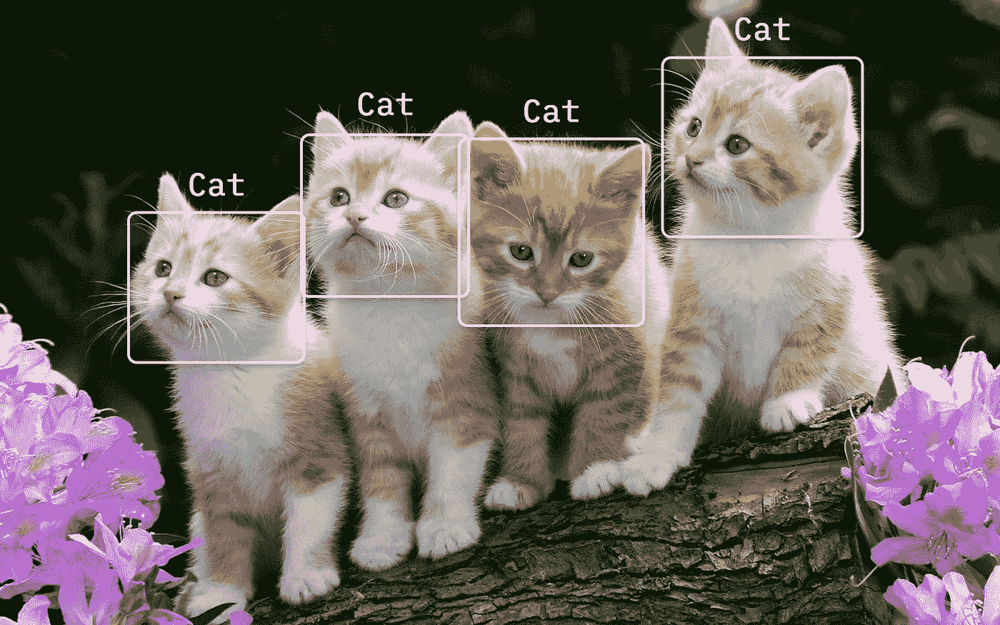
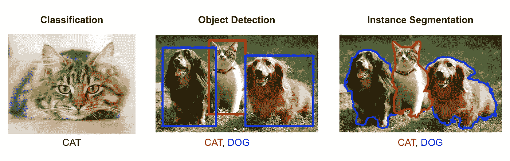

# TensorFlow.js —用 10 行代码实现实时物体检测

> 原文：<https://medium.com/hackernoon/tensorflow-js-real-time-object-detection-in-10-lines-of-code-baf15dfb95b2>



在我的上一篇文章中，我向你展示了如何在浏览器中进行图像分类。

图像分类可以是一个非常有用的工具，它可以让我们了解图像中有什么。然而，有时我们想要更多。这可能有点违反直觉，但仅仅因为机器学习模型可以说出图像中的内容，并不意味着它可以告诉我们它在图像中的位置。我们需要一个不同的架构。

这就是物体检测发挥作用的地方。

对象检测提供了计算场景中有多少对象、跟踪运动和简单定位对象位置的能力。



在本教程结束时，我们将拥有一个全功能的实时对象检测 web 应用程序，它将通过我们的网络摄像头跟踪对象。

# 检测物体

为了进行对象检测预测，我们需要做的就是导入 TensorFlow 模型，`[coco-ssd](https://github.com/tensorflow/tfjs-models/tree/master/coco-ssd)`，它可以用像 NPM 这样的包管理器安装，或者简单地导入到一个`<script>`标签中。然后，我们可以加载模型，并做出预测。

> **注意:**加载模型可能需要几秒钟。最好加载模型一次，并保存对它的引用。

我们传递给检测函数的图像只是对 html ``标签的引用:

```

```

在我们得到我们的预测之后，我们需要一种方法把它显示到屏幕上。我们的预测响应将是一个包围盒及其置信度得分的列表。它应该是这样的:

```
[{
  bbox: [x, y, width, height],
  class: "cat",
  score: 0.8380282521247864
}]
```

为了绘制边界框，我们将利用一个`<canvas>`元素:

```
<canvas id="canvas">
```

canvas 元素允许我们使用 strokeRect 函数，它与我们的预测结果完美地对应起来:

# 简单的检测演示

# 来自网络摄像头的流

在网络摄像头流上运行实时检测几乎与从``标签更改为`<video>`标签一样简单…唯一的例外是启动网络摄像头的巨大代码块:

然后，我们可以将视频元素传递给模型进行检测。然而，这一次我们将调用`requestAnimationFrame`，它将尽可能快地在无限循环中反复调用我们的检测函数，当它跟不上时跳过帧。

# 实时检测演示

 [## TensorFlow.js 实时对象检测演示

z364noozrm.codesandbox.io](https://z364noozrm.codesandbox.io/) 

> **注意:**必须使用谷歌 Chrome 或支持网络摄像头流媒体的浏览器(非 Safari)。

完整代码链接:[https://codesandbox.io/s/z364noozrm](https://codesandbox.io/s/z364noozrm)。

# 最后的想法

我在使用 TensorFlow.js 的过程中得到了很多乐趣。他们让机器学习变得极其简单，最大限度地减少了麻烦。一个类似的项目可能要花我几天时间，但这只花了我几个小时。我想我的下一个项目将是尝试训练我自己的一些模型🎉

感谢阅读！如果你有任何问题，请随时联系 bourdakos1@gmail.com，通过 [LinkedIn](https://www.linkedin.com/in/nicholasbourdakos) 联系我，或者通过 [Medium](/@bourdakos1) 和 [Twitter](https://twitter.com/bourdakos1) 关注我。

如果你觉得这篇文章很有帮助，给它一些掌声会很有意义👏并分享出来帮别人找！并欢迎在下方发表评论。