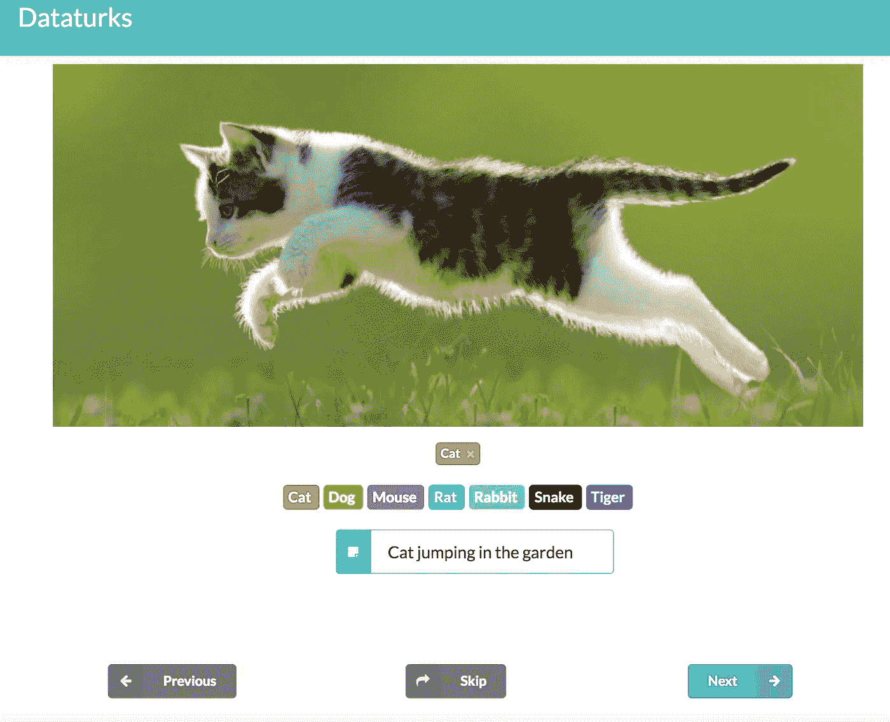
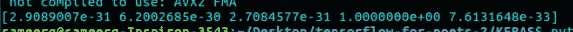

# Tensorflow Vs Keras？—通过建立图像分类模型进行比较。

> 原文：<https://medium.com/hackernoon/tensorflow-vs-keras-comparison-by-building-a-model-for-image-classification-f007f336c519>


是的，正如标题所说，这是数据科学家之间非常平常的谈话(甚至是你！)有些人说 TensorFlow 更好，有些人说 Keras 更好！让我们看看在图像分类的情况下，这个东西实际上是如何工作的。

在此之前，让我们介绍这两个术语 Keras 和 Tensorflow，并帮助您在 10 分钟内建立一个强大的图像分类器！

# **张量流:**

Tensorflow 是深度学习中开发模型使用最多的库。这是有史以来最好的图书馆，被许多极客在日常实验中完全选中。如果我说谷歌已经把张量处理单元(TPU)仅仅用于处理张量，你能想象吗？是的，他们有。他们放置了一个单独的实例类，称为 TPU，它具有最强大的计算能力来处理张量流的深度学习模型。

# **建造它的时间到了！**

我现在将帮助您使用 tensorflow 创建一个强大的图像分类器。等等！什么是量词？这只是您向 tensorflow 代码抛出的一个简单问题，询问给定的图像是玫瑰还是郁金香。所以，首先要做的是。让我们在机器上安装 tensorflow。官方文档提供了两个版本，即 CPU 和 GPU 版本。对于 CPU 版本:

```
pip install tensorflow
```

请注意，我是在对 GPU 而不是 CPU 进行实验后写这篇博客的。GPU 安装在这里被整齐的给了[。](https://www.tensorflow.org/install/)


现在，让我们用 Google 的 Tensorflow for poets 实验来训练一个模型。谷歌的这个知识库有惊人的脚本，可以对图像进行简单的实验。它非常简洁，足以满足我们的目的。还记得我之前用过的**强大**这个词吗？是的，当我们使用一种叫做**迁移学习的东西时，这个词就开始起作用了。**迁移学习是一种强大的方法，它使用已经训练了几天或几周的预训练模型，然后改变最终层以适应我们自己的一组类。

Inception V3 是一个非常好的模型，在 2015 ImageNet Challenge 的图像分类中排名第二。对于每类图像数量较少的数据集，它被认为是迁移学习的最佳网络。


Inception V3

现在克隆 git 存储库:

```
git clone https://github.com/googlecodelabs/tensorflow-for-poets-2cd tensorflow-for-poets-2
```

现在，你可以选择你的图像。你所要做的就是把数据集文件夹放在下面的样式中。

```
 — Dataset folder -
       class1/
           — image1
           — image2
       class2/
           — image1
           — image2
```


FLOWER DATA

它应该看起来像上面这样(忽略 image.py)。我已经得到了上面的**花 _ 照片**文件夹:

```
curl http://download.tensorflow.org/example_images/flower_photos.tgz | tar xz -C tf_files
```

## 创建数据集

你可以使用任何你喜欢的图片。越多越好(以几千为目标)。如上所述，将它们按类别分开，并确保它们在一个名为`tf_files.`的文件夹中

你可以下载已经存在的各种用例的数据集，比如《权力的游戏》中角色的癌症检测。这里是各种[影像分类数据集。](https://dataturks.com/projects/Trending?type=IMAGE_CLASSIFICATION)

或者，如果您有自己独特的用例，您可以为它创建自己的数据集。您可以从网上下载图像，并使用像 [Dataturks](https://dataturks.com/) 这样的注释工具，在 ziffy 中手动上传图像并标记图像，从而立即创建一个大数据集。更好的是，Dataturks 的输出可以很容易地用于构建 tf_files。



Building dataset using Dataturks

我发现了一个很棒的插件，可以在谷歌 Chrome 上批量下载图像——这个+ Dataturks 将使构建训练数据变得轻而易举。此处链接。

你可以试试用 dataturks [的 image_classification 工具在这里](https://dataturks.com/projects/import?type=IMAGE_CLASSIFICATION)做这个。此处，该工具提供的最佳功能是，如果我们有一个非结构化数据集，并且所有图像都在一个文件夹中。通过手动用类来标记它，您可以下载一个 json 文件，其中包含嵌入了类的图像的所有细节。然后为 [keras](https://gist.github.com/sameerg07/e296fe1f8e24933aa6eedd558047278c) 和 [tensorflow](https://gist.github.com/sameerg07/4e0337ed2f77845edbb319633bd324e5) 使用这里给出的脚本:

```
-------> for tensorflow
python3 tensorflow_json_parser.py — json_file “flower.json” — dataset_path “Dataset5/”-------> for keras
python3 keras_json_parser.py --json_file "flower.json" --dataset_path "Dataset5/" --train_percentage 80 --validation_percentage 20
```

## 培养

现在是训练模型的时候了。在 tensorflow-for-poets-2 文件夹中，有一个名为 scripts 的文件夹，其中包含了重新训练模型所需的所有内容。 **retrain.py** 有一种特殊的方式来裁剪和缩放图像，这太酷了。


然后使用以下命令进行训练，其中选项名称本身描述了所需的训练路径。：

```
python3 -m scripts.retrain \ 
 --bottleneck_dir=tf_files/bottlenecks \ 
 --model_dir=tf_files/models/inception \
 --output_graph=tf_files/retrained_graph.pb \
 --output_labels=tf_files/retrained_labels.txt \
 --image_dir=tf_files/flower_photos
```

这将下载初始模型，并使用培训文件夹和给定的参数相应地培训最后一层。我用 12GB Nvidia Tesla k80 和 7GB Vram 在 GCP 实例上训练了 4000 步。


训练是以 80-20，测试-训练分割完成的，我们可以在上面看到，它给出了 91%的测试准确度。现在是测试的时候了！我们在 ***tf_files/*** 中有一个. pb 文件可以用来测试。以下更改已添加到 **label_image.py**

```
from PIL import Image,ImageDraw,ImageFont
results = results.tolist()
image = Image.open(file_name)
fonttype = ImageFont.truetype(“/usr/share/fonts/truetype/dejav/DejaVuSans.ttf”,18)

draw = ImageDraw.Draw(image)
draw.text(xy=(5,5),text=str(labels[results.index(max(results))])+”:”+str(max(results)),fill = (255,255,255,128),font = fonttype)
image.show()
image.save(file_name.split(“.”)[0]+”1"+”.jpg”)
```

上面的代码将帮助我们在被测试的图像上绘制精度并保存它。随机图像的置信度百分比如下所示


显示了几个测试输出:


a collage of few outputs comprising of all classes

正如我们所看到的，对于所陈述的任务来说，结果是非常有希望的。

# **KERAS:**

Keras 是建立在 TensorFlow 之上的高级 API(也可以用在 Theano 之上)。与 **Tensorflow 相比，它更加用户友好和易于使用。如果我们是所有这些深度学习的新手，想要从头开始编写一个新模型，那么我会建议使用 Keras，因为它在可读性和可写性方面都很容易。它可以与以下设备一起安装:**

```
pip install keras
```

甚至这个东西也包裹在 tensorflow 上，所以 CPU v/s GPU 兼容性变化也将适用于此。


因为，我们必须使用迁移学习和 inception 模型来执行相同的分类花卉的任务，我已经看到 Keras 以标准格式加载模型，就像 API 是如何编写的一样。

```
from keras.applications.inception_v3 import preprocess_input
```

Keras 具有加载数据集的标准格式，即，我们不是直接在数据集文件夹中给出文件夹，而是手动划分训练和测试数据，并按照以下方式排列它们。我使用了在 tensorflow 部分下载的相同数据集，并按照下面的指示做了一些修改。

```
 — Dataset folder -
  — train/ 
       class1/
          — image1
          — image2
       class2/
          — image1
          — image2
  — test/ 
      class1/
          — image1
          — image2
      class2/
          — image1
          — image2
```

它应该如下所示:


和测试应该有如下所示的文件夹:


TRAIN FOLDER

现在，我们已经完成了数据集的设置，是时候进行培训了！我写下了一小段代码来进行下面的训练:

这段代码写得很简洁，通过将参数传递给下面的命令可以很容易理解:

```
python3 inception_train.py 
 — train_dir flower_photos/train \
 — val_dir flower_photos/validation \ 
 — nb_epoch 50 \ 
 — batch_size 10 \ 
 — output_model_file inception_yo1.model
```

在我的 GPU 上的训练花费了每个时期大约 1 分钟，每个时期 292 步，并且训练了 50 个时期(这非常多！)批量为 10，数据分割为 80–20。


哇哦！我们完成了训练，达到了大约 91%的测试准确度和 0.38 的损失。该模型已经保存为一个 inception.model 文件，可以再次加载和测试。为此，我们编写了另一个脚本，在图像上绘制预测的类并保存它。测试脚本如下所示:

inception_test.py

该脚本可以测试为:

```
python3 -m scripts.label_image — graph=tf_files/retrained_graph.pb — image=rose.jpeg
```

所有类别的预测置信度百分比输出如下:



[daisy,dandelion,roses,sunflower,tulip]

下面是一些带有图形的输出:


tested images with their probability graphs

终于！您已经学习了如何使用 Keras 和 tensorflow 构建强大的分类器。但是，哪一个是最好的仍然是我们头脑中的一个问题！因此，让我们仅基于目前的分类任务进行比较研究。

keras 的全部 tain 和测试代码以及修改后的 tensorflow 脚本都可以在我的 github [这里](https://github.com/sameerg07/FlowerClassification)找到。

## 原型制作:

如果你真的想快速编写代码并建立模型，那么 Keras 是一个好选择。我们可以在几分钟内建立复杂的模型！`Model`和`Sequential`API 是如此强大，以至于它们甚至不会给你一种你正在构建强大模型的感觉，因为它们使用起来很容易。

就这样，一个模型做好了！甚至迁移学习在 Keras 中比在 tensorflow 中更容易编码。Tensorflow 太难了，除非你是一个有粘性的程序员，否则无法从头开始编码。

## 临时编码和灵活性:

与 Keras 相比，tensorflow 是一个低级的库，许多新功能在 tensorflow 中可以以比 Keras 更好的方式实现，例如，任何激活功能等。此外，tensorflow 中模型的微调和调整比 Keras 中的更灵活，因为有更多的参数可用。

## 训练时间和处理能力:

上述模型在相同的数据集上训练，我们看到 Keras 比 tensorflow 需要更长的训练时间。Tensorflow 在 15 分钟内完成了 4000 步的训练，而 Keras 花了大约 2 小时完成 50 个周期。可能我们无法比较步数和纪元，但在这种情况下，两者都给出了 91%的测试准确度，这是可比的，我们可以描述 keras 训练比 tensorflow 慢一点。除此之外，这是有意义的，因为 tensorflow 是一个低级库。

## 提供的额外功能:

Tensorflow 有一个内置的调试器，可以在训练期间进行调试，也可以生成图形。


TensorFlow Debugger snapshot (Source : TensorFlow documentation )

Tensorflow 甚至支持线程和队列异步训练重张量！这为 TPU 提供了更好、更快的处理速度。线程的示例代码如下所示:

## 监测和控制:

根据我在 dee 学习中的经验，我觉得 tensorflow 非常适合许多情况，尽管它有点难。例如，我们可以很容易地监控每一件事，例如控制网络的权重和梯度。我们可以选择哪一步应该训练，哪一步不应该。这在喀拉斯不太可行。下面给出的一行就有这样的魔力！

```
step = tf.Variable(1, trainable=False, dtype=tf.int32)
```

# 结论:

无论如何，Keras 将很快被整合到 tensorflow 中！那么，为什么选择 pythonic 呢？(Keras 是 pythonic 化的)。我的建议是花些时间习惯 tensorflow。上面的分类问题，如果你已经按照博客做了相应的步骤，那么你会觉得 Keras 在很多方面都是比 tensorflow 小痛苦和耐心杀手。所以，试着使用其他的类，试着为假钞检测等应用训练分类器

希望这个博客能让你更好地了解什么时候用什么！

我希望听到任何建议或疑问。请在 sameer.gadicherla@dataturks.comT3 给我写信