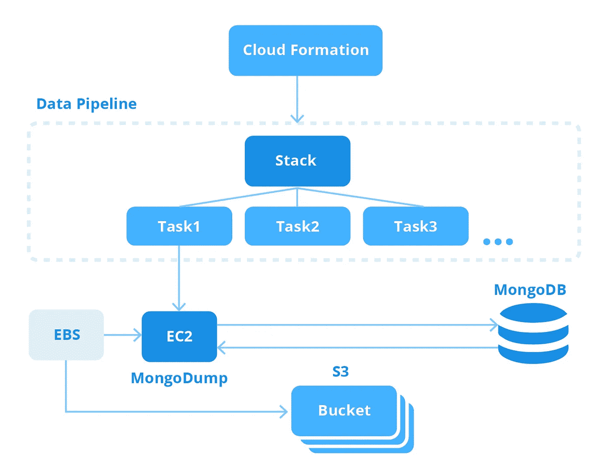

# 自动化 MongoDB 备份的 Terraform 模块

> 原文：<https://medium.com/hackernoon/terraform-module-for-automated-mongodb-backup-8c9594ca018>

MongoDB 是使用最广泛的数据库之一，为它创建备份是一项至关重要的日常任务，不能掉以轻心。这就是我们决定自动化流程的原因。

手动备份完全过时了，更不用说这意味着要记住所有的特性并手动标记副本。自动备份需要使用默认情况下不存在的某些库，DevOps 团队很可能会通过艰难的方式了解到这一点。

因此，我们希望在为自动化 MongoDB 备份创建 [Terraform 模块时达到以下结果:](https://github.com/ITSvitCo/terraform-aws-mongo-backup)

*   备份流程的自动化管理(您只需访问您的 AWS 帐户、已安装的 Terraform 和我们的解决方案)
*   创建结构化且易于访问的备份注册表(存储多个最新版本的备份，确保它们可从多个访问点获得)

**截图 1** : AWS CloudFormation 界面，带有周期性任务列表

# 使用来自 IT Svit 的自动化 MongoDB 备份工具

我们目前有一个 Terraform 清单，它安装了所有需要的库和依赖项，支持使用 AWS CloudFormation 和数据管道工具自动备份到 AWS S3 云存储。CloudFormation 充当调度程序，启动数据管道任务，创建一个 MongoDB 转储作为备份，并将其存储在 S3 存储桶中。可通过 Terraform 或数据管道网络界面访问流程日志。

**截图二**:AWS 数据管道备份任务列表

**截图 3** :存储在 AWS S3 存储桶中的数据库备份

**截图 4** :每个备份都有版本，这意味着如果需要，可以恢复任何文件的特定版本。

总之，这是一个整洁的小工具，解决了任何 DevOps 团队的主要头痛之一:自动数据库备份，备份版本监控和简单的恢复请求。

因此，使用该解决方案唯一需要的是访问 AWS 服务和安装在您机器上的 Terraform。Terraform 运行安装所需库和配置备份工作流的清单。在 [Github](https://github.com/ITSvitCo/terraform-aws-mongo-backup) 上查看！

这个故事最初发表在我公司的博客上—[https://it svit . com/blog/automate-MongoDB-backups-using-terraform/](https://itsvit.com/blog/automate-mongodb-backups-using-terraform/)