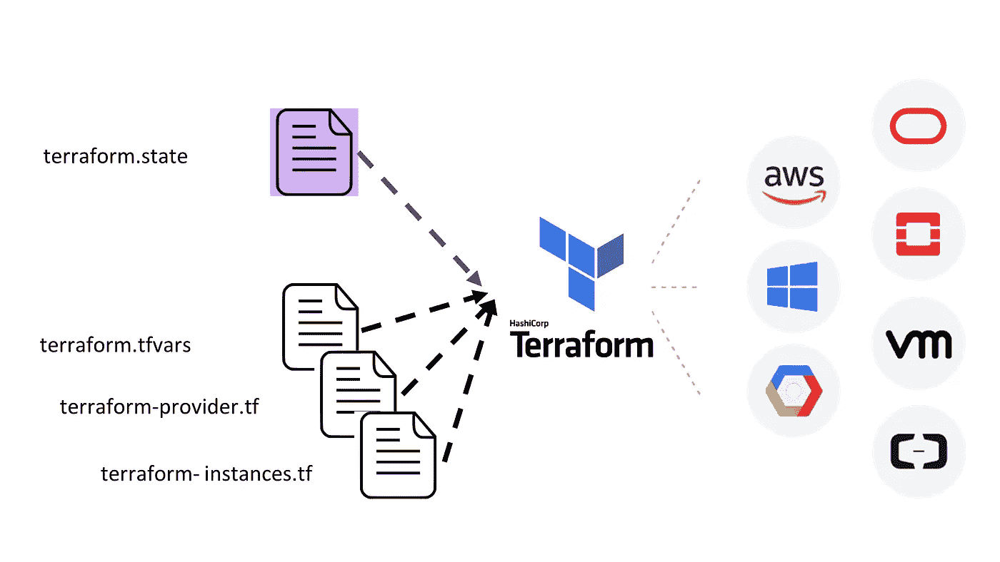

# devo PS 101—terra form 的第一步:Terraform + OpenStack + Ansible

> 原文：<https://medium.com/hackernoon/terraform-openstack-ansible-d680ea466e22>

我目前是一名教师助理👨‍💻 *@* [*Técnico 葡京*](https://tecnico.ulisboa.pt/en/) *，我正与*[*Rui Cruz*](https://fenix.tecnico.ulisboa.pt/homepage/ist40132)博士教授密切合作👨‍🏫*at*[*it 基础设施管理与行政*](https://fenix.tecnico.ulisboa.pt/disciplinas/AGISIT/2018-2019/1-semestre) 🖥 *、a* 大师级课程 *@* [*Técnico 葡京*](https://tecnico.ulisboa.pt/en/) 。

本教程旨在向您介绍 Terraform。Terraform 将利用 OpenStack 上的基础设施部署。Ansible 将提供已部署的机器。我们将使用 vagger 来管理安装了 Terraform 和 Ansible 的机器。

在[DevOps 101——基础设施作为带有流浪者(灯栈)的代码](https://hackernoon.com/devops101-itinfrastructure-54337d6a148b)中，我介绍了敏捷 devo PS 运动。它的目的是自动化工作，让你更快地启动。

如果你打算开始一项业务或副业，你必须考虑的是 DevOps。你为什么要在乎？随着业务需求的增长，您会有不同的基础架构需求。因此，如果您从一开始就以正确的方式构建一切，那么更改和升级的成本将会更低。时间不多了，我们来介绍一下:


Terraform 旨在提供一个工作流程来管理基础设施。它允许您定义基础设施，以最小的成本进行更改和部署更改。

该方案综合了 Terraform 的工作原理:



Terraform 依赖于。定义基础设施(地形实例)的 tf 文件。Terraform 通过状态文件知道部署了什么。默认情况下，此状态存储在名为“terraform.tfstate”的本地文件中。它也可以远程存储，这在团队环境中效果更好。Terraform 允许几个提供者，通常在一个名为 terraform-provider.tf 的文件中初始化。如果您想更详细地了解它是如何工作的，[查看 terraform 的这个介绍视频，](https://www.youtube.com/watch?v=h970ZBgKINg)。

# 要求

[这个实验的代码在 Github](https://github.com/RafaelAPB/devops101-terraform-ansible-openstack) 上。[分叉仓库](https://help.github.com/articles/fork-a-repo/)然后[克隆它。](https://help.github.com/articles/cloning-a-repository/)

强烈推荐你用流浪。如果你不知道什么是流浪者或者它是如何工作的，[这篇文章很适合你(它甚至一步一步地解释了如何配置这个工具和它们的依赖关系)](https://hackernoon.com/devops101-vagrant-6737c8c29904)。

# 在我们开始之前…

第一步:了解你的资源。

如果您打开支持文件，您将看到几个文件类型:。tf，。yml，。cfg，。嘘和一个流浪的档案。

我们可以看到 3 个逻辑组:与流浪者、Ansible 和 Terraform 相关的文件。流浪者为您提供一个虚拟机，其中包含运行 Terraform 所需的软件。或者，如果不想使用虚拟机，可以在主机上安装 Terraform。

Ansible 是一个开源工具，旨在简化供应。Ansible 将通过 Terraform 连接到已部署的实例。之后，它会安装所需的软件。

最后，Terraform 将负责部署基础设施。

**第二步:初始化虚拟机。**

在保存支持文件的同一个目录下，运行*运行*并等待机器启动。注意，流浪者将当前文件夹与 *terraform-experiment 同步。*

现在我们为下一步做好了准备。

**第三步:了解 Terraform 支持文件。**

研究 terraform-provider.tf:


Created with carbon.sh (check it out)

如您所见，这个文件中有几个变量声明。一些将要传递给我们的提供者的变量。

Terraform 的提供者以不同的方式初始化，因为它们有不同的 API。换句话说，您需要为正在使用的每个提供程序设置不同的变量。[这里列出了 OpenStack 需要的变量](https://www.terraform.io/docs/providers/openstack/)。对于这个实验，我将使用我大学的私有云，基于 OpenStack。例如，您可以使用 [SUSE OpenStack Cloud](https://www.suse.com/pt-br/products/suse-openstack-cloud/) 、 [OpenTelekomCloud](https://www.terraform.io/docs/providers/opentelekomcloud/index.html) 或任何基于 OpenStack 的私有云。Y [您可以在本地安装 OpenStack】，并从那里运行(最便宜的解决方案)。](https://www.mirantis.com/blog/how-to-install-openstack-on-your-local-machine-using-devstack/)

接下来的 **DevOps101** ☄️，关于如何使用 Terraform 在谷歌云引擎上部署基础设施的教程，敬请关注！[🦄](https://emojipedia.org/unicorn-face/)

要访问您的提供商，您需要填写必需的变量:


**第 4 步:了解您想要部署的基础设施**

现在，研究一下 *terraform-instances.tf* 和 *terraform-networks.tf* 文件。他们在定义什么？他们是如何做到的？

在 *terraform-networks.tf* 上，我们正在创建一个前端网络、一个子网并定义一个安全组。安全组允许从[端口 443](https://www.grc.com/port_443.htm) 接收连接。文件 *terraform-instances.tf 定义了*两个 web 服务器和一个负载均衡器。然后，它将它们分配给一个网络、一个安全组和一个子网。


# 让我们开始行动吧！

生成公私密钥对。此密钥对将存储在/home/中。ssh/。您可以通过以下方式生成密钥(通过按 ENTER 键跳过所有提示):

```
$ ssh-keygen -t rsa -b 2048
```

您的密钥对将由 Terraform (terraform.tfvars)导入。

接下来，我们想把我们的计划应用到现实世界中。请注意，Terraform 有五个基本命令，允许我们处理端到端的工作流:

*   **terraform init:** 该命令用于初始化包含 terraform 配置文件的工作目录。
*   **terraform 刷新:**该命令用于协调 terraform 了解的状态(通过其状态文件)与现实基础设施。
*   **地形计划:**创建执行计划。Terraform 执行刷新，然后确定需要采取哪些操作来实现配置文件中指定的所需状态。
*   **terraform apply: A** 应用所需的更改，以达到所需的配置状态。
*   **地形摧毁:**摧毁由地形管理的基础设施。

首先，我们需要初始化工作目录。这是在编写新的 Terraform 配置后应该运行的第一个命令。运行:

```
$ terraform init
```

它应该输出类似如下的内容:


为了了解 Terraform 必须对提供者进行哪些更改，请运行:

```
$ terraform plan
```

输出指定了计划:


现在是部署基础设施的时候了。运行:

```
$ terraform apply
```

到目前为止，您的基础设施已经部署完毕。


为了供应机器，我们将使用 Ansible。我用了 Oliver Louvignes 的这个角色集合。要告诉 Ansible 将哪些机器作为目标，请替换 file *主机上机器的 IP。*如果找不到，运行*地形输出。*现在，运行安装节点的行动手册:

```
$ ansible-playbook site-servers-setup-all.yml
```

就是这样。您有一个由两个 web 服务器组成的系统(没有任何负载平衡),在 OpenStack 提供者上运行 Node。接下来，在*"***devo PS 101**☄️*"，*我们将部署一个由两个 web 服务器和一个负载均衡器组成的系统。

# 结束实验

使用两个命令，您将结束实验并关闭虚拟机。这些是:

```
$ terraform destroy -auto-approve
$ exit
$ vagrant halt 
```

如果要销毁您创建的虚拟机，请运行:

```
$ vagrant destroy
```

恭喜你！💯你到达终点了！🦄

# 后续步骤:

## 如果你喜欢这篇文章，请订阅我的邮件列表。这里是👇。这对我意义重大。

[](http://eepurl.com/go_uUD)