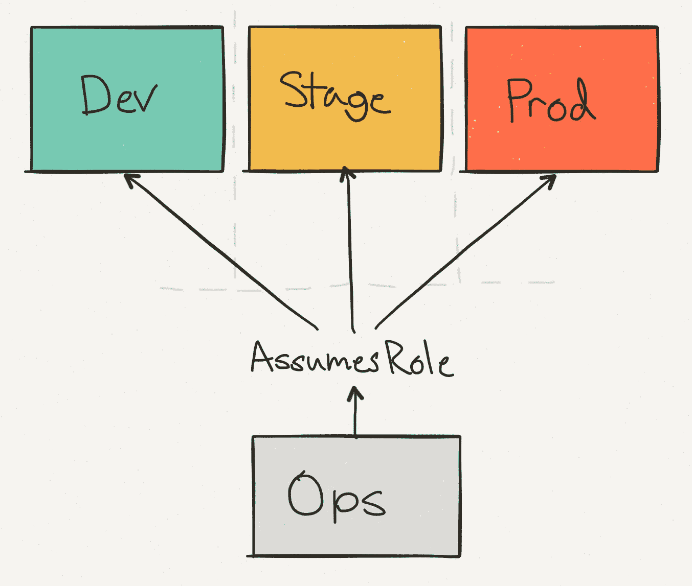
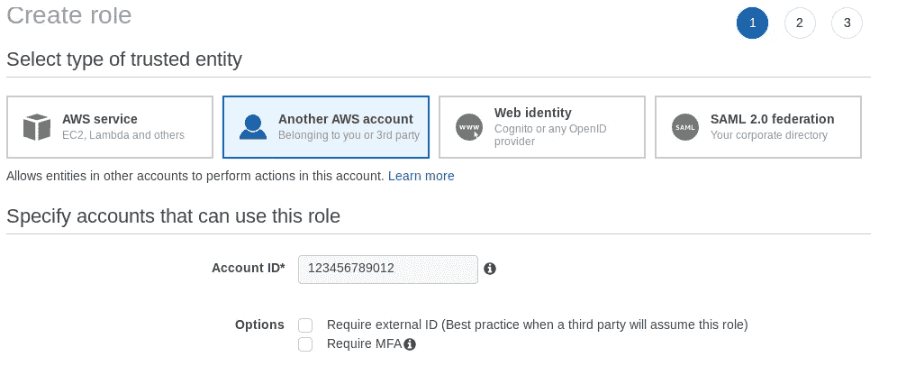

# 具有 AWS 的地形承担角色

> 原文：<https://medium.com/hackernoon/terraform-with-aws-assume-role-21567505ea98>



为不同的环境使用不同的 AWS 帐户现在是一种最佳实践，这样我们就可以完全隔离所有的环境。

在上图[复制自 segment.io 博客]中，Ops AWS 帐户是其余 AWS 帐户的入口点。这意味着我们不需要开发、试运行和生产 AWS 帐户上的用户，而是可以使用 AWS STS 并承担引导/访问 AWS 服务的角色。

## 优势？

通过为不同的环境使用单独的 AWS 帐户

1.  资源分离和隔离。
2.  集中访问位置。

还有更多…..

## **先决条件？**

4 个 AWS 帐户，并确保为根帐户启用 MFA。

注意:我们也可以设置 2 个 AWS 账户，但在本帖中，我们考虑 4 个 AWS 账户。

让我们给出 4 个 AWS 帐户的名称，我们将在帖子中提到。

1.  ops[跳转 AWS 账户或者我称之为 Bastion AWS 账户]
2.  开发 AWS 帐户
3.  暂存 AWS 帐户
4.  生产 AWS 帐户

`ops`账号作为跳转点和集中登录。组织中的每个人都可以拥有一个 IAM 帐户。

其他环境有一组 IAM 角色可以在它们之间切换。这意味着我们的管理员帐户只有一个登录点，一个限制访问的地方。

例如，Anay 可以访问所有三个环境，但是 Abhi 只能访问 dev。但他们都是通过`ops`账号登录的。

我们不用复杂的 IAM 设置来限制访问，而是可以根据环境轻松锁定用户，并根据*角色对他们进行分组。*从界面使用每个帐户就像切换当前活动角色一样简单。

一旦我们获得 AWS 帐户，下面是我们需要执行的所有步骤

1.  在 Ops AWS 帐户中创建 IAM 用户。像 anay，abhi 等
2.  在所有 3 个(开发、试运行和生产)AWS 客户中创建角色，并附加一些政策，或使其成为拥有特定 AWS 访问资源的组的一部分。
3.  创建角色时，请确保在运营和开发、运营和筹备、运营和生产 AWS 帐户之间添加信任关系。



4.在运营转移帐户中创建一个用户，该用户必须有权承担开发、转移和生产帐户的角色。下面是您可以附加到用户以承担角色的示例策略。

```
{
 “Version”: “2012–10–17”,
 “Statement”: [
 {
 “Effect”: “Allow”,
 “Action”: “sts:AssumeRole”,
 “Resource”: “arn:aws:iam::123545678:role/rolename”
 }
 ]
}
```

一旦用户创建了 aws-cli，请在要运行 terraform 的主机服务器上进行配置(也可以在本地机器上进行配置)。

我在这里假设您的系统上有 terraform 最新版本的二进制文件，并使用 terraform 承担角色

```
provider "aws" {
  assume_role {
    role_arn     = "arn:aws:iam::ACCOUNT_ID:role/ROLE_NAME"
    session_name = "SESSION_NAME"
    external_id  = "EXTERNAL_ID"
  }
}
```

现在，只需在状态文件中添加下面两行，用于您想要引导的模块。

```
 role_arn     = "arn:aws:iam::ACCOUNT_ID:role/ROLE_NAME"
    profile      = "my_profile_name" 
```

您现在可以安全地运行 Terraform 了！