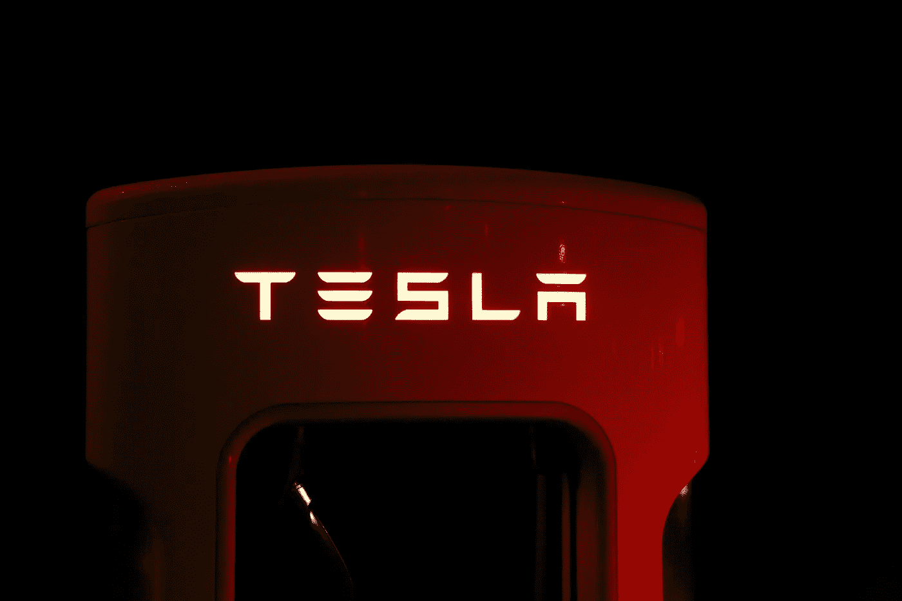

# 特斯拉、埃隆·马斯克和可能永远不会到来的未来

> 原文：<https://medium.com/hackernoon/tesla-elon-musk-and-the-future-that-may-never-arrive-39fa9955e8cf>

## 特斯拉是公司、慈善机构、高中科学项目还是实验？

他必须是最具表现力的财富 500 强首席执行官，不羞于在 Twitter 上接受挑战，迅速采取有目的的慈善行动(这让他感动)，敢于做大事，不怕失败(？).难怪人们喜欢他。我说过他很酷吗？但这一切对特斯拉意味着什么？我们现在不考虑 SpaceX 或无聊的公司。只是特斯拉；是产品天才还是试用版业务？

> 声明:我没有也不会为埃隆·马斯克或他的任何商业后代工作。这并不意味着侮辱或取笑特尔萨。我尊重埃隆·马斯克和他所做的事情。这是一篇透视文章，旨在探究科技界感兴趣的人的想法。

一天，对冲基金经理吉姆·查诺斯(Jim Chanos)在电视上说，当我正在看电视时，埃隆·马斯克(Elon Musk)在 2020 年(T1)之前不会成为特斯拉的首席执行官。我不是埃隆·马斯克的“粉丝”，但同时我也不讨厌他。所以我听了对冲基金经理的观点。这个人从实用主义商业的角度，用老式的方式说话。不过，我有点认同这一点。他说特斯拉没有盈利。他说每次，他们总是推迟。他说了这样的话，*‘5 年前，他们说特斯拉将在 3 年内开始赚钱。三年过去了，然后他们说他们还得再等两年。他接着说了类似这样的话，*‘当到期的时间再次到来时，它将被推迟’*。然后他朝这个方向走去，*‘最终，投资者会厌倦不盈利’*。他认为，此举会让埃隆被解雇。*

***埃隆到底在做什么不盈利？最初，我已经忘记写这个了，但是最近发生了一件事。特斯拉不得不裁员，(在我看来)以提高效率。然后埃隆不得不说**这不是为了盈利**。他说，因为特斯拉(在他领导下的新特斯拉)到目前为止还没有盈利，所以它显然不是最优先的。我在想， ***“这家伙为什么反对盈利？”*** 我的意思是，利润不是优先考虑的。那么特斯拉是什么？公司还是慈善机构？我的猜测是两者都不是。姑且称之为埃隆的大脑孩子吧。***

特斯拉与其他汽车公司相比的优势在于，它是一家全电动汽车公司。老实说，当埃隆进入时，这是一个很大的挑战。特斯拉自称的是汽车行业的未来。但是这些年后，我们必须问自己，**未来是来了还是没有？**

到目前为止，我在生活中所学到的一件事是，未来是不可预测的，而是可以创造的。你可以预测你想要什么，但如果其中一个主要玩家决定让一些不同的事情发生，并且玩得很好，你只能在一旁无助地看着玩家的愿望发挥出来，除非你自己也是玩家。自 20 世纪 60 年代以来，机器人就被预测为未来的重要组成部分。这是 2018 年，我们仍在等待机器人成为主流。我们的主流是智能手机，顺便说一下，没有任何强有力的直接预测。**未来是我们创造的，而不是我们想象的**。

所以，电动车。特斯拉就是以此为品牌的。他们被视为领导者。现在，每家汽车公司都在争夺电动汽车的霸主地位。事实上，据说现在一些传统车企的电动车板块比特斯拉还大。因此，**在他们标榜自己为领导者的地方，他们现在有了更大的竞争对手**。另外，这些公司正在盈利。也许这不是来自他们的电动汽车部门，但总的来说，这是一个好迹象。*“但是特斯拉还有品牌”*。是的，特斯拉做到了，但最终现实将吞噬精心制作的社会形象。

让我们看看未来的另一个维度。电动汽车不再是未来的亮点。现在，每个人都对自动驾驶汽车感到兴奋。特斯拉也参与其中，但清晰的品牌区分并没有将特斯拉与这一理念融合在一起。似乎每个人都在参与无人驾驶汽车，甚至谷歌和优步。因此，人们对电动汽车的兴奋程度已经不如过去了。我知道有人在想，*“环境呢”？在接下来的 30 年里，我们仍然会在世界范围内就此举行会议和讨论。每个人都想摆脱烟雾，只要它不会阻止钱流向他们。许多人不喜欢特朗普，因为他选择退出“环境友好”协议。但是看看那些应该带头冲锋陷阵的人有多真诚。我已经数不清有多少公司被发现伪造数据以符合排放标准。这些都是被抓到的人。当然，有些人没有被抓到(或者很多人)。埃隆应该受到表扬，因为他把自己限制在电气领域。但老实说，特斯拉应该盈利或…*

我不能肯定地说，埃隆下台或辞职不会发生在 2020 年。就像我说的，**未来是制造出来的，而不是预测出来的**(因为有活跃的玩家)。但是如果一些激进的事情发生，就必须有所改变。最终，数字说的会赢。迄今为止，特斯拉的投资者因其冷静而令人敬畏。也许他们正依靠其他地方的利润生活。我们将会看到他们的耐心有多长。对冲基金经理吉姆查诺斯在我看到的采访中提到了一些事情。埃隆在他的 Twitter 账户上提到了一些未来的事情，吉姆将时间追溯到季度收益报告的发布。吉姆说这只是为了分散人们对报告的注意力。

> 因此，埃隆似乎在让人们为永远都是未来的未来做准备。

然而，如果没有火焰喷射器的荣誉提名，这部作品是不完整的。或者我应该用它的新名字来称呼它，而不是喷火器。它在销售上获得了巨大成功。这种模式能被用来为特斯拉带来利润吗？也许吧。也许不是。但让我告诉你我看到了什么。**埃隆有粉丝。他很讨人喜欢。特斯拉有粉丝。是意识形态**。特斯拉似乎存在的一个问题是，许多想要它的人买不起。尽管埃隆尽可能将价格保持在最低水平，但它仍未在这一领域取得突破。

喷火器为什么表现这么好？很酷。埃隆做到了。这是埃隆的粉丝可以轻易买到的东西。这些特点不能带到车上吗？不完全是。在可预见的未来，电力仍将十分昂贵。*“那些买得起车的人呢？”这就是事情变得棘手的地方。在上层街区，埃隆的粉丝没有那么多。曾经有一个布加迪和特斯拉跑车的比较。特斯拉在许多领域都遥遥领先。布加迪的价格大约是跑车的两倍，但在评论中，70%的人选择了布加迪。为什么？这是因为如果你想买一辆高档车，最好把它造得越高越好。**特斯拉高端价格太低，普通价格高得无可奈何。***

特斯拉有哪些选项？**一、结交上层邻里**。尽管特斯拉的营销策略很好，但它必须针对能带来巨大销量的东西。这个选项不能单独应用，否则原粉丝会有被出卖的感觉。

所以，**选项 2 号；打造特斯拉**的豪华品牌汽车。一些能引起上流社区注意的东西。把它从特斯拉品牌中剥离出来。改变整体的外观和感觉，让它变得更好，然后，非常昂贵。

**选项 3 号；创造更多的非汽车产品**。创造更多符合特斯拉理念的家居产品。从单纯的汽车制造业过渡到制造业。创造更多特斯拉粉丝能买的东西。大学生可以买的东西，高中生可以拥有的东西，并感受到与埃隆和他的想法的联系。它不一定是非常有用的东西(不是火焰喷射器已经证明了这一点)。

**选项 4 号；收购一些具有令人印象深刻的销售和销售前景的创新创业公司，然后扩大规模**。因此，埃隆成了梦想家之家的首席梦想家。这些收购的成功可以帮助特斯拉在销售报告中取得平衡，特斯拉汽车制造部门盈利的压力将越来越小。

**选项 5；去中心化和完全加密**。当然，埃隆将不得不向这个方向学习很多东西。这里的概念是，你将只能用特斯拉代币购买一辆特斯拉汽车。特斯拉代币的价值(以美元计)将随时间变化。这意味着人们可以选择以更高的价格出售他们的特斯拉代币，或者用它来购买特斯拉汽车。另外，任何有现金想要购买特斯拉的人都必须首先购买特斯拉代币。这将是一枚成功的硬币！不过，他们最初会与监管机构产生大量问题。

最后，特斯拉走向默默无闻对谁都没有好处。即使是吉姆·查诺斯也希望看到变化，他的赌注是基于不会有变化的事实。老实说，特斯拉目前的发展方向并不乐观。他们目前正在准备的未来还很遥远，甚至可能不会到来。我希望这些选项中的一个(或它的变体)对特斯拉和埃隆有吸引力。干杯！

> 附:埃隆，如果你正在读这篇文章，细节中有更多的创意。我不介意谈话，即使只是为了寻求刺激，☺