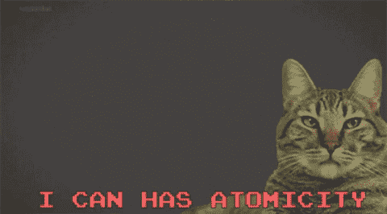
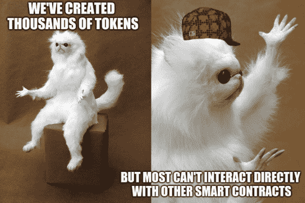
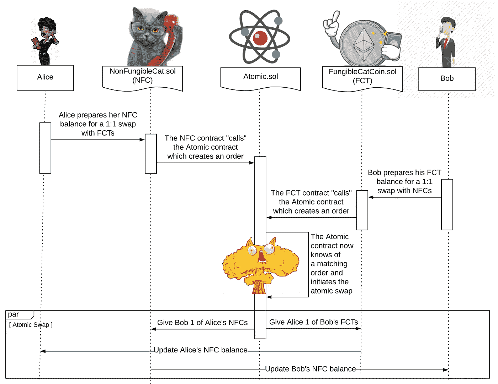

# 不可替代代币的原子互换市场

> 原文：<https://medium.com/hackernoon/test-bd14e0e1170d>

大约一年前，一群古怪的猫开始入侵以太坊世界。这些猫团结在一起，热切地开始了征服区块链和加密货币领域的使命。渴望拥有自己的[月亮羊羔](https://cryptobriefing.com/crypto-slang-lambos-on-the-moon/)，这些猫通过创造独特的象征性表现自己而发起了一场运动，然后开始从它们的猫贩运中心和小猫生产工厂产生收入流[。](/@codetractio/a-look-into-cryptokitties-revenue-model-6466b705a998)

这是真的——不要被愚弄了，猫肯定一直在进化，而且无可争议的是，它们引领着区块链的创新行列。

现在，在他们第一次出现大约一年后，他们冒险进入其他创新的密码企业变得越来越普遍；他们完全有能力开拓原子领域只是时间问题。

Well, atomicity of cypto at least

> 这篇文章中的大部分想法和研究直接来自这些猫，当然不是来自写这篇文章的人。

# **快速入门**

以太坊中不可替代的代币已经存在了一段时间。如果你是这个话题的新手，这里有一本入门书:

**可替换令牌:**每个可替换令牌都无法与同类型的其他令牌区分开来。考虑可替代代币的一个简单方法是，它们类似于美元。当你去商店购物时，收银员不会在意你用的是哪张一美元的钞票，他们只会在意你给了他们多少。

**不可替换令牌**:与可替换令牌不同，每一个不可替换令牌都可以与其他令牌区分开来。在这种情况下，每个令牌都有一些可区分的特性，使其与其他令牌不同或独一无二。考虑不可替代性的一个简单方法是从棒球卡的角度来考虑。如果你在交易棒球卡，每张卡的价值或待遇都不一样。在交易中，你会关心牌的质量，而不一定是牌的数量。

**原子互换:** [原子互换](https://www.investopedia.com/terms/a/atomic-swaps.asp)对于加密货币来说也不是什么新想法。原子互换允许一种货币兑换成另一种货币，而不需要使用集中的中介。通常，这是通过利用智能合同作为分散的撮合者来实现的。

但是用原子交换**来交换**不可替代的令牌呢？亲爱的读者，这一现实刚刚到来。

*但首先，我们来了解一下背景…*

# 定义当前的 Catscape

现在，为了充分理解为什么原子交换是一个有趣的概念，首先快速看一下分散应用程序、智能合约和令牌的当前情况会有所帮助。

如果你拿着显微镜去观察[分散应用](https://www.coindesk.com/information/what-is-a-decentralized-application-dapp/)(或 **DApps** )你会很快发现它们与我们今天都知道并使用的应用非常相似。在这一点上，DApps 和 app 都是由类似的代码组成的，它们的存在只是为了以完全预先指定的方式对现实世界的事件和用户交互做出反应。

通常，接受任何一种类型的应用程序的过程都是难以区分的。假设您有一个应用程序，它允许已知的猫粮制造商为其供应讨价还价。在任一应用程序框架中，都存在一组相似的逻辑约束，它们是满足任务需求所必需的。简单地说，这个特定的任务需要预定义的规则集来创建和分发发票，以及创建和分发供应链信息。

在传统的应用程序中，应用程序开发人员只是将这些逻辑组织成几个软件包，然后将这些软件包托管在集中控制的服务器上。当创建这些类型的集中式应用程序时，通常会以管理员定义的访问控制结束。在很多情况下，这种集中控制模式比分散控制模式允许更高的吞吐量和权限粒度。

## 那么，去中心化的应用程序怎么样呢？

分散式应用程序将从相同的想法开始(创建一个猫粮制造应用程序)，但是在经过类似的开发周期之后，他们将它部署到一个分散的上下文中。然而，这一点的含义超出了应用程序部署的位置，在分散的环境中，重要的部分变成了代码如何在这个不受限制的数字边界中与接口。

与集中式应用程序不同，DApps 本质上更容易访问。在这种情况下，分散的架构暴露了环境，这些环境向第三方猫提供了更流畅的可访问性，而这些第三方猫恰好也在这个新的领域中进行构建(*注意:DApps 通常是没有权限的，但这不是一个约束*)。也就是说，DApp 环境更有趣的一面是，其中的每个应用程序都具有极大的可组合性潜力。弄清楚如何利用这种可组合性通常不是显而易见的，但是如果做对了，它可以解开[在它们的集中式对等物](/coinmonks/introducing-crypto-composables-ee5701fde217)中不可能的事情。

当这种权力得到适当运用时，它可以成为其他猫繁殖者创建[免费但独立的应用程序](https://blog.userfeeds.io/giving-cryptokitties-thousands-of-social-media-platforms-bd449a0a3a74)的[基石，从而为整个猫生态系统带来互利*，例如每当订单簿看到大量销售*时就会触发猫薄荷分配智能合同！](/coinmonks/crypto-composables-building-blocks-and-applications-65902709298c)

无权限的有味道的可组合性是强大的——理解它对这个故事的其余部分很重要。

## **代币和智能合约**

如果你还没有看过我的[最新](/nori-carbon-removal/an-uncensored-look-at-smart-contracts-part-1-the-gentlest-of-introductions-b3c3b6b24eee) [总结智能合约的帖子](https://hackernoon.com/the-journey-to-a-world-unknown-begins-in-a-vessel-yet-built-c854cb4aa12e)，这是一个很好的开始。简单总结一下，智能合约是区块链和去中心化应用的一个子技术。它们基于金融类投入运作，并根据类似合同的协议执行。

> 旁注-猫的智能合同的一个流行用途可能是猫薄荷分配器，每当智能合同被喂以 1 个猫硬币时，就会释放一袋猫薄荷。

既然我们谈到了代币的话题，让我们确保理解了一些要点。**代币，至少像过去几年设计的那样，本身往往就是智能合约** *。*此外，代币合同是余额的合并分类账，可以在发送启动交易时更新。

现在，让我重申最后一点，因为理解这一点非常重要:大多数令牌只会存在于它们自己的智能契约的上下文中。令牌被合并到它们自己的上下文中。

这意味着当你将一个令牌从你的帐户“转移”到另一个帐户(或 Dapp 的智能合约)时，你实际上从未将它发送到任何地方。相反，令牌保留在自己的合同中，只是为了更新其内部分类帐。**同样，大多数令牌从未离开它们的契约上下文**。

你听到了吗？没有吗？再来一次:

这是一个问题。分散式应用程序是强大的*,因为*它们具有可组合和与其他上下文交互的能力，所以当我们以不支持这一点的方式设计它们时，我们最终会浪费很多潜力。

现在，你可能会说“等等。。。有大量的令牌，以及大量可以使用这些令牌的分散式应用程序！”，从技术上来说，确实如此。大多数令牌*仍然可以*用于其他智能合约，即使它们是独立的。然而，这样的互动既不流畅也不自然。

对于普通的猫来说，举个例子可能会有所帮助。显然，最常见的令牌标准是 [ERC-20 令牌](https://github.com/ethereum/EIPs/blob/master/EIPS/eip-20.md)(但其他令牌类型也是如此，如 [ERC-223](https://github.com/ethereum/EIPs/issues/223) )，如果你听到有人谈论令牌，他们可能指的就是这种类型。这些令牌可以通过以下方式在 DApps 中使用:

1.  从将令牌“转移”到智能合约开始。这有效地增加了 DApps 令牌余额，但是**而不是**实际上将令牌从令牌契约发送到 DApps 契约。
2.  通过使用 Ether 向 DApp 契约发送另一个事务以及与您想要触发的函数相关联的数据，与它进行交互。
3.  DApp 合约检查代币合约的分类帐，以查看它是否有有效余额来执行该操作
4.  如果余额有效，它将对令牌执行操作。如果没有，它就失败了。
5.  当用户已经完成与 DApp 的交互时，他们可以继续“撤回”他们的令牌。这样做减少了 dapps 余额，增加了用户。

我断言如下:*这是可笑的 AF* **。**步骤 2 意味着应用程序将始终要求 cat 进行两次独立的手动交易。

但是并没有失去一切！一种改进的令牌设计方法已经存在(并且此后提出了更多)。

# **前进的道路**

进入[ERC-777](https://eips.ethereum.org/EIPS/eip-777):**高级令牌标准。**高级令牌为可替换令牌引入了一些真正强大的属性。虽然这些令牌仍然没有能力完全超越其自身契约上下文的约束，但它确实有一个显著的属性，可以提高可组合性。具体来说，它可以做两件新的事情:

1.  当事务被触发时，令牌契约可以“调用”其他契约
2.  令牌交易可以接受用于链接附加函数调用的交易数据，并有效地允许令牌以功能上类似于以太(智能合约中用于触发功能的货币)的方式使用。

> 注意:高级令牌标准为我们提供了两种有效创建原子市场契约的方法。此外，高级令牌的复杂性可以跨越完全独立的帖子的内容。所以，为了我们两个的缘故，我只打算详细说明我们如何使用#2。此外，我将只在象征性津贴的背景下谈论它。

我们从一个标准的 ERC-20 `approve`函数开始。ERC-20 批准包含分配第三方卡特彼勒或签订津贴合同的逻辑。这意味着，如果我批准给你 20 枚猫币的津贴，那么你就可以代表我寄出这 20 枚猫币。

不幸的是，在这些标准令牌中，这种类型的`approve`逻辑仅仅给了我们允许另一个地址的能力，功能到此为止。对于指定的地址，要立即对这一新的津贴采取行动，它仍然需要得到通知(例如，对于转移你的津贴的令牌合同，它将需要第二次交易)。这意味着被分配津贴的运营商现在必须发送他们自己的以太网，并且为了触发新的功能，他们必须代表令牌所有者消费该费用。但这不是我们想要的！

**解决方法？给令牌合约一个“电话”，以便它可以拨打其他合约。**

我们可以使用一个新的功能，赋予令牌契约“向外拨号”到运营商地址的能力，而不是依赖其他智能契约(或 cat)来手动验证它们是否收到了津贴(或者在最好的情况下:依赖所有者发送第二次交易)。这非常有用，尤其是当津贴的指定操作者是智能合同地址时。

**为什么？**

因为现在令牌可以调用原子契约，如果它“拾取”，令牌可以告诉智能契约创建一个要约，将所有者的令牌交换为不可替代的令牌。

**如何？**

想法是将这些类型的函数嵌套在面向*余额*和*容差*的函数中，这些函数在指定接收方或运营商为合同地址时启动；如果是，令牌协定调用指定智能协定中的附加函数。它如何能够做到这一点是通过[利用注册中心契约](https://github.com/ethereum/EIPs/issues/820)(更多信息和实现可在这个库中获得[)。因此，当许可被授予时(通过调用`approve`函数)，智能合同在注册中心查找指定的运营商地址，如果注册中心响应该地址是许可的支持合同，则它通知令牌合同它可以执行特殊功能(例如在原子市场的订单簿中创建或完成订单)。](https://github.com/nori-dot-eco/contracts/tree/master/contracts/registry)

但这还不是全部！这种权力也可以扩展到不可替换的令牌。基本上，我们需要做的就是修改不可替换的令牌契约，以允许这种相同类型的注册拨号。如果你好奇，这里是我们对这个扩展的实现。就是这样！

有了这样的扩展，一个高级的不可替代令牌将获得与它的可替代对应物相同的超级能力，然后原子交换将变得容易。清楚了吗？没有吗？好吧，考虑以下顺序:

Note: non-fungible tokens are typically variant in pricing due to their distinguishable qualities, and this 1:1 example is shown only for simplicity. For more realistic price matching markets, checkout out price-based selectable market or first-in-first-out market implementations [here](https://github.com/nori-dot-eco/contracts/tree/master/contracts/market)

现在，如果你不能按照上面的顺序图，没关系。基本上，场景如下:

1.  Alice 发信号表示她想用一个可替换令牌交换一个不可替换令牌。她通过调用可替换的令牌契约来为原子契约分配津贴，从而实现了这一点。
2.  可替换代币合同拿起电话，拨打原子市场，问“哟，我听说爱丽丝想给你 1 代币的津贴，你想做什么？”
3.  原子契约回应道，“哦嗨！是的，每当有人给我一个可替换代币的津贴时，他们实际上只是试图为一个不可替换的代币开一个订单，我现在就为她创建一个！”。原子契约然后挂断了电话。*注意:Alice 仍然拥有她的可替换令牌，并且原子契约仅被赋予代表她发送它的能力。*
4.  Bob 表示他想用一个不可替换的令牌交换一个可替换的令牌。他通过调用不可替换的令牌契约，将津贴分配给原子契约来实现这一点。
5.  不可替代代币合同拿起电话并拨打原子市场，询问“哟，我听说鲍勃想给你 1 代币的津贴，你想做什么？”
6.  原子契约回应道，“哦嗨！是的，每当有人给我不可替代代币的津贴时，他们实际上只是试图为可替代代币创建一个订单，我现在就为她创建一个！”。
7.  在挂断之前，原子市场意识到有一个匹配的订单来交换爱丽丝和鲍勃各自的令牌。这样，它启动了原子交换。在这种情况下，它通过拨打可替代令牌合同将爱丽丝的可替代猫硬币发送给鲍勃，并通过拨打不可替代令牌合同将鲍勃的不可替代猫发送给爱丽丝。

# 厉害！现在，我们到底做了什么？

有了这种逻辑，我们已经有效地从一个 [2 交易要求](http://blockchainers.org/index.php/2018/02/08/token-erc-comparison-for-fungible-tokens/)(以及资产托管福费特，意味着需要撤销一个额外的交易，使得每个参与者的总 **3** **交易** **)转移到一个交易(没有托管福费特)，意味着每个参与者的总 **1 交易。****

好多了！

只有当我们以可积极组合的方式构建应用程序时，我们才能创建真正去中心化的应用程序——例如那种去掉讨厌的“中间猫”的应用程序，这样我们就再也不用失去对我们辛苦赚来的硬币的保管了。此外，当我们像这样构建时，我们可以最小化信任要求并降低成本。这意味着所有的猫都有更多的猫薄荷！

使用查找注册表和高级令牌扩展的组合，我们能够部署原子市场合约，这些合约可以等待令牌合约的调用，这样我们就可以拥有真正分散的做市。

> 如果你喜欢这篇文章，但不喜欢猫(你怎么敢)，请继续关注另一篇文章，我将提供一个真实世界的用例，以及一个明显更“在杂草中”的技术分解，关于我们如何在 [Nori](http://nori.com) 建立一个交易 CO2 去除证书和这些类型的高级令牌的原子市场。与此同时，[可以随意查看这里的实现](https://github.com/nori-dot-eco/contracts/tree/master/contracts/market)。